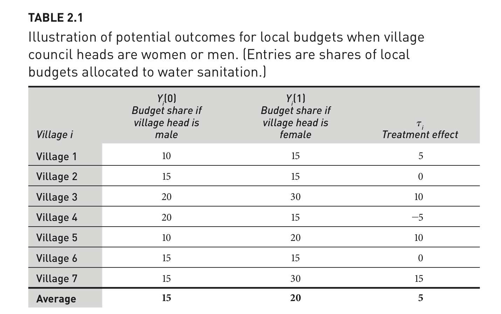

# Causal Effects {#causaleffects}

In this section, we discuss causal effects. It builds on Gerber and Green FEDAI Chapter 2.


Goal of Causality

Isolate the *manipulation* of one factor ("No causation without manipulation."), while *controlling* or "holding everything else constant."

  - Does border security increase trust in government?
      + Factual: Trust in an environment with border security
      + Counterfactual: Trust in an environment without border security
  - Does gender affect budgetary priorities?
      + Factual: The budget under a village head who is male
      + Counterfactual: The budget under a village head who is female
  - Does race affect one's job prospect?
      + Factual: Jamal applied for a job but did not get it
      + Counterfactual: Would Jamal have gotten a job if he were white?

## Potential Outcomes Framework

To make causal claims, we compare two states of the world and their potential outcomes:

$Y_i(d)$

  - What is $Y_i(0)$?
  - What is $Y_i(1)$?
      + $i$ refers to individual subjects from $i = 1$ to N.
      + $d$ is the treatment indicator
      + $d_i$ refers to whether the subject is treated: $d_i = 1$ or $d_i = 0$
      + $D_i$ refers to a hypothetical treatment allocation

A causal "treatment effect" is then the difference in these potential outcomes:

  - $\tau_i$ = $Y_i(1)$ - $Y_i(0)$



*FEDAI Table 2.1*      

The treatment effect is the difference between two states of the world: one which a unit receives treatment, and another in which it does not.

### Average Treatment Effect

The ***average treatment effect*** then is the mean of these individual treatment effects:

  - Estimand: On average, how much outcomes would change if all units go from untreated to treated.

\begin{align*}
ATE &= \frac{1}{N} \sum_{i=1}^N \tau_i \\
&= \mu_{Y(1)} -\mu_{Y(0)} \\
&= \frac{1}{N} \sum_{i=1}^N Y_i (1) - \frac{1}{N} \sum_{i=1}^N Y_i (0) \\
&= \frac{1}{N} \sum_{i=1}^N (Y_i (1)-Y_i (0))\\
&= E[Y_i(1) - Y_i(0)]\\
\end{align*}


ATE $= \frac{1}{N} \sum_{i=1}^N \tau_i$ is what we want to describe a causal effect, but in  real life, we have problems. What are they?

<details> <summary>Try on your own, then expand for the answer.</summary>

We only observe one potential outcome.

  - $Y_i = d_iY_i(1) + (1-d_i)Y_i(0)$   


(Unless we are in [Groundhog Day](https://www.youtube.com/watch?v=5E0M6Rh9qpg))

</details>

## Fundamental Problem of Causal Inference

We only observe one potential outcome: $Y_i$.

  - $Y_i = d_iY_i(1) + (1-d_i)Y_i(0)$   


(Unless we are in [Groundhog Day](https://www.youtube.com/watch?v=5E0M6Rh9qpg))


Example from 2022 Dallas Cowboys game.

  - We only get to observe $Y_i$= Cowboys lose.
  - After the game, many people said things like:
      + If the Cowboys had handed the ref the ball, $Y_i(1)$ = Cowboys win
      + If the Cowboys had continued to throw the ball instead of run, $Y_i(1)$ = Cowboys win
      + If Dak had just run a shorter distance instead, $Y_i(1)$ = Cowboys win
      
  
<blockquote class="twitter-tweet"><p lang="en" dir="ltr">did this seriously just happen <a href="https://t.co/MmUk8E1XSL">pic.twitter.com/MmUk8E1XSL</a></p>&mdash; SB Nation (@SBNation) <a href="https://twitter.com/SBNation/status/1482882322483531780?ref_src=twsrc%5Etfw">January 17, 2022</a></blockquote> <script async src="https://platform.twitter.com/widgets.js" charset="utf-8"></script>

But the fundamental problem of causal inference is that we can only observe one potential outcome, the outcome in this case, under the state of the world $Y_i(0)$ where the play unfolded as it did in the video.

  - It is impossible to observe the actual causal effect of any of the above: $Y_i(1) -Y_i(0)$


## Identification strategy


We cannot observe the ideal actual causal effect. Instead, we will frame our exercise on the premise that we are randomly *sampling* our $i's$ from a population. We then will create an identification strategy.

  - "Ideas that enable researchers to use observable quantities (e.g., sample averages) to reveal parameters of interest (e.g., average treatment effects)" (Gerber and Green 2012, 34)
  - Instead of observing the actual individual causal treatment effect and actual ATE, we develop an estimator for this quantity using the sample averages.


A few definitions:

  - The sample average is a random variable, a quantity that varies from sample to sample.^[Note: other books may approach this slightly differently by defining a Sample ATE, taking $D_i$ (treatment status) to be the random variable, and $Y_i(1)$ as fixed within a sample. ]
  - Expected value is the average outcome of a random variable weighted by its probability of occurrence.
  - Good news: Under random sampling, the expected value of a sample average is the population average.
  - Similarly, the expectation of a randomly selected observation from the population is the population mean.
  - Even though we have a sample, under random sampling, our sample will be unbiased. On average, it's true.
      + When the expected value of a sample estimate is equal to the population parameter $E[\hat{\theta}] = \theta$, this means our estimator is "unbiased."

***Expectation***

\begin{align*}
E[X]=\sum x Pr[X=x]
\end{align*}

  - where $Pr[X=x]$ denotes the probability that $X$ takes on the value $x$, and where the summation is taken over all possible values of $x$. Think of this like a weighted average. 

Example: $E[Y_i(1)]$ is the expected value of the treated potential outcome of a subject who is randomly sampled.(It will equal the average value of all possible values.)

  - What is the value of $E[Y_i(1)]$ in this example?
  

*FEDAI Table 2.1*      


## Difference in Means Estimator

In the real world, we follow this process for causal identification:

  - Our motivation: Find quantities that represent the population parameters ($\theta$)
  - Our problem: We often only get a sample of the population and can only observe one potential outcome for any unit in our sample
  - Goal: Get unbiased estimators for the population
  - Definition of unbiasedness: $E[\hat{\theta}] = \theta$

Suppose $D_i$ were randomly assigned such that $m$ subjects assigned to treatment and $N-m$ subjects assigned to control. 

\begin{align*}
\widehat{ATE} &= \frac{1}{m}\sum_1^m Y_i - \frac{1}{N-m}\sum_{m+1}^{N} Y_i \\
\end{align*}


Is the difference in means estimator an unbiased estimate for the ATE? How can we find out?

We take the expected value: 

\begin{align*}
E[\widehat{ATE}] &= E[\frac{1}{m}\sum_1^m Y_i - \frac{1}{N-m}\sum_{m+1}^{N} Y_i ]\\
&= \frac{1}{m}\sum_1^m E(Y_i) - \frac{1}{N-m}\sum_{m+1}^{N} E(Y_i ) \\
&= \frac{E(Y_1) + E(Y_2) +...+E(Y_m)}{m} -  \frac{E(Y_{m+1}) + E(Y_{m+2}) +...+E(Y_N)}{N-m}\\
&= \frac{m * E[Y_i(1 | D_i = 1)]}{m} - \frac{(N-m)* E[Y_i(0) | D_i = 0]}{N-m}\\
&= E[Y_i(1) | D_i = 1] - E[Y_i(0) | D_i = 0] \\
%&= E[Y_i (1)]-E[Y_i (0)]=E[\tau_i ]=ATE
\end{align*}

Is the final statement equivalent to the ATE? 
  
  - We want our final statement to be $E[Y_i (1)]-E[Y_i (0)]=E[\tau_i ]$=ATE
  - Our final statement is: $E[Y_i(1) | D_i = 1] - E[Y_i(0) | D_i = 0]=E[\widehat{ATE}]$

Under what conditions can we get those two statements to look the same?

<details> <summary>Well, let's look into some rules of expectation.</summary>

$E[Y|X] = E[Y]$ if Y and X are independent.^[See [video](https://www.youtube.com/watch?v=Ki2HpTCPwhM) for help on law of iterated expectations]

</details>

Our final statement can be simplified when treatment assignment is independent of potential outcomes:

  - $E[Y_i(1) |D_i = 1] = E[Y_i(1) |D_i = 0] = E[Y_i(1)]$
  - $E[Y_i(0) |D_i = 0] = E[Y_i(0) |D_i = 1] = E[Y_i(0)]$

When does this occur? Random assignment of treatment!!

Putting this together, under random assignment:

\begin{align*}
E[\widehat{ATE}] &= E[\frac{1}{m}\sum_1^m Y_i - \frac{1}{N-m}\sum_{m+1}^{N} Y_i ]\\
&= \frac{1}{m}\sum_1^m E(Y_i) - \frac{1}{N-m}\sum_{m+1}^{N} E(Y_i ) \\
&= E[Y_i(1) | D_i = 1] - E[Y_i(0) | D_i = 0] \\
&= E[Y_i (1)]-E[Y_i (0)]=E[\tau_i ]\\
E[\widehat{ATE}] &= ATE
\end{align*}

***Why Experiments***

One approach for addressing the fundamental problem of causal inference is to simulate two potential states of the world through random assignment: Randomized Controlled Trials / Experiments

Experiments approximate factual vs. counterfactual comparison
  
  - We randomly assign one group to receive a "treatment" and another not to receive a treatment (the control)
  - Using what we learned above, when treatment assignment is **randomized**, the only thing that distinguishes the treatment group from the control group in expectation, besides the treatment itself, is chance.
  - This allows us to use a simple differences in means estimator in experiments to estimate our average treatment effects.


## Overview of identification assumptions


What if we can't guarantee random assignment?

***Example: Selection into treatment***

What if we didn't have the independence? Subtract and add $E[Y_i (0) | D_i=1]$ to help us illustrate a type of bias that may occur.

$E[Y_i (1) | D_i=1]-E[Y_i (0) | D_i=0] =$ 

$\underbrace{E[Y_i (1) | D_i = 1] - E[Y_i (0) | D_i=1]}_{\text{Average treatment effect for the treated}} + \underbrace{E[Y_i (0)|D_i=1]-E[Y_i (0)| D_i=0] }_{\text{Selection bias}}$


In observational studies, where assignment into treatment is not random, the second term "Selection bias" may not be zero. 
 
  - E.g., suppose we want to know the effect of minimum wage laws on unemployment.
  - Laws aren't randomly assigned
  - Possible that states where unemployment (outcome) is lower are less likely to see minimum wage laws passed relative to states where unemployment is higher. If so, the potential outcomes $Y_i(0)$ of states that would hypothetically be treated or untreated would not be the same.


***Assumptions***

To "identify" the average treatment effect, we need

  - Probability of treatment of all units is between 0 and 1
  - Ignorability: $Y_i(1), Y_i(0) \perp D_i$ (random assignment)
  - Non-interference: $Y_i(d_1, d_2, ..., d_n) = Y_i(d)$, $d_i = d$
  - Excludability: if $Y_i(z, d)$ where z $\in [0, 1]$ and $d \in [0, 1]$, $Y_i(1, d) = Y_i(0, d)$ 

Let's put these into plain words.


## Application in R


Article: "Are Emily and Greg More Employable Than Lakisha and Jamal? A Field Experiment on Labor Market Discrimination" by Bertrand and Mullainathan (2004)

  - Research Question: Does race influence hiring decisions?
  - What are the potential outcomes?
  - What is the approach? Audit study: "send fictitious resumes to help-wanted ads in Boston and Chicago newspapers. 
      + Treatment: Manipulate perceived race: resumes randomly assigned African-American- or White-sounding names.
      + Outcomes: Does the resume get a callback?

How should we estimate the average treatment effect?

### Loading the data

We will use data from [Imai (2017)](https://qss.princeton.press/student-resources-for-quantitative-social-science/) Chapter 2.


Let's load the data. Note: When we have variables that are text-based categories, we may want to tell R to treat these "strings" of text information as factor variables, a particular type of variable that represents data as a set of nominal (unordered) or ordinal (ordered) categories. We do this with the `stringsAsFactors` argument.

```{r, eval=F}
resume <- read.csv("resume.csv", stringsAsFactors = T)
```

```{r}
resume <- read.csv("https://raw.githubusercontent.com/ktmccabe/teachingdata/main/resume.csv",
                   stringsAsFactors = T)
```


Variables and Description
  
  - `firstname`: first name of the fictitious job applicant 
  - `sex`: sex of applicant (female or male) 
  - `race`:  race of applicant (black or white) 
  - `call`: whether a callback was made (1 = yes, 0 = no) 
  

The data contain 4870 resumes and 4 variables.
```{r}
nrow(resume) # number of rows
ncol(resume) # number of columns
dim(resume) # number of rows and columns
```

```{r}
head(resume)
```

### Variable classes

We can check the class of each variable: Look, we have a new type, a "factor" variable.

```{r}
class(resume$firstname)
class(resume$sex)
class(resume$race)
class(resume$call)
```

Rules of Thumb
  
  - Usually, we want `character` variables to store text (e.g., open-ended survey responses)
  - We want `numeric` variables to store numbers.
  - Usually, we want `factor` variables to store categories. 
      + Within R, factor variables assign a number to each category, which is given a label or `level` in the form of text.
      + Categories might be ordinal or "ordered" (e.g., Very likely, Somewhat likely, Not likely) or
      + Unordered (e.g., "male", "female")
      + R won't know if a factor variable is ordered or unordered. Alas, we have to be smarter than R.
      + R might think you have a character variable when you want it to be a factor or the reverse. 
          - That's when `as.factor()` and `as.character()` are useful. 
  - Always check `class()` to find out the variable type


### Exploring Treatment and Control Groups 


We are going to use several different approaches to calculate our difference in means between treatment and control to help us explore R's capabilities and common computational approaches.

We can use the `table` command to see how many observations in our data fall into each category or numerical value.

```{r}
## Example: how many black vs. white sounding resumes
table(resume$race)
```

As mentioned, `factor` variables have levels:

```{r}
levels(resume$race)
```


We can also use the `table` command to show a crosstabulation: a table that displays the frequency of observations across two variables. ***Because our outcome variable call is dichotomous and we are interested in the rates of callbacks***, we might use a table to display this information. (For outcomes that are continuous, the table approach is less useful.)

```{r}
## Example: how many black vs. white sounding resumes by call backs
## We can label the two dimensions of the table with the =
table(calledback = resume$call, race = resume$race)
```


Sometimes we will want to show the proportion instead of the frequency using `prop.table`

```{r}
## Example: proportion black vs. white sounding resumes by call backs
## Convert to proportion
prop.table(table(calledback = resume$call, race = resume$race), margin = 2) # 1 for row sum, 2 for col
```

***How can we interpret this crosstabulation?***

### Means with Relational Operators

Goal: Compare callback rates for white sounding names to black sounding names, so we need to be able to filter by race. 

Good news: We have several relational operators in R that evaluate logical statements:
  
  -  `==, <, >, <=, >=, !=`
  - We have a statement and R evaluates it as `TRUE` or `FALSE`

```{r, eval=F}
## for each observation, does the value of race equal "black"?
resume$race == "black"
```

By putting this logical statement within `[ ]`, we are asking R to take the `mean()` of the variable `resume$call` for the subset of observations for which this logical statement is `TRUE`.

```{r}
mean(resume$call[resume$race == "black"])
```


Ultimately, each of these paths has led us to a place where we can estimate the average treatment effect by calculation the difference in means: the difference in callback rates for black and white applicants.

We said the ATE = $\bar{Y}(treatment) - \bar{Y}(control)$ 

```{r}
ate <- mean(resume$call[resume$race == "black"]) - 
  mean(resume$call[resume$race == "white"])
ate
```

How can we interpret this? Do white applicants have an advantage?


### Means with `tidyverse`

The `tidyverse` offers a suite of R functions and a different grammar or syntax of coding. Some people prefer this to the "base R" codes we did above. To use this suite, first install the `tidyverse` package:

When you install a package, this is like downloading an app to your phone. You only have to do it one time. 
```{r, eval=F}
install.packages("tidyverse")
```

After you have a package installed, much like an app on your phone, you then need to open it before using it in R. To do so, use the `library()` command.

```{r, message=FALSE, warning=FALSE}
library(tidyverse)
```

The `tidyverse` works through these piping `%>%` operators. We can read it from left to right. Take our dataset `resume`, group the data by `race`, and within each racial group, summarize the data by taking the mean call back rate.

```{r}
resume %>%
  group_by(race) %>%
  summarise(means = mean(call))
```

We could go a step further to calculate the ATE.

```{r}
ate <- resume %>%
  group_by(race) %>%
  summarise(means = mean(call)) %>%
  ungroup() %>%
  spread(race, means)%>%
  mutate(diff = black - white)

ate
```


### ATE with linear regression

Linear regression also offers a way to calculate the conditional means and difference in means between two groups. In R, we use `lm()` for this. The syntax is `lm(y ~ x, data = mydataframe)`.

```{r}
fit <- lm(call ~ race, data =resume)
```

We can look at the coefficient results only.

```{r}
fit$coefficients
```

In a regression of this form, the intercept represents the mean of the reference category, in this case, the callback rate for Black applicants. The coefficient on `racewhite` represents the difference in means between the reference category and this group. I.e., going from a Black applicant (the reference category) to a white applicant, on average, increases call backs by 3.2 percentage points.

### Subsetting data in R

Maybe we are interested in differences in callbacks for females. One approach for looking at the treatment effect for female applicants, only, is to subset our data to include only female names.

  - To do this, we will  assign a new `data.frame` object that keeps only those rows where `sex == "female"` and retains all columns 
  - Below are two approaches for this subsetting, one that uses brackets and one that uses the `subset` function

```{r}
## option one
females <- resume[resume$sex == "female", ]
## option two using subset()- preferred
females <- subset(resume, sex == "female")
```

Now that we have subset the data, this simplifies estimating the ATE for female applicants only.

We said the ATE = $\bar{Y}(treatment) - \bar{Y}(control)$

```{r}
ate.females <- mean(females$call[females$race == "black"]) -
  mean(females$call[females$race == "white"])
ate.females
```

***Question: Is this an unbiased estimate of the average treatment effect?***


<details> <summary>Try on your own, then expand for the answer.</summary>

This is an example of a "Conditional Average Treatment Effect." Generally, because gender is a pre-treatment factor, we can condition on it and get unbiased estimates for the average treatment effect within a particular gender group.

  - Random assignment of treatment means that in expectation, we should have about equal proportions of female applicants in each treatment group, ruling out the potential for selection bias.

</details>


### Additional Practice

We will use data from the article below:

Thal, A. (2020). The desire for social status and economic conservatism among affluent Americans. American Political Science Review, 114(2), 426-442.

In the experiment, affluent Americans are randomly assigned to encounter Facebook posts in which others broadcast their economic success. These posts are designed in a way that encourages affluent respondents to view economic success as a means of achieving social status. The experiment includes a sample of 2010 affluent Americans-- people who report household incomes in the top 10 percent of the U.S. income distribution.

  - Causal Question: Does desire for social status influence economic views of affluent Americans?
  - Randomization: Randomly assign respondents to view different fictional Facebook posts designed to signal different motivations
  - Outcome: An economic conservatism index based on respondents' support for decreasing "taxes on households making \$150,000 or more a year," support for decreasing the "taxes on money people make from selling investments, also referred to as capital gains," and support for decreasing "government regulation of business and industry."
  - Comparison: Average economic views between experimental conditions that vary in the type of social cues given.

{width=70%}

{width=70%}

Let's load the data! Here, note that the data file is in a .RData format instead of .csv. This means that instead of using `read.csv`, we should use a function to load the data that is suitable for the .RData format. This will be `load`. That function works the following way:

```{r, eval=T, echo=FALSE, include=FALSE}
load("data/status.RData")
```

```{r,eval=F}
load("status.RData")
```

After running the above code, an object will show up in your R environment.

```{r}
head(status)
```

The data include the following variables

  - `condition`: Placebo, Concrete, Self-Esteem, Social Approval, Conspicuous Consumption
  - `gender`: 1= male; 0= otherwise
  - `econcon`: Economic views. Numeric variable from 0 to 1, with higher values reflecting more conservative views

Practice:

  1. How many people are in each `condition`?
  2. What is the average treatment effect between the Placebo and Social Approval conditions?


<details> <summary>Try on your own, then expand for the answer.</summary>

```{r}
## Number of observations
table(status$condition)

## tidy
groupmeans <- status %>%
  group_by(condition) %>%
  summarise(means = mean(econcon)) %>%
  ungroup %>%
  spread(condition, means) 
groupmeans$`Social Approval` - groupmeans$Placebo

## relational operators
ate <- mean(status$econcon[status$condition == "Social Approval"]) - mean(status$econcon[status$condition == "Placebo"]) 
ate

## regression
fit <- lm(econcon ~ condition, data = status)
fit$coefficients["conditionSocial Approval"]
```

</details>
