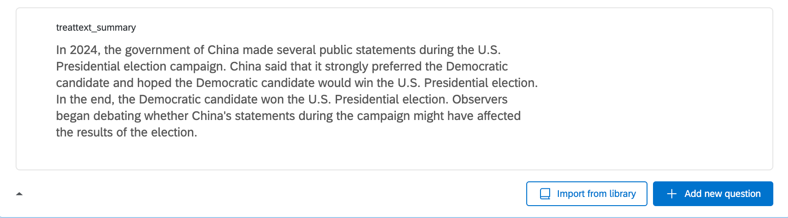
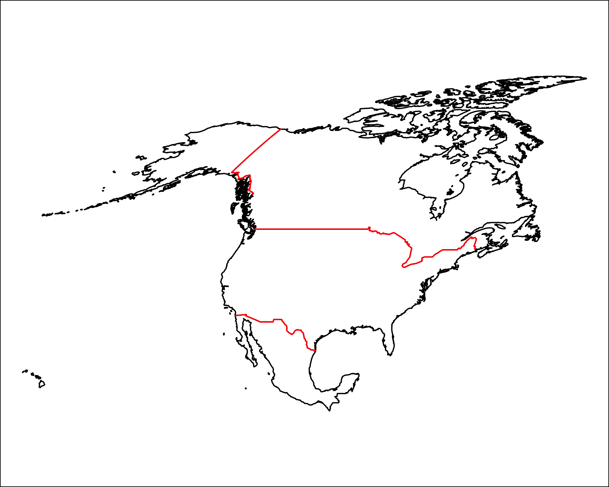

# Experimental Design {#design}

In this section, we discuss best practices for experimental design, as well as implementing a design in Qualtrics.

The two primary readings are:

   - Mutz, D. (2021). Improving Experimental Treatments in Political Science. In J. Druckman & D. Green (Eds.), Advances in Experimental Political Science (pp. 219-238). Cambridge: Cambridge University Press. 
   - Salganik, Matt. [Chap 4 of Bit by Bit](https://www.bitbybitbook.com/en/1st-ed/running-experiments/)
   
## Designing an Experiment

Four main ingredients in an experimental design

  1. Recruitment of participants  
  2. Randomization of treatment - means people in treatment and control groups will be similar
  3. Delivery of treatment (intervention)
  4. Measurement of outcomes


What does an experimental design test?

Broadly "causal effects": More specifically:

  - From Mutz: Experiments are designed to answer the question, "If
x changes, how should y be expected to change?"
    + Goal of experimental treatment is to create variation in the independent variable in the direction (or directions) intended by the researcher.
  - From Salganik: "Narrowly focused experiments answer a much more specific question: What is the average effect of this specific treatment with this specific implementation for this population of participants at this time?" 

How can we evaluate experiments?

### Validity

"Validity refers to the extent to which the results of a particular experiment support some more general conclusion."

  - Statistical conclusion validity- correctness of statistical analysis
  - Internal validity- correctness of procedures
  - Construct validity- match between data and theoretical constructs
  - External validity- how can results generalize to other situations


<style>
p.comment {
background-color: #DBDBDB;
padding: 10px;
border: 1px solid black;
margin-left: 25px;
border-radius: 5px;
font-style: italic;
}

</style>


***What makes a good treatment? Does it require realism?***

<p class="comment">
Your ideas ...                                                                                                                                                                                                             </p>


***How does our excludability assumption factor into this?***

<p class="comment">
Your ideas ...                                                                                                                                                                                                             </p>

***What does it mean to say a treatment is generalizable?***

<p class="comment">
Your ideas ...                                                                                                                                                                                                             </p>


***How can we increase engagement with our experiments?***

<p class="comment">
Your ideas ...                                                                                                                                                                                                             </p>

***What is a manipulation check, and what role does it serve?***

<p class="comment">
Your ideas ...                                                                                                                                                                                                             </p>


### Design Space for Experiments


[*Figure 4.1*](https://www.bitbybitbook.com/en/1st-ed/running-experiments/lab-field/)


<style>
p.comment {
background-color: #DBDBDB;
padding: 10px;
border: 1px solid black;
margin-left: 25px;
border-radius: 5px;
font-style: italic;
}

</style>


***What are the tradeoffs between digital vs. analog experiments?***

<p class="comment">
Your ideas ...                                                                                                                                                                                                             </p>
***What are the tradeoffs between lab vs. field experiments?***

<p class="comment">
Your ideas ...                                                                                                                                                                                                             </p>


### Types of Designs


***What are the strengths and weaknesses of different types of designs?***

<p class="comment">
Your ideas ...                                                                                                                                                                                                             </p>


## Using Qualtrics

Everyone at Rutgers gets a free Qualtrics account. Qualtrics provides a user-friendly interface for designing online surveys and survey experiments.

We will walk through how to design a simple survey experiment on the platform.

  1. Go to the [Rutgers Qualtrics site](https://rutgers.qualtrics.com/). The first time you use this you might have to initialize your account.
  2. Click on "Create a new project" and select "Survey" from scratch and get started.
  3. Give the project an informative name like "Experimental methods demo." We will start with a blank survey project.

This should take you to a landing page that looks something like this:

{width=80%}


When running an academic survey, generally, the first survey question should be a consent form.

  - Rutgers has template consent forms [here](https://research.rutgers.edu/researcher-support/research-compliance/human-subjects-protection-program-toolkit). For a survey, you may want the [Online survey questionnaire consent form](https://research.rutgers.edu/sites/default/files/2022-01/rcr_online_survey-questionnaire_adult_consent_template_1.11.22.docx). The text of the consent form has to be approved by the IRB.


After the consent form, you might ask respondents a set of "pre-treatment" questions, such as demographics, attention checks, etc. These are things you want to know about respondents prior to when they enter your experiment. 

  - You can organize these questions into different "blocks." Blocks make it easier to move groups of questions up and down the survey, randomize the order of questions people see within a given block, or branch people to see only one of a set of blocks. We will get to this later.
  

Now we are ready to program an experiment. There are many ways to do this, but we will choose a couple of common approaches.
  
  - In general, programming the experiment will involve 1) entering experimental treatments and questions into the survey interface we are currently working in; and 2) building a randomizer in the survey flow.
  - To prepare to program your experiment, you should have a sense of how many unique experimental conditions you have.
      - If you have a relatively small number of experimental conditions (e.g., 2-4), an easy way to program the experiment is to manually create a unique block for each condition.
      - If you have a larger number of experimental conditions (e.g., if you are manipulating several things at once across conditions), you might consider integrating piped text or another approach to avoid the need to manually create all of your experimental conditions.
      - If you have a very large number of conditions or need to adjust the randomization in a more complex way (e.g., control the specific probabilities that certain conditions appear), you may need to integrate JavaScript code to help with randomization. 


### Experimental Design with Vignette Experiment

For this example, we will use the experimental design from "Public Opinion and Foreign Electoral Intervention" by Michael Tomz and Jessica Weeks, published in the *American Political Science Review* in 2020. The article is [here](https://www.cambridge.org/core/journals/american-political-science-review/article/abs/public-opinion-and-foreign-electoral-intervention/AC34B6090EACF336D08713AF69BF7904).

They "hypothesize that American tolerance of foreign intervention should depend on the type of intervention and the intended beneficiary. We distinguish three modes of interference: verbal endorsements, threats, and operations." 

  - Endorsements occur when foreign countries express their opinions about candidates. 
  - Threats combine an endorsement with a promise of future reward or threat of future punishment, such as threatening to downgrade future relations if the preferred candidate loses. 
  - Operations [are] when foreign powers undertake efforts such as spreading embarrassing information about a candidate, hacking into voting systems, or donating money to an election campaign
  
These are contrasted with a comparison of staying out of the election.

***Hypotheses***

  - "We predict that citizens will be most concerned about operations such as hacking into voting systems or donating money, as these directly advantage the favored candidate and involve behavior the U.N. has classified as impermissible interference in the internal affairs of another nation. Americans should be more tolerant of threats and most tolerant of endorsements, which could be seen
as legitimate and harmless expressions of opinion that do not intrude on American sovereignty."
  - "We also hypothesize that revelations of foreign intervention will generate polarized partisan responses. . . we anticipate that American voters will disapprove more strongly of foreign meddling on behalf of political opponents, than of foreign meddling to assist their own party."

Table 1 in the paper displays the experimental design used to test the hypotheses. We will program the primary manipulation, which varies the endorsement, threat, operation, or stay out conditions. For now, we will fix the country to be China, the candidate to be the Democratic candidate, and the operation to be donating money and 100\% certainty it was China.

### Unique blocks per experimental condition

In this approach, we will create a separate block for each unique experimental vignette. In our case, we will create a block with a Text/Graphic question type. We paste in our experimental text and give the block and question informative labels. The question name will be the name of the variable for the question when you eventually load the data. 

  - For each condition, create a new block. 
  - See the four blocks below, one for each condition
  
  
{width=40%} {width=40%}
{width=40%} {width=40%}

After creating each experimental block, we can then add a new block with our outcome questions. Go ahead and add 1-2 outcome questions so that you have an example.If your outcome condition text is specific to each treatment condition, you can create outcome questions within the experimental blocks. 

Finally, after that, you may have some last demographic questions. You can put those in yet another last block.

Once you have created all your blocks, you can now go to the survey flow. To do that, click on the icon in the left side of the survey landing page.

{width=40%}

Your survey flow should look something like this. We are now ready to add randomization so that each respondent only sees one of our experimental blocks, randomly assigned.

{width=70%}

### Adding a randomizer in the survey flow

Within the survey flow, add a randomizer underneath the consent form.

  - Under the randomizer, add an embedded data field with an informative label for your treatment (e.g., "treat")
      + Create a unique value for each of your treatment conditions
      + Make sure the randomizer is set to show just one of these values.
      
{width=90%}

As people go through the survey, under the hood of qualtrics, they will be assigned one of your experimental condition values. This embedded data field will show up as a variable in the data you download. However, we need one more step to make sure people only see the experimental block that corresponds to their embedded data field. This works through branching.

  - Above each experimental block, add a "Branch" object
  - Branch people using embedded data. Set the condition to match each embedded data value, and then move the experimental blocks underneath the appropriate branch.
      + You can also duplicate the outcome block and put them underneath the corresponding treatment blocks.
  - Hit apply to make sure the survey flow saves.
  
{width=90%}

A last thing we often want to do is add a branch underneath the consent form to end the survey for anyone who does not consent to take the survey. The specific end-of-survey message you provide may be different depending on which company you use to recruit respondents. For now, we will use a default end-of-survey message.

{width=60%}

You are now ready to "Preview" your survey!


### Using Piped Text in Randomization

We could complicate the randomization more so than we have done so far. For example, in Tomz and Weeks (2020), they do not fix the country to be China. Instead, they randomly vary this to be China, Pakistan, or Turkey for each respondent. We could build this added treatment arm into our design through "piped text."

  - Go back into your survey data flow. Create a second randomizer towards the top of the survey. Create a new embedded data field with an informative label, like country. Create unique fields for each of our country names. Hit apply.

{width=70%}

  - Now, in addition to being assigned a treatment condition, everyone is also independently randomly assigned a country. We now need to make sure the text they see reflects both their treatment condition and country.
    + We could create 4 X 3 experimental blocks to reflect these dual randomizations.
    + Instead, we are going to integrate the second treatment into the four blocks we have already programmed-- just to save us time.
    
  - Back in the survey landing page, click on every single block of text or question that includes the word "China." In place of "China" click on the "piped text" option. Set the piped text to be the "country" embedded data field. Here is an example. Note: you need to do this for every single mention of country.
  
{width=70%}

We could complicate our design even further by adding additional piped text randomization to vary whether it is the Democratic vs. Republican candidate, the percent certainty about the country involved, and the type of operation. This would all involve adding additional randomizers and/or branching in the survey flow, along with piped text in the experimental blocks.


### Data and Analysis

Once you have a draft of your survey programmed, you will want to "preview" the survey from the perspective of a respondent by clicking "preview" in the survey landing page.

{width=70%}

Repeat this a few times to see if things seem to be working properly. After that, you can do a few more steps to test your survey.

  - Option 1: Fake Data. In the survey landing, go to Tools -> Generate test responses. This will automatically generate fake/simulated responses to your survey. This can allow you to check how the data will download, see if you can load it into your preferred statistical software and access the variables in the way you imagined, and check if the randomization appears to work properly.
  - Option 2: Get a distribution link for your survey, and send the link to your friends and colleagues to help you test the survey from a respondent's perspective. 
      + Go to Distributions -> Get a single reusable link
      + Note: once you click this, your survey is now published and "active." To make any future changes to your survey, on the survey landing you will have to click "Publish." 
      
With both of these options, your survey will start to populate responses in the Data and Analysis section of Qualtrics. Click on this now that you have done one or both of these steps.

This will give you an overview of the responses and number of recorded responses.

This is also where we can download the data. Go to Export and Import - > Export Data.

  - Download the data as a csv file if you plan to work in R.
  - If you click on "More options," you can export randomized viewing order as well as other features you may want to toggle on or off.

If you open up your .csv file in a spreadsheet software like Excel, you will notice that the first row contains your question names as variables. The next two rows are more information about the questions, including the question wording. The actual responses start in row 3.

  - If you load the csv file into R as is, you would want to delete the first two rows from your dataframe (the first row will automatically be treated as a header in R)
  - Alternatively, you can delete rows 2-3 from the spreadsheet software before loading it into R.
  - Save the .csv file with an informative name in the working directory where you store files to work on in R.
  
Load the data into R.

```{r}
## my data are in a /data/ subfolder of my working directory
expdemo <- read.csv("data/expdemo.csv")
expdemo <- expdemo[-c(1:2),] # remove first two rows
```

Let's limit the sample to those who agreed to our consent form. Locate your consent variable and subset on those who agree.

```{r}
expdemo <- subset(expdemo, QID1 == "I Agree")
```

At this stage, we just have fake/test respondents. However, we can still see if the randomization works properly and if the outcome questions are populating in the way we want.


For example, we want about a quarter of respondents assigned to each of the experimental conditions.

```{r}
table(expdemo$treat)
```

And let's make sure our outcomes are populating correctly. Note how people from each condition have populated the outcomes. This gives us confidence that the survey logic is working correctly. If, for example, no one from the endorsement condition had answered the outcome, this might mean we had a typo or other error in our survey logic.

```{r}
table(expdemo$approval)
table(condition=expdemo$treat,
      outcome = expdemo$approval)
```

If our survey programming was all set, at this point, you could actually set up your entire R code and analysis based on the fake data. That would mean that all you have to do after you run the survey with real respondents is switch the dataset you load into the software. That would be the ultimate "pre-analysis plan." 

Once you are done testing in Qualtrics, back in the Data and Analysis page, you can delete all responses using Tools -> Delete data.

Once you are done testing and revising the survey, you are now ready to integrate it with your preferred survey firm/recruiting platform. The specific steps from here going forward vary across platforms.

### Additional Bells and Whistles

Qualtrics has a number of other features you can use, including different question types, the ability to randomize the order of response options, features to require/request responses.You can continue to explore these as you develop your own surveys.


  - Their help pages are pretty useful. Here is one on [question types](https://www.qualtrics.com/support/survey-platform/survey-module/editing-questions/question-types-guide/question-types-overview/).


For those familiar with "conjoint experiments" that have a lot of randomization, Anton Strezhnev has developed a tool for programming these in Qualtrics. See information [here](https://github.com/astrezhnev/conjointsdt).


It is also possible to download data from Qualtrics directly into R using an R package [here](https://github.com/ropensci/qualtRics).


### Adding a gif to Qualtrics

{width=40%}

{width=40%}

{width=40%}

New examples

{width=40%}

{width=40%}

{width=40%}
{width=40%}
{width=40%}
{width=40%}
{width=40%}
{width=40%}
{width=40%}
{width=40%}


{width=40%}


  