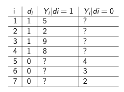

# Uncertainty {#uncertainty}


In this section, we cover calculations of uncertainty following Gerber and Green Chapter 3 and 9.3. 

  - We cover the computation of standard errors and confidence intervals.
  - We introduce the null hypothesis testing framework.
  - We then look at an experimental application and compute t-tests and interactions to assess average and heterogeneous treatment effects.
  - Finally, we examine randomization inference as an alternative to t-tests.

## Standard Errors

Standard errors represent the standard deviation of a sampling distribution.

***What is the standard deviation?***

Measure of spread: typical deviation of an observation from the mean.

{width=40%} {width=40%}

*From the Cartoon Guide to Statistics*

To calculate the standard deviation:

1. Take a squared deviation from the mean for a unit $i$.
\begin{align*}
&= (y_i -  \bar{y})^2 
\end{align*}
2. Do this for each unit $i$ out of a sample. Take the sum.
\begin{align*}
&= \sum_{i=1}^{N} (y_i -  \bar{y})^2 
\end{align*}
3. Divide over the total sample. When we are dealing with a sample from a population whose mean is unknown (usually the case), we have to take N-1 instead of N.
\begin{align*}
&= \frac{1}{N-1} \sum_{i=1}^{N} (y_i -  \bar{y})^2 
\end{align*}
4. Take the square root 
\begin{align*}
s &= \sqrt{\frac{1}{N-1} \sum_{i=1}^{N} (y_i -  \bar{y})^2 }
\end{align*}
Remember: standard deviation is the square root of the variance!

Let's say these were the data for a sample of 10 voters' scores on a feeling thermometer of their views toward liberals.

```{r}
fts <- c(40, 95, 100, 5, 75, 80, 65, 100, 90, 28)

## 1. take the squared deviation from the mean
sq.dev <- (fts - mean(fts))^2

## 2. Take the sum
sum.sq.dev <- sum(sq.dev)

## 3. Divide over N - 1
sum.sq.dev.n <- sum.sq.dev/(length(fts) - 1)

## 4. Take the square root
s <- sqrt(sum.sq.dev.n)
s

## optional code
sd(fts) # or sqrt(var(fts)) 
```


***What is a sampling distribution?***

The experiment we happen to conduct yields an estimate of the average treatment effect, but in a different randomization, our estimate might have been different.  

  - Sampling distribution refers to the set of estimates that could have been generated by every possible random assignment. 
  - The standard error is a measure of the spread of this distribution.
  - Good news: Under the central limit theorem, this distribution approximates the shape of a normal distribution when there are sufficient observations.
      + Why is this good news? Going to help us estimate uncertainty.
      
      

### Standard Error of the Mean


The population mean and variance are $\mu_y$ and $\sigma^2_y$ for some variable $Y$ and $\sigma_y$ is the standard deviation. We want to know the variability of our sample mean $\bar{Y}$.


Well we already know the mean of our sample mean ($\bar{Y}$) is the population mean $(\mu_y)$:

\begin{align*}
E(\bar{Y}) &= E[\frac{1}{N}\sum_{i=1}^{N} y_i] \\
&= \frac{1}{N}*[E(y_1) + E(y_2) + ... + E(y_N)]\\
&= \frac{1}{N}*N\mu_y\\
&= \mu_y
\end{align*}


What about the variance of $\bar{Y}$? We call the variance of our population mean: $\sigma^2$.
\vspace{3mm}

\begin{align*}
Var(\bar{Y}) &= Var[\frac{1}{N}\sum_{i=1}^{N} y_i] \\
&= \frac{1}{N^2}*[Var(y_1) + Var(y_2) + ... + Var(y_N)]\\
&= \frac{1}{N^2}*N\sigma^2\\
&= \frac{\sigma^2}{N}
\end{align*}

Then to get to the standard error, we take the square root:

\begin{align*}
&= \frac{\sigma}{\sqrt{N}}
\end{align*}


We cannot observe the actual $\sigma$ so instead, we will follow the practice of using a "sample analogue." In our case, this is $s$, the sample standard deviation: 

  - So we have an ***estimate for the standard error of our sample mean***:

\begin{align*}
\widehat{SE}_m &= \frac{s}{\sqrt{N}}\\
\end{align*}


***Computing the estimate of our standard error***

1. Take the standard deviation of our sample. Recall:

\begin{align*}
s &= \sqrt{\frac{1}{N-1} \sum_{i=1}^{N} (y_i -  \bar{y})^2 }\\
\end{align*}

2. Divide by the square root of the sample size.

\begin{align*}
\widehat{SE}_m &= \frac{s}{\sqrt{N}}\\
\end{align*}


***Example***

What's our estimate for the mean and standard error for feeling thermometer scores toward liberals?

```{r}
## 1. Take standard deviation
st.dev.fts <- sd(fts)

## 2. Divide by square root of sample size
se.fts <- st.dev.fts/sqrt(length(fts))
se.fts

## Alternative
sqrt(var(fts)/length(fts))

## What's the mean?
mean(fts)
```

### Standard error for a difference in means

So we have an estimate for the standard error of our sample mean: But often we want the standard error of a **difference** in means, correspondig to the uncertainty of $\widehat{ATE}$. 

When we take the difference in variances from two independent samples, we add their variances:

\begin{align*}
\widehat{SE}_{d-i-m} &= \sqrt{\frac{\widehat{Var}(Y_i(1))}{m} + \frac{\widehat{Var}(Y_i(0))}{N-m}}\\
\end{align*}

Note: Let's inspect this formula. What does it tell us about when the standard error will be larger/smaller?

  - Gives us insight into designs with blocking, matched pairs


## Confidence Intervals

1. Take a sample statistic (e.g.,$\bar{Y}$)

2. Set a test value. A common one is $\alpha = 0.05$

3. Find the critical value associated with the test level. Example:

\begin{align*}
z_{crit (1-\alpha/2)} &= 1.96\\
\end{align*}


4. Multiply the critical value by the standard error of your statistic, and add and subtract from the statistic

\begin{align*}
CI &= \bar{Y} +/- crit.value*\widehat{SE}_{\bar{Y}}\\
\end{align*}

Careful when interpreting CI's: note that the interval may vary from experiment to experiment, while the parameter stays fixed.


***Example computing confidence intervals***

```{r}
m.fts <- mean(fts)

## What's our test level? .05
alpha <- .05

## critical value for normal distribution
crit.z <- qnorm(1- alpha/2)
## critical value for t-distribution
crit.t <- qt(1- alpha/2, df = (length(fts)-1))

## Confidence interval using t-distribution
ci.ub <- m.fts + crit.t*se.fts
ci.lb <- m.fts - crit.t*se.fts
c(ci.lb, ci.ub) 

## Alternative using the R t.test function
t.testfts <- t.test(fts)
t.testfts$conf.int[1:2]
```

## Hypothesis Tests

Generally, we want to actually test hypotheses. We will use the null hypothesis testing framework. In this framework, we collect evidence to reject or fail to reject a naive starting assumption: the null hypothesis.

Typical setup for two-sample test. 

  - Null hypotheis: $H_o$: $\mu_{Y(1)} = \mu_{Y(0)}$
  - Alternative hypothesis: $H_a$: $\mu_{Y(1)} \neq \mu_{Y(0)}$; 
      + or $H_a$: $\mu_{Y(1)} > \mu_{Y(0)}$ or $H_a$: $\mu_{Y(1)} < \mu_{Y(0)}$

Review: Let's say we do a two-sided test and get a p-value from our t-test of 0.003. What should we conclude? 

  - Wait, what's a p-value? How should we interpret this p-value? (pg. 64, Gerber and Green) 

### t-tests

A common implementation of hypothesis tests for comparing averages of two groups is the t-test.

Single population
\begin{align*}
t &= \frac{\bar{X} - \mu_o}{\widehat{SE}_m}\\
\end{align*}

Two populations

\begin{align*}
t &= \frac{(\bar{X_1} - \bar{X_0})- (\mu_1 - \mu_0)}{\widehat{SE}_{d-i-m}}\\
\end{align*}

In each case, we standardize our estimates according to the student's t-distribution. We look to see just how extreme our t statistic is. t is our test statistic, a ratio between the size of the difference in means over the variability in the underlying data, represented by the standard error. [Here](https://blog.minitab.com/en/adventures-in-statistics-2/understanding-t-tests-t-values-and-t-distributions) is a relatively accessible summary of t values. 

### p-values

{width=70%}

The p-value asks: What is the probability of getting a result this extreme or more extreme "by chance"/"if the null were true"? In a world where the null is true, we still might not get a t=0 in every sample. The t-distribution represents the range of t-values we might expect to see with some probability under the assumption the null is true. We need to quantify how likely it would be to get our t-statistic in this world where the null is true.

  - Lower-tailed test, p-value $= Pr(T < t  | H_o$ is true) 
  - Upper-tailed test, p-value $= Pr(T > t  | H_o$ is true)
  - Two-sided test is specified by: p-value $= 2 * P(T > |t| \hspace{1mm} | H_o$ is true)

We primarily use two-sided tests. To get the p-value, we need the degrees of freedom because the t-distribution varies somewhat in shape according to the degrees of freedom, which are primarily a function of the sample size. Degrees of freedom govern how thick the tails of the distribution are, which can influence and increase the size of the p-value. For one sample tests, it is N-1. For two-sample t-tests, the degrees of freedom calculation can be more complicated. 

If we use the Welch calculation for unequal variances, which is the default setting in the R `t.test` function it is: df$=\frac{\widehat{SE}^4}{ \frac{\widehat{Var}(Y_i(1))^2}{m^2(m-1)} + {\frac{\widehat{Var}(Y_i(0))^2}{(N-m)^2(N-m-1)}}}$.

  - Fortunately, the `t.test` function in R will calculate that for you.


## Empirical Application


We will use data from the following experiment: "Social Exclusion and Political Identity: The Case of Asian American Partisanship" by Alexander Kuo, Neil Malhotra, and Cecilia Mo (2016). The data set based on authors' replication file [here](https://dataverse.harvard.edu/dataset.xhtml?persistentId=doi:10.7910/DVN/GMWOY6)

  - Research Question: Do feelings of social exclusion lead Asians to develop more negative feelings toward the Republican Party?
      - Sample: 114: 61 self-reported Asian, 53 self-reported white
      - Treatment: Manipulate feelings of social exclusion. 
      - Outcome: Difference in views toward Democratic vs. Republican Party
          + Close-mindedness, ignorance, represent interests, likes/dislikes, feeling thermometer, party ID, and the average of these six

Let's put this in the potential outcomes framework.

  - For a given unit $i$ what are the potential outcomes we are interested in?
  - What is the $\tau_i$ we are interested in?
  - How are we going to estimate it?

### Treatment

For those in the treatment group, a white female assistant to the research team says, "I'm sorry; I forgot that this study is only for US citizens. Are you a US citizen? I cannot tell." If the subject was a US citizen, the assistant was instructed to say "OK, go ahead" and have the respondent start the survey; if the subject was not a US citizen, the assistant was instructed to pause and then say "it's OK, go ahead." Subjects then completed an online survey of their political attitudes.


<style>
p.comment {
background-color: #DBDBDB;
padding: 10px;
border: 1px solid black;
margin-left: 25px;
border-radius: 5px;
font-style: italic;
}

</style>


***Is this treatment a good treatment?*** Use the principles we discussed last section to evaluate this implementation.

<p class="comment">
Your ideas ...                                                                                                                                                                                                             </p>
 


### Analysis

Let's load the data.

```{r}
library(foreign)
exclusion <- read.dta("data/exclusion.dta")

## Explore data
## How many subjects?
## How many Asian vs. White subjects
## What proportion of subjects were treated?
```

```{r}
## Let's relabel the names to something sensible
names(exclusion)

## v1 is difference between dem - rep in closed mindedness
names(exclusion)[1] <- "clmindeddr"
## v2 is difference between dem - rep in ignorance
names(exclusion)[2] <- "ingnorantdr"

## What if you don't want to have to find the number?
names(exclusion)[names(exclusion) == "v3"] <- "netlikesdr"

names(exclusion)[4] <- "piddr" # pid
names(exclusion)[5] <- "ftdr" # feeling thermometer
names(exclusion)[6] <- "repdr" # represents interests
```


```{r}
## Difference in means for the average
## Overall
d.i.m <- mean(exclusion$study2_avg[exclusion$treatment_cit == 1]) -  
               mean(exclusion$study2_avg[exclusion$treatment_cit == 0])

## Among whites
diff.whites <- mean(exclusion$study2_avg[exclusion$treatment_cit == 1 &
                                     exclusion$asiant == 0]) -  
               mean(exclusion$study2_avg[exclusion$treatment_cit == 0 &
                                          exclusion$asiant == 0 ])
## Among asians
diff.asians <- mean(exclusion$study2_avg[exclusion$treatment_cit == 1 &
                                     exclusion$asiant == 1]) -  
               mean(exclusion$study2_avg[exclusion$treatment_cit == 0 &
                                          exclusion$asiant == 1 ])
```

We could also subset the data by race/ethnicity group. Let's do that and then calculate our t-test and uncertainty by hand and using the R functions.

```{r}
## Subset data for only Asian respondents
asians <- subset(exclusion, asiant == 1)

## t-test by hand for sample of Asian Respondents
## Calculating Standard error

## Get N for each group
n.asianst1 <- length(asians$study2_avg[asians$treatment_cit == 1])
n.asianst0 <- length(asians$study2_avg[asians$treatment_cit == 0])

## Get variance for each group
v.asianst1 <- var(asians$study2_avg[asians$treatment_cit == 1])
v.asianst0 <- var(asians$study2_avg[asians$treatment_cit == 0])

## Standard error
se.diffasians <- sqrt(v.asianst1/n.asianst1 + v.asianst0/n.asianst0)

## t-statistic
t.diffasians <- diff.asians/se.diffasians

## Degrees of freedom
t.df <- (se.diffasians)^4/
  (v.asianst1^2/(n.asianst1^2*(n.asianst1 - 1)) 
   + v.asianst0^2/(n.asianst0^2*(n.asianst0 - 1)))

## p-value for two-sided test
p.asians <- (1- pt(abs(t.diffasians), t.df))*2
```

We could visualize this according to the t-distribution with degrees of freedom equal to `t.df`: 50.73481 and our t-value of 2.196597 in the dashed red line.

```{r, echo=F}

t <- seq(-3, 3, .1)
plot(t, dt(t, df=t.df), ylab="Density", type="l")
abline(v=t.diffasians, col="red", lty=2)
```

To get our p-value in a two-sided test, we compute the area to the right of this and to the left of its corresponding value on the opposite side of the distribution (equivalently due to the symmetric nature of the distribution, we can take 2 $\times$ either area). This area represents a probability, as the total area under the curve sums to 1.


```{r, echo=F}

t <- seq(-3, 3, .1)
plot(t, dt(t, df=t.df), ylab="Density", type="l")
abline(v=c(t.diffasians, -t.diffasians), col="red", lty=2)
polygon(c(-3,seq(-3, -t.diffasians, .1),-t.diffasians),
        c(0,dt(seq(-3, -t.diffasians, .1), df=t.df),0),
        col="pink")
polygon(c(t.diffasians, seq(t.diffasians, 3,.1),3),
        c(0,dt(seq(t.diffasians,3, .1), df=t.df),0),
        col="pink")
```


A shortcut for computing the results is to use the R function. When learning a new function, you can access the help files in R by typing `?FUN` into the console. Example: `t.test`.

```{r}
## t-test the quick way!
asians.t <- t.test(asians$study2_avg[asians$treatment_cit == 1],
                   asians$study2_avg[asians$treatment_cit == 0])


whites <- subset(exclusion, asiant == 0)
whites.t <- t.test(whites$study2_avg[whites$treatment_cit == 1],
                   whites$study2_avg[whites$treatment_cit == 0])

```
What are our conclusions about the hypothesis tests?


### Heterogeneous Treatment Effects

The researchers believe that the size of the treatment effects will be different depending on the race/ethnicity of the participant.

  - Should we compare the treatment effects among Asians vs. whites?
      + If we do, can we say that being Asian caused a different reaction to microaggressions than being white?
      + Overall, what are the limits of studying heterogeneity?


One approach to detecting a heterogeneous treatment effect is to use an interaction in a linear regression model.

As we discussed in the second section, when you have a treatment categorical variable, the regression coefficient $\hat \beta$ represents the difference in means.

  - When we interact this treatment indicator with a second variable, it will tell us how much the treatment effect varies according to the levels of that second variable.

Let's start by calculating our treatment effects with the regression approach.
```{r}
## Linear regression lm(y ~ x, data = nameofyourdataframe)
asians.r <- lm(study2_avg ~ treatment_cit, data = asians)
```
```{r, eval=F}
summary(asians.r)
```
```{r}
whites.r <- lm(study2_avg ~ treatment_cit, data = whites)
```
```{r, eval=F}
summary(whites.r)
```

Why is the p-value slightly different here?

<details> <summary>Try on your own, then expand for the answer.</summary>

We do not assume our groups have equal variances when we do the t-test, but regression relies on a pooled variance estimator, which differs slightly. We can recover the p-value in two ways.

```{r}
## Indicate var.equal=T
asians.t.p <- t.test(asians$study2_avg[asians$treatment_cit == 1],
                   asians$study2_avg[asians$treatment_cit == 0], var.equal = T)
asians.t.p$p.value

## By hand, use pooled estimator for variance/standard error/degrees of freedom
pooled.var <- ((n.asianst1 - 1) * v.asianst1 + 
                 (n.asianst0 - 1)*v.asianst0)/ (n.asianst0 + n.asianst1 -2)
pooled.se <- sqrt(pooled.var) * sqrt( 1/n.asianst0 + 1/n.asianst1)
pooled.t <- diff.asians/pooled.se
pooled.p <- (1- pt(abs(pooled.t), (n.asianst0 + n.asianst1 -2)))*2
pooled.p
```
</details>

Let's now add the interaction term using the asterisk symbol:

```{r}
## Using an interaction
het.r <- lm(study2_avg ~ treatment_cit + asiant 
            + treatment_cit*asiant, data = exclusion)
summary(het.r)

## How do we interpret each coefficient?
```

We now have a t-test for the interaction term, specifically. Be mindful that when you include an interaction term in a regression model, it changes the way we interpret the two other "main effects."


### Difference in Proportions

If we have a proportion as an average outcome instead of a mean, we may wish to adjust how we calculate uncertainty to better reflect the nature of a dichotomous outcome variable.

When we are comparing two proportions, we can use the `prop.test` function in R, which will adjust this calculation for us.

```{r}
## Create a proportion variable where 1=dem, 0=rep
table(exclusion$piddr)

asians$dem <- ifelse(asians$piddr > .5, 1, 0)

## Calculate difference in proportions by hand
m1.asians <- mean(asians$dem[asians$treatment_cit == 1])
m0.asians <- mean(asians$dem[asians$treatment_cit == 0])
m1.asians - m0.asians
```


```{r}
## Use prop.test: NOTE THE DIFFERENT SYNTAX FROM t.test
## x is the "number of successes" i.e., number of 1's for each group
## n is sample size for each group
p.test.asians <- prop.test(x = c(sum(asians$dem[asians$treatment_cit == 1]),
                sum(asians$dem[asians$treatment_cit == 0])), 
                n = c(length(asians$dem[asians$treatment_cit == 1]), 
                  length(asians$dem[asians$treatment_cit == 0])))


## Note if you were to run the standard t-test, 
## the difference would be the same but calculation of uncertainty is different
t.test(asians$dem[asians$treatment_cit == 1], 
       asians$dem[asians$treatment_cit == 0])
```
What do you conclude about the test?


## Randomization Inference


Null Hypothesis of No Average Effect vs. Sharp Null Hypothesis of No Effect (pg. 62)

  - $\mu_{Y(1)} = \mu_{Y(0)}$ vs.
  - $Y_i(1) = Y_i(0)$ for all i

What are the key differences here?

  - The treatment has no effect: $Y_i(1) = Y_i(0)$ for all $i$. 
  - Suppose we are in the world where the sharp null is true.
  - Let's simulate what the sampling distribution under that null distribution looks like. 
  - We assess the distribution relative to the ATE we observe under the assignment in our sample
  - How likely is it we would observe our ATE, given the null distribution?

***Example***
Here is our data for 7 observations, where 4 are assigned to treatment, 3 to control.



Our estimate for the average treatment effect is $6-3 = 3.$


Suppose the sharp null is true: $Y_i(1) = Y_i(0)$. This means $\tau_i$ = 0 for all $i.$


In our null world, if we know $Y_i$ for each $i$ and $\tau_i$ for each $i$, we can solve for the missing potential outcome.


For randomization inference, what we do now is simulate possible randomizations-- what if a different set of observations were treated each time?


What is our average treatment effect for d? 18/4 - 15/3 = -.5


Repeat for all (or a lot of) possible permutations of d. This gives us an implied null distribution of the average treatment effect under the sharp null. Note: it won't always be zero. It will be a distribution around zero. We will compare how extreme our observed estimate of the average treatment effect is compared to this distribution under the null.

***Empirical example with social exclusion experiment***

Alex Coppock has updated the randomization inference package to `ri2` in R. More on this package is available [here](http://alexandercoppock.com/ri2/index.html).

```{r, warning=F, message=FALSE}
## install.packages("ri2", dependencies=T)
library(ri2)

## Declare randomization
declaration <- declare_ra(N=nrow(asians), prob=.5)

## Estimate the average treatment effect
set.seed(1215)
ri2_out <- conduct_ri(
  formula = study2_avg ~ treatment_cit,
  assignment = "treatment_cit",
  declaration = declaration,
  sharp_hypothesis = 0,
  data = asians
)
```

Plot and compare distribution to observed ATE

```{r, warning=F, message=F}
plot(ri2_out)
```

Summarize Output

```{r}
summary(ri2_out)
```

We can manually see what the package is doing by counting how many of the simulated estimates from the empirical distribution of the sharp null hypothesis were more extreme than our estimate from the study. Note that in this case, our p-value is very similar to the t-test.

```{r}
estimate <- tidy(ri2_out)$estimate
nsims <- length(ri2_out$sims_df$est_sim)
simstimates <- ri2_out$sims_df$est_sim
## Two-tailed p-value
length(simstimates[abs(simstimates) >= abs(estimate)])/nsims
```

## A Note on Expectations and Variance


This section includes definitions of expectation and variance and walks through more deliberately how we derive what the variance of a mean is (which we need for standard errors!).

  - This [video](https://www.youtube.com/watch?v=7mYDHbrLEQo) walks you through the steps in the slides from Week 3 Uncertainty with very similar notation. Below, we go through a more elongated version of the derivation that starts from the basic definition of the variance of a random variable.


We are going to exploit a few "rules" of expectations and variance as we go through the derivation.

  - The expectation of a sum is the sum of the expectations: $E(X + Y) = E(X) + E(Y)$
  - The expectation of a constant ($a$) is the constant.The expectation of a constant multiplied by a random variable is $E(aX) = aE(X)$
  - When our observations are independent (which we are generally assuming), the variance of the sum is equal to the sum of the variance: $Var(\sum_{i=1}^N X_i) = \sum_{i=1}^N Var(X_i)$
  - When we pull a constant outside the variance operator, we square it: $Var(a * X) = a^2Var(X)$
      + The steps below for deriving the standard error show why this squaring happens.
  - The variance of a random variable is: $Var(X) = E[(X - \mu)^2]$ where $\mu$ refers to the expected value or ``population mean" of the random variable (i.e., $E[(X - \mu)^2] = E[(X - E(X))^2]$).


***Expectation and Variance of a Random Variable***

The expected value of a random variable (e.g., $X$) is the average value random variable weighted by its probability of ocurrence. We write it as $E(X)$ or sometimes $\mu_x$.

The variance of a random variable is a measure of spread (written as $Var(X)$ or $\sigma_x^2$): the degree to which values of the random variable differ from its expected value.

  - The square root of the variance is the standard deviation, sometimes written as $\sigma_x$, a measure of spread describing the typical deviation from the expected value.


OK: The variance of a random variable is defined as the expected squared deviation from the expected value. Let's do this for a random variable $X_i$ (i.e., from $E(X_i)$ or $\mu$):

\begin{align*}
Var(X_i) &= E[(X_i - \mu)^2] 
%\\
%&= E[X_i^2 - 2 X_i \mu + \mu^2]&& \text{ 1) foil the squared difference}\\
%&=E(X_i^2) - 2* E(X_i)*E(X_i) + [E(X_i)]^2 && \text{ 2) Move expectation inside, rewrite $\mu$ as $E%(X_i)$}\\
%&= E(X_i^2) - [E(X_i)]^2 && \text{ 3) Subtract like terms}
\end{align*}

The square root of this quantity is the standard deviation.

***Expectation and Variance of a Mean***

We now consider our mean (e.g., $\bar{X}$) as our random variable and will derive its variance. Why?

  - Because this gives us the variability in our sampling distribution (how our mean varies) and will get us to our standard error.
  - Recall the standard error is simply the standard deviation of our sampling distribution i.e., the square root of the variance of our sample mean as we think about how the mean varies over all possible randomizations.

Recall: The expected value of our sample mean ($E(\bar{X})$) can be written as:

\begin{align*}
E(\bar{X}) &= \frac{1}{N} \sum_{i=1}^N E(X_i)\\
\end{align*}


So we now start with $Var(\bar{X})$ instead of $Var(X_i)$. However, our variance is still defined as a squared deviation. This time it is the squared deviation of a sample mean from the expected value of the sample mean.
\begin{align*}
Var(\bar{X}) &= E[(\bar{X} - E(\bar{X}))^2]\\
&= E[(\frac{1}{N} \sum_{i=1}^N X_i - E(\frac{1}{N} \sum_{i=1}^N X_i))^2] && \text{rewrite $\bar{X}$}\\
&= E[(\frac{1}{N} [\sum_{i=1}^N X_i - E( \sum_{i=1}^N X_i)])^2] && \text{pull out $\frac{1}{N}$}\\
&= E[\frac{1}{N^2}(\sum_{i=1}^N X_i - E( \sum_{i=1}^N X_i))^2] && \text{Note: the squaring of constant}\\
&= \frac{1}{N^2}E[(\sum_{i=1}^N X_i - E( \sum_{i=1}^N X_i))^2]&& \text{Move constant outside expectation}\\
&= \frac{1}{N^2} Var(\sum_{i=1}^N X_i) && \text{Rewrite as variance of the sum  of $X_i$}\\
&=  \frac{1}{N^2}\sum_{i=1}^N Var(X_i) && \text{Apply rule on variance of sum}\\
&=  \frac{1}{N^2}*(Var(X_1) + Var(X_2) +...+ Var(X_N)) && \text{Write out the sum}\\
&=  \frac{1}{N^2}*N* \sigma^2 && \text{Substitute our known $\sigma^2$ from above}\\
&= \frac{\sigma^2}{N} 
\end{align*}


Note: the square root of this is our standard deviation aka our standard error: $\frac{\sigma}{\sqrt{N}}$. We cannot observe $\sigma$, so we estimate this using the sample standard deviation $s$. This will be useful, for example, if we want a standard error for the mean outcome in our treatment group.


***Variance of our Difference in Means***

Now we last want to quantify the variability in the sampling distribution for our difference in means ($\bar{X}_1 - \bar{X}_0$) assuming our samples and observations are independent. The idea is that every possible randomization similarly generates a different estimate for the difference just as it does for any individual mean.

Well we just showed we know the variance of each mean separately:

  - $Var(\bar{X_1}) = \frac{\sigma_1^2}{N_1}$ 
  - $Var(\bar{X_0}) = \frac{\sigma_0^2}{N_0}$ 

Now we have to get the variance of our difference: $Var(\bar{X}_1 - \bar{X}_0)$.

To do this, we exploit yet another rule for independent samples: that the variance of a difference is equal to the sum of the variances:

  - $Var(\bar{X}_1 - \bar{X}_0) = Var(\bar{X}_1) + Var(\bar{X}_0)$
  - The standard deviation is again the square root of this: $\sqrt{Var(\bar{X}_1) + Var(\bar{X}_0)}$


Ok writing this out:
\begin{align*}
Var(\bar{X}_1 - \bar{X}_0) &= Var(\bar{X}_1) + Var(\bar{X}_0)\\
&= \frac{\sigma_1^2}{N_1} + \frac{\sigma_0^2}{N_0}
\end{align*}

Now if we want the standard error we get:
\begin{align*}
\sqrt{Var(\bar{X}_1 - \bar{X}_0)} &= \sqrt{Var(\bar{X}_1) + Var(\bar{X}_0)}\\
&= \sqrt{\frac{\sigma_1^2}{N_1} + \frac{\sigma_0^2}{N_0}}
\end{align*}

Like before, we use sample substitutes ($s_1$ and $s_0$) where $m$ represents the number of units in the treatment and $N-m$, the number of unites in the control (switching notation here to match the book):

\begin{align*}
\widehat{SE}_{d-i-m} &= \sqrt{\frac{s_1}{m} + \frac{s_0}{N-m}}
\end{align*}

Note: this estimate of the standard error is considered conservative and is only appropriate when samples are independent. We will discuss alternative measures of variance.

  - For example, when we use OLS to get out difference in means, we will use a slightly different "pooled variance estimator" where we assume $\sigma_1^2 = \sigma_0^2$.
      + Here, the pooled sample variance is: $s_{pooled}^2 = \frac{(n_1 -1)s^2_1 + (n_0-1)s^2_0}{(n_1 +n_0 -2)}$
      + where the standard error is: $\sqrt{s_{pooled}^2} * \sqrt{(\frac{1}{n_1}+\frac{1}{n_0})}$

## Equivalence of t-test and ANOVA

You may be familiar with ANOVA as a way to test for group differences. When you have two groups, the t-test and ANOVA are actually equivalent. Let's convince ourselves of this.

```{r}
## 1) t-test where variances are assumed to be equal (often we leave this unequal, which adjusts for unequal variances)
t1 <- t.test(asians$study2_avg[asians$treatment_cit == 1],
                   asians$study2_avg[asians$treatment_cit == 0],
                   var.equal=T)

## 2) One-way anova
## create variable that is back out vs. stay out only
a1 <- aov(study2_avg ~ treatment_cit, data = asians)
a1.sum <- summary(a1)

## In one-way ANOVA test, a significant p-value indicates that
## at least one of the group means are different, but we don’t know which 
## pairs of groups are different.
## However, if we only have two groups, ANOVA reduces to a t-test

## 3) Also equivalent to simple regression
l1 <- lm(study2_avg ~ treatment_cit, data = asians)


## Prove to yourself the equivalence
## 1) Compare p-values of the treatment effect in each case
t1$p.value
a1.sum[[1]]$`Pr(>F)`
summary(l1)$coefficients[2, 4]

## 2) Compare test-statistics
## Note it's the same F-statistic in ANOVA and lm
summary(l1)$f
a1.sum[[1]]$`F value`

## And woohoo! the f-statistic is actually equivalent to our t-stat^2
## (with two groups, sqrt(f) equals the absolute value of t)
t1$statistic^2

```

ANOVA and t-test diverge in estimates when you have more than 2 groups

  - ANOVA tests if you have at least one sig. diff (a "joint test" of statistical sig)
  - t-tests are meant for pairwise comparisons of significance
  - BUT there are "post-hoc" anova tests to look at pairwise comparisons, 
  - As there are multiple-testing corrections for t-tests
      + More on [multiple testing adjustments](https://egap.org/resource/10-things-to-know-about-multiple-comparisons/)

## Comparing different types of tests

We have suggested that using a linear regression or a t-test result in the same difference-in-mean estimates with estimating average treatment effects.

There may be some slight differences in the uncertainty depending on how you specifiy the t-test.

A t-test generally uses this formula for a t-test, which allows the variances to be unequal between the two groups `var.equal = F`. However, this is not the only way to estimate uncertainty when comparing two independent groups.

\begin{align*}
\widehat{SE}_{d-i-m} &= \sqrt{\frac{s_1}{m} + \frac{s_0}{N-m}}
\end{align*}

```{r}
asians.t <- t.test(asians$study2_avg[asians$treatment_cit == 1],
                   asians$study2_avg[asians$treatment_cit == 0],
                   var.equal=F)
asians.t$stderr

## by hand
## Get N for each group
n.asianst1 <- length(asians$study2_avg[asians$treatment_cit == 1])
n.asianst0 <- length(asians$study2_avg[asians$treatment_cit == 0])

## Get variance for each group
v.asianst1 <- var(asians$study2_avg[asians$treatment_cit == 1])
v.asianst0 <- var(asians$study2_avg[asians$treatment_cit == 0])

## Standard error
se.diffasians <- sqrt(v.asianst1/n.asianst1 + v.asianst0/n.asianst0)
se.diffasians
```

It is also common to use an assumption that the variances between groups are equal `var.equal = T`, in which case the variance is calculated using a "pooled" estimator.

\begin{align*}
\widehat{SE}_{d-i-m pooled} &= \sqrt{\frac{(m-1)s^2_1 + (N -m-1)s^2_2}{N - 2}}*\sqrt{\frac{1}{m} + \frac{1}{N-m}}
\end{align*}

```{r}
asians.t <- t.test(asians$study2_avg[asians$treatment_cit == 1],
                   asians$study2_avg[asians$treatment_cit == 0],
                   var.equal=T)
asians.t$std.err


## By hand, use pooled estimator for variance/standard error/degrees of freedom
pooled.var <- ((n.asianst1 - 1) * v.asianst1 + 
                 (n.asianst0 - 1)*v.asianst0)/ (n.asianst0 + n.asianst1 -2)
pooled.se <- sqrt(pooled.var) * sqrt( 1/n.asianst0 + 1/n.asianst1)
pooled.se
```

The pooled variance t-test and linear regression procedure will result in the same estimates of uncertainty.

\begin{align*}
\widehat{SE}_{\hat \beta } &= \sqrt{\frac{1}{N-2} \times \frac{\sum (y_i - \hat y_i)^2}{\sum (x_i - \bar x)^2}}
\end{align*}


```{r}
asians.fit <- lm(study2_avg ~ treatment_cit, data=asians)

## Manual application of formula
y <- asians$study2_avg
yhat <- fitted(asians.fit)
x <- asians$treatment_cit
xbar <- mean(asians$treatment_cit)
N <- n.asianst0 + n.asianst1

SSy <- sum((y - yhat)^2)
SSx <- sum((x - xbar)^2)

reg.SE <- sqrt(1/(N-2) * (SSy/SSx))
reg.SE

## compare to standard error extracted from model summary
summary(asians.fit)$coefficients[2,2]
```

This is also equivalent to the standard error of the estimate in an ANOVA comparison with two groups, as ANOVA has an equivalence to regression and the t-test in the case of a two-group comparison.

```{r}
a1 <- aov(study2_avg ~ treatment_cit, data = asians)

sqrt(diag(vcov(a1)))[2]
```


## Experimental Design Complications

The uncertainty calculations we have done so far have focused on comparisons between two experimental groups, using independent samples (where treatment has been randomly assigned), in a one-shot study.

Of course, as we read in section 3, these are not the only experimental designs.

  - We may have designs with more than two experimental groups
  - We may have designs where we measure an outcome both pre-treatment and post-treatment
  - We may have designs where we expose a subject to multiple experimental treatments (e.g., in conjoint studies).
  
Each of these cases may present a slight modifications in how we conduct hypothesis tests and compute uncertainty. We will cover these as we encounter them.


