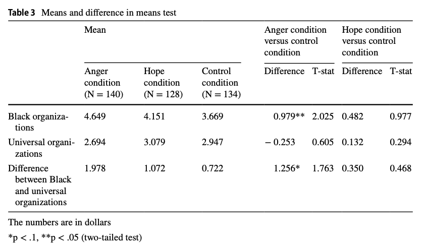

# Visualization {#visualize}

In this section, we will walk through some options for visualizing the results of experiments using R.

  - You may wish to refer to the [R Graphics cookbook](https://r-graphics.org/) by Winston Chang or [Data Visualization](https://socviz.co/) by Kieran Healy for additional examples of plotting in R.
  - For considerations on plotting for different types of experimental designs and randomization schemes, you may wish to consult Alex Coppock's [chapter](https://alexandercoppock.com/coppock_2020.pdf) in *Advances in Experimental Political Science*.


## Plotting Average Treatment Effects

The example we will use is from ["Black Politics: How Anger Infuences the Political Actions
Blacks Pursue to Reduce Racial Inequality"](https://link.springer.com/article/10.1007/s11109-018-9477-1) by Antoine J. Banks, Ismail K. White, and Brian D. McKenzie, published in *Political Behavior* in 2019.

We will replicate the results from Study 2, which is a survey experiment. The sample includes 444 Black treated Black respondents recruited by Qualtrics. The excerpt below shows the experimental manipulation.

{width=70%}


Let's load the data. Note: This file is in a .dta format, but if you try to use `read.dta` to load it, you may receive an error because it is too new of a Stata format. As an alternative, we can use the `rio` package to open the file. Install the package, open the package with `library` an load the data. The `rio` packages uses a single `import` function to load data.

```{r}
## install.packages("rio", dependencies=T)
library(rio)
banks <- import("data/banksstudy2.dta")
```

The authors have a variable in their data `baddata` they use to exclude subjects who failed to follow the instructions of their manipulation. They limit their analyses to those who passed this check. Let's do the same by removing any subjects that have non-missing values on this variable.

```{r}
banks <- subset(banks, is.na(baddata)==T)
```

Let's replicate a portion of the analysis presented in Table 3 of the paper. 

{width=80%}


We will first calculate our estimate of $E(Y_i(1_{anger}) - Y_i(0_{no anger}))$ using the difference-in-means estimator: $\sum_{i=1}^m Y_i(1_{anger}) - \sum_{m+1}^{N-m}Y_i(0_{no anger})$.

  - We will compare those in the Anger and Control conditions on the outcome for donations to Black organizations.
  - We will use a t-test to do so.
  
```{r}
d.i.m <- mean(banks$blackdon[banks$angvcon == 1], na.rm=T) -
  mean(banks$blackdon[banks$angvcon == 0], na.rm=T)
t.results <- t.test(banks$blackdon[banks$angvcon == 1],
                    banks$blackdon[banks$angvcon == 0])
ci <- t.results$conf.int
```

Let's repeat for the hope condition.

```{r}
d.i.m2 <- mean(banks$blackdon[banks$hopevcon == 1], na.rm=T) -
  mean(banks$blackdon[banks$hopevcon == 0], na.rm=T)
t.results2 <- t.test(banks$blackdon[banks$hopevcon == 1],
                    banks$blackdon[banks$hopevcon == 0])
ci2 <- t.results2$conf.int
```

We could have alternatively used a linear regression to assess significance or randomization inference. <details> <summary>Expand for a randomization inference example.</summary>

Let's focus on just the Anger vs. Control first.
```{r, warning=F, message=F}
angercontrol <- subset(banks, angvcon == 0 | angvcon ==1)

## remove missing data
angercontrol <- subset(angercontrol, is.na(blackdon) ==F)

## install.packages("ri2", dependencies=T)
library(ri2)

## Declare randomization
declaration <- declare_ra(N=nrow(angercontrol), prob=.5)

## Estimate the average treatment effect
set.seed(1215)
ri2_out <- conduct_ri(
  formula = blackdon ~ angvcon,
  assignment = "angvcon",
  declaration = declaration,
  sharp_hypothesis = 0,
  data = angercontrol
)


```

Plot and compare distribution to observed ATE

```{r, warning=F, message=F}
plot(ri2_out)
```


Summarize Output

```{r}
summary(ri2_out)
```

We can manually see what the package is doing by counting how many of the simulated estimates from the empirical distribution of the sharp null hypothesis were more extreme than our estimate from the study. Note that in this case, our p-value is very similar to the t-test.

```{r}
estimate <- tidy(ri2_out)$estimate
nsims <- length(ri2_out$sims_df$est_sim)
simstimates <- ri2_out$sims_df$est_sim
## Two-tailed p-value
length(simstimates[abs(simstimates) >= abs(estimate)])/nsims
```


We can compare this to the p-value through the t-test where we assume a t distribution and calculate the area at the extremes as larger or larger than our t-statistic.

```{r, echo=F}

t <- seq(-3, 3, .1)
plot(t, dt(t, df=268.77), ylab="Density", type="l")
abline(v=c(t.results$statistic, -t.results$statistic), col="red", lty=2)
polygon(c(-3,seq(-3, -t.results$statistic, .05),-t.results$statistic),
        c(0,dt(seq(-3, -t.results$statistic, .05), df=268.77),0),
        col="pink")
polygon(c(t.results$statistic, seq(t.results$statistic, 3,.05),3),
        c(0,dt(seq(t.results$statistic,3, .05), df=268.77),0),
        col="pink")
```


</details>


### ATE using `plot`

When we want to visualize results in R, generally we plot the main Quantity of Interest 

  - Usually the estimated average treatment effect and/or average outcome from each condition condition
      + With uncertainty estimates
      + Potentially also showing the distribution of underlying data
  - Some marker to show a relative benchmark (e.g., a line at 0)


The `plot` function in R is based on a coordinate system. We supply the `x=` and `y=` values where we want to place points.

```{r, echo=F}
plot(0,
     xlim=c(1, 10), # x-axis limits
     ylim=c(1,100), # y-axis limits
     type = "n", # n means blank
     xlab = "x-axis label",
     ylab = "y-axis label",
     cex.main = .7, cex.lab = .7, cex.axis=.6, # size of title, label, axis text
     main = "title of plot")
```

We will make a plot to display the two ATE estimates we just calculated. 

  - We need to supply the exact same number of values for the x-axis as the y-axis. Let's plot the ATE estimates at points 1 and 2 on the x-axis and at the corresponding y-values for the ATEs we estimated.

```{r}  
## Plot 
plot(x = c(1, 2), 
     y = c(d.i.m, d.i.m2))
```

This has created the plot, but it is not very informative.

  - Let' set the axis dimensions with `xlim=` an `ylim=`
  - Let's add a title with `main=`
      + We can adjust the size of the title text with `cex.main`
  - Let's add a label for y and x axis with `ylab` and `xlab`
      + We can adjust the size of the labels `cex.lab`

  
```{r}
plot(x = c(1, 2), 
     y = c(d.i.m, d.i.m2),
     xlim=c(.5, 2.5),
     ylim = c(-1, 2),
     main="Average Treatment Effects on Donations to Black Organizations",
     cex.main=.8,
     ylab="Difference in Donation Amount",
     xlab= "Treatment Comparison",
     cex.lab=.8)

```
  
In our case, the values on the x-axis are meaningless. We arbitrarily placed the points at 1 and 2. Let's get rid of the current x-axis and instead replace it with an axis that labels our comparisons.

  - We get rid of the current x-axis with `xaxt="n"`
  - We create a new axis using the `axis` function. Note: this function goes below the `plot()` function instead of inside it. 
  

```{r}
plot(x = c(1, 2), 
     y = c(d.i.m, d.i.m2),
     xlim=c(.5, 2.5),
     ylim = c(-1, 2),
     main="Average Treatment Effects on Donations to Black Organizations",
     cex.main=.8,
     ylab="Difference in Donation Amount",
     xlab= "Treatment Comparison",
     cex.lab=.8,
     xaxt="n")
axis(1, at=1:2, labels=c("Anger vs. \n Control","Hope vs. \n Control"),
     tick=F)
```

We now have an informative plot of our ATE quantities of interest. However, we still need to add something to visualize uncertainty and a benchmark to indicate the size and/or significance of our quantities.

  - We can add a horizonatal line to the plot with `abline(h=)`. Like `axis()`, this function goes below the `plot()` function.
  - We can add confidence intervals as vertical line segments to our plot using the `lines` function. Again, this adds a layer below our plot.
  
```{r}
plot(x = c(1, 2), 
     y = c(d.i.m, d.i.m2),
     xlim=c(.5, 2.5),
     ylim = c(-1, 2),
     main="Average Treatment Effects on Donations to Black Organizations",
     cex.main=.8,
     ylab="Difference in Donation Amount",
     xlab= "Treatment Comparison",
     cex.lab=.8,
     xaxt="n")
axis(1, at=1:2, labels=c("Anger vs. \n Control","Hope vs. \n Control"),
     tick=F)
abline(h=0, col="red3", lty=2)
lines(c(1,1), ci)
lines(c(2,2), ci2)
```

### ATE with `ggplot`

The package `ggplot2` also offers a system of plotting in R. The "gg" in ggplot2 stands for the "Grammar of Graphics." This program provides another framework for creating figures in R. According to Hadley Wickham, "ggplot2 provides beautiful, hassle-free plots that take care of fiddly details like drawing legends."

Practically speaking, `ggplot()` is another tool to plot the same types of figures we have been making in class. Some people prefer `ggplot2` because they find the logic of building figures more intuitive using this framework and/or more aesthetically pleasing. However, both `ggplot()` and the plots we have been making in class can accomplish the same ultimate goals of data visualization-- to communicate information transparently, quickly, accurately, simply, and beautifully. Which types of plots you may prefer is up to your own taste.

The syntax for this is different. One of the primary differences is that the `ggplot` function generally requires that you start from a `data.frame` object. This means that we will have to organize the set of results we want to plot into a rectangular data.frame.

```{r}
## Put each result in a vector
angerresults <- c(d.i.m, ci)
hoperesults <- c(d.i.m2, ci2)

## Bind these together as rows, store as dataframe
comb <- data.frame(rbind(angerresults, hoperesults))

## Give columns informative labels
names(comb) <- c("ATE", "lower", "upper")

## Add group indicator
comb$Comparison <- c("Anger vs. \n Control","Hope vs. \n Control")

```

Now we can use the `ggplot` function from the `ggplot2` package. The main plotting function in `ggplot2` is the `ggplot()` function. It will give you access to barplots, boxplots, scatterplots, histograms, etc.

The three primary components of a ggplot() are a dataframe (`data =`), a set of mapping aesthetics (`aes()`), and `geoms` (e.g., geom boxplot, geom bar, geom point, geom line, etc.).

  - The function `ggplot()` first takes a dataframe that includes the values you would like to plot (e.g., `data = comb`).
  - The aesthetics then include the variable names that you want to plot on the x and y axis (e.g., `aes(x=Comparison, y=ATE)`)
      + Additional mapping aesthetics can be specified. For example, a third variable (or a repeat of a previous variable) can also be specified (e.g., `fill =`, `colour =`, `shape =`), which acts as a grouping variable. If this is specified, `ggplot()` will create a corresponding legend for the plot and will color/make different shapes for different groups within this third variable.
  - After closing out the first `ggplot()` parentheses, you then annotate the plot by adding (`+`) a geometric layer. 
      + In the example below, we use the `geom_point` layer to add the ATEs and `geom_errorbar` layer to add confidence intervals.


There are many more possibilities for plotting with `ggplot()`. For additional resources on all that is gg, I recommend the [R Graphics Cookbook](https:// r-graphics.org/).


```{r, message=F, warning=F}
library(ggplot2)
ggplot(comb, aes(x=Comparison, y=ATE))+
  geom_point()+
  geom_errorbar(aes(ymin=lower, ymax=upper), width=.1)+
  theme_bw()
```

Just like with the other plotting functions in R, you can also specify a number of other arguments to make your plot more informative and aesthetically pleasing. Here, you do this by adding (`+`) additional arguments. See examples below (e.g., `ggtitle`, `xlab`, `ylab` for titles, `ylim` for y-axis limits, etc.). We can also add a horizontal line with `geom_hline`.

```{r}
ggplot(comb, aes(x=Comparison, y=ATE))+
  geom_point()+
  geom_errorbar(aes(ymin=lower, ymax=upper), width=.1)+
  theme_bw()+
  geom_hline(aes(yintercept=0), linetype="dashed", colour="red3")+
  ggtitle("Average Treatment Effects on Donations to Black Organizations")+
  theme(plot.title = element_text(hjust = 0.5))# centers title
```

## Heterogeneous Treatment Effects


Let's replicate Figure 3 of the paper to study heterogeneous treatment effects. The authors compute these using a regression analysis. We will focus on the Anger vs. Control condition.

First, let's limit the sample to just these two conditions.

```{r}
angcontrol <- subset(banks, angvcon == 1 | angvcon == 0)
```

We will look at how the effect of anger varies across the Community Nationalism Scale in the variable `blackauto3`. This is a three-point scale with points at 0,1, and 2. We could treat this as a numeric variable or as a categorical variable. We will first do it as a categorical variable.

```{r}
## option 1- categorical
fit <- lm(blackdon ~ angvcon*factor(blackauto3), data=angcontrol)
summary(fit)
```

Focus on the interaction term when interpreting the results for the heterogeneous treatment effects.

```{r}
## option 2- numeric
fit.numeric <- lm(blackdon ~ angvcon*blackauto3, data=angcontrol)
```

We can then calculate the average treatment effects within each level of `blackauto3` using the `margins()` function in R from the `margins` package.

  - The first input is the object name for the regression model (e.g., `fit`).
  - The next input is a list of variables and their corresponding values for which you want to hold constant while estimating marginal effects of some other variable
  - The `variable` input is then the treatment condition, or the variable for which you want to estimate the marginal effect on the outcome. The `change` then describes the two values of the treatment condition variable that represent the control vs. treatment. In this case it was 0 vs. 1. If your treatment condition is a factor variable, you probably don't need to specify this.

```{r, warning=F, message=F}
library(margins)
outp <- margins(fit, at = list(blackauto3 = c(0, 1, 2)),
        variable = "angvcon", change = c(0, 1))
summary(outp)
```
The summary is already in a nice dataframe format, which makes it easy to use ggplot.

```{r}
outp.df <- summary(outp)

ggplot(outp.df, aes(x=blackauto3, y=AME))+
  geom_point()+
  geom_errorbar(aes(ymin=lower, ymax=upper), width=.1)+
  theme_bw()+
  geom_hline(aes(yintercept=0), linetype="dashed", colour="red3")+
  ggtitle("Average Treatment Effects on Donations to Black Organizations \n by Community nationalism")+
  ylab("Average Treatment Effects on Black Org. Donations")+
  xlab("Community Nationalism")+
  scale_x_continuous(breaks = c(0, 1, 2), labels = c("Low", "Medium", "High"))+
  theme(plot.title = element_text(hjust = 0.5))# centers title
```

Here's an alternative way to look at it with `geom_line` and `geom_ribbon`

```{r}
ggplot(outp.df, aes(x=blackauto3, y=AME))+
  geom_point()+
  geom_line()+
  geom_ribbon(aes(ymin=lower, ymax=upper), alpha=.4)+
  theme_bw()+
  geom_hline(aes(yintercept=0), linetype="dashed", colour="red3")+
  ggtitle("Average Treatment Effects on Donations to Black Organizations \n by Community nationalism")+
  ylab("Average Treatment Effects on Black Org. Donations")+
  xlab("Community Nationalism")+
  scale_x_continuous(breaks = c(0, 1, 2), labels = c("Low", "Medium", "High"))+
  theme(plot.title = element_text(hjust = 0.5))# centers title
```

An alternative way to represent heterogeneity is instead of plotting the conditional average treatment effects, we can plot the raw outcomes in each condition.

We can then calculate the estimated outcomes using the `prediction` package in R. It works somewhat similarly to `margins` except we do not specify the variable for estimating the marginal effect. Instead, we fold the treatment variable into the list argument.

```{r, message=F, warning=F}
library(prediction)
outp2 <- prediction(fit, at = list(blackauto3 = c(0, 1, 2),
                                  angvcon = c(0,1)),
                   calculate_se = T)
summary(outp2)

outp2.df <- data.frame(summary(outp2))
```

```{r}
ggplot(outp2.df, aes(x=at.blackauto3., y=Prediction, 
                     fill=as.factor(at.angvcon.)))+
  geom_point()+
  geom_line()+
  geom_ribbon(aes(ymin=lower, ymax=upper), alpha=.4)+
  theme_bw()+
  ggtitle("Average Donations to Black Organizations \n by Community nationalism")+
  ylab("Average Black Org. Donations")+
  xlab("Community Nationalism")+
  scale_fill_manual("Condition", labels=c("Control", "Anger"), values=c("orange", "dodgerblue"))+
  scale_x_continuous(breaks = c(0, 1, 2), 
                     labels = c("Low", "Medium", "High"))+
  theme(plot.title = element_text(hjust = 0.5))# centers title
```


## Some additional plotting options


The common visualizations used to show average treatment effects do not give much information about the distributions of underlying data. Here are a few examples of plotting the underlying distributions.

  - You might also explore `geom_bar` for outcomes that are binary or categorical in nature as an alternative to `geom_histogram`.


Create a variable that summarizes all three experimental conditions. This will make it easier to plot data grouped by each condition.
```{r}
banks$condition <- NA
banks$condition[banks$angvcon == 1] <- "Anger"
banks$condition[banks$hopevcon == 1] <- "Hope"
banks$condition[banks$angvcon ==  0 & banks$hopevcon == 0] <- "Control"
banks$condition <- factor(banks$condition, levels=c("Control", "Anger", "Hope"))
```

We filter out respondents who were not assigned to any condition. You can do this as part of the plot code, or you can `banks <- subset(banks, is.na(condition)==F)` prior to running the plot code.

```{r, warning=F, message=FALSE}
library(tidyverse)
banks %>%
  filter(is.na(condition)==F) %>%
  ggplot(aes(x=blackdon, fill=condition))+
  geom_histogram(alpha=.4)+
  theme_bw()+
  ggtitle("Distribution of Donations to Black Organizations")+
  theme(plot.title = element_text(hjust = 0.5),
        legend.position = "bottom") +
  facet_grid(~condition)+
  xlab("Amount Donation (dollars)")
```


```{r, warning=F, message=FALSE}
banks %>%
  filter(is.na(condition)==F) %>%
  ggplot(aes(y=blackdon, x=condition, color=condition))+
  geom_boxplot()+
  geom_jitter(alpha=.5)+
  theme_bw()+
  ggtitle("Distribution of Donations to Black Organizations")+
  theme(plot.title = element_text(hjust = 0.5),
        legend.position = "bottom") +
  ylab("Amount Donation (dollars)")
```


```{r, warning=F, message=FALSE}
banks %>%
  filter(is.na(condition)==F) %>%
  ggplot(aes(x=blackdon, fill=condition))+
  geom_density(alpha=.5)+
  theme_bw()+
  ggtitle("Distribution of Donations to Black Organizations")+
  theme(plot.title = element_text(hjust = 0.5)) +
  facet_grid(~condition)+
  xlab("Amount Donation (dollars)")
```

Here is a way to show the means and confidence intervals for each condition. This figure is based on the plot in Figure 17.1 from Alex Coppock's [chapter](https://alexandercoppock.com/coppock_2020.pdf) in *Advances in Experimental Political Science*.
```{r, warning=F, message=FALSE}
## Find means and confidence intervals by condition
banks <- subset(banks, is.na(condition)==F)
m.cond <- tapply(banks$blackdon, banks$condition, mean, na.rm=T)
ci.hope <- t.test(banks$blackdon[banks$condition == "Hope"])$conf.int
ci.anger <- t.test(banks$blackdon[banks$condition == "Anger"])$conf.int
ci.control <- t.test(banks$blackdon[banks$condition == "Control"])$conf.int
combd <- data.frame(cbind(cbind(m.cond),rbind(ci.control, ci.anger, ci.hope)))
names(combd) <- c("Mean", "lower", "upper")
combd$condition <- c("Control", "Anger", "Hope")
combd$condition <- factor(combd$condition, levels=c("Control", "Anger", "Hope"))


## Note we draw from both data=combd and data=banks
ggplot(combd, aes(x=condition, y=Mean, color=condition)) +
  geom_point(data = banks, aes(y=blackdon),
    position = position_jitter(width = 0.2, height = 0.1),
    alpha = 0.4) +
  geom_point(size = 3) +
  geom_errorbar(aes(ymin = lower, ymax = upper), width = 0) +
  theme_bw() +
  ggtitle("Donations to Black Organizations by Condition")+
  theme(plot.title = element_text(hjust = 0.5)) +
  scale_y_continuous(breaks = seq(0, 10, length.out = 5)) +
  theme(axis.title.x = element_blank()) +
  ylab("Donations (dollars)")
```


## Examples of arguments in `plot`

Here are some common R plotting functions and arguments

Create a plot

  - `plot()`: for scatterplots and trend plots
  - `barplot()`: for barplot comparisons across categories
  - `boxplot()`: boxplot for summaries of numeric variables
  - `hist()`: for histogram summaries of a single numeric variable
  
Aesthetic arguments within a plot

  - `main = `: Specifies the main title of the plot. Supply text (e.g.,  `main = "my title"`) 
  - `ylab = `: Specifies the title of the y-axis. Supply text (e.g.,  `ylab = "Mean of variable"`) 
  - `xlab = `: Specifies the title of the x-axis. Supply text (e.g.,  `xlab = "X variable name"`)
  - `ylim =`: Specifies the range of the y-axis. Supply vector of two numbers (e.g., `ylim = c(0, 100)`)
  - `xlim =`: Specifies the range of the x-axis. Supply vector of two numbers (e.g., `xlim = c(0, 100)`)
  - `bty="n"`: Removes the border box around the plot
  - `cex`, `cex.main`, `cex.names`, `cex.lab`, `cex.axis`: Changes the size of different elements of a plot. Default is 1, so a value of .8 would be smaller than default, and 1.2 would be bigger than normal.
  - `type =`: Specifies the type of plot (e.g., `type="l"` is a line plot, `type="b"` is a plot with points and lines connecting them)
  - `lwd=`: Specifies the width of a line on a plot. Default is 1. E.g., `lwd=3` makes a line much thicker
  - `pch=`: Specifies the point type. E.g., `pch=15`
  - `lty=`: Specifies the line type. E.g., `lty=2` is a dashed line
  - `col=`: Specifies the color of the central element of the plot. Can take a single color or vector of colors. Use `colors()` in the console to see all R colors.
  - `names`: Specifies a set of labels in a barplot
  

Ways to annotate a plot (generally added below the initial plotting function)

  - `abline()`: Adds a line to the plot at a particular point on the x- or y- intercept, either horizontal, vertical, or of a particular slope
      + Example: Adding a horizontal line at a particular at a y value of 2 `abline(h=2)`
      + Example: Adding a vertical line at a particular at a x value of 2 `abline(v=2)`
  - `lines(x=, y=)`: Adds a line connecting pairs of x- and y-coordinates. We used this to add the South line to the social mobility plot.
  - `axis()`: Used to replace the default x- or y- axis that R will create with a customized axis
      + To create an original y-axis, use `axis(2, vectorofvalues, labels)` and specify `yaxt="n"` inside the plotting function to remove the original y-axis.
      + To create an original x-axis, use `axis(1, vectorofvalues, labels)` and specify `xaxt="n"` inside the plotting function to remove the original x-axis.
  - `legend()`: Adds a legend to a plot. Can specify the location as the first argument (e.g., `"bottomleft"` or `"topright"`)
  - `text()`: Adds text to a plot at specific x- and y- locations. (E.g., `text(x=3, y=4, "Here is a point"`). The x and y arguments can be single numbers or a vector of numbers. x and y need to be the same length.
  - `points()`: Adds points to a plot at specific x- and y- locations. Inputs are much like `plot`


