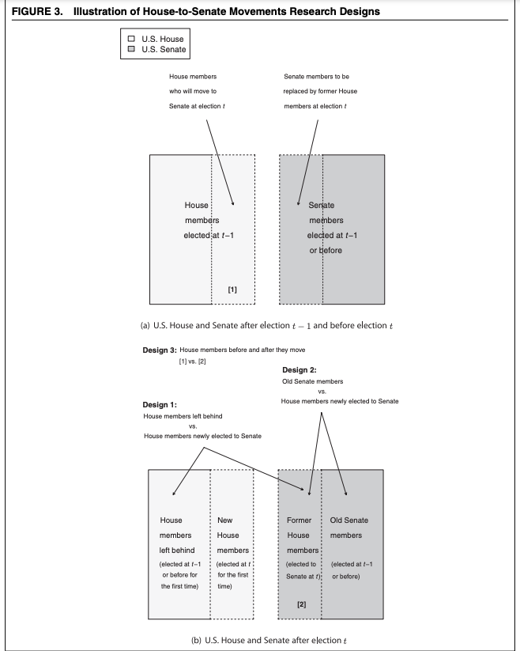

# Quasi and Natural Experiments {#quasi}

In this section, we will discuss quasi- and natural experiments. Here are a few sources we will draw upon for the discussion.

  - Sekhon, Jasjeet S., and Rocio Titiunik. 2012. "When Natural Experiments Are Neither Natural Nor Experiments." American Political Science Review, 106 (1): 35-57.
      + For more on natural experiments, see Thad Dunning's [book](https://www.cambridge.org/core/books/natural-experiments-in-the-social-sciences/96A64CBDC2A2952DC1C68AF77DE675AF)
  - RDD: Michael Barber, Daniel M. Butler and Jessica Preece (2016), "Gender Inequalities in Campaign Finance", Quarterly Journal of Political Science: Vol. 11: No. 2, pp 219-248. http://dx.doi.org/10.1561/100.00015126 
  - DiD and Unexpected Event: HOLMAN, M., MEROLLA, J., & ZECHMEISTER, E. (2021). The Curious Case of Theresa May and the Public That Did Not Rally: Gendered Reactions to Terrorist Attacks Can Cause Slumps Not Bumps. American Political Science Review, 1-16. doi: 10.1017/S0003055421000861 
  
## What makes an experiment not an experiment?

Earlier we outlined the characteristics that made a research design an experiment. These included things like "randomization" and "manipulation of treatment" and "control" from the researcher. These characteristics were important to give us confidence that we were identifying not just correlations, but "causal" effects.

In this section, we begin to look at designs where these are not feasible. Can we still make causal claims in these settings, or is this a doomed adventure?

{width=50%}


  
### What is a natural experiment?


<style>
p.comment {
background-color: #DBDBDB;
padding: 10px;
border: 1px solid black;
margin-left: 25px;
border-radius: 5px;
font-style: italic;
}

</style>

First, let's think about what separates a "randomized controlled experiment" from a "natural experiment" from something that just isn't an "experiment." 

***What is the difference in how the treatment is administered?***

<p class="comment">
Your ideas ...                                                                                                           </p>                                                                               


We want whatever variable that stands in as our "treatment" to be plausibly "exogenous" in our design/model: "Exogeneity implies that the treatment and control groups created by the natural experiment are similar in terms of all observed and unobserved factors that may affect the outcome of interest, with the exception of the treatment and confounders that the researcher
controls for." (Sekhon and Titiunik)

***How do we identify treatment and control comparison groups?***

<p class="comment">
Your ideas ...                                                                                                           </p>                                                                               


Even without a randomized treatment, we can still think about the logic of our experimental design along the same way as the diagram below. We just need to think more carefully about our assumptions and potentially make adjustments to our design or modelling to help reduce the potential for selection bias or violations to excludability.

  - Cross-sectional between subjects
  - Before vs. After
  - Differences-in-Differences


For example, we could investigate the comparisons in the Sekhon and Titiunik discussion of the Grofman et al. work on legislator movement between the House and Senate.

{width=50%}


Design 3 is an example of before vs. after. As the authors note, here we can rule out confounders related to the individuals, as we are comparing the same units across time. However, we have to assume a "change in behavior of moving House members between $t - 1$ and $t$ can only be attributed to the movement from the House to the Senate if other factors that affect roll-call voting are
held constant between these two period...that moving House members would not have changed their behavior between $t- 1$ and $t$ if they had
stayed in the House."

## Exploiting Exogenous Policy Changes and Events


We will use the application from "The Curious Case of Theresa May and the Public That Did Not Rally: Gendered Reactions to Terrorist Attacks Can Cause Slumps Not Bumps" by Mirya Holman, Jennifer Merolla, and Elizabeth Zechmeister published in 2021 in the *American Political Science Review.* doi: 10.1017/S0003055421000861 

Research Question: How does leader gender influence the rally around the flag effect? Do people rally around the flag for women leaders?

  - Application: They look at the impact of a terrorist attack on support for Theresa May.
      + The May 22, 2017 Manchester Bombing occurred during the fielding of the 2017 British Election Study
      + As the authors note on pg. 252, the treatment (the terrorist attack) occurred "as if" random with respect to the timing of individuals' survey responses about the likeability of May and preference for prime minister.
          - Note that similar to a regression discontinuity design, they restrict the "bandwidth" around the attack to include survey responses close to the attack.


### Unexpected Event Design

The authors use the following justification for an unexpected event during survey design.

  - "The event was unanticipated by all except the attacker and their confidants and there is an exogenous assignment of the treatment and control groups from random survey rollout." 
  - "We can thus compare responses of individuals in the control group (i.e., those who took the survey before the Manchester Bombing) and the
treatment group (i.e., those who took that same survey after the Manchester Bombing). 

This represents a between-subjects version of a before-after design.

Key Assumptions

  - Treatment assignment as-if random. While this assumption is not fully testable, we can partially examine it by comparing the treatment and control groups on a number of variables that should not differ between the groups (e.g., demographics). See pg. 253
  - No other events/changes influence before-after trend. What if it was an economic decline? Or effects of Brexit? See pgs. 257-258.
  

***Analysis and Results***

The authors run a regression analysis to compare the favorability of May among those surveyed after the attack ($Y_i(1) | d_i =$ surveyed after) to the favorability of May among those surveyed before the attack ($Y_i(0) | d_i =$ surveyed before).

{width=50%}

How can we interpret the -.332 result in the first column?


### Differences in Differences

The authors also place their framework into a differences-in-differences design. The British Election Study is a panel survey with multiple waves with the attack ocurring in Wave 12. The previous analysis used only the 12th wave. In this analysis, we compare the ***trends*** in support for May among those who were eventually treated with the terror attack in the 12th wave to those who went untreated in the 12th wave.

Below is a stylized way to think about difference-in-difference designs.

{width=60%}


The authors interact the treatment variable (whether respondents were exposed to the terrorist attack in Wave 12) with a time variable indicating in the favorability of May was measured prior to or in Wave 12.

  - This interaction represents the causal effect of the terrorist attack on May's favorability by comparing the trend in opinion among the treatment and control group.

{width=50%}


Key Assumption of Differences in Differences

  - Parallel Trends: In the absence of treatment, the trend/slope of the control group and treatment group would be the same.


## Regression Discontinuity


Strategy for causal inference in observational studies

  - Exploits a point of discontinuity that can be attributed to an ***exogenous treatment*** (influenced/determined by an outside force-- think physical boundaries, rules, policy inclusion/exclusion thresholds)
  - Compare units "close to" discontinuity, assuming similar except on either side of threshold
  - Strong internal validity, low generalizability away from discontinuity

### Sharp RD

We observe the treated potential outcome if a unit is above some threshold $c$ along the "running/forcing" variable $X$. Otherwise, we observe the untreated potential outcome.

\begin{equation*}
  Y_i =(1 - d_i)Y_i(0) + d_iY_i(1)=\begin{cases}
    Y_i(1), & \text{if $X_i > c$}.\\
    Y_i(0), & \text{if $X_i \leq c$}.
  \end{cases}
\end{equation*}
where $c$ is a threshold/point of discontinuity

Our causal effect of interest is still $Y_i(1) - Y_i(0)$, but we still struggle from the same fundamental problem of causal inference.

In RD designs, similar to common experimental analyses, we will estimate an average treatment effect by comparing an average outcome among the treated units to the control units.

  - However, we only look at units close to the discontinuity. It is here where we think treatment assignment is plausibly exogenous. Why?
  - This then influences our interpretation of the average effect. It is no longer the average effect of all units. Instead it is a "local average treatment effect" for units at the point of discontinuity.

#### Sharp vs. Fuzzy

In a fuzzy regression design, the rule/threshold only influences the *probability* of treatment status and does not determine it.

  - You can think of this as similar to the encouragement designs from last section
  - We estimate the local average treatment effects in fuzzy regression discontinuity using the same two-stage regression model with instrumental variables regression that we did there. In class we will primarily focus on sharp RD.

### Application in R

We will use a regression discontinuity design to estimate whether female state legislative incumbents have more trouble fundraising than do male 
legislative incumbents. Observations consist of information on all U.S. 
state legislative races in which a male and female candidate ran 
against each other. This is based on the article:

  - Barber, Michael, Daniel Butler, and Jessica Preece. 2016. ``Gender Inequalities in Campaign Finance.http://dx.doi.org/10.1561/100.00015126 Quarterly Journal of Political Science 11(2): 219-248.


Note the authors' discussion of possible research designs on pg. 22-225.

  - Option 1: "Most studies focus on the amount of money that
candidates raise, comparing the amount raised by similar male and female
candidates. On the most basic level, this is done by estimating a model that
controls for other relevant factors and tests to see whether women raise more
or less money than men."
    + "It relies on the important assumption that the model accounts for all other relevant variables. If not, then omitted variable bias can affect the estimates. Omitted variable bias is particularly likely to be a problem when studying gender and fundraising because, as Palmer and Simon (2006) show, women and men represent districts that are very different on average... when
we compare men and women we cannot rule out that any results simply reflect
the differences in district characteristics and have nothing to do with the
politician's sex."
  - Chosen Option: "Rather than trying to control for all possible confounding factors, we use a regression discontinuity design to identify incumbents who represent districts that are otherwise similar."
    + Assumption: Random assignment of the treatment ***in the neighborhood of the treatment threshold***
    + "In this case, we consider races where male and female candidates face off and use the proportion of the votes won by the female candidate as the variable that determines treatment assignment:" whether or not a district has a male or female incumbent (226).
    + "We then compare the fundraising by the male winners and female winners in the following election cycle. Differences between these two groups of legislators should be due purely to gender differences because district and electoral factors are balanced between the treatment and control groups of legislators." (226-227).


The data file you will use is `fundsub.csv`, a CSV data file. 

The independent variables are the winning (incumbent) candidate's gender and the vote share the female candidate received in the election. 

  - `male.winner`: Coded 1= a man won the election and 0= a woman won the election in the most recent election in a legislative district (time $t$)
  - `female.margin`:   The two-candidate vote share that the woman candidate won in the most recent election in a legislative district in time $t$ (if above 50 a woman won, if a below 50, a man won

The outcome variable is the amount the winning candidate in a given election (which could be male or female) raised in their *next* election cycle. We will analyze their data to help determine if male winning candidates raise more money than female winning candidates in their subsequent election cycles when they are incumbents. 

  - `total.candidate.raised`: Amount raised by the winning candidate (i.e., the incumbent) in the subsequent election cycle (time $t+1$)
  - `log.total.candidate.raised`: The log of the total amount raised by the  winning candidate (i.e., the incumbent) in the subsequent election cycle (time $t +1$)
      + Because the fundraising data is heavily skewed, researchers used the log of the variable instead of the raw variable. This makes our data look more "normal" in distribution because it compresses the scale
  - `log.total.dist.last`: The log of the total spending in the district in the previous election cycle (time $t - 1$)


Let's load the data

```{r, eval=F}
fund <- read.csv("fundsub.csv")
```

```{r, echo=F}
fund <- read.csv("data/fundsub.csv")
```

We need to locate $X$, $c$, $Y$, and a variable that determines if we observe a subject's treated potential outcome $Y_i(1)$ or untreated potential outcome $Y_i(0$).

```{r}
## X is the running/forcing variable
## X > 50 means a female candidate won
range(fund$female.margin[fund$male.winner ==0])

## X < 50 means a male candidate won
range(fund$female.margin[fund$male.winner ==1])
```

To make our regression easier to interpret, we should also center our forcing variable on 50, such that when this variable is 0, that is our threshold of winning.

  - We will create a new variable called `forcing.variable` that does this. In addition, to match the authors, we actually want the variable to be in a direction where positive values mean that the male candidates were winners (and negative, female winners).

```{r}
fund$forcing.variable <- -1*(fund$female.margin - 50)
```
  
We are going to compare the amount of money raised among incumbents who are male vs. incumbents who are female using a regression discontinuity design. Let's replicate the first column of Table 1 in their paper.

{width=40%}

  - Following the researchers, we are going to restrict our analysis to compare candidates who won races that were competitive: within +/- 2 percentage points in vote share. We also want to remove ties, cases where the female margin is 50. 

```{r}
rsub <- subset(fund, female.margin > 48 & 
                 female.margin < 52 &
                 female.margin !=50)
```


There are many different ways to estimate a regression discontunity local average treatment effect that range from simple to complex.

  - What bandwidth to choose? How do you choose it?
  - Allow slopes to differ on either side of discontinuity?
  - Should you account for potential non-linearities, in what way?
  - Should you weight observations differently, according to proximity to threshold?
  - Should you include covariates? Which covariates?

Most simple: Treat observations on a particular side of discontinuity as exchangeable and calculate a simple difference-in-means.
  
```{r}
uniform <- lm(log.total.raised.candidate ~ male.winner, 
          data = rsub)

coef(uniform)["male.winner"]

## This is equivalent to
mean(rsub$log.total.raised.candidate[rsub$male.winner == 1]) -
  mean(rsub$log.total.raised.candidate[rsub$male.winner == 0])
```

  - We find that male legislators who barely win election against
a female candidate go on to raise more money overall in the next election cycle than female candidates who barely win against male candidates.

Allow the vote margin to have a linear slope on either side of the discontinuity that can influence the outcome. 

  - Use an interaction term.
  - Estimate the effect of a male (vs. female) winning the election when the forcing variable is zero.

```{r}
linear <- lm(log.total.raised.candidate ~ male.winner*forcing.variable, 
          data = rsub)

coef(linear)["male.winner"]
```

Allow an algorithm to choose the bandwidth instead of relatively arbitrarily choosing +/- 2. To do this, we will use the `rdrobust` package in R.

```{r, eval=F}
install.packages("rdrobust", dependencies = T)
```

Open the package

```{r, warning=F}
library(rdrobust)

## remove ties
rdprep <- subset(fund, female.margin !=50)
rdb <- rdrobust(y=rdprep$log.total.raised.candidate,
                x=rdprep$forcing.variable, 
                kernel = "uniform", 
                p=1, 
                bwselect = "mserd")
summary(rdb)

## rdd effect
rdb$coef[1]
```

Note: we could use `rdrobust` to recover the estimate we already calculated by setting a specific bandwidth `h=2` to reflect the +/- 2.<details> <summary>Expand for the answer.</summary>


```{r}
rdbold <- rdrobust(y=rdprep$log.total.raised.candidate,
                x=rdprep$forcing.variable, 
                kernel = "uniform", 
                p=1, 
                h=2)
rdbold$coef[1]
```

</details>

We can also adjust the weighting of observations to weight observations closer to the discontinuity more heavily than those far away. In addition, instead of assuming a linear slope on either side, we could allow the slope to be non-linear, such as quadratic.

```{r}
## remove ties
rdb2 <- rdrobust(y=rdprep$log.total.raised.candidate,
                x=rdprep$forcing.variable, 
                kernel = "triangular", # implements a type of weighting 
                p=2, # shifts to quadratic 
                bwselect = "mserd")
summary(rdb2)

## rdd effect
rdb2$coef[1]
```

We see a positive local average treatment effect of male winners on fundraising in each specification, but whether this is significant depends on the specification. The choice should consider tradeoffs in bias created by expanding the bandwidth vs. variance, which may be affected by changing the sample size.

```{r, echo=F}
plot(x=1:3,
     y= c(coef(linear)["male.winner"], 
          rdb$coef[1],
          rdb2$coef[1]), 
     ylim = c(-1, 2), 
     xlim = c(.8, 3.2),
     pch = 15, 
     xaxt= "n", xlab = "Bandwidths", main = "RDD Estimates",
     ylab = "Effect on Log Total Raised Candidate")
lines(c(1,1), confint(linear)[2,])
lines(c(2,2), rdb$ci[1,])
lines(c(3,3), rdb2$ci[1,])

abline(h=0, col = "red")
text(1:3, -.5, c("+/- 2",  "+/- 7 \n Optimal", "Triangular \n Quadratic"), cex = .6)
```

### Considerations in RD Design

Remember: This is a local average treatment effect only

  - Potentially poor generalizability
  - Should incorporate placebo and design tests to help justify assumptions
      + E.g., The discontinuity should influence what you hypothesize it to influence and should NOT influence something you do not hypothesize it to influence
      + E.g., Check for sorting around the threshold
  - Recommend you review documentation for `rdrobust` before using it in your own work [here](https://rdpackages.github.io/rdrobust/)
  - May also be interested in [*A Practical Introduction to Regression Discontinuity Designs*](https://www.cambridge.org/core/books/practical-introduction-to-regression-discontinuity-designs/F04907129D5C1B823E3DB19C31CAB905) by Cattaneo, Idrobo, and Titiunik


***Example: Placebo Analysis***

We assume that treatment assignment is "as-if" random around the cutpoint (discontinuity). 

  - This means that any  pre-treatment covariates should be continuous at the cutpoint, just as pre-treatment covariates should be balanced across conditions in an experiment. 
  - Any evidence that there is a significant discontinuity effect on a pre-treatment covariate would be evidence that perhaps we do not have an as-if random design. 

Let's do one test of this. Let's repeat our original RDD model of a +/-2 bandwidth, but now let's have the outcome be the total spending in the district in a previous election in t-1. Run the model and interpret the results in light of the design assumptions.

```{r, eval=F}
fit.sorting <- lm(log.total.dist.last ~ male.winner*forcing.variable,
                  data=rsub)
summary(fit.sorting)
```

We see a null effect here, which helps lend support that this "pre-treatment" covariate is balanced around the discontinuity. If, instead, it were significant, that might call into question that a male vs. female winner is "as-if" random in close elections.


### RD Visualizations

One benefit of the `rdrobust` package is that it makes it fairly easy to implement common visualizations of the RDD.

  - A few examples with different specifications

```{r}
rdplot(y= rdprep$log.total.raised.candidate,
               x=rdprep$female.margin,
               kernel="uniform",  p=1, c=50, 
               title="RD Plot: Candidate Fundraising",
      y.label="Fundraising at time t+1", 
      x.label="Female Vote Share in Election at time t")
```


```{r}
rdplot(y= rdprep$log.total.raised.candidate,
               x=rdprep$female.margin,
               kernel="triangular",  p=2, c=50,
               title="RD Plot: Candidate Fundraising",
      y.label="Fundraising at time t+1", 
      x.label="Female Vote Share in Election at time t")
```


### Fuzzy RD Application

We will adapt the example from [Andrew Heiss](https://evalf20.classes.andrewheiss.com/example/rdd-fuzzy/), which evaluates the effectiveness of a tutoring program on performance on a school's exit exam.

  - Here, students become eligible for the tutoring program if they score 70 or below on an exam at the beginning of the school year.
  - However, students are not forced to take this program, and some students may still be able to enroll in tutoring even if they scored above 70. In short we have a ***compliance*** issue, just as we discussed compliance issues in encouragement designs for field experiments.
      + Compliers are those that enroll in the tutoring program if and only if they scored 70 or below.
  - Our goal with a fuzzy regression design is to estimate the LATE, the complier average causal effect for those in the neighborhood of the cutoff.
      + In this way, we combine the "local" aspect of sharp RD by estimating effects at a threshold, and the "local" nature of complier effects in that the effect is only applicable for people who are compliers.
      

Let's load the data, which can be found linked through his website [here](https://evalf20.classes.andrewheiss.com/data/tutoring_program_fuzzy.csv).

```{r, echo=F}
tutor <- read.csv("data/tutoring_program_fuzzy.csv")
```
```{r, eval=F}
tutor <- read.csv("tutoring_program_fuzzy.csv")
```


We can see the distribution of scores for those in vs. not in the tutoring program. Most people who scored below 70 are in the program (TRUE), but there are also some people who scored above 70 in the program. Likewise, most people who scored above 70 are not in the program, but some that scored below 70 are also not in the program.

  - Entrance exam score is ***predictive*** of tutoring program uptake but not deterministically so.
      + Being below vs. above the cutoff is like the "encouragement" for whether someone takes vs. does not take the tutoring program, which is the "treatment."

```{r}
library(ggplot2)
ggplot(tutor, aes(x=entrance_exam, group=tutoring, color=tutoring))+
  geom_density()+
  geom_vline(xintercept=70)

```


We will now combine our two frameworks 1) Sharp RD and 2) Encouragement Designs to estimate our local average treatment effect for compliers.

Getting our data ready for the RD framework.

  - We will center the entrance exam score on the cutoff of 70 so that we can interpret the variable as distance from the threshold.
  - We will create our "instrument" variable by creating a variable that indicates if someone was below the cutoff ( = 1) vs. above the cutoff (= 0)
 
```{r}
tutor$forcing  <- tutor$entrance_exam - 70

tutor$below <- NA # initialize variable
tutor$below[tutor$entrance_exam <= 70] <- 1
tutor$below[tutor$entrance_exam > 70] <- 0
```
  
  - We will select a bandwidth of observations near the cutoff score. We will follow the Heiss example and use +/- 10
  
```{r}
tutor.narrow <- subset(tutor, forcing >= -10 &
                         forcing <= 10)
```
 
 
Implementing our CACE two-stage framework.

  - Recall that the we use the indicator of being above vs. below the cutoff as an encouragement/instrument for our treatment of being enrolled vs. not enrolled in the tutoring program.
  
```{r, warning=F, message=F}
library(AER)
fit2stage <- ivreg(exit_exam ~ forcing*tutoring |
                     forcing*below, data = tutor.narrow)
```

In addition to `AER` the `estimatr` package also have a two-stage function. They only differ in the default way of calculating standard errors. This function will have slightly more conservative standard errors.

```{r, warning=F, message=F}
library(estimatr)
fit2stage2 <- iv_robust(exit_exam ~ forcing*tutoring |
                     forcing*below, data = tutor.narrow)
summary(fit2stage2)
```

We can interpret 9.64 as the causal effect of the tutoring program on exit exam scores for compliers at the score threshold.

We can also implement the two-stage framework in the `rdrobust` package, which allows us to let an algorithm set the bandwidth for us and more easily integrate different choices for weighting.

```{r}
library(rdrobust)
fit2rdrob <- rdrobust(y=tutor$exit_exam, x=tutor$forcing,
                      fuzzy = tutor$tutoring,
                      kernel = "triangular")
summary(fit2rdrob)
```

Here, the bandwidth selected was closer to 13. With this alternate bandwidth and a triangular weight, we still get a result of 9.68, similar to the other specification.


Assumptions we made to identify this as a causal effect at the cutoff for compliers:

  - That our instrument is relevant. I.e., that the entrance exam cutoff of 70 was indeed predictive of program uptake. 
  - Exclusion restriction-- that our instrument (the cutoff score) only influences the final exam score through the tutoring program. If that cutoff were used for multiple decisions about a student, this may cast doubt on the viability of the assumption.
  - Exogeneity- we assume that the cutoff is quasi-random and rule out other possible confounders.
  


