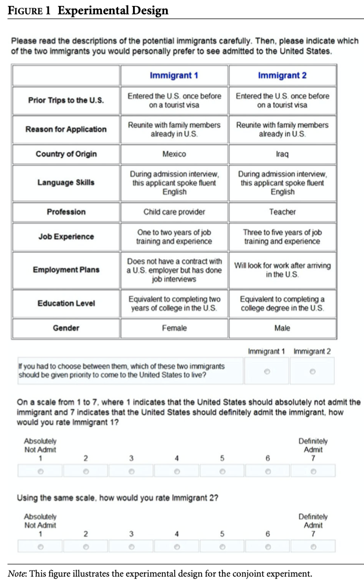

# Conjoints {#conjoints}


In this section, we will briefly go over conjoint designs. You can see the following resources:

  - Application: Hainmueller, Jens and Daniel J. Hopkins. ["The Hidden American Immigration Consensus: A Conjoint Analysis of Attitudes toward Immigrants."](https://onlinelibrary.wiley.com/doi/epdf/10.1111/ajps.12138) American Journal of Political Science 59(3): 529-48.
  - Methods: Hainmueller, J., Hopkins, D., & Yamamoto, T. (2014). ["Causal Inference in Conjoint Analysis: Understanding Multidimensional Choices via Stated Preference Experiments."](https://www.cambridge.org/core/journals/political-analysis/article/causal-inference-in-conjoint-analysis-understanding-multidimensional-choices-via-stated-preference-experiments/414DA03BAA2ACE060FFE005F53EFF8C8) Political Analysis, 22(1), 1-30. doi:10.1093/pan/mpt024
  - Caution in presentation: Leeper, T., Hobolt, S., & Tilley, J. (2020). ["Measuring Subgroup Preferences in Conjoint Experiments."](https://www.cambridge.org/core/journals/political-analysis/article/abs/measuring-subgroup-preferences-in-conjoint-experiments/4F2C21AC02753F1FFF2F5EA0F943C1B2) Political Analysis, 28(2), 207-221. doi:10.1017/pan.2019.30
  - Caution in estimation of interactions: Naoki Egami & Kosuke Imai (2019) [Causal Interaction in Factorial Experiments: Application to Conjoint Analysis](https://www.tandfonline.com/doi/citedby/10.1080/01621459.2018.1476246), Journal of the American Statistical Association, 114:526, 529-540, DOI: 10.1080/01621459.2018.1476246
  - Caution in population used: De la Cuesta, B., Egami, N., & Imai, K. (2022). [Improving the External Validity of Conjoint Analysis: The Essential Role of Profile Distribution](https://www.cambridge.org/core/journals/political-analysis/article/abs/improving-the-external-validity-of-conjoint-analysis-the-essential-role-of-profile-distribution/B911EF14513292A24ECB4AC4BAA3FA6B). Political Analysis, 30(1), 19-45. doi:10.1017/pan.2020.40
  - Programming a conjoint in qualtrics: Strezhnev, Anton. [Conjoint Survey Design Tool](https://github.com/astrezhnev/conjointsdt)
  
  
## Conjoint Overview

Conjoint designs are a version of factorial experiments. Conjoints have been around for several decades in marketing and over the past 10 years, have picked up more frequently in their use in political science. Conjoints offer a way to understand multidimensional preferences.

  - It allows a researcher to vary, simultaneously, several different dimensions or "attributes" about a concept, such as a candidate, a job applicant, a political policy proposal, etc.
  - This potentially offers an advantage over a standard vignette design where about only one dimension is varied across conditions.

The most common form of a conjoint used in political science is a "choice-based" or "forced-choice" conjoint design.

Below is an example from Hainmueller and Hopkins (2014).

{width=90%}

In this study, survey respondents are asked to evaluate which of two immigrants should be given priority to come to the United States to live.

  - Note that each respondent is "forced to choose" between a pair of profiles.
      + The design does not have to be set up this way. You could provide 3-4 profiles (e.g., in a multiparty system maybe you have several candidate profiles) or just 1 profile. But 2 is probably the most common for designs described as a conjoint.
  - Each immigrant profile as a set of "attributes" or sometimes called "features" such as their Language Skills and Gender.
      + Each of these attributes has a set of possible Levels (e.g., Female, Male).
      + Generally, for every profile a respondent sees, within and across respondents, the Levels of each attribute are randomly assigned.
      + Sometimes the order of the attributes are also randomly ordered, while other times, a researcher may have a theoretical reason for fixing an attribute in a particular order.
  - Note that the tabular design is very common in conjoints, as it makes it easier on the reader to compare across options. However, this is not required. You could present pairs of vignette paragraphs with randomly perturbed text, randomly varied bulleted lists, etc. This article from Hainmueller et al. (2015) compares a few [designs](https://www.pnas.org/doi/10.1073/pnas.1416587112). 
  - Often, in addition or instead of forcing a choice between the profiles, respondents are asked to rate each profile in response to additional questions.
  
## AMCE effects

A common quantity of interest in political science applications of conjoint designs is the "average marginal component effect" or AMCE. This is very similar to the concept of an average treatment effect in a standard design. However, its interpretation takes into account the design feature that there are several components varying simultaneously.

The AMCE in the example estimates the difference in the probability that an immigrant was chosen when "comparing two different attribute values—for example, an immigrant with "fluent English" versus an immigrant with "broken English" -
where the average is taken over all possible combinations of the other immigrant attributes" (Hainmueller and Hopkins 2014, 537) and across respondents in the sample. 
    
  - This acknowledges the possibility that if the design used a different set of attributes or the set of possible attribute combinations was designed differently, the AMCE might be different.
  

A common way to present AMCE results is in the figure below:

{width=80%}

Each estimate represents the average difference in probability an immigrant was chosen between a particular value of an attribute and the value of the attribute that was set as the reference category during the estimation.


## AMCE estimation

A common way to analyze conjoint designs in political science is to follow the Hainmueller, Hopkins, Yamamoto (2014) [recommendations](https://www.cambridge.org/core/journals/political-analysis/article/causal-inference-in-conjoint-analysis-understanding-multidimensional-choices-via-stated-preference-experiments/414DA03BAA2ACE060FFE005F53EFF8C8) and use linear regression with clustered standard errors. Once you have organized your data in the right way, this ends up being very similar to the analysis of standard experimental designs.

Let's take a toy example.

```{r, include=F, eval=F}
gender <- c("Female", "Male")
language <- c("Fluent English", "Broken English", "No English")
country <- c("Mexico", "China", "Sudan")

conjointtoy <- data.frame(Respondent= c(1,1,1,1,2,2,2,2,3,3,3,3),
                          Task = c(rep(c(1,1,2,2), 3)),
                          Chosen= c(1,0,0,1,0,1, 0,1,1,0,1,0),
                          Gender = sample(gender, size=12, replace=T),
                          Country = sample(country, size=12, replace=T),
                          Language = sample(language, size=12, replace=T))
save(conjointtoy, file="data/conjointtoy.RData")
```

Imagine that we had a sample of

  - 3 respondents who each completed 2 tasks where they evaluated 2 profiles.
      + This gives us 3 $\times$ 2 $\times$ 2 profile evaluations
  - We want to organize our data so that each row represents a respondent-profile evaluation. 
      + This means each respondent is represented 4 times in the data, 1 for each profile they evaluated. We have 12 observations overall.
  - Let's suppose each profile had three attributes- Gender, Country, and Language
      + These will be the columns associated with each profile evaluation
  - We will also have a column for the outcome-- whether a given profile was chosen -- 1 if yes, 0 if no.
  
```{r, eval=T, include=F}
load("data/conjointtoy.RData")
conjointtoy
```

```{r, eval=F}
load("conjointtoy.RData")
```

```{r}
conjointtoy
```


So, in the first row, in task 1, respondent 1 evaluated a profile of a female immigrant from China who speaks fluent English. Based on the Chosen column, this profile was chosen for admission.

In the sixth row, respondent 2 in task 1 evaluated a profile of a male immigrant from Sudan who spoke fluent English. This profile was chosen for priority admission.

In estimating the AMCE, we want to know how the probability an immigrant was chosen varies as the attribute values vary.

  - Let's calculate the AMCE of going from Fluent English vs. No English in our toy (read: randomly generated) dataset.
      + We simply estimate the proportion of times an immigrant with Fluent English was chosen vs. the proportion of times an immigrant with No English was chosen. This does not necessarily equate to the proportion of people who prefer Fluent to No English immigrants, however, see the interpretations to follow.
      
```{r}
prob.fluent <- mean(conjointtoy$Chosen[conjointtoy$Language == "Fluent English"])
prob.no <- mean(conjointtoy$Chosen[conjointtoy$Language == "No English"])

prob.fluent - prob.no
```

This is equivalent to running a regression. Note that because respondents are represented multiple times in our data, we are going to use clustered standard errors.

We first make sure that "No English" is the reference category.
```{r}
conjointtoy$Language <- as.factor(conjointtoy$Language)
conjointtoy$Language <- relevel(conjointtoy$Language, ref="No English")
```


```{r, warning=F, message =F}
library(estimatr)
fit <- lm_robust(Chosen ~ Language, data = conjointtoy,
                 se_type="stata", clusters=Respondent)
summary(fit)
```

Note that we get the same estimate from each process. We estimate a -.27 difference in the likelihood an immigrant was given priority when counterfactually varying the immigrant's language skills from "fluent English" to "No English", averaging across respondents and the distribution of combinations of the other immigrant attributes.


The counterfactual we imagine, for example, is taking the potential outcome of first row profile: a profile of a female immigrant from China who speaks fluent English, and counterfactually imagining the potential outcome of that same profile of a female immigrant from China who speaks ***No English***, both against a randomly generated profile. Then, we imagine another possible combination, for example, a profile of a female immigrant from Mexico who speaks fluent English vs. imagining the potential outcome of the profile of a female immigrant from Mexico who speaks ***No English***, and we continue so on and so forth, imagining the average difference in potential outcomes that arises across all possible combinations of immigrant attributes from the profile being evaluated and the "opponent." 

That is, in paired-choice designs, we imagine that all attribute combinations of their opponent profiles are also varying. Here, AMCE compares the probability of an immigrant profile with fluent English chosen against another randomly generated profile (with fluent English or another Language skills level) to the probability of an immigrant profile with no English skills being chosen for priority against a similarly randomly generated immigrant profile.The AMCE asks "how much better or worse a randomly selected [immigrant profile] would fare" in this competition if Language skills vary from fluent to no English. 

See [Bansak et al. 2022](https://papers.ssrn.com/sol3/papers.cfm?abstract_id=3588941) for a detailed discussion of these AMCE interpretations. In general terms, for a paired-choice design, they recommend the interpretation:

  - "The AMCE can be described as the effect on the probability of choosing a profile when an attribute changes values for that profile. So one might say: "Changing the age of the candidate from young to old increases the probability of choosing the candidate profile by $X$ percentage points" (21) (on average against an opponent randomly drawn from the attributes' randomization distribution).
  - The AMCE incoporates both preference directionality and preference intensity in the estimates and averages both over respondents and the distribution of attribute combinations. Even if most people prefer a female to male immigrant, it is possible that in a multi-attribute setting, that immigrant gender has little effect due to other attributes taking priority. Therefore, the AMCE will not necessarily correspond to the fraction of voters preferring an attribute $A = a$ over $A = -a$. Alternatively, if a small number of respondents greatly prefer female to male immigrants, they may drive up the AMCE.

## Conjoint Application in R

Let's look at a more elaborate example from Hainmueller and Hopkins using replication data they provide.

```{r, include=F}
library(foreign)

conj <- read.dta("data/conjoint.dta")
```

```{r, eval=F}
library(foreign)

conj <- read.dta("conjoint.dta")
```

We can familiarize ourselves with the data structure.
```{r}
head(conj)
```

```{r}
## How many observations?
nrow(conj)

## How many unique participants?
length(unique(conj$CaseID)) # 1396 

## How many contests? (tasks)
table(conj$contest_no) # 5

## Education features
table(conj$FeatEd)

## Job features
table(conj$FeatJob)

## Lang features
table(conj$FeatLang)

## Outcome: Choice Task 
table(conj$Chosen_Immigrant)
```

Let's look at the AMCE for language.

```{r}
## Make outcome numeric
conj$Chosen_Immigrant <- ifelse(conj$Chosen_Immigrant == "Yes", 1, 0)
fit.lang <- lm_robust(Chosen_Immigrant ~ FeatLang, 
                      data = conj, se_type="stata",
                      clusters=CaseID)
summary(fit.lang)
```

How should we interpret these results? Note that the left-out category is "fluent English."


### A wrinkle- restricted combinations

Sometimes in conjoints we restrict which attributes can appear with other features to avoid nonsensical combinations. For example, education and occupation were restricted in this application. A profile assigned as a computer programmer had to have at least a two-year college degree.

```{r}
table(conj$FeatJob,conj$FeatEd)
```


If you incorporate this into your design, you must also incorporate this into the analysis. We can do so by interacting the restricted attributes. We would then need to calculate the average effect of college vs. no formal education among just those job strata that were available for both. 
`

### Visualizing the AMCE with a package

Some R packages have also incorporated the ability to estimate AMCEs and account for restricted randomizations relatively easily when estimating the AMCE. You can see Leeper's package `cregg` [here](https://cran.r-project.org/web/packages/cregg/vignettes/Introduction.html) for an example.

Below is an example without restrictions. The `cregg`package can be nice because it has a plotting tool built into the function. However, you should be careful to understand what it is plotting, and you may want to create your own plots so that you can customize which attributes are plotted and how they appear.

```{r, warning=F, message=F}
library(cregg)
fit.cregg <- amce(Chosen_Immigrant ~ FeatLang,data= conj, id=~CaseID)
fit.cregg
plot(fit.cregg)
```


### Subgroup analysis

It is perfectly possible to see how the AMCEs differ across different respondent characteristics or combinations of profile characteristics.

When evaluating the difference in AMCEs for different respondent subgroups, [Leeper et al. 2020](https://www.cambridge.org/core/journals/political-analysis/article/abs/measuring-subgroup-preferences-in-conjoint-experiments/4F2C21AC02753F1FFF2F5EA0F943C1B2) recommend displaying the marginal means from each group (e.g., the probability the immigrant profile was chosen for Democratic vs. Republican respondents) instead of the AMCEs. This is because displaying the AMCEs may obscure very big differences in the preferences of the respondent subgroups among the reference category. The `cregg` package also talks about this [here](https://cran.r-project.org/web/packages/cregg/vignettes/Introduction.html) with tips for visualization. 

For example, perhaps Republicans are very opposed to immigrants with no formal education, while Democrats are very supportive. All of the AMCEs within each group are calculated relative to that baseline preference. Even if the AMCEs comparing "college degree" to "no formal education" are similar across partisan subgroups, this would not necessarily mean their overall preferences are similar.


