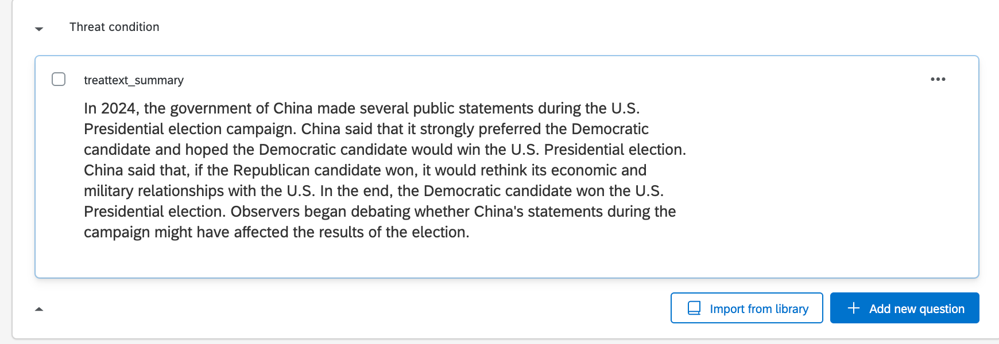

# Course Notes

This document will include important links and course notes for Experimental Methods in Political Science.

  - This site will be updated throughout the semester with new content. 
  - The Canvas modules will provide links to the relevant sections to review for a given week of the course.
  - The primary text for the course is [Field Experiments: Design, Analysis, and Interpretation](https://wwnorton.com/books/9780393979954) by Alan Gerber and Don Green. We will refer to this as FEDAI in the notes.
  - This is a new and living document. If you spot errors or have questions or suggestions, please email me at k.mccabe@rutgers.edu or send a Slack message.


<!-- If you need PDF output, uncomment bookdown::pdf_book above in YAML. You will need a LaTeX installation, e.g., https://yihui.name/tinytex/ -->

<!-- Instructions: https://ontheline.trincoll.edu/bookdown.html -->


## Setup in R {#rsetup}

**Goal**

By the end of the first week of the course, you will want to have R and RStudio installed on your computer (both free) and feel comfortable using R as a calculator.

R is an application that processes the R programming language in a statistical computing environment. RStudio is also an application, which serves as a user interface that makes working in R easier. We will primarily open and use RStudio to work with R.   

In other classes, you may come across Stata, SPSS, Excel, or SAS, which are programs that also conduct data analysis. R has the advantage of being free and open-source. Even after you leave the university setting, you will be able to use R/RStudio for free. As an open-source program, it is very flexible, and a community of active R/RStudio users is constantly adding to and improving the program.   


**R and RStudio Installation**

This content follows and reinforces [QSS 1.3](https://assets.press.princeton.edu/chapters/s11025.pdf) by Kosuke Imai. Additional resources are also linked below.

  - This [video](http://www.youtube.com/embed/ulIv0NiVTs4?rel=0) from Professor Christopher Bail explains why many social scientists use R and describes the R and RStudio installation process. This involves
    1. Going to [cran](https://cran.r-project.org/), select the link that matches your operating system, and
then follow the installation instructions, and 
    2. Visiting [RStudio](http://www.rstudio.com/) and follow the download and installation instructions. R is the statistical software and programming language used for analysis. RStudio provides a convenient user interface for running R code. 

```{r, echo=FALSE, warning=FALSE, message=FALSE}
library("vembedr")
library(knitr)

embed_url("https://www.youtube.com/watch?v=ulIv0NiVTs4")
```


 

## First Time Working in R and RStudio

This next section provides a few notes on using R and RStudio now that you have installed it. In this section, we cover the following materials:

  - Using R as a calculator and assigning objects using `<-`
  - Setting your working directory and the `setwd()` function.
  - Creating and saving an R script


### Open RStudio

RStudio is an open-source and free program that greatly facilitates the use of R, especially for users new to programming. Once you have downloaded and installed R and RStudio, to work in R, all you need to do now is ***open RStudio*** (it will open R). It should look like this, though your version numbers will be different:


**Note:** The first time you open RStudio, you likely only have the three windows above. We will want to create a fourth window by **opening an R script** to create the fourth window. 

  - To do this, in RStudio, click on File -> New -> R script in your computer's toolbar. This will open a blank document for text editing in the upper left of the RStudio window. We will return to this window in a moment.
      + You can alternatively click on the green + sign indicator in the top-left corner of the RStudio window, which should give you the option to create a new R script document.

Now you should have something that looks like this, similar to [Figure 1.1. in QSS](https://assets.press.princeton.edu/chapters/s11025.pdf):


  
  - The upper-left window has our script document that will contain code.
  - The lower-left window is the console. This will show the output of the code we run. We will also be able to type directly in the console.
  - The upper-right window shows the environment (and other tabs, such as the history of commands). When we load and store data in RStudio, we will see a summary of that in the environment.
  - The lower-right window will enable us to view plots and search help files, among other things.


### Using R as a Calculator

The *bottom left* window in your RStudio is the Console. You can type in this window to use R as a calculator or to try out commands. It will show the raw output of any commands you type. For example, we can try to use R as a calculator. Type the following in the Console (the bottom left window) and hit "enter" or "return" on your keyboard:

```{r}
5 + 3

5 - 3

5^2

5 * 3

5/3

(5 + 3) * 2
```

In the other RStudio windows, the upper right will show a history of commands that you have sent from the text editor to the R console, along with other items. The lower right will show graphs, help documents and other features. These will be useful later in the course.

### Working in an R Script

Earlier, I asked you to open an R script in the upper left window by doing File, then New File, then R Script. Let's go back to working in that window.

**Set your working directory `setwd()`**

(Almost) every time you work in RStudio, the first thing you will do is set your working directory. This is a designated folder in your computer where you will save your R scripts and datasets.

There are many ways to do this.

  - An easy way is to go to Session -> Set Working Directory -> Choose Directory. I suggest choosing a folder in your computer that you can easily find and that you will routinely use for this class. Go ahead and create/select it. 
  - Note: when you selected your directory, code came out in the bottom left Console window. This is the `setwd()` command which can also be used directly to set your working directory in the future.
  - If you aren't sure where your directory has been set, you can also type `getwd()` in your Console. Try it now


```{r, eval=F}
## Example of where my directory was
getwd()
```


If I want to  change the working directory, I can go to the top toolbar of my computer and use Session -> Set Working Directory -> Choose Directory or just type my file pathway using the `setwd()` below:

```{r, eval=FALSE}
## Example of setting the working directory using setwd().
## Your computer will have your own file path.
setwd("/Users/ktmccabe/Dropbox/Rutgers Teaching/")
```


**Saving the R Script**

Let's now save our R script to our working directory and give it an informative name. To do so, go to File, then Save As, make sure you are in the same folder on your computer as the folder you chose for your working directory.

Give the file an informative name, such as: "McCabeWeek1.R". Note: all of your R scripts will have the .R extension.


### Preparing your R script

Now that we have saved our R script, let's work inside of it. Remember, we are in the top-left RStudio window now.

  - Just like the beginning of a paper, you will want to title your R script. In R, any line that you start with a \# will not be treated as a programming command. You can use this to your advantage to write titles/comments. Below is a screenshot example of a template R script.
  - You can specify your working directory at the top, too. Add your own filepath inside `setwd()`


  - Then you can start answering problems in the rest of the script.
  - Think of the R script as where you write the final draft of your paper. In the Console (the bottom-left window), you can mess around and try different things, like you might when you are taking notes or outlining an essay. Then, write the final programming steps that lead you to your answer in the R script. For example, if I wanted to add 5 + 3, I might try different ways of typing it in the Console, and then when I found out `5 + 3` is the right approach, I would type that into my script.

### Executing Commands in your R script

The last thing we will note in this initial handout is how to execute commands in your R script.

To run / execute a command in your R script (the upper left window), you can

  1. Highlight the code you want to run, and then hold down "command + return" on a Mac or "control + enter" on Windows
  2. Place your cursor at the end of the line of code (far right), and hit "command + return" on a Mac or "control + return" on Windows, or
  3. Do 1 or 2, but instead of using the keyboard to execute the commands, click "Run" in the top right corner of the upper-left window.


Try it: Type `5 + 3` in the R script. Then, try to execute `5 + 3`. It should look something like this:

{width=70%}

After you executed the code, you should see it pop out in your Console:
```{r}
5 + 3
```


{width=90%}


Note: The symbol \# also allows for annotation behind commands or on a separate line. Everything that follows \# will be ignored by R. You can annotate your own code so that you and others can understand what each part of the code is designed to do.

```{r}
## Example
sum53 <- 5 + 3 # example of assigning an addition calculation
```

### Objects

Sometimes we will want to store our calculations as "objects" in R. We use `<-` to assign objects by placing it [to the left](https://www.youtube.com/watch?v=vLZA67L7gIo&ab_channel=BeyonceSasha1) of what we want to store. For example, let's store the calculation `5 + 3` as an object named `sum53`:

```{r}
sum53 <- 5 + 3
```

After we execute this code, `sum53 now stores the calculation. This means, that if we execute a line of code that just has `sum53`, it will output 8. Try  it:

```{r}
sum53
```

Now we no longer have to type `5 + 3`, we can just type `sum53`. For example, let's say we wanted to subtract 2 from this calculation. We could do:

```{r}
sum53 - 2
```

Let's say we wanted to divide two stored calculations:
```{r}
ten <- 5 + 5
two <- 1 + 1
ten / two
```

The information stored does not have to be numeric. For example, it can be a word, or what we would call a character string, in which case you need to use quotation marks.

```{r}
mccabe <- "professor for this course"
mccabe
```


*Note:* Object names cannot begin with numbers and no spacing is allowed. Avoid using special characters such as \% and \$, which have specific meanings in R. Finally, use concise and intuitive object names.

  - GOOD CODE: `practice.calc <- 5 + 3`
  - BAD CODE: `meaningless.and.unnecessarily.long.name <- 5 + 3`

While these are simple examples, we will use objects all the time for more complicated things to store (e.g., like full datasets!) throughout the course.

We can also store an array or "vector" of information using `c()`

```{r}
somenumbers <- c(3, 6, 8, 9)
somenumbers
```

**Importance of Clean Code**

Ideally, when you are done with your R script, you should be able to highlight the entire script and execute it without generating any error messages. This means your code is clean. Code with typos in it may generate a red error message in the Console upon execution. This can happen when there are typos or commands are misused.

For example, R is case sensitive. Let's say we assigned our object like before:
```{r}
sum53 <- 5 + 3
```

However, when we went to execute `sum53`, we accidentally typed `Sum53`:
```{r, error=TRUE}
Sum53
```

Only certain types of objects can be used in mathematical calculations. Let's say we tried to divide `mccabe` by 2:

```{r, error=TRUE}
mccabe / 2
```

A big part of learning to use R will be learning how to troubleshoot and detect typos in your code that generate error messages.

{width=80%}


### Practice with R Scripts

Below is an exercise that will demonstrate you are able to use R as a calculator and create R scripts.

  1. Create an R script saved as ``LastnameSetup1.R" (use your last name). Within the R script, follow the example from  this handout and title the script.
  2. Set your working directory, and include the file pathway (within `setwd()`) at the top of your .R script.
  3. Do the calculation 8 + 3 - 2 in R. Store it as an object with an informative name. Report the answer.
  4. Do the calculation 5 x 3 in R. Store it as an object with an informative name. Report the answer.
  5. Add these two calculations together. Note: do this by adding together the objects you created, not the underlying raw calculations. Report the answer.


### Loading data into R

Often the variables we care about are stored inside of rectangular datasets, like the dataset on turnout below from QSS Chapter 1. 

{width=80%}

  - These have a number of rows `nrow()` and columns `ncol()`
  - Each row is an "observation," representing the information collected from an individual or entity
  - Each column is a variable, representing a changing characteristic across multiple observations
  

When we import a dataset into R, we have a few options. This highlights key elements of [QSS section 1.3.5](https://assets.press.princeton.edu/chapters/s11025.pdf), which provides an overview of loading data into R with an example using UN population data.


Option 1: Download dataset to your computer

  - Move the dataset to your working directory
  - Identify the file type (e.g., csv, dta, RData, txt)
  - Pick the appropriate R function to match the type (e.g., `read.csv(), read.dta(), load(), read.table()`)
  - Assign the dataset to an object. This object will now be `class()` of `data.frame`

```{r, eval=F}
## The turnout dataset is available in the week 2 Canvas module
turnout <- read.csv("turnout.csv")
```

With a recent update to R, many people now add an argument to their code when loading in .csv files, which makes it easier to work with categorical variables.

```{r, eval=F}
turnout <- read.csv("turnout.csv", stringsAsFactors = T)
```

There are also packages that exist, which simplify loading different types of data. Example:

```{r, eval=F}
install.packages("rio", dependencies = T)
```

Once you've installed it, you can load the package with `library()`. While you only need to install the package once, you need to use `library()` in each script where you use `import`.
```{r, eval=F}
library(rio)
turnout <- import("turnout.csv")
```


Option 2: Read file from a url provided
  
  - Need an active internet connection for this to work
  - Need friendly file type
  - URL generally must be public
  - Include the url inside the function used to read the data

```{r}
turnout <- read.csv("https://raw.githubusercontent.com/ktmccabe/teachingdata/main/turnout.csv")
```

```{r}
class(turnout)
```

You can also open up a window to view the data:
```{r, eval=FALSE}
View(turnout)
```

And you can view the first few rows with `head()`

```{r, eval=TRUE}
head(turnout)
```

Note that the columns are the variables, and each row contains the values corresponding to the variables for different units in the data. Here, each row is an election year. In many datasets we will work with, each row will be an experimental subject.

We can access specific columns in the data using the \$ attached to the dataframe name. For example, the code below displays all of the values from the `year` variable in the `turnout` dataframe:

```{r}
turnout$year
```

This will be useful when we want to summarize particular variables, such as by finding the median.

```{r}
median(turnout$year)
```

## R Markdown

An R Markdown document, which you can create in RStudio, allows you to weave together regular text, R code, and the output of R code in the same document. This can be very convenient when conducting data analysis because it allows you more space to explain what you are doing in each step. It can also be an effective platform for writing a report on a data analysis, similar to what you do when you write up a problem set. It can also be useful for organizing replication files to post after you publish a paper.

R Markdown documents can be "compiled" into html, pdf, or docx documents. Below is an example of what a compiled html file looks like.

  - Note that the image has both written text and a gray chunk, within which there is some R code, as well as the output of the R code (e.g., the number 8 and the image of the histogram plot)

<center> {width=60%}</center>

We say this is a "compiled" RMarkdown document because it differs from the raw version of the file, which is a .Rmd file format. Below is an example of what the raw .Rmd version looks like, compared to the compiled html version.

{width=45%} {width=40%}


### How to get setup in RMarkdown

Just like with a regular R script, to work in RMarkdown, you will open up RStudio.

The **first time** you will be working in RMarkdown, you will want to install two packages: `rmarkdown` and `knitr`. You can do this in the Console window in RStudio.

Type the following into the Console window and hit enter/return.

```{r, eval=F}
install.packages("rmarkdown")
install.packages("knitr")
```

Once you have those installed, now, each time you want to create an RMarkdown document, you will open up a .Rmd R Markdown file and get to work.

  1. Go to File -> New File -> R Markdown in RStudio
      - Alternatively, you can click the green + symbol at the top left of your RStudio window
  2. This should open up a window with several options, similar to the image below
      - Create an informative title and change the author name to match your own
      - For now, we will keep the file type as html. In the future, you can create pdf or .doc documents. However, these require additional programs installed on your computer.


  3. After you hit "OK" a new .Rmd script file will open in your top-left window with some template language and code chunks, similar to the image below. 
  

  
  4. ***Save as .Rmd file.*** Save the file by going to "File -> Save as" in RStudio
      - Give the file an informative name like your LastnamePractice1.Rmd
  5. ***Key Components.*** Now you are ready to work within the Rmd script file. We will point to four basic components of this file, and you can build your knowledge of RMarkdown from there.
      1. The top part bracketed by `---` on top and bottom is the YAML component. This tells RStudio the pertinent information about how to "compile" the Rmd file. Most of the time you can leave this alone, but you can always edit the title, author, or date as you wish.
      2. The next component are the global options for the document. It is conveniently labeled "setup." By default what this is saying is that the compiled version will "echo" (i.e., display all code chunks and output) unless you specifically specify otherwise. For example, note that it says `include = FALSE` for the setup chunk. That setting means that this code chunk will "run" but it will not appear in the nicely compiled .html file. Most of the time you will not need to edit those settings.
      3. The third component I want to bring attention to is the body text. The \# symbol in RMarkdown is used to indicate that you have a new section of the document. For example, in the compiled images at the beginning, this resulted in the text being larger and bolded when it said "Problem 2." In addition to just using a single \#, using \#\# or \#\#\# can indicate subsections or subsubsections. Other than that symbol, you can generally write text just as you would in any word processing program, with some exceptions, such as how to make text bold or italicized. (See bottom of section for resources on the Markdown language.)
      4. The final component I want to call attention to are the other main body code chunks. These are specific parts of the document where you want to create a mini R script. To create these, you can simply click the + C symbol toward the top of the top left window of RStudio and indicate you want an R chunk.
      
      <center>
{width=20%}</center>
        - For example, in the image above, there is an R code chunk labeled `cars`. The `cars` component is just a label for the code chunk. Labeling code chunks is not necessary. By default, a new R code chunk will just have `r` in the brackets, and that is sufficient.
    
  6. ***Writing R Code.*** Within a code chunk, you can type R code just like you would in any R script. To run ("execute") the R code, you can run a single line the exact same way you do in a regular R script by moving the cursor to the end of a line of code or highlighting a portion of code and hitting "Run." However, in RMarkdown, you also have the option of running an entire code chunk at once by hitting the green triangle at the top-right of a given code chunk.
    
{width=70%}

  7. ***Knitting the document.*** Once you have added a code chunk and/or some text, you are ready to compile or "Knit" the document. This is what generates the .html document.
      - To do so, click on the Knit button toward the top of the top-left window of Rstudio. After a few moments, this should open up a preview window displaying the compiled html file. 
      - It will also save an actual .html file in your working directory (the same location on your computer where you have saved the .Rmd file)
      - Try to locate this compiled .html file on your computer and open it. For most computers, .html files will open in your default web browser, such as Google Chrome or Safari. 
      - This step is a common place where errors are detected and generated. Sometimes the compiling process fails due to errors in the R code in your code chunks or an error in the Markdown syntax. If your document fails to knit, the next step is to try to troubleshoot the error messages the compiling process generates. The best way to reduce and more easily detect errors is to "knit as you go." Try to knit your document after each chunk of code you create. 

### Additional RMarkdown resources

Here are a few additional resources for working with RMarkdown.

  - This [website](https://monashbioinformaticsplatform.github.io/2017-11-16-open-science-training/topics/rmarkdown.html) provides some basic syntax for the Markdown language, such as how to display bulleted lists and how to bold or italicize text.
  - This [page](https://rpubs.com/brandonkopp/RMarkdown) walks through the setup of RMarkdown documents similar to what the course notes just did. This provides a second set of instructions and additional examples of settings you can use to customize your RMarkdown output (e.g., how large figures are when they are displayed).
  - This [page](https://rmarkdown.rstudio.com/articles_intro.html) talks more about compiling aka rendering aka knitting Rmd documents into different formats, such as html, pdf, or Word doc files.
  

### Practice with R Markdown

Below is an exercise that will demonstrate you are able to use R as a calculator and compile RMarkdown documents.

  1. Create an Rmd file saved as "LastnameSetup1.Rmd" (use your last name). Provide an informative title for the document.
  2. Create a section labeled "Problems." 
  3. Create a code chunk where you do the calculation 8 + 3 - 2 in R. Store it as an object with an informative name. Report the answer as text underneath the code chunk.
  4. In a second code chunk, do the calculation 5 x 3 in R. Store it as an object with an informative name. Report the answer as text underneath the code chunk..
  5. In a third code chunk, add these two calculations together. Note: do this by adding together the objects you created, not the underlying raw calculations. Report the answer as text underneath the code chunk..
  6. Knit the file to create an html document. Open the html document in a web browser to check the formatting.

  

## What are experiments?

Our first discussion will be focused on elaborating on what we see as the goals of social science and how experiments fit into these goals.

We draw on the following readings

  - Gerber, A. and D.P. Green. 2012. *Field Experiments: Design, Analysis, and Interpretation.* W.W. Norton. Chapter 1.
  - Angrist, Joshua D. and Jorn-Steffen Pischke. Mostly Harmless Econometrics. Part One: Preliminaries: “Questions about Questions.” Available online [here](https://assets.press.princeton.edu/chapters/s8769.pdf) 
  - Kinder, Donald R. and Thomas R. Palfrey. 1993. “On Behalf of an Experimental Political Science.” In *Experimental Foundations of Political Science.* 
  - Sen, Maya and Omar Wasow. 2016. “Race as a Bundle of Sticks: Designs that Estimate Effects of Seemingly Immutable Characteristics.” Annual Review of Political Science doi: 10.1146/annurev-polisci-032015-010015.

We will sketch out the answers to these questions as a group. Along the way, we will try to build a research design for a research question we come up with as a class.


<style>
p.comment {
background-color: #DBDBDB;
padding: 10px;
border: 1px solid black;
margin-left: 25px;
border-radius: 5px;
font-style: italic;
}

</style>


***What are the goals of social science? What are examples of research questions that can be addressed with each goal?***

<p class="comment">
Your ideas ...                                                                                                                                                                                                             </p>


***What makes an experiment an experiment? What are the goals of experimentation?***

<p class="comment">
Your ideas ...                                                                                                                                                                                                             </p>


***What are some advantages of experimentation over other methods in political science?***

<p class="comment">
Your ideas ...                                                                                                                                                                                                             </p>


***What are examples of different types of experiments?***

<p class="comment">
Your ideas ...                                                                                                                                                                                                             </p>


***What are limitations of experiments? Can we experiment on everything?***

<p class="comment">
Your ideas ...                                                                                                                                                                                                             </p>


<!--chapter:end:index.Rmd-->

# Causal Effects {#causaleffects}

In this section, we discuss causal effects. It builds on Gerber and Green FEDAI Chapter 2.


Goal of Causality

Isolate the *manipulation* of one factor ("No causation without manipulation."), while *controlling* or "holding everything else constant."

  - Does border security increase trust in government?
      + Factual: Trust in an environment with border security
      + Counterfactual: Trust in an environment without border security
  - Does gender affect budgetary priorities?
      + Factual: The budget under a village head who is male
      + Counterfactual: The budget under a village head who is female
  - Does race affect one's job prospect?
      + Factual: Jamal applied for a job but did not get it
      + Counterfactual: Would Jamal have gotten a job if he were white?

## Potential Outcomes Framework

To make causal claims, we compare two states of the world and their potential outcomes:

$Y_i(d)$

  - What is $Y_i(0)$?
  - What is $Y_i(1)$?
      + $i$ refers to individual subjects from $i = 1$ to N.
      + $d$ is the treatment indicator
      + $d_i$ refers to whether the subject is treated: $d_i = 1$ or $d_i = 0$
      + $D_i$ refers to a hypothetical treatment allocation

A causal "treatment effect" is then the difference in these potential outcomes:

  - $\tau_i$ = $Y_i(1)$ - $Y_i(0)$


*FEDAI Table 2.1*      

The treatment effect is the difference between two states of the world: one which a unit receives treatment, and another in which it does not.

### Average Treatment Effect

The ***average treatment effect*** then is the mean of these individual treatment effects:

  - Estimand: On average, how much outcomes would change if all units go from untreated to treated.

\begin{align*}
ATE &= \frac{1}{N} \sum_{i=1}^N \tau_i \\
&= \mu_{Y(1)} -\mu_{Y(0)} \\
&= \frac{1}{N} \sum_{i=1}^N Y_i (1) - \frac{1}{N} \sum_{i=1}^N Y_i (0) \\
&= \frac{1}{N} \sum_{i=1}^N (Y_i (1)-Y_i (0))\\
&= E[Y_i(1) - Y_i(0)]\\
\end{align*}


ATE $= \frac{1}{N} \sum_{i=1}^N \tau_i$ is what we want to describe a causal effect, but in  real life, we have problems. What are they?

<details> <summary>Try on your own, then expand for the answer.</summary>

We only observe one potential outcome.

  - $Y_i = d_iY_i(1) + (1-d_i)Y_i(0)$   


(Unless we are in [Groundhog Day](https://www.youtube.com/watch?v=5E0M6Rh9qpg))

</details>

## Fundamental Problem of Causal Inference

We only observe one potential outcome: $Y_i$.

  - $Y_i = d_iY_i(1) + (1-d_i)Y_i(0)$   


(Unless we are in [Groundhog Day](https://www.youtube.com/watch?v=5E0M6Rh9qpg))


Example from 2022 Dallas Cowboys game.

  - We only get to observe $Y_i$= Cowboys lose.
  - After the game, many people said things like:
      + If the Cowboys had handed the ref the ball, $Y_i(1)$ = Cowboys win
      + If the Cowboys had continued to throw the ball instead of run, $Y_i(1)$ = Cowboys win
      + If Dak had just run a shorter distance instead, $Y_i(1)$ = Cowboys win
      
  
<blockquote class="twitter-tweet"><p lang="en" dir="ltr">did this seriously just happen <a href="https://t.co/MmUk8E1XSL">pic.twitter.com/MmUk8E1XSL</a></p>&mdash; SB Nation (@SBNation) <a href="https://twitter.com/SBNation/status/1482882322483531780?ref_src=twsrc%5Etfw">January 17, 2022</a></blockquote> <script async src="https://platform.twitter.com/widgets.js" charset="utf-8"></script>

But the fundamental problem of causal inference is that we can only observe one potential outcome, the outcome in this case, under the state of the world $Y_i(0)$ where the play unfolded as it did in the video.

  - It is impossible to observe the actual causal effect of any of the above: $Y_i(1) -Y_i(0)$


## Identification strategy


We cannot observe the ideal actual causal effect. Instead, we will frame our exercise on the premise that we are randomly *sampling* our $i's$ from a population. We then will create an identification strategy.

  - "Ideas that enable researchers to use observable quantities (e.g., sample averages) to reveal parameters of interest (e.g., average treatment effects)" (Gerber and Green 2012, 34)
  - Instead of observing the actual individual causal treatment effect and actual ATE, we develop an estimator for this quantity using the sample averages.


A few definitions:

  - The sample average is a random variable, a quantity that varies from sample to sample.^[Note: other books may approach this slightly differently by defining a Sample ATE, taking $D_i$ (treatment status) to be the random variable, and $Y_i(1)$ as fixed within a sample. ]
  - Expected value is the average outcome of a random variable weighted by its probability of occurrence.
  - Good news: Under random sampling, the expected value of a sample average is the population average.
  - Similarly, the expectation of a randomly selected observation from the population is the population mean.
  - Even though we have a sample, under random sampling, our sample will be unbiased. On average, it's true.
      + When the expected value of a sample estimate is equal to the population parameter $E[\hat{\theta}] = \theta$, this means our estimator is "unbiased."

***Expectation***

\begin{align*}
E[X]=\sum x Pr[X=x]
\end{align*}

  - where $Pr[X=x]$ denotes the probability that $X$ takes on the value $x$, and where the summation is taken over all possible values of $x$. Think of this like a weighted average. 

Example: $E[Y_i(1)]$ is the expected value of the treated potential outcome of a subject who is randomly sampled.(It will equal the average value of all possible values.)

  - What is the value of $E[Y_i(1)]$ in this example?
  

*FEDAI Table 2.1*      


## Difference in Means Estimator

In the real world, we follow this process for causal identification:

  - Our motivation: Find quantities that represent the population parameters ($\theta$)
  - Our problem: We often only get a sample of the population and can only observe one potential outcome for any unit in our sample
  - Goal: Get unbiased estimators for the population
  - Definition of unbiasedness: $E[\hat{\theta}] = \theta$

Suppose $D_i$ were randomly assigned such that $m$ subjects assigned to treatment and $N-m$ subjects assigned to control. 

\begin{align*}
\widehat{ATE} &= \frac{1}{m}\sum_1^m Y_i - \frac{1}{N-m}\sum_{m+1}^{N} Y_i \\
\end{align*}


Is the difference in means estimator an unbiased estimate for the ATE? How can we find out?

We take the expected value: 

\begin{align*}
E[\widehat{ATE}] &= E[\frac{1}{m}\sum_1^m Y_i - \frac{1}{N-m}\sum_{m+1}^{N} Y_i ]\\
&= \frac{1}{m}\sum_1^m E(Y_i) - \frac{1}{N-m}\sum_{m+1}^{N} E(Y_i ) \\
&= \frac{E(Y_1) + E(Y_2) +...+E(Y_m)}{m} -  \frac{E(Y_{m+1}) + E(Y_{m+2}) +...+E(Y_N)}{N-m}\\
&= \frac{m * E[Y_i(1 | D_i = 1)]}{m} - \frac{(N-m)* E[Y_i(0) | D_i = 0]}{N-m}\\
&= E[Y_i(1) | D_i = 1] - E[Y_i(0) | D_i = 0] \\
%&= E[Y_i (1)]-E[Y_i (0)]=E[\tau_i ]=ATE
\end{align*}

Is the final statement equivalent to the ATE? 
  
  - We want our final statement to be $E[Y_i (1)]-E[Y_i (0)]=E[\tau_i ]$=ATE
  - Our final statement is: $E[Y_i(1) | D_i = 1] - E[Y_i(0) | D_i = 0]=E[\widehat{ATE}]$

Under what conditions can we get those two statements to look the same?

<details> <summary>Well, let's look into some rules of expectation.</summary>

$E[Y|X] = E[Y]$ if Y and X are independent.^[See [video](https://www.youtube.com/watch?v=Ki2HpTCPwhM) for help on law of iterated expectations]

</details>

Our final statement can be simplified when treatment assignment is independent of potential outcomes:

  - $E[Y_i(1) |D_i = 1] = E[Y_i(1) |D_i = 0] = E[Y_i(1)]$
  - $E[Y_i(0) |D_i = 0] = E[Y_i(0) |D_i = 1] = E[Y_i(0)]$

When does this occur? Random assignment of treatment!!

Putting this together, under random assignment:

\begin{align*}
E[\widehat{ATE}] &= E[\frac{1}{m}\sum_1^m Y_i - \frac{1}{N-m}\sum_{m+1}^{N} Y_i ]\\
&= \frac{1}{m}\sum_1^m E(Y_i) - \frac{1}{N-m}\sum_{m+1}^{N} E(Y_i ) \\
&= E[Y_i(1) | D_i = 1] - E[Y_i(0) | D_i = 0] \\
&= E[Y_i (1)]-E[Y_i (0)]=E[\tau_i ]\\
E[\widehat{ATE}] &= ATE
\end{align*}

***Why Experiments***

One approach for addressing the fundamental problem of causal inference is to simulate two potential states of the world through random assignment: Randomized Controlled Trials / Experiments

Experiments approximate factual vs. counterfactual comparison
  
  - We randomly assign one group to receive a "treatment" and another not to receive a treatment (the control)
  - Using what we learned above, when treatment assignment is **randomized**, the only thing that distinguishes the treatment group from the control group in expectation, besides the treatment itself, is chance.
  - This allows us to use a simple differences in means estimator in experiments to estimate our average treatment effects.


## Overview of identification assumptions


What if we can't guarantee random assignment?

***Example: Selection into treatment***

What if we didn't have the independence? Subtract and add $E[Y_i (0) | D_i=1]$ to help us illustrate a type of bias that may occur.

$E[Y_i (1) | D_i=1]-E[Y_i (0) | D_i=0] =$ 

$\underbrace{E[Y_i (1) | D_i = 1] - E[Y_i (0) | D_i=1]}_{\text{Average treatment effect for the treated}} + \underbrace{E[Y_i (0)|D_i=1]-E[Y_i (0)| D_i=0] }_{\text{Selection bias}}$


In observational studies, where assignment into treatment is not random, the second term "Selection bias" may not be zero. 
 
  - E.g., suppose we want to know the effect of minimum wage laws on unemployment.
  - Laws aren't randomly assigned
  - Possible that states where unemployment (outcome) is lower are less likely to see minimum wage laws passed relative to states where unemployment is higher. If so, the potential outcomes $Y_i(0)$ of states that would hypothetically be treated or untreated would not be the same.


***Assumptions***

To "identify" the average treatment effect, we need

  - Probability of treatment of all units is between 0 and 1
  - Ignorability: $Y_i(1), Y_i(0) \perp D_i$ (random assignment)
  - Non-interference: $Y_i(d_1, d_2, ..., d_n) = Y_i(d)$, $d_i = d$
  - Excludability: if $Y_i(z, d)$ where z $\in [0, 1]$ and $d \in [0, 1]$, $Y_i(1, d) = Y_i(0, d)$ 

Let's put these into plain words.


## Application in R


Article: "Are Emily and Greg More Employable Than Lakisha and Jamal? A Field Experiment on Labor Market Discrimination" by Bertrand and Mullainathan (2004)

  - Research Question: Does race influence hiring decisions?
  - What are the potential outcomes?
  - What is the approach? Audit study: "send fictitious resumes to help-wanted ads in Boston and Chicago newspapers. 
      + Treatment: Manipulate perceived race: resumes randomly assigned African-American- or White-sounding names.
      + Outcomes: Does the resume get a callback?

How should we estimate the average treatment effect?

### Loading the data

We will use data from [Imai (2017)](https://qss.princeton.press/student-resources-for-quantitative-social-science/) Chapter 2.


Let's load the data. Note: When we have variables that are text-based categories, we may want to tell R to treat these "strings" of text information as factor variables, a particular type of variable that represents data as a set of nominal (unordered) or ordinal (ordered) categories. We do this with the `stringsAsFactors` argument.

```{r, eval=F}
resume <- read.csv("resume.csv", stringsAsFactors = T)
```

```{r}
resume <- read.csv("https://raw.githubusercontent.com/ktmccabe/teachingdata/main/resume.csv",
                   stringsAsFactors = T)
```


Variables and Description
  
  - `firstname`: first name of the fictitious job applicant 
  - `sex`: sex of applicant (female or male) 
  - `race`:  race of applicant (black or white) 
  - `call`: whether a callback was made (1 = yes, 0 = no) 
  

The data contain 4870 resumes and 4 variables.
```{r}
nrow(resume) # number of rows
ncol(resume) # number of columns
dim(resume) # number of rows and columns
```

```{r}
head(resume)
```

### Variable classes

We can check the class of each variable: Look, we have a new type, a "factor" variable.

```{r}
class(resume$firstname)
class(resume$sex)
class(resume$race)
class(resume$call)
```

Rules of Thumb
  
  - Usually, we want `character` variables to store text (e.g., open-ended survey responses)
  - We want `numeric` variables to store numbers.
  - Usually, we want `factor` variables to store categories. 
      + Within R, factor variables assign a number to each category, which is given a label or `level` in the form of text.
      + Categories might be ordinal or "ordered" (e.g., Very likely, Somewhat likely, Not likely) or
      + Unordered (e.g., "male", "female")
      + R won't know if a factor variable is ordered or unordered. Alas, we have to be smarter than R.
      + R might think you have a character variable when you want it to be a factor or the reverse. 
          - That's when `as.factor()` and `as.character()` are useful. 
  - Always check `class()` to find out the variable type


### Exploring Treatment and Control Groups 


We are going to use several different approaches to calculate our difference in means between treatment and control to help us explore R's capabilities and common computational approaches.

We can use the `table` command to see how many observations in our data fall into each category or numerical value.

```{r}
## Example: how many black vs. white sounding resumes
table(resume$race)
```

As mentioned, `factor` variables have levels:

```{r}
levels(resume$race)
```


We can also use the `table` command to show a crosstabulation: a table that displays the frequency of observations across two variables. ***Because our outcome variable call is dichotomous and we are interested in the rates of callbacks***, we might use a table to display this information. (For outcomes that are continuous, the table approach is less useful.)

```{r}
## Example: how many black vs. white sounding resumes by call backs
## We can label the two dimensions of the table with the =
table(calledback = resume$call, race = resume$race)
```


Sometimes we will want to show the proportion instead of the frequency using `prop.table`

```{r}
## Example: proportion black vs. white sounding resumes by call backs
## Convert to proportion
prop.table(table(calledback = resume$call, race = resume$race), margin = 2) # 1 for row sum, 2 for col
```

***How can we interpret this crosstabulation?***

### Means with Relational Operators

Goal: Compare callback rates for white sounding names to black sounding names, so we need to be able to filter by race. 

Good news: We have several relational operators in R that evaluate logical statements:
  
  -  `==, <, >, <=, >=, !=`
  - We have a statement and R evaluates it as `TRUE` or `FALSE`

```{r, eval=F}
## for each observation, does the value of race equal "black"?
resume$race == "black"
```

By putting this logical statement within `[ ]`, we are asking R to take the `mean()` of the variable `resume$call` for the subset of observations for which this logical statement is `TRUE`.

```{r}
mean(resume$call[resume$race == "black"])
```


Ultimately, each of these paths has led us to a place where we can estimate the average treatment effect by calculation the difference in means: the difference in callback rates for black and white applicants.

We said the ATE = $\bar{Y}(treatment) - \bar{Y}(control)$ 

```{r}
ate <- mean(resume$call[resume$race == "black"]) - 
  mean(resume$call[resume$race == "white"])
ate
```

How can we interpret this? Do white applicants have an advantage?


### Means with `tidyverse`

The `tidyverse` offers a suite of R functions and a different grammar or syntax of coding. Some people prefer this to the "base R" codes we did above. To use this suite, first install the `tidyverse` package:

When you install a package, this is like downloading an app to your phone. You only have to do it one time. 
```{r, eval=F}
install.packages("tidyverse")
```

After you have a package installed, much like an app on your phone, you then need to open it before using it in R. To do so, use the `library()` command.

```{r, message=FALSE, warning=FALSE}
library(tidyverse)
```

The `tidyverse` works through these piping `%>%` operators. We can read it from left to right. Take our dataset `resume`, group the data by `race`, and within each racial group, summarize the data by taking the mean call back rate.

```{r}
resume %>%
  group_by(race) %>%
  summarise(means = mean(call))
```

We could go a step further to calculate the ATE.

```{r}
ate <- resume %>%
  group_by(race) %>%
  summarise(means = mean(call)) %>%
  ungroup() %>%
  spread(race, means)%>%
  mutate(diff = black - white)

ate
```


### ATE with linear regression

Linear regression also offers a way to calculate the conditional means and difference in means between two groups. In R, we use `lm()` for this. The syntax is `lm(y ~ x, data = mydataframe)`.

```{r}
fit <- lm(call ~ race, data =resume)
```

We can look at the coefficient results only.

```{r}
fit$coefficients
```

In a regression of this form, the intercept represents the mean of the reference category, in this case, the callback rate for Black applicants. The coefficient on `racewhite` represents the difference in means between the reference category and this group. I.e., going from a Black applicant (the reference category) to a white applicant, on average, increases call backs by 3.2 percentage points.

### Subsetting data in R

Maybe we are interested in differences in callbacks for females. One approach for looking at the treatment effect for female applicants, only, is to subset our data to include only female names.

  - To do this, we will  assign a new `data.frame` object that keeps only those rows where `sex == "female"` and retains all columns 
  - Below are two approaches for this subsetting, one that uses brackets and one that uses the `subset` function

```{r}
## option one
females <- resume[resume$sex == "female", ]
## option two using subset()- preferred
females <- subset(resume, sex == "female")
```

Now that we have subset the data, this simplifies estimating the ATE for female applicants only.

We said the ATE = $\bar{Y}(treatment) - \bar{Y}(control)$

```{r}
ate.females <- mean(females$call[females$race == "black"]) -
  mean(females$call[females$race == "white"])
ate.females
```

***Question: Is this an unbiased estimate of the average treatment effect?***


<details> <summary>Try on your own, then expand for the answer.</summary>

This is an example of a "Conditional Average Treatment Effect." Generally, because gender is a pre-treatment factor, we can condition on it and get unbiased estimates for the average treatment effect within a particular gender group.

  - Random assignment of treatment means that in expectation, we should have about equal proportions of female applicants in each treatment group, ruling out the potential for selection bias.

</details>


### Additional Practice

We will use data from the article below:

Thal, A. (2020). The desire for social status and economic conservatism among affluent Americans. American Political Science Review, 114(2), 426-442.

In the experiment, affluent Americans are randomly assigned to encounter Facebook posts in which others broadcast their economic success. These posts are designed in a way that encourages affluent respondents to view economic success as a means of achieving social status. The experiment includes a sample of 2010 affluent Americans-- people who report household incomes in the top 10 percent of the U.S. income distribution.

  - Causal Question: Does desire for social status influence economic views of affluent Americans?
  - Randomization: Randomly assign respondents to view different fictional Facebook posts designed to signal different motivations
  - Outcome: An economic conservatism index based on respondents' support for decreasing "taxes on households making \$150,000 or more a year," support for decreasing the "taxes on money people make from selling investments, also referred to as capital gains," and support for decreasing "government regulation of business and industry."
  - Comparison: Average economic views between experimental conditions that vary in the type of social cues given.

{width=70%}

{width=70%}

Let's load the data! Here, note that the data file is in a .RData format instead of .csv. This means that instead of using `read.csv`, we should use a function to load the data that is suitable for the .RData format. This will be `load`. That function works the following way:

```{r, eval=T, echo=FALSE, include=FALSE}
load("data/status.RData")
```

```{r,eval=F}
load("status.RData")
```

After running the above code, an object will show up in your R environment.

```{r}
head(status)
```

The data include the following variables

  - `condition`: Placebo, Concrete, Self-Esteem, Social Approval, Conspicuous Consumption
  - `gender`: 1= male; 0= otherwise
  - `econcon`: Economic views. Numeric variable from 0 to 1, with higher values reflecting more conservative views

Practice:

  1. How many people are in each `condition`?
  2. What is the average treatment effect between the Placebo and Social Approval conditions?


<details> <summary>Try on your own, then expand for the answer.</summary>

```{r}
## Number of observations
table(status$condition)

## tidy
groupmeans <- status %>%
  group_by(condition) %>%
  summarise(means = mean(econcon)) %>%
  ungroup %>%
  spread(condition, means) 
groupmeans$`Social Approval` - groupmeans$Placebo

## relational operators
ate <- mean(status$econcon[status$condition == "Social Approval"]) - mean(status$econcon[status$condition == "Placebo"]) 
ate

## regression
fit <- lm(econcon ~ condition, data = status)
fit$coefficients["conditionSocial Approval"]
```

</details>


***Additional Review Questions***

  - What is this quantity $E[Y_i (1) − Y_i (0)]$ conceptually?
  - What is the fundamental problem of causal inference?
  - How can we find out if our estimates are unbiased? (What process do we need to do?)
  - With randomization, why is $E[Y_i (1)] = E [Y_i (1)|D_i = 1]$?
  - What other assumptions do we need to estimate the ATE in an unbiased way using differences in means?


<!--chapter:end:02-causaleffects.Rmd-->

# Experimental Design {#design}

In this section, we discuss best practices for experimental design, as well as implementing a design in Qualtrics.

The two primary readings are:

   - Mutz, D. (2021). Improving Experimental Treatments in Political Science. In J. Druckman & D. Green (Eds.), Advances in Experimental Political Science (pp. 219-238). Cambridge: Cambridge University Press. 
   - Salganik, Matt. [Chap 4 of Bit by Bit](https://www.bitbybitbook.com/en/1st-ed/running-experiments/)
   
## Designing an Experiment

Four main ingredients in an experimental design

  1. Recruitment of participants  
  2. Randomization of treatment - means people in treatment and control groups will be similar
  3. Delivery of treatment (intervention)
  4. Measurement of outcomes


What does an experimental design test?

Broadly "causal effects": More specifically:

  - From Mutz: Experiments are designed to answer the question, "If
x changes, how should y be expected to change?"
    + Goal of experimental treatment is to create variation in the independent variable in the direction (or directions) intended by the researcher.
  - From Salganik: "Narrowly focused experiments answer a much more specific question: What is the average effect of this specific treatment with this specific implementation for this population of participants at this time?" 

How can we evaluate experiments?

### Validity

"Validity refers to the extent to which the results of a particular experiment support some more general conclusion."

  - Statistical conclusion validity- correctness of statistical analysis
  - Internal validity- correctness of procedures
  - Construct validity- match between data and theoretical constructs
  - External validity- how can results generalize to other situations


<style>
p.comment {
background-color: #DBDBDB;
padding: 10px;
border: 1px solid black;
margin-left: 25px;
border-radius: 5px;
font-style: italic;
}

</style>


***What makes a good treatment? Does it require realism?***

<p class="comment">
Your ideas ...                                                                                                                                                                                                             </p>


***How does our excludability assumption factor into this?***

<p class="comment">
Your ideas ...                                                                                                                                                                                                             </p>

***What does it mean to say a treatment is generalizable?***

<p class="comment">
Your ideas ...                                                                                                                                                                                                             </p>


***How can we increase engagement with our experiments?***

<p class="comment">
Your ideas ...                                                                                                                                                                                                             </p>

***What is a manipulation check, and what role does it serve?***

<p class="comment">
Your ideas ...                                                                                                                                                                                                             </p>


### Design Space for Experiments


[*Figure 4.1*](https://www.bitbybitbook.com/en/1st-ed/running-experiments/lab-field/)


<style>
p.comment {
background-color: #DBDBDB;
padding: 10px;
border: 1px solid black;
margin-left: 25px;
border-radius: 5px;
font-style: italic;
}

</style>


***What are the tradeoffs between digital vs. analog experiments?***

<p class="comment">
Your ideas ...                                                                                                                                                                                                             </p>
***What are the tradeoffs between lab vs. field experiments?***

<p class="comment">
Your ideas ...                                                                                                                                                                                                             </p>


### Types of Designs


***What are the strengths and weaknesses of different types of designs?***

<p class="comment">
Your ideas ...                                                                                                                                                                                                             </p>


## Using Qualtrics

Everyone at Rutgers gets a free Qualtrics account. Qualtrics provides a user-friendly interface for designing online surveys and survey experiments.

We will walk through how to design a simple survey experiment on the platform.

  1. Go to the [Rutgers Qualtrics site](https://rutgers.qualtrics.com/). The first time you use this you might have to initialize your account.
  2. Click on "Create a new project" and select "Survey" from scratch and get started.
  3. Give the project an informative name like "Experimental methods demo." We will start with a blank survey project.

This should take you to a landing page that looks something like this:

{width=80%}


When running an academic survey, generally, the first survey question should be a consent form.

  - Rutgers has template consent forms [here](https://research.rutgers.edu/researcher-support/research-compliance/human-subjects-protection-program-toolkit). For a survey, you may want the [Online survey questionnaire consent form](https://research.rutgers.edu/sites/default/files/2022-01/rcr_online_survey-questionnaire_adult_consent_template_1.11.22.docx). The text of the consent form has to be approved by the IRB.


After the consent form, you might ask respondents a set of "pre-treatment" questions, such as demographics, attention checks, etc. These are things you want to know about respondents prior to when they enter your experiment. 

  - You can organize these questions into different "blocks." Blocks make it easier to move groups of questions up and down the survey, randomize the order of questions people see within a given block, or branch people to see only one of a set of blocks. We will get to this later.
  

Now we are ready to program an experiment. There are many ways to do this, but we will choose a couple of common approaches.
  
  - In general, programming the experiment will involve 1) entering experimental treatments and questions into the survey interface we are currently working in; and 2) building a randomizer in the survey flow.
  - To prepare to program your experiment, you should have a sense of how many unique experimental conditions you have.
      - If you have a relatively small number of experimental conditions (e.g., 2-4), an easy way to program the experiment is to manually create a unique block for each condition.
      - If you have a larger number of experimental conditions (e.g., if you are manipulating several things at once across conditions), you might consider integrating piped text or another approach to avoid the need to manually create all of your experimental conditions.
      - If you have a very large number of conditions or need to adjust the randomization in a more complex way (e.g., control the specific probabilities that certain conditions appear), you may need to integrate JavaScript code to help with randomization. 


### Experimental Design with Vignette Experiment

For this example, we will use the experimental design from "Public Opinion and Foreign Electoral Intervention" by Michael Tomz and Jessica Weeks, published in the *American Political Science Review* in 2020. The article is [here](https://www.cambridge.org/core/journals/american-political-science-review/article/abs/public-opinion-and-foreign-electoral-intervention/AC34B6090EACF336D08713AF69BF7904).

They "hypothesize that American tolerance of foreign intervention should depend on the type of intervention and the intended beneficiary. We distinguish three modes of interference: verbal endorsements, threats, and operations." 

  - Endorsements occur when foreign countries express their opinions about candidates. 
  - Threats combine an endorsement with a promise of future reward or threat of future punishment, such as threatening to downgrade future relations if the preferred candidate loses. 
  - Operations [are] when foreign powers undertake efforts such as spreading embarrassing information about a candidate, hacking into voting systems, or donating money to an election campaign
  
These are contrasted with a comparison of staying out of the election.

***Hypotheses***

  - "We predict that citizens will be most concerned about operations such as hacking into voting systems or donating money, as these directly advantage the favored candidate and involve behavior the U.N. has classified as impermissible interference in the internal affairs of another nation. Americans should be more tolerant of threats and most tolerant of endorsements, which could be seen
as legitimate and harmless expressions of opinion that do not intrude on American sovereignty."
  - "We also hypothesize that revelations of foreign intervention will generate polarized partisan responses. . . we anticipate that American voters will disapprove more strongly of foreign meddling on behalf of political opponents, than of foreign meddling to assist their own party."

Table 1 in the paper displays the experimental design used to test the hypotheses. We will program the primary manipulation, which varies the endorsement, threat, operation, or stay out conditions. For now, we will fix the country to be China, the candidate to be the Democratic candidate, and the operation to be donating money and 100\% certainty it was China.

### Unique blocks per experimental condition

In this approach, we will create a separate block for each unique experimental vignette. In our case, we will create a block with a Text/Graphic question type. We paste in our experimental text and give the block and question informative labels. The question name will be the name of the variable for the question when you eventually load the data. 

  - For each condition, create a new block. 
  - See the four blocks below, one for each condition
  
  
{width=40%} {width=40%}
{width=40%} {width=40%}

After creating each experimental block, we can then add a new block with our outcome questions. Go ahead and add 1-2 outcome questions so that you have an example.If your outcome condition text is specific to each treatment condition, you can create outcome questions within the experimental blocks. 

Finally, after that, you may have some last demographic questions. You can put those in yet another last block.

Once you have created all your blocks, you can now go to the survey flow. To do that, click on the icon in the left side of the survey landing page.

{width=40%}

Your survey flow should look something like this. We are now ready to add randomization so that each respondent only sees one of our experimental blocks, randomly assigned.

{width=70%}

### Adding a randomizer in the survey flow

Within the survey flow, add a randomizer underneath the consent form.

  - Under the randomizer, add an embedded data field with an informative label for your treatment (e.g., "treat")
      + Create a unique value for each of your treatment conditions
      + Make sure the randomizer is set to show just one of these values.
      
{width=90%}

As people go through the survey, under the hood of qualtrics, they will be assigned one of your experimental condition values. This embedded data field will show up as a variable in the data you download. However, we need one more step to make sure people only see the experimental block that corresponds to their embedded data field. This works through branching.

  - Above each experimental block, add a "Branch" object
  - Branch people using embedded data. Set the condition to match each embedded data value, and then move the experimental blocks underneath the appropriate branch.
      + You can also duplicate the outcome block and put them underneath the corresponding treatment blocks.
  - Hit apply to make sure the survey flow saves.
  
{width=90%}

A last thing we often want to do is add a branch underneath the consent form to end the survey for anyone who does not consent to take the survey. The specific end-of-survey message you provide may be different depending on which company you use to recruit respondents. For now, we will use a default end-of-survey message.

{width=60%}

You are now ready to "Preview" your survey!


### Using Piped Text in Randomization

We could complicate the randomization more so than we have done so far. For example, in Tomz and Weeks (2020), they do not fix the country to be China. Instead, they randomly vary this to be China, Pakistan, or Turkey for each respondent. We could build this added treatment arm into our design through "piped text."

  - Go back into your survey data flow. Create a second randomizer towards the top of the survey. Create a new embedded data field with an informative label, like country. Create unique fields for each of our country names. Hit apply.

{width=70%}

  - Now, in addition to being assigned a treatment condition, everyone is also independently randomly assigned a country. We now need to make sure the text they see reflects both their treatment condition and country.
    + We could create 4 X 3 experimental blocks to reflect these dual randomizations.
    + Instead, we are going to integrate the second treatment into the four blocks we have already programmed-- just to save us time.
    
  - Back in the survey landing page, click on every single block of text or question that includes the word "China." In place of "China" click on the "piped text" option. Set the piped text to be the "country" embedded data field. Here is an example. Note: you need to do this for every single mention of country.
  
{width=70%}

We could complicate our design even further by adding additional piped text randomization to vary whether it is the Democratic vs. Republican candidate, the percent certainty about the country involved, and the type of operation. This would all involve adding additional randomizers and/or branching in the survey flow, along with piped text in the experimental blocks.


### Data and Analysis

Once you have a draft of your survey programmed, you will want to "preview" the survey from the perspective of a respondent by clicking "preview" in the survey landing page.

{width=70%}

Repeat this a few times to see if things seem to be working properly. After that, you can do a few more steps to test your survey.

  - Option 1: Fake Data. In the survey landing, go to Tools -> Generate test responses. This will automatically generate fake/simulated responses to your survey. This can allow you to check how the data will download, see if you can load it into your preferred statistical software and access the variables in the way you imagined, and check if the randomization appears to work properly.
  - Option 2: Get a distribution link for your survey, and send the link to your friends and colleagues to help you test the survey from a respondent's perspective. 
      + Go to Distributions -> Get a single reusable link
      + Note: once you click this, your survey is now published and "active." To make any future changes to your survey, on the survey landing you will have to click "Publish." 
      
With both of these options, your survey will start to populate responses in the Data and Analysis section of Qualtrics. Click on this now that you have done one or both of these steps.

This will give you an overview of the responses and number of recorded responses.

This is also where we can download the data. Go to Export and Import - > Export Data.

  - Download the data as a csv file if you plan to work in R.
  - If you click on "More options," you can export randomized viewing order as well as other features you may want to toggle on or off.

If you open up your .csv file in a spreadsheet software like Excel, you will notice that the first row contains your question names as variables. The next two rows are more information about the questions, including the question wording. The actual responses start in row 3.

  - If you load the csv file into R as is, you would want to delete the first two rows from your dataframe (the first row will automatically be treated as a header in R)
  - Alternatively, you can delete rows 2-3 from the spreadsheet software before loading it into R.
  - Save the .csv file with an informative name in the working directory where you store files to work on in R.
  
Load the data into R.

```{r}
## my data are in a /data/ subfolder of my working directory
expdemo <- read.csv("data/expdemo.csv")
expdemo <- expdemo[-c(1:2),] # remove first two rows
```

Let's limit the sample to those who agreed to our consent form. Locate your consent variable and subset on those who agree.

```{r}
expdemo <- subset(expdemo, QID1 == "I Agree")
```

At this stage, we just have fake/test respondents. However, we can still see if the randomization works properly and if the outcome questions are populating in the way we want.


For example, we want about a quarter of respondents assigned to each of the experimental conditions.

```{r}
table(expdemo$treat)
```

And let's make sure our outcomes are populating correctly. Note how people from each condition have populated the outcomes. This gives us confidence that the survey logic is working correctly. If, for example, no one from the endorsement condition had answered the outcome, this might mean we had a typo or other error in our survey logic.

```{r}
table(expdemo$approval)
table(condition=expdemo$treat,
      outcome = expdemo$approval)
```

If our survey programming was all set, at this point, you could actually set up your entire R code and analysis based on the fake data. That would mean that all you have to do after you run the survey with real respondents is switch the dataset you load into the software. That would be the ultimate "pre-analysis plan." 

Once you are done testing in Qualtrics, back in the Data and Analysis page, you can delete all responses using Tools -> Delete data.

Once you are done testing and revising the survey, you are now ready to integrate it with your preferred survey firm/recruiting platform. The specific steps from here going forward vary across platforms.

### Additional Bells and Whistles

Qualtrics has a number of other features you can use, including different question types, the ability to randomize the order of response options, features to require/request responses.You can continue to explore these as you develop your own surveys.


  - Their help pages are pretty useful. Here is one on [question types](https://www.qualtrics.com/support/survey-platform/survey-module/editing-questions/question-types-guide/question-types-overview/).


For those familiar with "conjoint experiments" that have a lot of randomization, Anton Strezhnev has developed a tool for programming these in Qualtrics. See information [here](https://github.com/astrezhnev/conjointsdt).


It is also possible to download data from Qualtrics directly into R using an R package [here](https://github.com/ropensci/qualtRics).


  

<!--chapter:end:03-ExperimentalDesign.Rmd-->

