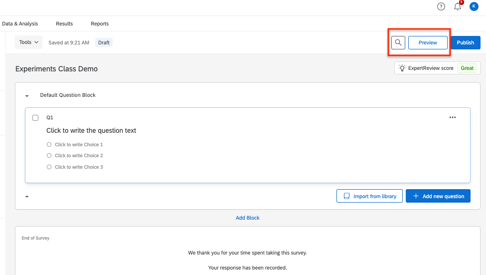
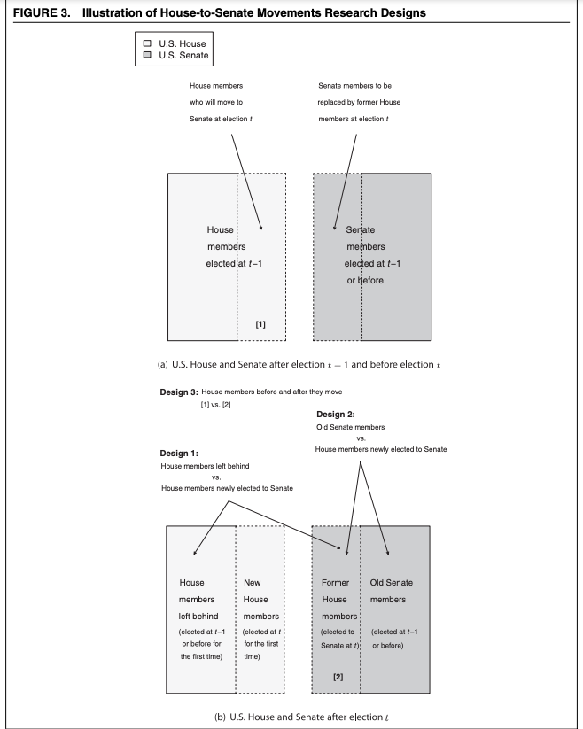

# Course Notes

This document will include important links and course notes for Experimental Methods in Political Science.

  - This site will be updated throughout the semester with new content. 
  - The Canvas modules will provide links to the relevant sections to review for a given week of the course.
  - The primary text for the course is [Field Experiments: Design, Analysis, and Interpretation](https://wwnorton.com/books/9780393979954) by Alan Gerber and Don Green. We will refer to this as FEDAI in the notes.
  - This is a new and living document. If you spot errors or have questions or suggestions, please email me at k.mccabe@rutgers.edu or send a Slack message.


<!-- If you need PDF output, uncomment bookdown::pdf_book above in YAML. You will need a LaTeX installation, e.g., https://yihui.name/tinytex/ -->

<!-- Instructions: https://ontheline.trincoll.edu/bookdown.html -->


## Setup in R {#rsetup}

**Goal**

By the end of the first week of the course, you will want to have R and RStudio installed on your computer (both free) and feel comfortable using R as a calculator.

R is an application that processes the R programming language in a statistical computing environment. RStudio is also an application, which serves as a user interface that makes working in R easier. We will primarily open and use RStudio to work with R.   

In other classes, you may come across Stata, SPSS, Excel, or SAS, which are programs that also conduct data analysis. R has the advantage of being free and open-source. Even after you leave the university setting, you will be able to use R/RStudio for free. As an open-source program, it is very flexible, and a community of active R/RStudio users is constantly adding to and improving the program.   


**R and RStudio Installation**

This content follows and reinforces [QSS 1.3](https://assets.press.princeton.edu/chapters/s11025.pdf) by Kosuke Imai. Additional resources are also linked below.

  - This [video](http://www.youtube.com/embed/ulIv0NiVTs4?rel=0) from Professor Christopher Bail explains why many social scientists use R and describes the R and RStudio installation process. This involves
    1. Going to [cran](https://cran.r-project.org/), select the link that matches your operating system, and
then follow the installation instructions, and 
    2. Visiting [RStudio](http://www.rstudio.com/) and follow the download and installation instructions. R is the statistical software and programming language used for analysis. RStudio provides a convenient user interface for running R code. 

```{r, echo=FALSE, warning=FALSE, message=FALSE}
library("vembedr")
library(knitr)

embed_url("https://www.youtube.com/watch?v=ulIv0NiVTs4")
```


 

## First Time Working in R and RStudio

This next section provides a few notes on using R and RStudio now that you have installed it. In this section, we cover the following materials:

  - Using R as a calculator and assigning objects using `<-`
  - Setting your working directory and the `setwd()` function.
  - Creating and saving an R script


### Open RStudio

RStudio is an open-source and free program that greatly facilitates the use of R, especially for users new to programming. Once you have downloaded and installed R and RStudio, to work in R, all you need to do now is ***open RStudio*** (it will open R). It should look like this, though your version numbers will be different:


**Note:** The first time you open RStudio, you likely only have the three windows above. We will want to create a fourth window by **opening an R script** to create the fourth window. 

  - To do this, in RStudio, click on File -> New -> R script in your computer's toolbar. This will open a blank document for text editing in the upper left of the RStudio window. We will return to this window in a moment.
      + You can alternatively click on the green + sign indicator in the top-left corner of the RStudio window, which should give you the option to create a new R script document.

Now you should have something that looks like this, similar to [Figure 1.1. in QSS](https://assets.press.princeton.edu/chapters/s11025.pdf):


  
  - The upper-left window has our script document that will contain code.
  - The lower-left window is the console. This will show the output of the code we run. We will also be able to type directly in the console.
  - The upper-right window shows the environment (and other tabs, such as the history of commands). When we load and store data in RStudio, we will see a summary of that in the environment.
  - The lower-right window will enable us to view plots and search help files, among other things.


### Using R as a Calculator

The *bottom left* window in your RStudio is the Console. You can type in this window to use R as a calculator or to try out commands. It will show the raw output of any commands you type. For example, we can try to use R as a calculator. Type the following in the Console (the bottom left window) and hit "enter" or "return" on your keyboard:

```{r}
5 + 3

5 - 3

5^2

5 * 3

5/3

(5 + 3) * 2
```

In the other RStudio windows, the upper right will show a history of commands that you have sent from the text editor to the R console, along with other items. The lower right will show graphs, help documents and other features. These will be useful later in the course.

### Working in an R Script

Earlier, I asked you to open an R script in the upper left window by doing File, then New File, then R Script. Let's go back to working in that window.

**Set your working directory `setwd()`**

(Almost) every time you work in RStudio, the first thing you will do is set your working directory. This is a designated folder in your computer where you will save your R scripts and datasets.

There are many ways to do this.

  - An easy way is to go to Session -> Set Working Directory -> Choose Directory. I suggest choosing a folder in your computer that you can easily find and that you will routinely use for this class. Go ahead and create/select it. 
  - Note: when you selected your directory, code came out in the bottom left Console window. This is the `setwd()` command which can also be used directly to set your working directory in the future.
  - If you aren't sure where your directory has been set, you can also type `getwd()` in your Console. Try it now


```{r, eval=F}
## Example of where my directory was
getwd()
```


If I want to  change the working directory, I can go to the top toolbar of my computer and use Session -> Set Working Directory -> Choose Directory or just type my file pathway using the `setwd()` below:

```{r, eval=FALSE}
## Example of setting the working directory using setwd().
## Your computer will have your own file path.
setwd("/Users/ktmccabe/Dropbox/Rutgers Teaching/")
```


**Saving the R Script**

Let's now save our R script to our working directory and give it an informative name. To do so, go to File, then Save As, make sure you are in the same folder on your computer as the folder you chose for your working directory.

Give the file an informative name, such as: "McCabeWeek1.R". Note: all of your R scripts will have the .R extension.


### Preparing your R script

Now that we have saved our R script, let's work inside of it. Remember, we are in the top-left RStudio window now.

  - Just like the beginning of a paper, you will want to title your R script. In R, any line that you start with a \# will not be treated as a programming command. You can use this to your advantage to write titles/comments. Below is a screenshot example of a template R script.
  - You can specify your working directory at the top, too. Add your own filepath inside `setwd()`


  - Then you can start answering problems in the rest of the script.
  - Think of the R script as where you write the final draft of your paper. In the Console (the bottom-left window), you can mess around and try different things, like you might when you are taking notes or outlining an essay. Then, write the final programming steps that lead you to your answer in the R script. For example, if I wanted to add 5 + 3, I might try different ways of typing it in the Console, and then when I found out `5 + 3` is the right approach, I would type that into my script.

### Executing Commands in your R script

The last thing we will note in this initial handout is how to execute commands in your R script.

To run / execute a command in your R script (the upper left window), you can

  1. Highlight the code you want to run, and then hold down "command + return" on a Mac or "control + enter" on Windows
  2. Place your cursor at the end of the line of code (far right), and hit "command + return" on a Mac or "control + return" on Windows, or
  3. Do 1 or 2, but instead of using the keyboard to execute the commands, click "Run" in the top right corner of the upper-left window.


Try it: Type `5 + 3` in the R script. Then, try to execute `5 + 3`. It should look something like this:

{width=70%}

After you executed the code, you should see it pop out in your Console:
```{r}
5 + 3
```


{width=90%}


Note: The symbol \# also allows for annotation behind commands or on a separate line. Everything that follows \# will be ignored by R. You can annotate your own code so that you and others can understand what each part of the code is designed to do.

```{r}
## Example
sum53 <- 5 + 3 # example of assigning an addition calculation
```

### Objects

Sometimes we will want to store our calculations as "objects" in R. We use `<-` to assign objects by placing it [to the left](https://www.youtube.com/watch?v=vLZA67L7gIo&ab_channel=BeyonceSasha1) of what we want to store. For example, let's store the calculation `5 + 3` as an object named `sum53`:

```{r}
sum53 <- 5 + 3
```

After we execute this code, `sum53 now stores the calculation. This means, that if we execute a line of code that just has `sum53`, it will output 8. Try  it:

```{r}
sum53
```

Now we no longer have to type `5 + 3`, we can just type `sum53`. For example, let's say we wanted to subtract 2 from this calculation. We could do:

```{r}
sum53 - 2
```

Let's say we wanted to divide two stored calculations:
```{r}
ten <- 5 + 5
two <- 1 + 1
ten / two
```

The information stored does not have to be numeric. For example, it can be a word, or what we would call a character string, in which case you need to use quotation marks.

```{r}
mccabe <- "professor for this course"
mccabe
```


*Note:* Object names cannot begin with numbers and no spacing is allowed. Avoid using special characters such as \% and \$, which have specific meanings in R. Finally, use concise and intuitive object names.

  - GOOD CODE: `practice.calc <- 5 + 3`
  - BAD CODE: `meaningless.and.unnecessarily.long.name <- 5 + 3`

While these are simple examples, we will use objects all the time for more complicated things to store (e.g., like full datasets!) throughout the course.

We can also store an array or "vector" of information using `c()`

```{r}
somenumbers <- c(3, 6, 8, 9)
somenumbers
```

**Importance of Clean Code**

Ideally, when you are done with your R script, you should be able to highlight the entire script and execute it without generating any error messages. This means your code is clean. Code with typos in it may generate a red error message in the Console upon execution. This can happen when there are typos or commands are misused.

For example, R is case sensitive. Let's say we assigned our object like before:
```{r}
sum53 <- 5 + 3
```

However, when we went to execute `sum53`, we accidentally typed `Sum53`:
```{r, error=TRUE}
Sum53
```

Only certain types of objects can be used in mathematical calculations. Let's say we tried to divide `mccabe` by 2:

```{r, error=TRUE}
mccabe / 2
```

A big part of learning to use R will be learning how to troubleshoot and detect typos in your code that generate error messages.

{width=80%}


### Practice with R Scripts

Below is an exercise that will demonstrate you are able to use R as a calculator and create R scripts.

  1. Create an R script saved as ``LastnameSetup1.R" (use your last name). Within the R script, follow the example from  this handout and title the script.
  2. Set your working directory, and include the file pathway (within `setwd()`) at the top of your .R script.
  3. Do the calculation 8 + 3 - 2 in R. Store it as an object with an informative name. Report the answer.
  4. Do the calculation 5 x 3 in R. Store it as an object with an informative name. Report the answer.
  5. Add these two calculations together. Note: do this by adding together the objects you created, not the underlying raw calculations. Report the answer.


### Loading data into R

Often the variables we care about are stored inside of rectangular datasets, like the dataset on turnout below from QSS Chapter 1. 

{width=80%}

  - These have a number of rows `nrow()` and columns `ncol()`
  - Each row is an "observation," representing the information collected from an individual or entity
  - Each column is a variable, representing a changing characteristic across multiple observations
  

When we import a dataset into R, we have a few options. This highlights key elements of [QSS section 1.3.5](https://assets.press.princeton.edu/chapters/s11025.pdf), which provides an overview of loading data into R with an example using UN population data.


Option 1: Download dataset to your computer

  - Move the dataset to your working directory
  - Identify the file type (e.g., csv, dta, RData, txt)
  - Pick the appropriate R function to match the type (e.g., `read.csv(), read.dta(), load(), read.table()`)
  - Assign the dataset to an object. This object will now be `class()` of `data.frame`

```{r, eval=F}
## The turnout dataset is available in the week 2 Canvas module
turnout <- read.csv("turnout.csv")
```

With a recent update to R, many people now add an argument to their code when loading in .csv files, which makes it easier to work with categorical variables.

```{r, eval=F}
turnout <- read.csv("turnout.csv", stringsAsFactors = T)
```

There are also packages that exist, which simplify loading different types of data. Example:

```{r, eval=F}
install.packages("rio", dependencies = T)
```

Once you've installed it, you can load the package with `library()`. While you only need to install the package once, you need to use `library()` in each script where you use `import`.
```{r, eval=F}
library(rio)
turnout <- import("turnout.csv")
```


Option 2: Read file from a url provided
  
  - Need an active internet connection for this to work
  - Need friendly file type
  - URL generally must be public
  - Include the url inside the function used to read the data

```{r}
turnout <- read.csv("https://raw.githubusercontent.com/ktmccabe/teachingdata/main/turnout.csv")
```

```{r}
class(turnout)
```

You can also open up a window to view the data:
```{r, eval=FALSE}
View(turnout)
```

And you can view the first few rows with `head()`

```{r, eval=TRUE}
head(turnout)
```

Note that the columns are the variables, and each row contains the values corresponding to the variables for different units in the data. Here, each row is an election year. In many datasets we will work with, each row will be an experimental subject.

We can access specific columns in the data using the \$ attached to the dataframe name. For example, the code below displays all of the values from the `year` variable in the `turnout` dataframe:

```{r}
turnout$year
```

This will be useful when we want to summarize particular variables, such as by finding the median.

```{r}
median(turnout$year)
```

## R Markdown

An R Markdown document, which you can create in RStudio, allows you to weave together regular text, R code, and the output of R code in the same document. This can be very convenient when conducting data analysis because it allows you more space to explain what you are doing in each step. It can also be an effective platform for writing a report on a data analysis, similar to what you do when you write up a problem set. It can also be useful for organizing replication files to post after you publish a paper.

R Markdown documents can be "compiled" into html, pdf, or docx documents. Below is an example of what a compiled html file looks like.

  - Note that the image has both written text and a gray chunk, within which there is some R code, as well as the output of the R code (e.g., the number 8 and the image of the histogram plot)

<center> {width=60%}</center>

We say this is a "compiled" RMarkdown document because it differs from the raw version of the file, which is a .Rmd file format. Below is an example of what the raw .Rmd version looks like, compared to the compiled html version.

{width=45%} {width=40%}


### How to get setup in RMarkdown

Just like with a regular R script, to work in RMarkdown, you will open up RStudio.

The **first time** you will be working in RMarkdown, you will want to install two packages: `rmarkdown` and `knitr`. You can do this in the Console window in RStudio.

Type the following into the Console window and hit enter/return.

```{r, eval=F}
install.packages("rmarkdown")
install.packages("knitr")
```

Once you have those installed, now, each time you want to create an RMarkdown document, you will open up a .Rmd R Markdown file and get to work.

  1. Go to File -> New File -> R Markdown in RStudio
      - Alternatively, you can click the green + symbol at the top left of your RStudio window
  2. This should open up a window with several options, similar to the image below
      - Create an informative title and change the author name to match your own
      - For now, we will keep the file type as html. In the future, you can create pdf or .doc documents. However, these require additional programs installed on your computer.


  3. After you hit "OK" a new .Rmd script file will open in your top-left window with some template language and code chunks, similar to the image below. 
  

  
  4. ***Save as .Rmd file.*** Save the file by going to "File -> Save as" in RStudio
      - Give the file an informative name like your LastnamePractice1.Rmd
  5. ***Key Components.*** Now you are ready to work within the Rmd script file. We will point to four basic components of this file, and you can build your knowledge of RMarkdown from there.
      1. The top part bracketed by `---` on top and bottom is the YAML component. This tells RStudio the pertinent information about how to "compile" the Rmd file. Most of the time you can leave this alone, but you can always edit the title, author, or date as you wish.
      2. The next component are the global options for the document. It is conveniently labeled "setup." By default what this is saying is that the compiled version will "echo" (i.e., display all code chunks and output) unless you specifically specify otherwise. For example, note that it says `include = FALSE` for the setup chunk. That setting means that this code chunk will "run" but it will not appear in the nicely compiled .html file. Most of the time you will not need to edit those settings.
      3. The third component I want to bring attention to is the body text. The \# symbol in RMarkdown is used to indicate that you have a new section of the document. For example, in the compiled images at the beginning, this resulted in the text being larger and bolded when it said "Problem 2." In addition to just using a single \#, using \#\# or \#\#\# can indicate subsections or subsubsections. Other than that symbol, you can generally write text just as you would in any word processing program, with some exceptions, such as how to make text bold or italicized. (See bottom of section for resources on the Markdown language.)
      4. The final component I want to call attention to are the other main body code chunks. These are specific parts of the document where you want to create a mini R script. To create these, you can simply click the + C symbol toward the top of the top left window of RStudio and indicate you want an R chunk.
      
      <center>
{width=20%}</center>
        - For example, in the image above, there is an R code chunk labeled `cars`. The `cars` component is just a label for the code chunk. Labeling code chunks is not necessary. By default, a new R code chunk will just have `r` in the brackets, and that is sufficient.
    
  6. ***Writing R Code.*** Within a code chunk, you can type R code just like you would in any R script. To run ("execute") the R code, you can run a single line the exact same way you do in a regular R script by moving the cursor to the end of a line of code or highlighting a portion of code and hitting "Run." However, in RMarkdown, you also have the option of running an entire code chunk at once by hitting the green triangle at the top-right of a given code chunk.
    
{width=70%}

  7. ***Knitting the document.*** Once you have added a code chunk and/or some text, you are ready to compile or "Knit" the document. This is what generates the .html document.
      - To do so, click on the Knit button toward the top of the top-left window of Rstudio. After a few moments, this should open up a preview window displaying the compiled html file. 
      - It will also save an actual .html file in your working directory (the same location on your computer where you have saved the .Rmd file)
      - Try to locate this compiled .html file on your computer and open it. For most computers, .html files will open in your default web browser, such as Google Chrome or Safari. 
      - This step is a common place where errors are detected and generated. Sometimes the compiling process fails due to errors in the R code in your code chunks or an error in the Markdown syntax. If your document fails to knit, the next step is to try to troubleshoot the error messages the compiling process generates. The best way to reduce and more easily detect errors is to "knit as you go." Try to knit your document after each chunk of code you create. 

### Additional RMarkdown resources

Here are a few additional resources for working with RMarkdown.

  - This [website](https://monashbioinformaticsplatform.github.io/2017-11-16-open-science-training/topics/rmarkdown.html) provides some basic syntax for the Markdown language, such as how to display bulleted lists and how to bold or italicize text.
  - This [page](https://rpubs.com/brandonkopp/RMarkdown) walks through the setup of RMarkdown documents similar to what the course notes just did. This provides a second set of instructions and additional examples of settings you can use to customize your RMarkdown output (e.g., how large figures are when they are displayed).
  - This [page](https://rmarkdown.rstudio.com/articles_intro.html) talks more about compiling aka rendering aka knitting Rmd documents into different formats, such as html, pdf, or Word doc files.
  

### Practice with R Markdown

Below is an exercise that will demonstrate you are able to use R as a calculator and compile RMarkdown documents.

  1. Create an Rmd file saved as "LastnameSetup1.Rmd" (use your last name). Provide an informative title for the document.
  2. Create a section labeled "Problems." 
  3. Create a code chunk where you do the calculation 8 + 3 - 2 in R. Store it as an object with an informative name. Report the answer as text underneath the code chunk.
  4. In a second code chunk, do the calculation 5 x 3 in R. Store it as an object with an informative name. Report the answer as text underneath the code chunk..
  5. In a third code chunk, add these two calculations together. Note: do this by adding together the objects you created, not the underlying raw calculations. Report the answer as text underneath the code chunk..
  6. Knit the file to create an html document. Open the html document in a web browser to check the formatting.

  

## What are experiments?

Our first discussion will be focused on elaborating on what we see as the goals of social science and how experiments fit into these goals.

We draw on the following readings

  - Gerber, A. and D.P. Green. 2012. *Field Experiments: Design, Analysis, and Interpretation.* W.W. Norton. Chapter 1.
  - Angrist, Joshua D. and Jorn-Steffen Pischke. Mostly Harmless Econometrics. Part One: Preliminaries: “Questions about Questions.” Available online [here](https://assets.press.princeton.edu/chapters/s8769.pdf) 
  - Kinder, Donald R. and Thomas R. Palfrey. 1993. “On Behalf of an Experimental Political Science.” In *Experimental Foundations of Political Science.* 
  - Sen, Maya and Omar Wasow. 2016. “Race as a Bundle of Sticks: Designs that Estimate Effects of Seemingly Immutable Characteristics.” Annual Review of Political Science doi: 10.1146/annurev-polisci-032015-010015.

We will sketch out the answers to these questions as a group. Along the way, we will try to build a research design for a research question we come up with as a class.


<style>
p.comment {
background-color: #DBDBDB;
padding: 10px;
border: 1px solid black;
margin-left: 25px;
border-radius: 5px;
font-style: italic;
}

</style>


***What are the goals of social science? What are examples of research questions that can be addressed with each goal?***

<p class="comment">
Your ideas ...                                                                                                                                                                                                             </p>


***What makes an experiment an experiment? What are the goals of experimentation?***

<p class="comment">
Your ideas ...                                                                                                                                                                                                             </p>


***What are some advantages of experimentation over other methods in political science?***

<p class="comment">
Your ideas ...                                                                                                                                                                                                             </p>


***What are examples of different types of experiments?***

<p class="comment">
Your ideas ...                                                                                                                                                                                                             </p>


***What are limitations of experiments? Can we experiment on everything?***

<p class="comment">
Your ideas ...                                                                                                                                                                                                             </p>


## Getting Comfortable with R

We will use data from the article below, also provided as additional practice in section 2 of the course notes:

Thal, A. (2020). The desire for social status and economic conservatism among affluent Americans. American Political Science Review, 114(2), 426-442.

This study is an experiment where affluent Americans are randomly assigned to encounter Facebook posts in which others broadcast their economic success. These posts are designed in a way that encourages affluent respondents to view economic success as a means of achieving social status. The experiment includes a sample of 2010 affluent Americans-- people who report household incomes in the top 10 percent of the U.S. income distribution.

  - Causal Question: Does desire for social status influence economic views of affluent Americans?
  - Randomization: Randomly assign respondents to view different fictional Facebook posts designed to signal different motivations
  - Outcome: An economic conservatism index based on respondents' support for decreasing "taxes on households making \$150,000 or more a year," support for decreasing the "taxes on money people make from selling investments, also referred to as capital gains," and support for decreasing "government regulation of business and industry."
  - Comparison: Average economic views between experimental conditions that vary in the type of social cues given.

{width=70%}

{width=70%}


### Dataframes in R

Kosuke Imai's QSS [Chapter 1.3.5](https://assets.press.princeton.edu/chapters/s11025.pdf) pgs. 20-25 discusses different ways to load data based on the file type.

  - Common file types include .csv, .RData, .dta (a Stata format), .sav (and SPSS format)
  - You want to match the function with the file type.
  
For .RData files, we can just use the `load` command. That function works the following way:

```{r, eval=T, echo=FALSE, include=FALSE}
load("data/status.RData")
```

```{r,eval=F}
load("status.RData")
```

After running the above code, an object will show up in your R environment.

```{r}
head(status)
```

We also have a `status.dta` version of the file. To load this dataset, we could use the `read.dta` function which uses the `library(foreign)` package, a package uses for working with data types that are foreign to R.

  - When working with a function from outside of "base R"-- one that is located in a package, you always must open the package first using `library()` before using the function.

```{r}
library(foreign)
statusdta <- read.dta("status.dta")
```

In addition to these dataset-specific functions, some people like to use the package `rio` which has a generic function `import` which can be used to load many file types.

  - If you do not have a package installed, the first time you use the package, you must first install it using `install.packages()`. By adding `dependencies = T` to this function, R will also automatically install any other packages that this package relies on to use.
  
```{r, eval=F}
install.packages("rio", dependencies=T)
```

```{r, warning=F, message=F}
library(rio)
statusrio <- import("status.dta")
```

We also have a `status.csv` file type. We can use `read.csv()` to load this file.

```{r}
statuscsv <- read.csv("status.csv")
```

As an alternative, some people prefer to use the `read_csv` function that comes from the `tidyverse` package `readr`.

  - If you get an error saying you haven't installed `tidyverse`, follow what we did above in installing the `rio` package, but this time, for `tidyverse`.

```{r, warning=F, message=F}
library(tidyverse)
statuscsv2 <- read_csv("status.csv")
```

***YOUR TURN***: Not that we could also use `import()` to load the .csv version of the file. You can try that now:

```{r}
## Use import to load the csv file
## Note: remember to use the appropriate library command

```

Each of these processes will load an object in your R environment.

  - Note that there may be minor differences in how the data load depending on the function used. For example, some may include an extra indexing variable with a unique number per row.
  - In addition, there may be differences in the `class()` of how a variable loads.

{width=60%}


Let's explore the data.

  - We can view the data in a separate window using the `View()` command

```{r, eval=F}
View(status)
```

{width=60%}

  - Note that the top of each column is a header with a variable name.
  - Thes variable names "belong" to the dataframe object `status`
  
That is, `status` is a dataframe, which means it has rows and columns. 

  - In our case, every row represents a different survey respondent. 
  - The corresponding values in each column represent the values a given respondent takes on a different variable in the dataset. For example, the respondent in the 8th row was in the Self-Esteem condition, took the value 1 on male, and the value .4166 on econcon.

```{r}
class(status)
```

We have three primary columns or "variables" or "vectors" in our data.

  - `condition`: Placebo, Concrete, Self-Esteem, Social Approval, Conspicuous Consumption
  - `male`: 1= male; 0= otherwise
  - `econcon`: Economic views. Numeric variable from 0 to 1, with higher values reflecting more conservative views

To access a column name that exists within a dataframe (i.e., the column `condition` exists within the dataframe `status`), we generally use the syntax of the `dataframename$columnname`. The dataframe name is on the left of the dollar sign, and the column name is on the right.

To access the values of the condition column, we type:

```{r, eval=F}
status$condition
```

***YOUR TURN***: access the values in the `econcon` column.

```{r}
## Access the values in the econcon column

```

### Computing summary statistics of variables

This syntax (`dataframename$columnname`) applies when we want to compute summary statistics of specific columns within data frames.

R has a number of functions ([See QSS chapter 1.3.4](https://assets.press.princeton.edu/chapters/s11025.pdf)) that can be used to summarize columns aka vectors.

  - Examples: `mean()`, `median()`, `range()`, `sd()`, `length()`, `table()`
  
To apply these to a column within our dataframe, we similarly have to follow the syntax `dataframename$columnname` inside our function. For example, to find the range of the `econcon` variable, we write:

```{r}
range(status$econcon)
```
  
***YOUR TURN***: Find the mean of this column.

```{r}
## Find the mean of the econcon column

```

In the real world, often our data include missing values, which R represents as an `NA`. When this happens, we add an argument to these common functions, `na.rm=T` which tells R to "remove" / ignore the `NA` values when computing the mean, range, standard deviation, etc. Not all functions allow this argument, so if you receive an error when trying to use it, it could be that the argument doesn't work for that particular function

```{r}
range(status$econcon, na.rm=T)
```
Not all functions allow this argument, so if you receive an error when trying to use it, it could be that the argument doesn't work for that particular function. For example, the code below will generate an error because `table()` doesn't have this argument.

```{r, eval=F}
table(status$econcon, na.rm=T)
```

A common tool we may use to summarize variables is also the `table()` command, which will tell you how many observations (survey respondents) take on a particular value of a variable. Example:

```{r}
table(status$condition)
```

We see, for example, that 394 respondents were in the Placebo experimental condition.

***YOUR TURN***: Use table on the `male` column and indicate how many males and females we have in the data.

```{r}
## Use the table command to indicate how many male and female respondents

```


### Relational operators

In experiments, we often don't want to know these summary statistics for all respondents. Instead, often we want to know the summary statistics separately for those that belong to different subgroups of the sample.

We can use relational operators to help us isolate particular subgroups of data when conducting our analysis. We have several relational operators in R that evaluate logical statements:
  
  -  `==, <, >, <=, >=, !=`
  - We have a statement and R evaluates it as `TRUE` or `FALSE`
  - Note that relational operators use a double `==` to evaluate logical equivalency. This is different from the single `=` that is sometimes used elsewhere in R, such as in arguments within functions (.eg., `na.rm = T`)

```{r, eval=F}
## for each observation, does the value of condition equal "Self-Esteem"?
status$condition == "Self-Esteem"
```

For some values, it returns `TRUE` because a respondent was in that condition. For others, it returns `FALSE` because a respondent was in a different condition.

  - Note that R is very sensitive, including case sensitive. You want to make sure you enter the values (e.g., "Self-Esteem") EXACTLY as they appear in the dataframe. Extra spaces, typos, wrong capitalization will all give you the wrong answer.
  - Note that we use quotations around "Self-Esteem" because it is text. If instead we had a logical statement involving a numeric value, we would not need quotes.
  
```{r, eval=F}
status$male == 1
```

***YOUR TURN***: Use a logical statement to evaluate whether a given respondent takes the value "Placebo" as the condition variable.

```{r}
## Does condition equal Placebo?

```


By putting this logical statement within `[ ]`, we are asking R to take the `mean()` of the variable `staus$econ` for the subset of observations for which a logical statement is `TRUE`.

  - Let's take the overall `mean` of the `econcon` variable
  - This represents the average economic conservatism for all respondents

```{r}
mean(status$econcon, na.rm=T)
```

  - Let's take the `mean` of the `econcon` variable for those in the "Social Approval" condition (`status$condition == "Social Approval"`)
  - This represents the average economic conservatism for respondents in the Social Approval condition

```{r}
mean(status$econcon[status$condition == "Social Approval"], na.rm=T)
```

***Your TURN***: Compare this to the mean of those in the Placebo condition.

```{r}
## Find the mean econcon for those in the Placebo condition

```


#### Adding Boolean operators to relational statements

Instead of a single relational statement, sometimes we may want to combine multiple relational operators into a single logical statement.

For example, we may want to find the average economic views for male respondents, only, in the social approval condition. We need to find those that are in the Social Approval condition and are male.

  - In R, we can use `&` and `|` to represent AND and OR statements
  
For example, this will evaluate the logical statement asking if a respondent is in the Social Approval condition AND is male.

```{r, eval=F}
status$condition == "Social Approval" & status$male == 1
```

For example, this will evaluate the logical statement asking if a respondent is in the Social Approval condition OR the Placebo condition.

```{r, eval=F}
status$condition == "Social Approval" | status$condition == "Placebo"
```

Just like before, we can embed this entire statement into our `[]` to isolate these respondents when calculating descriptive statistics, such as average economic conservatism for these respondents.

```{r}
mean(status$econcon[status$condition == "Social Approval" 
                    & status$male == 1], na.rm=T)
```


***YOUR TURN***: Find the average economic conservatism for respondents who are either in the Social Approval or Placebo conditions.

```{r}
### Mean econcon for respondents in Social Approval or Placebo condition


```

#### Storing calculations as objects


For any of these calculations, you can store them as objects in your R environment by using the `<-` assignment tool. You will always write the object name you desire to the left of this tool, and keep the calculations on the right.

  - Storing these calculations can be useful because instead of needing to remember the raw number, you can just write the object name to retrieve the calculation.
  
For example we could save the mean economic views for respondents in the Social Approval condition as an object `meanSocApp`
  
  - You can name objects pretty much anything. You just want them to be relatively short, informative, and try to avoid special characters or words that have some other meaning in R (Example: you wouldn't want to name an object `range` because that is already a function name in R.)

```{r}
meanSocApp <- mean(status$econcon[status$condition == "Social Approval"],
                   na.rm=T)
meanSocApp
```
  
Once you create an object, it should also show up in your R environment.

{width=40%}


Let's do the same for the Placebo and Concrete conditions.

```{r}
meanPlacebo <- mean(status$econcon[status$condition == "Placebo"],
                   na.rm=T)
meanPlacebo
```

```{r}
meanConcrete <- mean(status$econcon[status$condition == "Concrete"],
                   na.rm=T)
meanConcrete
```

### Subsetting Dataframes

Thus far, we have used relational operators and boolean statements to isolate values within particular columns of a dataframe. We might also just want to simply cut down our whole dataframe (e.g., `status`) and create a new dataframe that contains only those rows relevant to a particular group of respondents.

  - In subsetting an entire dataframe, we retain all of the columns in the dataframe. (I.e., we will still have the columns `condition`, `male` and `econcon`). However, we will have a smaller number of rows.
  
For example, perhaps the researcher was interested in how the experiment worked for only respondents who are male. If we know we are going to conduct all of our analyses just on male respondents, it could be efficient for us to create a new, smaller dataframe that only includes rows where a respondent is male.

To do this, we will use the `subset` R command. It has the syntax `newdataframe <- subset(existingdataframe, logicalstatement)`. For example, let's create a new dataframe `maleonly` that contains the rows from the existing dataframe `status` where `male == 1`, reflecting that a respondent is male.

  - Note: In this function, we deviate from our previous syntax of using `dataframe$columnname`. This is because in the first argument, we tell R in which dataframe our columns are located. 
  
```{r}
maleonly <- subset(status, male ==1)
```

Note that this creates a new dataframe object in our environment. It just has a smaller number of observations (rows), reflecting that not all of our sample was male.

{width=50%}


We can view this new dataframe using the same `View()` command as before.

```{r,eval=F}
View(maleonly)
```


{width=50%}

Note that it looks very similar to the original `status` dataframe, but now all of the values in the `male` column are `1`.

We can treat this new dataframe the same way as `status` going forward, in that we can use the `maleonly$columnname` syntax to summarize columns within the `maleonly` dataframe. For example, `maleonly$econcon` would represent the values that male respondents take on economic conservatism.

***Your TURN***: Using the new dataframe, find the average economic conservatism for male respondents.

```{r}
## Using maleonly dataframe, find mean economic conservatism


## Note the value's equivalence to
mean(status$econcon[status$male == 1], na.rm=T)
```


Subsetting data can be an efficient way to write code to avoid the need to repeat relational operators within functions when computing summary statistics. For example, in the first problem set, you may subset your data to include only people that prefer to watch Entertainment, another subset for those who prefer to watch Fox, and so on.


### Working outside of dataframes

While much of our work in analyzing social science studies will exist within our dataframe objects, there are times where we may construct our own sets of objects that exist outside of dataframes.

For example, we created `meanConcrete`, `meanPlacebo`, and `meanSocApp` objects.

  - These represent the average economic conservatism for respondents in the Concrete, Placebo, and Social Approval conditions.

To retrieve each of these values, we could type them separately:

```{r}
meanConcrete
meanPlacebo
meanSocApp
```

However, to be more efficient, we could also bind them together in a single object using the `c()` function. This function creates a vector.

```{r}
conditionmeans <- c(meanConcrete, meanPlacebo, meanSocApp)
conditionmeans
```

Now, to retrieve the means for all of these conditions, we can simply type and run `conditionmeans`.

Note: Because `conditionmeans` does not exist within a dataframe, we don't need a `$` to access it. This is in contrast to a vector like `econcon` which solely exists within the dataframes `status` or `maleonly`.

Binding together values can come in handy when writing up reports of an analysis or even for visualization.

While we won't go into detail on plotting in this session, we can see an example of plotting these three condition means at points 1,2, and 3 on a simple point-based `plot(`) in R.

```{r}
plot(x = c(1,2,3),
     y = conditionmeans)
```

We can spice up the plot with some aesthetics to make it more readable:


```{r}
plot(x = c(1,2,3),
     y = conditionmeans,
     xlim = c(.5, 3.5),
     ylim=c(.6, .75),
     xlab= "Experimental Condition",
     ylab= "Mean Economic Conservatism",
     main = "Economic conservatism by condition",
     xaxt="n")
axis(1, c(1,2,3), c("Concrete", "Placebo", "Social\n Approval"),
     tick=F)
```


How did seeing a message about social approval influence economic attitudes?


<!--chapter:end:index.Rmd-->

# Causal Effects {#causaleffects}

In this section, we discuss causal effects. It builds on Gerber and Green FEDAI Chapter 2.


Goal of Causality

Isolate the *manipulation* of one factor ("No causation without manipulation."), while *controlling* or "holding everything else constant."

  - Does border security increase trust in government?
      + Factual: Trust in an environment with border security
      + Counterfactual: Trust in an environment without border security
  - Does gender affect budgetary priorities?
      + Factual: The budget under a village head who is male
      + Counterfactual: The budget under a village head who is female
  - Does race affect one's job prospect?
      + Factual: Jamal applied for a job but did not get it
      + Counterfactual: Would Jamal have gotten a job if he were white?

## Potential Outcomes Framework

To make causal claims, we compare two states of the world and their potential outcomes:

$Y_i(d)$

  - What is $Y_i(0)$?
  - What is $Y_i(1)$?
      + $i$ refers to individual subjects from $i = 1$ to N.
      + $d$ is the treatment indicator
      + $d_i$ refers to whether the subject is treated: $d_i = 1$ or $d_i = 0$
      + $D_i$ refers to a hypothetical treatment allocation

A causal "treatment effect" is then the difference in these potential outcomes:

  - $\tau_i$ = $Y_i(1)$ - $Y_i(0)$


*FEDAI Table 2.1*      

The treatment effect is the difference between two states of the world: one which a unit receives treatment, and another in which it does not.

### Average Treatment Effect

The ***average treatment effect*** then is the mean of these individual treatment effects:

  - Estimand: On average, how much outcomes would change if all units go from untreated to treated.

\begin{align*}
ATE &= \frac{1}{N} \sum_{i=1}^N \tau_i \\
&= \mu_{Y(1)} -\mu_{Y(0)} \\
&= \frac{1}{N} \sum_{i=1}^N Y_i (1) - \frac{1}{N} \sum_{i=1}^N Y_i (0) \\
&= \frac{1}{N} \sum_{i=1}^N (Y_i (1)-Y_i (0))\\
&= E[Y_i(1) - Y_i(0)]\\
\end{align*}


ATE $= \frac{1}{N} \sum_{i=1}^N \tau_i$ is what we want to describe a causal effect, but in  real life, we have problems. What are they?

<details> <summary>Try on your own, then expand for the answer.</summary>

We only observe one potential outcome.

  - $Y_i = d_iY_i(1) + (1-d_i)Y_i(0)$   


(Unless we are in [Groundhog Day](https://www.youtube.com/watch?v=5E0M6Rh9qpg))

</details>

## Fundamental Problem of Causal Inference

We only observe one potential outcome: $Y_i$.

  - $Y_i = d_iY_i(1) + (1-d_i)Y_i(0)$   


(Unless we are in [Groundhog Day](https://www.youtube.com/watch?v=5E0M6Rh9qpg))


Example from 2022 Dallas Cowboys game.

  - We only get to observe $Y_i$= Cowboys lose.
  - After the game, many people said things like:
      + If the Cowboys had handed the ref the ball, $Y_i(1)$ = Cowboys win
      + If the Cowboys had continued to throw the ball instead of run, $Y_i(1)$ = Cowboys win
      + If Dak had just run a shorter distance instead, $Y_i(1)$ = Cowboys win
      
  
<blockquote class="twitter-tweet"><p lang="en" dir="ltr">did this seriously just happen <a href="https://t.co/MmUk8E1XSL">pic.twitter.com/MmUk8E1XSL</a></p>&mdash; SB Nation (@SBNation) <a href="https://twitter.com/SBNation/status/1482882322483531780?ref_src=twsrc%5Etfw">January 17, 2022</a></blockquote> <script async src="https://platform.twitter.com/widgets.js" charset="utf-8"></script>

But the fundamental problem of causal inference is that we can only observe one potential outcome, the outcome in this case, under the state of the world $Y_i(0)$ where the play unfolded as it did in the video.

  - It is impossible to observe the actual causal effect of any of the above: $Y_i(1) -Y_i(0)$


## Identification strategy


We cannot observe the ideal actual causal effect. Instead, we will frame our exercise on the premise that we are randomly *sampling* our $i's$ from a population. We then will create an identification strategy.

  - "Ideas that enable researchers to use observable quantities (e.g., sample averages) to reveal parameters of interest (e.g., average treatment effects)" (Gerber and Green 2012, 34)
  - Instead of observing the actual individual causal treatment effect and actual ATE, we develop an estimator for this quantity using the sample averages.


A few definitions:

  - The sample average is a random variable, a quantity that varies from sample to sample.^[Note: other books may approach this slightly differently by defining a Sample ATE, taking $D_i$ (treatment status) to be the random variable, and $Y_i(1)$ as fixed within a sample. ]
  - Expected value is the average outcome of a random variable weighted by its probability of occurrence.
  - Good news: Under random sampling, the expected value of a sample average is the population average.
  - Similarly, the expectation of a randomly selected observation from the population is the population mean.
  - Even though we have a sample, under random sampling, our sample will be unbiased. On average, it's true.
      + When the expected value of a sample estimate is equal to the population parameter $E[\hat{\theta}] = \theta$, this means our estimator is "unbiased."

***Expectation***

\begin{align*}
E[X]=\sum x Pr[X=x]
\end{align*}

  - where $Pr[X=x]$ denotes the probability that $X$ takes on the value $x$, and where the summation is taken over all possible values of $x$. Think of this like a weighted average. 

Example: $E[Y_i(1)]$ is the expected value of the treated potential outcome of a subject who is randomly sampled.(It will equal the average value of all possible values.)

  - What is the value of $E[Y_i(1)]$ in this example?
  

*FEDAI Table 2.1*      


## Difference in Means Estimator

In the real world, we follow this process for causal identification:

  - Our motivation: Find quantities that represent the population parameters ($\theta$)
  - Our problem: We often only get a sample of the population and can only observe one potential outcome for any unit in our sample
  - Goal: Get unbiased estimators for the population
  - Definition of unbiasedness: $E[\hat{\theta}] = \theta$

Suppose $D_i$ were randomly assigned such that $m$ subjects assigned to treatment and $N-m$ subjects assigned to control. 

\begin{align*}
\widehat{ATE} &= \frac{1}{m}\sum_1^m Y_i - \frac{1}{N-m}\sum_{m+1}^{N} Y_i \\
\end{align*}


Is the difference in means estimator an unbiased estimate for the ATE? How can we find out?

We take the expected value: 

\begin{align*}
E[\widehat{ATE}] &= E[\frac{1}{m}\sum_1^m Y_i - \frac{1}{N-m}\sum_{m+1}^{N} Y_i ]\\
&= \frac{1}{m}\sum_1^m E(Y_i) - \frac{1}{N-m}\sum_{m+1}^{N} E(Y_i ) \\
&= \frac{E(Y_1) + E(Y_2) +...+E(Y_m)}{m} -  \frac{E(Y_{m+1}) + E(Y_{m+2}) +...+E(Y_N)}{N-m}\\
&= \frac{m * E[Y_i(1 | D_i = 1)]}{m} - \frac{(N-m)* E[Y_i(0) | D_i = 0]}{N-m}\\
&= E[Y_i(1) | D_i = 1] - E[Y_i(0) | D_i = 0] \\
%&= E[Y_i (1)]-E[Y_i (0)]=E[\tau_i ]=ATE
\end{align*}

Is the final statement equivalent to the ATE? 
  
  - We want our final statement to be $E[Y_i (1)]-E[Y_i (0)]=E[\tau_i ]$=ATE
  - Our final statement is: $E[Y_i(1) | D_i = 1] - E[Y_i(0) | D_i = 0]=E[\widehat{ATE}]$

Under what conditions can we get those two statements to look the same?

<details> <summary>Well, let's look into some rules of expectation.</summary>

$E[Y|X] = E[Y]$ if Y and X are independent.^[See [video](https://www.youtube.com/watch?v=Ki2HpTCPwhM) for help on law of iterated expectations]

</details>

Our final statement can be simplified when treatment assignment is independent of potential outcomes:

  - $E[Y_i(1) |D_i = 1] = E[Y_i(1) |D_i = 0] = E[Y_i(1)]$
  - $E[Y_i(0) |D_i = 0] = E[Y_i(0) |D_i = 1] = E[Y_i(0)]$

When does this occur? Random assignment of treatment!!

Putting this together, under random assignment:

\begin{align*}
E[\widehat{ATE}] &= E[\frac{1}{m}\sum_1^m Y_i - \frac{1}{N-m}\sum_{m+1}^{N} Y_i ]\\
&= \frac{1}{m}\sum_1^m E(Y_i) - \frac{1}{N-m}\sum_{m+1}^{N} E(Y_i ) \\
&= E[Y_i(1) | D_i = 1] - E[Y_i(0) | D_i = 0] \\
&= E[Y_i (1)]-E[Y_i (0)]=E[\tau_i ]\\
E[\widehat{ATE}] &= ATE
\end{align*}

***Why Experiments***

One approach for addressing the fundamental problem of causal inference is to simulate two potential states of the world through random assignment: Randomized Controlled Trials / Experiments

Experiments approximate factual vs. counterfactual comparison
  
  - We randomly assign one group to receive a "treatment" and another not to receive a treatment (the control)
  - Using what we learned above, when treatment assignment is **randomized**, the only thing that distinguishes the treatment group from the control group in expectation, besides the treatment itself, is chance.
  - This allows us to use a simple differences in means estimator in experiments to estimate our average treatment effects.


## Overview of identification assumptions


What if we can't guarantee random assignment?

***Example: Selection into treatment***

What if we didn't have the independence? Subtract and add $E[Y_i (0) | D_i=1]$ to help us illustrate a type of bias that may occur.

$E[Y_i (1) | D_i=1]-E[Y_i (0) | D_i=0] =$ 

$\underbrace{E[Y_i (1) | D_i = 1] - E[Y_i (0) | D_i=1]}_{\text{Average treatment effect for the treated}} + \underbrace{E[Y_i (0)|D_i=1]-E[Y_i (0)| D_i=0] }_{\text{Selection bias}}$


In observational studies, where assignment into treatment is not random, the second term "Selection bias" may not be zero. 
 
  - E.g., suppose we want to know the effect of minimum wage laws on unemployment.
  - Laws aren't randomly assigned
  - Possible that states where unemployment (outcome) is lower are less likely to see minimum wage laws passed relative to states where unemployment is higher. If so, the potential outcomes $Y_i(0)$ of states that would hypothetically be treated or untreated would not be the same.


***Assumptions***

To "identify" the average treatment effect, we need

  - Probability of treatment of all units is between 0 and 1
  - Ignorability: $Y_i(1), Y_i(0) \perp D_i$ (random assignment)
  - Non-interference: $Y_i(d_1, d_2, ..., d_n) = Y_i(d)$, $d_i = d$
  - Excludability: if $Y_i(z, d)$ where z $\in [0, 1]$ and $d \in [0, 1]$, $Y_i(1, d) = Y_i(0, d)$ 

Let's put these into plain words.


## Application in R


Article: "Are Emily and Greg More Employable Than Lakisha and Jamal? A Field Experiment on Labor Market Discrimination" by Bertrand and Mullainathan (2004)

  - Research Question: Does race influence hiring decisions?
  - What are the potential outcomes?
  - What is the approach? Audit study: "send fictitious resumes to help-wanted ads in Boston and Chicago newspapers. 
      + Treatment: Manipulate perceived race: resumes randomly assigned African-American- or White-sounding names.
      + Outcomes: Does the resume get a callback?

How should we estimate the average treatment effect?

### Loading the data

We will use data from [Imai (2017)](https://qss.princeton.press/student-resources-for-quantitative-social-science/) Chapter 2.


Let's load the data. Note: When we have variables that are text-based categories, we may want to tell R to treat these "strings" of text information as factor variables, a particular type of variable that represents data as a set of nominal (unordered) or ordinal (ordered) categories. We do this with the `stringsAsFactors` argument.

```{r, eval=F}
resume <- read.csv("resume.csv", stringsAsFactors = T)
```

```{r}
resume <- read.csv("https://raw.githubusercontent.com/ktmccabe/teachingdata/main/resume.csv",
                   stringsAsFactors = T)
```


Variables and Description
  
  - `firstname`: first name of the fictitious job applicant 
  - `sex`: sex of applicant (female or male) 
  - `race`:  race of applicant (black or white) 
  - `call`: whether a callback was made (1 = yes, 0 = no) 
  

The data contain 4870 resumes and 4 variables.
```{r}
nrow(resume) # number of rows
ncol(resume) # number of columns
dim(resume) # number of rows and columns
```

```{r}
head(resume)
```

### Variable classes

We can check the class of each variable: Look, we have a new type, a "factor" variable.

```{r}
class(resume$firstname)
class(resume$sex)
class(resume$race)
class(resume$call)
```

Rules of Thumb
  
  - Usually, we want `character` variables to store text (e.g., open-ended survey responses)
  - We want `numeric` variables to store numbers.
  - Usually, we want `factor` variables to store categories. 
      + Within R, factor variables assign a number to each category, which is given a label or `level` in the form of text.
      + Categories might be ordinal or "ordered" (e.g., Very likely, Somewhat likely, Not likely) or
      + Unordered (e.g., "male", "female")
      + R won't know if a factor variable is ordered or unordered. Alas, we have to be smarter than R.
      + R might think you have a character variable when you want it to be a factor or the reverse. 
          - That's when `as.factor()` and `as.character()` are useful. 
  - Always check `class()` to find out the variable type


### Exploring Treatment and Control Groups 


We are going to use several different approaches to calculate our difference in means between treatment and control to help us explore R's capabilities and common computational approaches.

We can use the `table` command to see how many observations in our data fall into each category or numerical value.

```{r}
## Example: how many black vs. white sounding resumes
table(resume$race)
```

As mentioned, `factor` variables have levels:

```{r}
levels(resume$race)
```


We can also use the `table` command to show a crosstabulation: a table that displays the frequency of observations across two variables. ***Because our outcome variable call is dichotomous and we are interested in the rates of callbacks***, we might use a table to display this information. (For outcomes that are continuous, the table approach is less useful.)

```{r}
## Example: how many black vs. white sounding resumes by call backs
## We can label the two dimensions of the table with the =
table(calledback = resume$call, race = resume$race)
```


Sometimes we will want to show the proportion instead of the frequency using `prop.table`

```{r}
## Example: proportion black vs. white sounding resumes by call backs
## Convert to proportion
prop.table(table(calledback = resume$call, race = resume$race), margin = 2) # 1 for row sum, 2 for col
```

***How can we interpret this crosstabulation?***

### Means with Relational Operators

Goal: Compare callback rates for white sounding names to black sounding names, so we need to be able to filter by race. 

Good news: We have several relational operators in R that evaluate logical statements:
  
  -  `==, <, >, <=, >=, !=`
  - We have a statement and R evaluates it as `TRUE` or `FALSE`

```{r, eval=F}
## for each observation, does the value of race equal "black"?
resume$race == "black"
```

By putting this logical statement within `[ ]`, we are asking R to take the `mean()` of the variable `resume$call` for the subset of observations for which this logical statement is `TRUE`.

```{r}
mean(resume$call[resume$race == "black"])
```


Ultimately, each of these paths has led us to a place where we can estimate the average treatment effect by calculation the difference in means: the difference in callback rates for black and white applicants.

We said the ATE = $\bar{Y}(treatment) - \bar{Y}(control)$ 

```{r}
ate <- mean(resume$call[resume$race == "black"]) - 
  mean(resume$call[resume$race == "white"])
ate
```

How can we interpret this? Do white applicants have an advantage?


### Means with `tidyverse`

The `tidyverse` offers a suite of R functions and a different grammar or syntax of coding. Some people prefer this to the "base R" codes we did above. To use this suite, first install the `tidyverse` package:

When you install a package, this is like downloading an app to your phone. You only have to do it one time. 
```{r, eval=F}
install.packages("tidyverse")
```

After you have a package installed, much like an app on your phone, you then need to open it before using it in R. To do so, use the `library()` command.

```{r, message=FALSE, warning=FALSE}
library(tidyverse)
```

The `tidyverse` works through these piping `%>%` operators. We can read it from left to right. Take our dataset `resume`, group the data by `race`, and within each racial group, summarize the data by taking the mean call back rate.

```{r}
resume %>%
  group_by(race) %>%
  summarise(means = mean(call))
```

We could go a step further to calculate the ATE.

```{r}
ate <- resume %>%
  group_by(race) %>%
  summarise(means = mean(call)) %>%
  ungroup() %>%
  spread(race, means)%>%
  mutate(diff = black - white)

ate
```


### ATE with linear regression

Linear regression also offers a way to calculate the conditional means and difference in means between two groups. In R, we use `lm()` for this. The syntax is `lm(y ~ x, data = mydataframe)`.

```{r}
fit <- lm(call ~ race, data =resume)
```

We can look at the coefficient results only.

```{r}
fit$coefficients
```

In a regression of this form, the intercept represents the mean of the reference category, in this case, the callback rate for Black applicants. The coefficient on `racewhite` represents the difference in means between the reference category and this group. I.e., going from a Black applicant (the reference category) to a white applicant, on average, increases call backs by 3.2 percentage points.

### Subsetting data in R

Maybe we are interested in differences in callbacks for females. One approach for looking at the treatment effect for female applicants, only, is to subset our data to include only female names.

  - To do this, we will  assign a new `data.frame` object that keeps only those rows where `sex == "female"` and retains all columns 
  - Below are two approaches for this subsetting, one that uses brackets and one that uses the `subset` function

```{r}
## option one
females <- resume[resume$sex == "female", ]
## option two using subset()- preferred
females <- subset(resume, sex == "female")
```

Now that we have subset the data, this simplifies estimating the ATE for female applicants only.

We said the ATE = $\bar{Y}(treatment) - \bar{Y}(control)$

```{r}
ate.females <- mean(females$call[females$race == "black"]) -
  mean(females$call[females$race == "white"])
ate.females
```

***Question: Is this an unbiased estimate of the average treatment effect?***


<details> <summary>Try on your own, then expand for the answer.</summary>

This is an example of a "Conditional Average Treatment Effect." Generally, because gender is a pre-treatment factor, we can condition on it and get unbiased estimates for the average treatment effect within a particular gender group.

  - Random assignment of treatment means that in expectation, we should have about equal proportions of female applicants in each treatment group, ruling out the potential for selection bias.

</details>


### Additional Practice

We will use data from the article below:

Thal, A. (2020). The desire for social status and economic conservatism among affluent Americans. American Political Science Review, 114(2), 426-442.

In the experiment, affluent Americans are randomly assigned to encounter Facebook posts in which others broadcast their economic success. These posts are designed in a way that encourages affluent respondents to view economic success as a means of achieving social status. The experiment includes a sample of 2010 affluent Americans-- people who report household incomes in the top 10 percent of the U.S. income distribution.

  - Causal Question: Does desire for social status influence economic views of affluent Americans?
  - Randomization: Randomly assign respondents to view different fictional Facebook posts designed to signal different motivations
  - Outcome: An economic conservatism index based on respondents' support for decreasing "taxes on households making \$150,000 or more a year," support for decreasing the "taxes on money people make from selling investments, also referred to as capital gains," and support for decreasing "government regulation of business and industry."
  - Comparison: Average economic views between experimental conditions that vary in the type of social cues given.

{width=70%}

{width=70%}

Let's load the data! Here, note that the data file is in a .RData format instead of .csv. This means that instead of using `read.csv`, we should use a function to load the data that is suitable for the .RData format. This will be `load`. That function works the following way:

```{r, eval=T, echo=FALSE, include=FALSE}
load("data/status.RData")
```

```{r,eval=F}
load("status.RData")
```

After running the above code, an object will show up in your R environment.

```{r}
head(status)
```

The data include the following variables

  - `condition`: Placebo, Concrete, Self-Esteem, Social Approval, Conspicuous Consumption
  - `male`: 1= male; 0= otherwise
  - `econcon`: Economic views. Numeric variable from 0 to 1, with higher values reflecting more conservative views

Practice:

  1. How many people are in each `condition`?
  2. What is the average treatment effect between the Placebo and Social Approval conditions?


<details> <summary>Try on your own, then expand for the answer.</summary>

```{r}
## Number of observations
table(status$condition)

## tidy
groupmeans <- status %>%
  group_by(condition) %>%
  summarise(means = mean(econcon)) %>%
  ungroup %>%
  spread(condition, means) 
groupmeans$`Social Approval` - groupmeans$Placebo

## relational operators
ate <- mean(status$econcon[status$condition == "Social Approval"]) - mean(status$econcon[status$condition == "Placebo"]) 
ate

## regression
fit <- lm(econcon ~ condition, data = status)
fit$coefficients["conditionSocial Approval"]
```

</details>


***Additional Review Questions***

  - What is this quantity $E[Y_i (1) − Y_i (0)]$ conceptually?
  - What is the fundamental problem of causal inference?
  - How can we find out if our estimates are unbiased? (What process do we need to do?)
  - With randomization, why is $E[Y_i (1)] = E [Y_i (1)|D_i = 1]$?
  - What other assumptions do we need to estimate the ATE in an unbiased way using differences in means?


<!--chapter:end:02-causaleffects.Rmd-->

# Experimental Design {#design}

In this section, we discuss best practices for experimental design, as well as implementing a design in Qualtrics.

The two primary readings are:

   - Mutz, D. (2021). Improving Experimental Treatments in Political Science. In J. Druckman & D. Green (Eds.), Advances in Experimental Political Science (pp. 219-238). Cambridge: Cambridge University Press. 
   - Salganik, Matt. [Chap 4 of Bit by Bit](https://www.bitbybitbook.com/en/1st-ed/running-experiments/)
   
## Designing an Experiment

Four main ingredients in an experimental design

  1. Recruitment of participants  
  2. Randomization of treatment - means people in treatment and control groups will be similar
  3. Delivery of treatment (intervention)
  4. Measurement of outcomes


What does an experimental design test?

Broadly "causal effects": More specifically:

  - From Mutz: Experiments are designed to answer the question, "If
x changes, how should y be expected to change?"
    + Goal of experimental treatment is to create variation in the independent variable in the direction (or directions) intended by the researcher.
  - From Salganik: "Narrowly focused experiments answer a much more specific question: What is the average effect of this specific treatment with this specific implementation for this population of participants at this time?" 

How can we evaluate experiments?

### Validity

"Validity refers to the extent to which the results of a particular experiment support some more general conclusion."

  - Statistical conclusion validity- correctness of statistical analysis
  - Internal validity- correctness of procedures
  - Construct validity- match between data and theoretical constructs
  - External validity- how can results generalize to other situations


<style>
p.comment {
background-color: #DBDBDB;
padding: 10px;
border: 1px solid black;
margin-left: 25px;
border-radius: 5px;
font-style: italic;
}

</style>


***What makes a good treatment? Does it require realism?***

<p class="comment">
Your ideas ...                                                                                                                                                                                                             </p>


***How does our excludability assumption factor into this?***

<p class="comment">
Your ideas ...                                                                                                                                                                                                             </p>

***What does it mean to say a treatment is generalizable?***

<p class="comment">
Your ideas ...                                                                                                                                                                                                             </p>


***How can we increase engagement with our experiments?***

<p class="comment">
Your ideas ...                                                                                                                                                                                                             </p>

***What is a manipulation check, and what role does it serve?***

<p class="comment">
Your ideas ...                                                                                                                                                                                                             </p>


### Design Space for Experiments


[*Figure 4.1*](https://www.bitbybitbook.com/en/1st-ed/running-experiments/lab-field/)


<style>
p.comment {
background-color: #DBDBDB;
padding: 10px;
border: 1px solid black;
margin-left: 25px;
border-radius: 5px;
font-style: italic;
}

</style>


***What are the tradeoffs between digital vs. analog experiments?***

<p class="comment">
Your ideas ...                                                                                                                                                                                                             </p>
***What are the tradeoffs between lab vs. field experiments?***

<p class="comment">
Your ideas ...                                                                                                                                                                                                             </p>


### Types of Designs


***What are the strengths and weaknesses of different types of designs?***

<p class="comment">
Your ideas ...                                                                                                                                                                                                             </p>


## Using Qualtrics

Everyone at Rutgers gets a free Qualtrics account. Qualtrics provides a user-friendly interface for designing online surveys and survey experiments.

We will walk through how to design a simple survey experiment on the platform.

  1. Go to the [Rutgers Qualtrics site](https://rutgers.qualtrics.com/). The first time you use this you might have to initialize your account.
  2. Click on "Create a new project" and select "Survey" from scratch and get started.
  3. Give the project an informative name like "Experimental methods demo." We will start with a blank survey project.

This should take you to a landing page that looks something like this:

{width=80%}


When running an academic survey, generally, the first survey question should be a consent form.

  - Rutgers has template consent forms [here](https://research.rutgers.edu/researcher-support/research-compliance/human-subjects-protection-program-toolkit). For a survey, you may want the [Online survey questionnaire consent form](https://research.rutgers.edu/sites/default/files/2022-01/rcr_online_survey-questionnaire_adult_consent_template_1.11.22.docx). The text of the consent form has to be approved by the IRB.


After the consent form, you might ask respondents a set of "pre-treatment" questions, such as demographics, attention checks, etc. These are things you want to know about respondents prior to when they enter your experiment. 

  - You can organize these questions into different "blocks." Blocks make it easier to move groups of questions up and down the survey, randomize the order of questions people see within a given block, or branch people to see only one of a set of blocks. We will get to this later.
  

Now we are ready to program an experiment. There are many ways to do this, but we will choose a couple of common approaches.
  
  - In general, programming the experiment will involve 1) entering experimental treatments and questions into the survey interface we are currently working in; and 2) building a randomizer in the survey flow.
  - To prepare to program your experiment, you should have a sense of how many unique experimental conditions you have.
      - If you have a relatively small number of experimental conditions (e.g., 2-4), an easy way to program the experiment is to manually create a unique block for each condition.
      - If you have a larger number of experimental conditions (e.g., if you are manipulating several things at once across conditions), you might consider integrating piped text or another approach to avoid the need to manually create all of your experimental conditions.
      - If you have a very large number of conditions or need to adjust the randomization in a more complex way (e.g., control the specific probabilities that certain conditions appear), you may need to integrate JavaScript code to help with randomization. 


### Experimental Design with Vignette Experiment

For this example, we will use the experimental design from "Public Opinion and Foreign Electoral Intervention" by Michael Tomz and Jessica Weeks, published in the *American Political Science Review* in 2020. The article is [here](https://www.cambridge.org/core/journals/american-political-science-review/article/abs/public-opinion-and-foreign-electoral-intervention/AC34B6090EACF336D08713AF69BF7904).

They "hypothesize that American tolerance of foreign intervention should depend on the type of intervention and the intended beneficiary. We distinguish three modes of interference: verbal endorsements, threats, and operations." 

  - Endorsements occur when foreign countries express their opinions about candidates. 
  - Threats combine an endorsement with a promise of future reward or threat of future punishment, such as threatening to downgrade future relations if the preferred candidate loses. 
  - Operations [are] when foreign powers undertake efforts such as spreading embarrassing information about a candidate, hacking into voting systems, or donating money to an election campaign
  
These are contrasted with a comparison of staying out of the election.

***Hypotheses***

  - "We predict that citizens will be most concerned about operations such as hacking into voting systems or donating money, as these directly advantage the favored candidate and involve behavior the U.N. has classified as impermissible interference in the internal affairs of another nation. Americans should be more tolerant of threats and most tolerant of endorsements, which could be seen
as legitimate and harmless expressions of opinion that do not intrude on American sovereignty."
  - "We also hypothesize that revelations of foreign intervention will generate polarized partisan responses. . . we anticipate that American voters will disapprove more strongly of foreign meddling on behalf of political opponents, than of foreign meddling to assist their own party."

Table 1 in the paper displays the experimental design used to test the hypotheses. We will program the primary manipulation, which varies the endorsement, threat, operation, or stay out conditions. For now, we will fix the country to be China, the candidate to be the Democratic candidate, and the operation to be donating money and 100\% certainty it was China.

### Unique blocks per experimental condition

In this approach, we will create a separate block for each unique experimental vignette. In our case, we will create a block with a Text/Graphic question type. We paste in our experimental text and give the block and question informative labels. The question name will be the name of the variable for the question when you eventually load the data. 

  - For each condition, create a new block. 
  - See the four blocks below, one for each condition
  
  
{width=40%} {width=40%}
{width=40%} {width=40%}

After creating each experimental block, we can then add a new block with our outcome questions. Go ahead and add 1-2 outcome questions so that you have an example.If your outcome condition text is specific to each treatment condition, you can create outcome questions within the experimental blocks. 

Finally, after that, you may have some last demographic questions. You can put those in yet another last block.

Once you have created all your blocks, you can now go to the survey flow. To do that, click on the icon in the left side of the survey landing page.

{width=40%}

Your survey flow should look something like this. We are now ready to add randomization so that each respondent only sees one of our experimental blocks, randomly assigned.

{width=70%}

### Adding a randomizer in the survey flow

Within the survey flow, add a randomizer underneath the consent form.

  - Under the randomizer, add an embedded data field with an informative label for your treatment (e.g., "treat")
      + Create a unique value for each of your treatment conditions
      + Make sure the randomizer is set to show just one of these values.
      
{width=90%}

As people go through the survey, under the hood of qualtrics, they will be assigned one of your experimental condition values. This embedded data field will show up as a variable in the data you download. However, we need one more step to make sure people only see the experimental block that corresponds to their embedded data field. This works through branching.

  - Above each experimental block, add a "Branch" object
  - Branch people using embedded data. Set the condition to match each embedded data value, and then move the experimental blocks underneath the appropriate branch.
      + You can also duplicate the outcome block and put them underneath the corresponding treatment blocks.
  - Hit apply to make sure the survey flow saves.
  
{width=90%}

A last thing we often want to do is add a branch underneath the consent form to end the survey for anyone who does not consent to take the survey. The specific end-of-survey message you provide may be different depending on which company you use to recruit respondents. For now, we will use a default end-of-survey message.

{width=60%}

You are now ready to "Preview" your survey!


### Using Piped Text in Randomization

We could complicate the randomization more so than we have done so far. For example, in Tomz and Weeks (2020), they do not fix the country to be China. Instead, they randomly vary this to be China, Pakistan, or Turkey for each respondent. We could build this added treatment arm into our design through "piped text."

  - Go back into your survey data flow. Create a second randomizer towards the top of the survey. Create a new embedded data field with an informative label, like country. Create unique fields for each of our country names. Hit apply.

{width=70%}

  - Now, in addition to being assigned a treatment condition, everyone is also independently randomly assigned a country. We now need to make sure the text they see reflects both their treatment condition and country.
    + We could create 4 X 3 experimental blocks to reflect these dual randomizations.
    + Instead, we are going to integrate the second treatment into the four blocks we have already programmed-- just to save us time.
    
  - Back in the survey landing page, click on every single block of text or question that includes the word "China." In place of "China" click on the "piped text" option. Set the piped text to be the "country" embedded data field. Here is an example. Note: you need to do this for every single mention of country.
  
{width=70%}

We could complicate our design even further by adding additional piped text randomization to vary whether it is the Democratic vs. Republican candidate, the percent certainty about the country involved, and the type of operation. This would all involve adding additional randomizers and/or branching in the survey flow, along with piped text in the experimental blocks.


### Data and Analysis

Once you have a draft of your survey programmed, you will want to "preview" the survey from the perspective of a respondent by clicking "preview" in the survey landing page.

{width=70%}

Repeat this a few times to see if things seem to be working properly. After that, you can do a few more steps to test your survey.

  - Option 1: Fake Data. In the survey landing, go to Tools -> Generate test responses. This will automatically generate fake/simulated responses to your survey. This can allow you to check how the data will download, see if you can load it into your preferred statistical software and access the variables in the way you imagined, and check if the randomization appears to work properly.
  - Option 2: Get a distribution link for your survey, and send the link to your friends and colleagues to help you test the survey from a respondent's perspective. 
      + Go to Distributions -> Get a single reusable link
      + Note: once you click this, your survey is now published and "active." To make any future changes to your survey, on the survey landing you will have to click "Publish." 
      
With both of these options, your survey will start to populate responses in the Data and Analysis section of Qualtrics. Click on this now that you have done one or both of these steps.

This will give you an overview of the responses and number of recorded responses.

This is also where we can download the data. Go to Export and Import - > Export Data.

  - Download the data as a csv file if you plan to work in R.
  - If you click on "More options," you can export randomized viewing order as well as other features you may want to toggle on or off.

If you open up your .csv file in a spreadsheet software like Excel, you will notice that the first row contains your question names as variables. The next two rows are more information about the questions, including the question wording. The actual responses start in row 3.

  - If you load the csv file into R as is, you would want to delete the first two rows from your dataframe (the first row will automatically be treated as a header in R)
  - Alternatively, you can delete rows 2-3 from the spreadsheet software before loading it into R.
  - Save the .csv file with an informative name in the working directory where you store files to work on in R.
  
Load the data into R.

```{r}
## my data are in a /data/ subfolder of my working directory
expdemo <- read.csv("data/expdemo.csv")
expdemo <- expdemo[-c(1:2),] # remove first two rows
```

Let's limit the sample to those who agreed to our consent form. Locate your consent variable and subset on those who agree.

```{r}
expdemo <- subset(expdemo, QID1 == "I Agree")
```

At this stage, we just have fake/test respondents. However, we can still see if the randomization works properly and if the outcome questions are populating in the way we want.


For example, we want about a quarter of respondents assigned to each of the experimental conditions.

```{r}
table(expdemo$treat)
```

And let's make sure our outcomes are populating correctly. Note how people from each condition have populated the outcomes. This gives us confidence that the survey logic is working correctly. If, for example, no one from the endorsement condition had answered the outcome, this might mean we had a typo or other error in our survey logic.

```{r}
table(expdemo$approval)
table(condition=expdemo$treat,
      outcome = expdemo$approval)
```

If our survey programming was all set, at this point, you could actually set up your entire R code and analysis based on the fake data. That would mean that all you have to do after you run the survey with real respondents is switch the dataset you load into the software. That would be the ultimate "pre-analysis plan." 

Once you are done testing in Qualtrics, back in the Data and Analysis page, you can delete all responses using Tools -> Delete data.

Once you are done testing and revising the survey, you are now ready to integrate it with your preferred survey firm/recruiting platform. The specific steps from here going forward vary across platforms.

### Additional Bells and Whistles

Qualtrics has a number of other features you can use, including different question types, the ability to randomize the order of response options, features to require/request responses.You can continue to explore these as you develop your own surveys.


  - Their help pages are pretty useful. Here is one on [question types](https://www.qualtrics.com/support/survey-platform/survey-module/editing-questions/question-types-guide/question-types-overview/).


For those familiar with "conjoint experiments" that have a lot of randomization, Anton Strezhnev has developed a tool for programming these in Qualtrics. See information [here](https://github.com/astrezhnev/conjointsdt).


It is also possible to download data from Qualtrics directly into R using an R package [here](https://github.com/ropensci/qualtRics).


### Adding a gif to Qualtrics

{width=40%}

{width=40%}

{width=40%}


  

<!--chapter:end:03-ExperimentalDesign.Rmd-->

# Uncertainty {#uncertainty}


In this section, we cover calculations of uncertainty following Gerber and Green Chapter 3 and 9.3. 

  - We cover the computation of standard errors and confidence intervals.
  - We introduce the null hypothesis testing framework.
  - We then look at an experimental application and compute t-tests and interactions to assess average and heterogeneous treatment effects.
  - Finally, we examine randomization inference as an alternative to t-tests.

## Standard Errors

Standard errors represent the standard deviation of a sampling distribution.

***What is the standard deviation?***

Measure of spread: typical deviation of an observation from the mean.

{width=40%} {width=40%}

*From the Cartoon Guide to Statistics*

To calculate the standard deviation:

1. Take a squared deviation from the mean for a unit $i$.
\begin{align*}
&= (y_i -  \bar{y})^2 
\end{align*}
2. Do this for each unit $i$ out of a sample. Take the sum.
\begin{align*}
&= \sum_{i=1}^{N} (y_i -  \bar{y})^2 
\end{align*}
3. Divide over the total sample. When we are dealing with a sample from a population whose mean is unknown (usually the case), we have to take N-1 instead of N.
\begin{align*}
&= \frac{1}{N-1} \sum_{i=1}^{N} (y_i -  \bar{y})^2 
\end{align*}
4. Take the square root 
\begin{align*}
s &= \sqrt{\frac{1}{N-1} \sum_{i=1}^{N} (y_i -  \bar{y})^2 }
\end{align*}
Remember: standard deviation is the square root of the variance!

Let's say these were the data for a sample of 10 voters' scores on a feeling thermometer of their views toward liberals.

```{r}
fts <- c(40, 95, 100, 5, 75, 80, 65, 100, 90, 28)

## 1. take the squared deviation from the mean
sq.dev <- (fts - mean(fts))^2

## 2. Take the sum
sum.sq.dev <- sum(sq.dev)

## 3. Divide over N - 1
sum.sq.dev.n <- sum.sq.dev/(length(fts) - 1)

## 4. Take the square root
s <- sqrt(sum.sq.dev.n)
s

## optional code
sd(fts) # or sqrt(var(fts)) 
```


***What is a sampling distribution?***

The experiment we happen to conduct yields an estimate of the average treatment effect, but in a different randomization, our estimate might have been different.  

  - Sampling distribution refers to the set of estimates that could have been generated by every possible random assignment. 
  - The standard error is a measure of the spread of this distribution.
  - Good news: Under the central limit theorem, this distribution approximates the shape of a normal distribution when there are sufficient observations.
      + Why is this good news? Going to help us estimate uncertainty.
      
      

### Standard Error of the Mean


The population mean and variance are $\mu_y$ and $\sigma^2_y$ for some variable $Y$ and $\sigma_y$ is the standard deviation. We want to know the variability of our sample mean $\bar{Y}$.


Well we already know the mean of our sample mean ($\bar{Y}$) is the population mean $(\mu_y)$:

\begin{align*}
E(\bar{Y}) &= E[\frac{1}{N}\sum_{i=1}^{N} y_i] \\
&= \frac{1}{N}*[E(y_1) + E(y_2) + ... + E(y_N)]\\
&= \frac{1}{N}*N\mu_y\\
&= \mu_y
\end{align*}


What about the variance of $\bar{Y}$? We call the variance of our population mean: $\sigma^2$.
\vspace{3mm}

\begin{align*}
Var(\bar{Y}) &= Var[\frac{1}{N}\sum_{i=1}^{N} y_i] \\
&= \frac{1}{N^2}*[Var(y_1) + Var(y_2) + ... + Var(y_N)]\\
&= \frac{1}{N^2}*N\sigma^2\\
&= \frac{\sigma^2}{N}
\end{align*}

Then to get to the standard error, we take the square root:

\begin{align*}
&= \frac{\sigma}{\sqrt{N}}
\end{align*}


We cannot observe the actual $\sigma$ so instead, we will follow the practice of using a "sample analogue." In our case, this is $s$, the sample standard deviation: 

  - So we have an ***estimate for the standard error of our sample mean***:

\begin{align*}
\widehat{SE}_m &= \frac{s}{\sqrt{N}}\\
\end{align*}


***Computing the estimate of our standard error***

1. Take the standard deviation of our sample. Recall:

\begin{align*}
s &= \sqrt{\frac{1}{N-1} \sum_{i=1}^{N} (y_i -  \bar{y})^2 }\\
\end{align*}

2. Divide by the square root of the sample size.

\begin{align*}
\widehat{SE}_m &= \frac{s}{\sqrt{N}}\\
\end{align*}


***Example***

What's our estimate for the mean and standard error for feeling thermometer scores toward liberals?

```{r}
## 1. Take standard deviation
st.dev.fts <- sd(fts)

## 2. Divide by square root of sample size
se.fts <- st.dev.fts/sqrt(length(fts))
se.fts

## Alternative
sqrt(var(fts)/length(fts))

## What's the mean?
mean(fts)
```

### Standard error for a difference in means

So we have an estimate for the standard error of our sample mean: But often we want the standard error of a **difference** in means, correspondig to the uncertainty of $\widehat{ATE}$. 

When we take the difference in variances from two independent samples, we add their variances:

\begin{align*}
\widehat{SE}_{d-i-m} &= \sqrt{\frac{\widehat{Var}(Y_i(1))}{m} + \frac{\widehat{Var}(Y_i(0))}{N-m}}\\
\end{align*}

Note: Let's inspect this formula. What does it tell us about when the standard error will be larger/smaller?

  - Gives us insight into designs with blocking, matched pairs


## Confidence Intervals

1. Take a sample statistic (e.g.,$\bar{Y}$)

2. Set a test value. A common one is $\alpha = 0.05$

3. Find the critical value associated with the test level. Example:

\begin{align*}
z_{crit (1-\alpha/2)} &= 1.96\\
\end{align*}


4. Multiply the critical value by the standard error of your statistic, and add and subtract from the statistic

\begin{align*}
CI &= \bar{Y} +/- crit.value*\widehat{SE}_{\bar{Y}}\\
\end{align*}

Careful when interpreting CI's: note that the interval may vary from experiment to experiment, while the parameter stays fixed.


***Example computing confidence intervals***

```{r}
m.fts <- mean(fts)

## What's our test level? .05
alpha <- .05

## critical value for normal distribution
crit.z <- qnorm(1- alpha/2)
## critical value for t-distribution
crit.t <- qt(1- alpha/2, df = (length(fts)-1))

## Confidence interval using t-distribution
ci.ub <- m.fts + crit.t*se.fts
ci.lb <- m.fts - crit.t*se.fts
c(ci.lb, ci.ub) 

## Alternative using the R t.test function
t.testfts <- t.test(fts)
t.testfts$conf.int[1:2]
```

## Hypothesis Tests

Generally, we want to actually test hypotheses. We will use the null hypothesis testing framework. In this framework, we collect evidence to reject or fail to reject a naive starting assumption: the null hypothesis.

Typical setup for two-sample test. 

  - Null hypotheis: $H_o$: $\mu_{Y(1)} = \mu_{Y(0)}$
  - Alternative hypothesis: $H_a$: $\mu_{Y(1)} \neq \mu_{Y(0)}$; 
      + or $H_a$: $\mu_{Y(1)} > \mu_{Y(0)}$ or $H_a$: $\mu_{Y(1)} < \mu_{Y(0)}$

Review: Let's say we do a two-sided test and get a p-value from our t-test of 0.003. What should we conclude? 

  - Wait, what's a p-value? How should we interpret this p-value? (pg. 64, Gerber and Green) 

### t-tests

A common implementation of hypothesis tests for comparing averages of two groups is the t-test.

Single population
\begin{align*}
t &= \frac{\bar{X} - \mu_o}{\widehat{SE}_m}\\
\end{align*}

Two populations

\begin{align*}
t &= \frac{(\bar{X_1} - \bar{X_0})- (\mu_1 - \mu_0)}{\widehat{SE}_{d-i-m}}\\
\end{align*}

In each case, we standardize our estimates according to the student's t-distribution. We look to see just how extreme our t statistic is. t is our test statistic, a ratio between the size of the difference in means over the variability in the underlying data, represented by the standard error. [Here](https://blog.minitab.com/en/adventures-in-statistics-2/understanding-t-tests-t-values-and-t-distributions) is a relatively accessible summary of t values. 

### p-values

{width=70%}

The p-value asks: What is the probability of getting a result this extreme or more extreme "by chance"/"if the null were true"? In a world where the null is true, we still might not get a t=0 in every sample. The t-distribution represents the range of t-values we might expect to see with some probability under the assumption the null is true. We need to quantify how likely it would be to get our t-statistic in this world where the null is true.

  - Lower-tailed test, p-value $= Pr(T < t  | H_o$ is true) 
  - Upper-tailed test, p-value $= Pr(T > t  | H_o$ is true)
  - Two-sided test is specified by: p-value $= 2 * P(T > |t| \hspace{1mm} | H_o$ is true)

We primarily use two-sided tests. To get the p-value, we need the degrees of freedom because the t-distribution varies somewhat in shape according to the degrees of freedom, which are primarily a function of the sample size. Degrees of freedom govern how thick the tails of the distribution are, which can influence and increase the size of the p-value. For one sample tests, it is N-1. For two-sample t-tests, the degrees of freedom calculation can be more complicated. 

If we use the Welch calculation for unequal variances, which is the default setting in the R `t.test` function it is: df$=\frac{\widehat{SE}^4}{ \frac{\widehat{Var}(Y_i(1))^2}{m^2(m-1)} + {\frac{\widehat{Var}(Y_i(0))^2}{(N-m)^2(N-m-1)}}}$.

  - Fortunately, the `t.test` function in R will calculate that for you.


## Empirical Application


We will use data from the following experiment: "Social Exclusion and Political Identity: The Case of Asian American Partisanship" by Alexander Kuo, Neil Malhotra, and Cecilia Mo (2016). The data set based on authors' replication file [here](https://dataverse.harvard.edu/dataset.xhtml?persistentId=doi:10.7910/DVN/GMWOY6)

  - Research Question: Do feelings of social exclusion lead Asians to develop more negative feelings toward the Republican Party?
      - Sample: 114: 61 self-reported Asian, 53 self-reported white
      - Treatment: Manipulate feelings of social exclusion. 
      - Outcome: Difference in views toward Democratic vs. Republican Party
          + Close-mindedness, ignorance, represent interests, likes/dislikes, feeling thermometer, party ID, and the average of these six

Let's put this in the potential outcomes framework.

  - For a given unit $i$ what are the potential outcomes we are interested in?
  - What is the $\tau_i$ we are interested in?
  - How are we going to estimate it?

### Treatment

For those in the treatment group, a white female assistant to the research team says, "I'm sorry; I forgot that this study is only for US citizens. Are you a US citizen? I cannot tell." If the subject was a US citizen, the assistant was instructed to say "OK, go ahead" and have the respondent start the survey; if the subject was not a US citizen, the assistant was instructed to pause and then say "it's OK, go ahead." Subjects then completed an online survey of their political attitudes.


<style>
p.comment {
background-color: #DBDBDB;
padding: 10px;
border: 1px solid black;
margin-left: 25px;
border-radius: 5px;
font-style: italic;
}

</style>


***Is this treatment a good treatment?*** Use the principles we discussed last section to evaluate this implementation.

<p class="comment">
Your ideas ...                                                                                                                                                                                                             </p>
 


### Analysis

Let's load the data.

```{r}
library(foreign)
exclusion <- read.dta("data/exclusion.dta")

## Explore data
## How many subjects?
## How many Asian vs. White subjects
## What proportion of subjects were treated?
```

```{r}
## Let's relabel the names to something sensible
names(exclusion)

## v1 is difference between dem - rep in closed mindedness
names(exclusion)[1] <- "clmindeddr"
## v2 is difference between dem - rep in ignorance
names(exclusion)[2] <- "ingnorantdr"

## What if you don't want to have to find the number?
names(exclusion)[names(exclusion) == "v3"] <- "netlikesdr"

names(exclusion)[4] <- "piddr" # pid
names(exclusion)[5] <- "ftdr" # feeling thermometer
names(exclusion)[6] <- "repdr" # represents interests
```


```{r}
## Difference in means for the average
## Overall
d.i.m <- mean(exclusion$study2_avg[exclusion$treatment_cit == 1]) -  
               mean(exclusion$study2_avg[exclusion$treatment_cit == 0])

## Among whites
diff.whites <- mean(exclusion$study2_avg[exclusion$treatment_cit == 1 &
                                     exclusion$asiant == 0]) -  
               mean(exclusion$study2_avg[exclusion$treatment_cit == 0 &
                                          exclusion$asiant == 0 ])
## Among asians
diff.asians <- mean(exclusion$study2_avg[exclusion$treatment_cit == 1 &
                                     exclusion$asiant == 1]) -  
               mean(exclusion$study2_avg[exclusion$treatment_cit == 0 &
                                          exclusion$asiant == 1 ])
```

We could also subset the data by race/ethnicity group. Let's do that and then calculate our t-test and uncertainty by hand and using the R functions.

```{r}
## Subset data for only Asian respondents
asians <- subset(exclusion, asiant == 1)

## t-test by hand for sample of Asian Respondents
## Calculating Standard error

## Get N for each group
n.asianst1 <- length(asians$study2_avg[asians$treatment_cit == 1])
n.asianst0 <- length(asians$study2_avg[asians$treatment_cit == 0])

## Get variance for each group
v.asianst1 <- var(asians$study2_avg[asians$treatment_cit == 1])
v.asianst0 <- var(asians$study2_avg[asians$treatment_cit == 0])

## Standard error
se.diffasians <- sqrt(v.asianst1/n.asianst1 + v.asianst0/n.asianst0)

## t-statistic
t.diffasians <- diff.asians/se.diffasians

## Degrees of freedom
t.df <- (se.diffasians)^4/
  (v.asianst1^2/(n.asianst1^2*(n.asianst1 - 1)) 
   + v.asianst0^2/(n.asianst0^2*(n.asianst0 - 1)))

## p-value for two-sided test
p.asians <- (1- pt(abs(t.diffasians), t.df))*2
```

We could visualize this according to the t-distribution with degrees of freedom equal to `t.df`: 50.73481 and our t-value of 2.196597 in the dashed red line.

```{r, echo=F}

t <- seq(-3, 3, .1)
plot(t, dt(t, df=t.df), ylab="Density", type="l")
abline(v=t.diffasians, col="red", lty=2)
```

To get our p-value in a two-sided test, we compute the area to the right of this and to the left of its corresponding value on the opposite side of the distribution (equivalently due to the symmetric nature of the distribution, we can take 2 $\times$ either area). This area represents a probability, as the total area under the curve sums to 1.


```{r, echo=F}

t <- seq(-3, 3, .1)
plot(t, dt(t, df=t.df), ylab="Density", type="l")
abline(v=c(t.diffasians, -t.diffasians), col="red", lty=2)
polygon(c(-3,seq(-3, -t.diffasians, .1),-t.diffasians),
        c(0,dt(seq(-3, -t.diffasians, .1), df=t.df),0),
        col="pink")
polygon(c(t.diffasians, seq(t.diffasians, 3,.1),3),
        c(0,dt(seq(t.diffasians,3, .1), df=t.df),0),
        col="pink")
```


A shortcut for computing the results is to use the R function. When learning a new function, you can access the help files in R by typing `?FUN` into the console. Example: `t.test`.

```{r}
## t-test the quick way!
asians.t <- t.test(asians$study2_avg[asians$treatment_cit == 1],
                   asians$study2_avg[asians$treatment_cit == 0])


whites <- subset(exclusion, asiant == 0)
whites.t <- t.test(whites$study2_avg[whites$treatment_cit == 1],
                   whites$study2_avg[whites$treatment_cit == 0])

```
What are our conclusions about the hypothesis tests?


### Heterogeneous Treatment Effects

The researchers believe that the size of the treatment effects will be different depending on the race/ethnicity of the participant.

  - Should we compare the treatment effects among Asians vs. whites?
      + If we do, can we say that being Asian caused a different reaction to microaggressions than being white?
      + Overall, what are the limits of studying heterogeneity?


One approach to detecting a heterogeneous treatment effect is to use an interaction in a linear regression model.

As we discussed in the second section, when you have a treatment categorical variable, the regression coefficient $\hat \beta$ represents the difference in means.

  - When we interact this treatment indicator with a second variable, it will tell us how much the treatment effect varies according to the levels of that second variable.

Let's start by calculating our treatment effects with the regression approach.
```{r}
## Linear regression lm(y ~ x, data = nameofyourdataframe)
asians.r <- lm(study2_avg ~ treatment_cit, data = asians)
```
```{r, eval=F}
summary(asians.r)
```
```{r}
whites.r <- lm(study2_avg ~ treatment_cit, data = whites)
```
```{r, eval=F}
summary(whites.r)
```

Why is the p-value slightly different here?

<details> <summary>Try on your own, then expand for the answer.</summary>

We do not assume our groups have equal variances when we do the t-test, but regression relies on a pooled variance estimator, which differs slightly. We can recover the p-value in two ways.

```{r}
## Indicate var.equal=T
asians.t.p <- t.test(asians$study2_avg[asians$treatment_cit == 1],
                   asians$study2_avg[asians$treatment_cit == 0], var.equal = T)
asians.t.p$p.value

## By hand, use pooled estimator for variance/standard error/degrees of freedom
pooled.var <- ((n.asianst1 - 1) * v.asianst1 + 
                 (n.asianst0 - 1)*v.asianst0)/ (n.asianst0 + n.asianst1 -2)
pooled.se <- sqrt(pooled.var) * sqrt( 1/n.asianst0 + 1/n.asianst1)
pooled.t <- diff.asians/pooled.se
pooled.p <- (1- pt(abs(pooled.t), (n.asianst0 + n.asianst1 -2)))*2
pooled.p
```
</details>

Let's now add the interaction term using the asterisk symbol:

```{r}
## Using an interaction
het.r <- lm(study2_avg ~ treatment_cit + asiant 
            + treatment_cit*asiant, data = exclusion)
summary(het.r)

## How do we interpret each coefficient?
```

We now have a t-test for the interaction term, specifically. Be mindful that when you include an interaction term in a regression model, it changes the way we interpret the two other "main effects."


### Difference in Proportions

If we have a proportion as an average outcome instead of a mean, we may wish to adjust how we calculate uncertainty to better reflect the nature of a dichotomous outcome variable.

When we are comparing two proportions, we can use the `prop.test` function in R, which will adjust this calculation for us.

```{r}
## Create a proportion variable where 1=dem, 0=rep
table(exclusion$piddr)

asians$dem <- ifelse(asians$piddr > .5, 1, 0)

## Calculate difference in proportions by hand
m1.asians <- mean(asians$dem[asians$treatment_cit == 1])
m0.asians <- mean(asians$dem[asians$treatment_cit == 0])
m1.asians - m0.asians
```


```{r}
## Use prop.test: NOTE THE DIFFERENT SYNTAX FROM t.test
## x is the "number of successes" i.e., number of 1's for each group
## n is sample size for each group
p.test.asians <- prop.test(x = c(sum(asians$dem[asians$treatment_cit == 1]),
                sum(asians$dem[asians$treatment_cit == 0])), 
                n = c(length(asians$dem[asians$treatment_cit == 1]), 
                  length(asians$dem[asians$treatment_cit == 0])))


## Note if you were to run the standard t-test, 
## the difference would be the same but calculation of uncertainty is different
t.test(asians$dem[asians$treatment_cit == 1], 
       asians$dem[asians$treatment_cit == 0])
```
What do you conclude about the test?


## Randomization Inference


Null Hypothesis of No Average Effect vs. Sharp Null Hypothesis of No Effect (pg. 62)

  - $\mu_{Y(1)} = \mu_{Y(0)}$ vs.
  - $Y_i(1) = Y_i(0)$ for all i

What are the key differences here?

  - The treatment has no effect: $Y_i(1) = Y_i(0)$ for all $i$. 
  - Suppose we are in the world where the sharp null is true.
  - Let's simulate what the sampling distribution under that null distribution looks like. 
  - We assess the distribution relative to the ATE we observe under the assignment in our sample
  - How likely is it we would observe our ATE, given the null distribution?

***Example***
Here is our data for 7 observations, where 4 are assigned to treatment, 3 to control.


Our estimate for the average treatment effect is $6-3 = 3.$


Suppose the sharp null is true: $Y_i(1) = Y_i(0)$. This means $\tau_i$ = 0 for all $i.$


In our null world, if we know $Y_i$ for each $i$ and $\tau_i$ for each $i$, we can solve for the missing potential outcome.


For randomization inference, what we do now is simulate possible randomizations-- what if a different set of observations were treated each time?


What is our average treatment effect for d? 18/4 - 15/3 = -.5


Repeat for all (or a lot of) possible permutations of d. This gives us an implied null distribution of the average treatment effect under the sharp null. Note: it won't always be zero. It will be a distribution around zero. We will compare how extreme our observed estimate of the average treatment effect is compared to this distribution under the null.

***Empirical example with social exclusion experiment***

Alex Coppock has updated the randomization inference package to `ri2` in R. More on this package is available [here](http://alexandercoppock.com/ri2/index.html).

```{r, warning=F, message=FALSE}
## install.packages("ri2", dependencies=T)
library(ri2)

## Declare randomization
declaration <- declare_ra(N=nrow(asians), prob=.5)

## Estimate the average treatment effect
set.seed(1215)
ri2_out <- conduct_ri(
  formula = study2_avg ~ treatment_cit,
  assignment = "treatment_cit",
  declaration = declaration,
  sharp_hypothesis = 0,
  data = asians
)
```

Plot and compare distribution to observed ATE

```{r, warning=F, message=F}
plot(ri2_out)
```

Summarize Output

```{r}
summary(ri2_out)
```

We can manually see what the package is doing by counting how many of the simulated estimates from the empirical distribution of the sharp null hypothesis were more extreme than our estimate from the study. Note that in this case, our p-value is very similar to the t-test.

```{r}
estimate <- tidy(ri2_out)$estimate
nsims <- length(ri2_out$sims_df$est_sim)
simstimates <- ri2_out$sims_df$est_sim
## Two-tailed p-value
length(simstimates[abs(simstimates) >= abs(estimate)])/nsims
```

## A Note on Expectations and Variance


This section includes definitions of expectation and variance and walks through more deliberately how we derive what the variance of a mean is (which we need for standard errors!).

  - This [video](https://www.youtube.com/watch?v=7mYDHbrLEQo) walks you through the steps in the slides from Week 3 Uncertainty with very similar notation. Below, we go through a more elongated version of the derivation that starts from the basic definition of the variance of a random variable.


We are going to exploit a few "rules" of expectations and variance as we go through the derivation.

  - The expectation of a sum is the sum of the expectations: $E(X + Y) = E(X) + E(Y)$
  - The expectation of a constant ($a$) is the constant.The expectation of a constant multiplied by a random variable is $E(aX) = aE(X)$
  - When our observations are independent (which we are generally assuming), the variance of the sum is equal to the sum of the variance: $Var(\sum_{i=1}^N X_i) = \sum_{i=1}^N Var(X_i)$
  - When we pull a constant outside the variance operator, we square it: $Var(a * X) = a^2Var(X)$
      + The steps below for deriving the standard error show why this squaring happens.
  - The variance of a random variable is: $Var(X) = E[(X - \mu)^2]$ where $\mu$ refers to the expected value or ``population mean" of the random variable (i.e., $E[(X - \mu)^2] = E[(X - E(X))^2]$).


***Expectation and Variance of a Random Variable***

The expected value of a random variable (e.g., $X$) is the average value random variable weighted by its probability of ocurrence. We write it as $E(X)$ or sometimes $\mu_x$.

The variance of a random variable is a measure of spread (written as $Var(X)$ or $\sigma_x^2$): the degree to which values of the random variable differ from its expected value.

  - The square root of the variance is the standard deviation, sometimes written as $\sigma_x$, a measure of spread describing the typical deviation from the expected value.


OK: The variance of a random variable is defined as the expected squared deviation from the expected value. Let's do this for a random variable $X_i$ (i.e., from $E(X_i)$ or $\mu$):

\begin{align*}
Var(X_i) &= E[(X_i - \mu)^2] 
%\\
%&= E[X_i^2 - 2 X_i \mu + \mu^2]&& \text{ 1) foil the squared difference}\\
%&=E(X_i^2) - 2* E(X_i)*E(X_i) + [E(X_i)]^2 && \text{ 2) Move expectation inside, rewrite $\mu$ as $E%(X_i)$}\\
%&= E(X_i^2) - [E(X_i)]^2 && \text{ 3) Subtract like terms}
\end{align*}

The square root of this quantity is the standard deviation.

***Expectation and Variance of a Mean***

We now consider our mean (e.g., $\bar{X}$) as our random variable and will derive its variance. Why?

  - Because this gives us the variability in our sampling distribution (how our mean varies) and will get us to our standard error.
  - Recall the standard error is simply the standard deviation of our sampling distribution i.e., the square root of the variance of our sample mean as we think about how the mean varies over all possible randomizations.

Recall: The expected value of our sample mean ($E(\bar{X})$) can be written as:

\begin{align*}
E(\bar{X}) &= \frac{1}{N} \sum_{i=1}^N E(X_i)\\
\end{align*}


So we now start with $Var(\bar{X})$ instead of $Var(X_i)$. However, our variance is still defined as a squared deviation. This time it is the squared deviation of a sample mean from the expected value of the sample mean.
\begin{align*}
Var(\bar{X}) &= E[(\bar{X} - E(\bar{X}))^2]\\
&= E[(\frac{1}{N} \sum_{i=1}^N X_i - E(\frac{1}{N} \sum_{i=1}^N X_i))^2] && \text{rewrite $\bar{X}$}\\
&= E[(\frac{1}{N} [\sum_{i=1}^N X_i - E( \sum_{i=1}^N X_i)])^2] && \text{pull out $\frac{1}{N}$}\\
&= E[\frac{1}{N^2}(\sum_{i=1}^N X_i - E( \sum_{i=1}^N X_i))^2] && \text{Note: the squaring of constant}\\
&= \frac{1}{N^2}E[(\sum_{i=1}^N X_i - E( \sum_{i=1}^N X_i))^2]&& \text{Move constant outside expectation}\\
&= \frac{1}{N^2} Var(\sum_{i=1}^N X_i) && \text{Rewrite as variance of the sum  of $X_i$}\\
&=  \frac{1}{N^2}\sum_{i=1}^N Var(X_i) && \text{Apply rule on variance of sum}\\
&=  \frac{1}{N^2}*(Var(X_1) + Var(X_2) +...+ Var(X_N)) && \text{Write out the sum}\\
&=  \frac{1}{N^2}*N* \sigma^2 && \text{Substitute our known $\sigma^2$ from above}\\
&= \frac{\sigma^2}{N} 
\end{align*}


Note: the square root of this is our standard deviation aka our standard error: $\frac{\sigma}{\sqrt{N}}$. We cannot observe $\sigma$, so we estimate this using the sample standard deviation $s$. This will be useful, for example, if we want a standard error for the mean outcome in our treatment group.


***Variance of our Difference in Means***

Now we last want to quantify the variability in the sampling distribution for our difference in means ($\bar{X}_1 - \bar{X}_0$) assuming our samples and observations are independent. The idea is that every possible randomization similarly generates a different estimate for the difference just as it does for any individual mean.

Well we just showed we know the variance of each mean separately:

  - $Var(\bar{X_1}) = \frac{\sigma_1^2}{N_1}$ 
  - $Var(\bar{X_0}) = \frac{\sigma_0^2}{N_0}$ 

Now we have to get the variance of our difference: $Var(\bar{X}_1 - \bar{X}_0)$.

To do this, we exploit yet another rule for independent samples: that the variance of a difference is equal to the sum of the variances:

  - $Var(\bar{X}_1 - \bar{X}_0) = Var(\bar{X}_1) + Var(\bar{X}_0)$
  - The standard deviation is again the square root of this: $\sqrt{Var(\bar{X}_1) + Var(\bar{X}_0)}$


Ok writing this out:
\begin{align*}
Var(\bar{X}_1 - \bar{X}_0) &= Var(\bar{X}_1) + Var(\bar{X}_0)\\
&= \frac{\sigma_1^2}{N_1} + \frac{\sigma_0^2}{N_0}
\end{align*}

Now if we want the standard error we get:
\begin{align*}
\sqrt{Var(\bar{X}_1 - \bar{X}_0)} &= \sqrt{Var(\bar{X}_1) + Var(\bar{X}_0)}\\
&= \sqrt{\frac{\sigma_1^2}{N_1} + \frac{\sigma_0^2}{N_0}}
\end{align*}

Like before, we use sample substitutes ($s_1$ and $s_0$) where $m$ represents the number of units in the treatment and $N-m$, the number of unites in the control (switching notation here to match the book):

\begin{align*}
\widehat{SE}_{d-i-m} &= \sqrt{\frac{s^2_1}{m} + \frac{s^2_0}{N-m}}
\end{align*}

Note: this estimate of the standard error is considered conservative and is only appropriate when samples are independent. We will discuss alternative measures of variance.

  - For example, when we use OLS to get out difference in means, we will use a slightly different "pooled variance estimator" where we assume $\sigma_1^2 = \sigma_0^2$.
      + Here, the pooled sample variance is: $s_{pooled}^2 = \frac{(n_1 -1)s^2_1 + (n_0-1)s^2_0}{(n_1 +n_0 -2)}$
      + where the standard error is: $\sqrt{s_{pooled}^2} * \sqrt{(\frac{1}{n_1}+\frac{1}{n_0})}$

## Equivalence of t-test and ANOVA

You may be familiar with ANOVA as a way to test for group differences. When you have two groups, the t-test and ANOVA are actually equivalent. Let's convince ourselves of this.

```{r}
## 1) t-test where variances are assumed to be equal (often we leave this unequal, which adjusts for unequal variances)
t1 <- t.test(asians$study2_avg[asians$treatment_cit == 1],
                   asians$study2_avg[asians$treatment_cit == 0],
                   var.equal=T)

## 2) One-way anova
## create variable that is back out vs. stay out only
a1 <- aov(study2_avg ~ treatment_cit, data = asians)
a1.sum <- summary(a1)

## In one-way ANOVA test, a significant p-value indicates that
## at least one of the group means are different, but we don’t know which 
## pairs of groups are different.
## However, if we only have two groups, ANOVA reduces to a t-test

## 3) Also equivalent to simple regression
l1 <- lm(study2_avg ~ treatment_cit, data = asians)


## Prove to yourself the equivalence
## 1) Compare p-values of the treatment effect in each case
t1$p.value
a1.sum[[1]]$`Pr(>F)`
summary(l1)$coefficients[2, 4]

## 2) Compare test-statistics
## Note it's the same F-statistic in ANOVA and lm
summary(l1)$f
a1.sum[[1]]$`F value`

## And woohoo! the f-statistic is actually equivalent to our t-stat^2
## (with two groups, sqrt(f) equals the absolute value of t)
t1$statistic^2

```

ANOVA and t-test diverge in estimates when you have more than 2 groups

  - ANOVA tests if you have at least one sig. diff (a "joint test" of statistical sig)
  - t-tests are meant for pairwise comparisons of significance
  - BUT there are "post-hoc" anova tests to look at pairwise comparisons, 
  - As there are multiple-testing corrections for t-tests
      + More on [multiple testing adjustments](https://egap.org/resource/10-things-to-know-about-multiple-comparisons/)

## Comparing different types of tests

We have suggested that using a linear regression or a t-test result in the same difference-in-mean estimates with estimating average treatment effects.

There may be some slight differences in the uncertainty depending on how you specifiy the t-test.

A t-test generally uses this formula for standard errors which allows the variances to be unequal between the two groups `var.equal = F`. However, this is not the only way to estimate uncertainty when comparing two independent groups.

\begin{align*}
\widehat{SE}_{d-i-m} &= \sqrt{\frac{s^2_1}{m} + \frac{s^2_0}{N-m}}
\end{align*}

```{r}
asians.t <- t.test(asians$study2_avg[asians$treatment_cit == 1],
                   asians$study2_avg[asians$treatment_cit == 0],
                   var.equal=F)
asians.t$stderr

## by hand
## Get N for each group
n.asianst1 <- length(asians$study2_avg[asians$treatment_cit == 1])
n.asianst0 <- length(asians$study2_avg[asians$treatment_cit == 0])

## Get variance for each group
v.asianst1 <- var(asians$study2_avg[asians$treatment_cit == 1])
v.asianst0 <- var(asians$study2_avg[asians$treatment_cit == 0])

## Standard error
se.diffasians <- sqrt(v.asianst1/n.asianst1 + v.asianst0/n.asianst0)
se.diffasians
```

It is also common to use an assumption that the variances between groups are equal `var.equal = T`, in which case the variance is calculated using a "pooled" estimator.

\begin{align*}
\widehat{SE}_{d-i-m pooled} &= \sqrt{\frac{(m-1)s^2_1 + (N -m-1)s^2_2}{N - 2}}*\sqrt{\frac{1}{m} + \frac{1}{N-m}}
\end{align*}

```{r}
asians.t <- t.test(asians$study2_avg[asians$treatment_cit == 1],
                   asians$study2_avg[asians$treatment_cit == 0],
                   var.equal=T)
asians.t$std.err


## By hand, use pooled estimator for variance/standard error/degrees of freedom
pooled.var <- ((n.asianst1 - 1) * v.asianst1 + 
                 (n.asianst0 - 1)*v.asianst0)/ (n.asianst0 + n.asianst1 -2)
pooled.se <- sqrt(pooled.var) * sqrt( 1/n.asianst0 + 1/n.asianst1)
pooled.se
```

The pooled variance t-test and simple linear regression procedure will result in the same estimates of uncertainty.

\begin{align*}
\widehat{SE}_{\hat \beta } &= \sqrt{\frac{1}{N-2} \times \frac{\sum (y_i - \hat y_i)^2}{\sum (x_i - \bar x)^2}}
\end{align*}


```{r}
asians.fit <- lm(study2_avg ~ treatment_cit, data=asians)

## Manual application of formula
y <- asians$study2_avg
yhat <- fitted(asians.fit)
x <- asians$treatment_cit
xbar <- mean(asians$treatment_cit)
N <- n.asianst0 + n.asianst1

SSy <- sum((y - yhat)^2)
SSx <- sum((x - xbar)^2)

reg.SE <- sqrt(1/(N-2) * (SSy/SSx))
reg.SE

## compare to standard error extracted from model summary
summary(asians.fit)$coefficients[2,2]
```

This is also equivalent to the standard error of the estimate in an ANOVA comparison with two groups, as ANOVA has an equivalence to regression and the t-test in the case of a two-group comparison.

```{r}
a1 <- aov(study2_avg ~ treatment_cit, data = asians)

sqrt(diag(vcov(a1)))[2]
```

In practice, researchers use each of these methods, even though there may be minor differences.


## Experimental Design Complications

The uncertainty calculations we have done so far have focused on comparisons between two experimental groups, using independent samples (where treatment has been randomly assigned), in a one-shot study.

Of course, as we read in section 3, these are not the only experimental designs.

  - We may have designs with more than two experimental groups
  - We may have designs where we measure an outcome both pre-treatment and post-treatment
  - We may have designs where we expose a subject to multiple experimental treatments (e.g., in conjoint studies).
  
Each of these cases may present a slight modifications in how we conduct hypothesis tests and compute uncertainty. We will cover these as we encounter them.


<!--chapter:end:04-Uncertainty.Rmd-->

# Visualization {#visualize}

In this section, we will walk through some options for visualizing the results of experiments using R.

  - You may wish to refer to the [R Graphics cookbook](https://r-graphics.org/) by Winston Chang or [Data Visualization](https://socviz.co/) by Kieran Healy for additional examples of plotting in R.
  - For considerations on plotting for different types of experimental designs and randomization schemes, you may wish to consult Alex Coppock's [chapter](https://alexandercoppock.com/coppock_2020.pdf) in *Advances in Experimental Political Science*.


This section follows our discussion of survey-based experiments. There are many types of experimental treatments that can be administered via surveys.


## Plotting Average Treatment Effects

The example we will use is from ["Black Politics: How Anger Infuences the Political Actions
Blacks Pursue to Reduce Racial Inequality"](https://link.springer.com/article/10.1007/s11109-018-9477-1) by Antoine J. Banks, Ismail K. White, and Brian D. McKenzie, published in *Political Behavior* in 2019.

We will replicate the results from Study 2, which is a survey experiment. The sample includes 444 Black treated Black respondents recruited by Qualtrics. The excerpt below shows the experimental manipulation.

{width=70%}

Here is a short video walking through the code to plot the ATEs using `plot` and `ggplot`. (Via youtube, you can speed up the playback to 1.5 or 2x speed.)

```{r, echo=FALSE, warning=FALSE, message=FALSE}
library("vembedr")
library(knitr)

embed_url("https://www.youtube.com/watch?v=_RniJm-hmHE")
```


Let's load the data. Note: This file is in a .dta format, but if you try to use `read.dta` to load it, you may receive an error because it is too new of a Stata format. As an alternative, we can use the `rio` package to open the file. Install the package, open the package with `library` an load the data. The `rio` packages uses a single `import` function to load data.

```{r}
## install.packages("rio", dependencies=T)
library(rio)
banks <- import("data/banksstudy2.dta")
```

The authors have a variable in their data `baddata` they use to exclude subjects who failed to follow the instructions of their manipulation. They limit their analyses to those who passed this check. Let's do the same by removing any subjects that have non-missing values on this variable.

```{r}
banks <- subset(banks, is.na(baddata)==T)
```

Let's replicate a portion of the analysis presented in Table 3 of the paper. 

{width=80%}


We will first calculate our estimate of $E(Y_i(1_{anger}) - Y_i(0_{no anger}))$ using the difference-in-means estimator: $\sum_{i=1}^m Y_i(1_{anger}) - \sum_{m+1}^{N-m}Y_i(0_{no anger})$.

  - We will compare those in the Anger and Control conditions on the outcome for donations to Black organizations.
  - We will use a t-test to do so.
  
```{r}
d.i.m <- mean(banks$blackdon[banks$angvcon == 1], na.rm=T) -
  mean(banks$blackdon[banks$angvcon == 0], na.rm=T)
t.results <- t.test(banks$blackdon[banks$angvcon == 1],
                    banks$blackdon[banks$angvcon == 0])
ci <- t.results$conf.int
```

Let's repeat for the hope condition.

```{r}
d.i.m2 <- mean(banks$blackdon[banks$hopevcon == 1], na.rm=T) -
  mean(banks$blackdon[banks$hopevcon == 0], na.rm=T)
t.results2 <- t.test(banks$blackdon[banks$hopevcon == 1],
                    banks$blackdon[banks$hopevcon == 0])
ci2 <- t.results2$conf.int
```

We could have alternatively used a linear regression to assess significance or randomization inference. <details> <summary>Expand for a randomization inference example.</summary>

Let's focus on just the Anger vs. Control first.
```{r, warning=F, message=F}
angercontrol <- subset(banks, angvcon == 0 | angvcon ==1)

## remove missing data
angercontrol <- subset(angercontrol, is.na(blackdon) ==F)

## install.packages("ri2", dependencies=T)
library(ri2)

## Declare randomization
declaration <- declare_ra(N=nrow(angercontrol), prob=.5)

## Estimate the average treatment effect
set.seed(1215)
ri2_out <- conduct_ri(
  formula = blackdon ~ angvcon,
  assignment = "angvcon",
  declaration = declaration,
  sharp_hypothesis = 0,
  data = angercontrol
)


```

Plot and compare distribution to observed ATE

```{r, warning=F, message=F}
plot(ri2_out)
```


Summarize Output

```{r}
summary(ri2_out)
```

We can manually see what the package is doing by counting how many of the simulated estimates from the empirical distribution of the sharp null hypothesis were more extreme than our estimate from the study. Note that in this case, our p-value is very similar to the t-test.

```{r}
estimate <- tidy(ri2_out)$estimate
nsims <- length(ri2_out$sims_df$est_sim)
simstimates <- ri2_out$sims_df$est_sim
## Two-tailed p-value
length(simstimates[abs(simstimates) >= abs(estimate)])/nsims
```


We can compare this to the p-value through the t-test where we assume a t distribution and calculate the area at the extremes as larger or larger than our t-statistic.

```{r, echo=F}

t <- seq(-3, 3, .1)
plot(t, dt(t, df=268.77), ylab="Density", type="l")
abline(v=c(t.results$statistic, -t.results$statistic), col="red", lty=2)
polygon(c(-3,seq(-3, -t.results$statistic, .05),-t.results$statistic),
        c(0,dt(seq(-3, -t.results$statistic, .05), df=268.77),0),
        col="pink")
polygon(c(t.results$statistic, seq(t.results$statistic, 3,.05),3),
        c(0,dt(seq(t.results$statistic,3, .05), df=268.77),0),
        col="pink")
```


</details>


### ATE using `plot`


When we want to visualize results in R, generally we plot the main Quantity of Interest 

  - Usually the estimated average treatment effect and/or average outcome from each condition condition
      + With uncertainty estimates
      + Potentially also showing the distribution of underlying data
  - Some marker to show a relative benchmark (e.g., a line at 0)


The `plot` function in R is based on a coordinate system. We supply the `x=` and `y=` values where we want to place points.

```{r, echo=F}
plot(0,
     xlim=c(1, 10), # x-axis limits
     ylim=c(1,100), # y-axis limits
     type = "n", # n means blank
     xlab = "x-axis label",
     ylab = "y-axis label",
     cex.main = .7, cex.lab = .7, cex.axis=.6, # size of title, label, axis text
     main = "title of plot")
```

We will make a plot to display the two ATE estimates we just calculated. 

  - We need to supply the exact same number of values for the x-axis as the y-axis. Let's plot the ATE estimates at points 1 and 2 on the x-axis and at the corresponding y-values for the ATEs we estimated.

```{r}  
## Plot 
plot(x = c(1, 2), 
     y = c(d.i.m, d.i.m2))
```

This has created the plot, but it is not very informative.

  - Let' set the axis dimensions with `xlim=` an `ylim=`
  - Let's add a title with `main=`
      + We can adjust the size of the title text with `cex.main`
  - Let's add a label for y and x axis with `ylab` and `xlab`
      + We can adjust the size of the labels `cex.lab`

  
```{r}
plot(x = c(1, 2), 
     y = c(d.i.m, d.i.m2),
     xlim=c(.5, 2.5),
     ylim = c(-1, 2),
     main="Average Treatment Effects on Donations to Black Organizations",
     cex.main=.8,
     ylab="Difference in Donation Amount",
     xlab= "Treatment Comparison",
     cex.lab=.8)

```
  
In our case, the values on the x-axis are meaningless. We arbitrarily placed the points at 1 and 2. Let's get rid of the current x-axis and instead replace it with an axis that labels our comparisons.

  - We get rid of the current x-axis with `xaxt="n"`
  - We create a new axis using the `axis` function. Note: this function goes below the `plot()` function instead of inside it. 
  

```{r}
plot(x = c(1, 2), 
     y = c(d.i.m, d.i.m2),
     xlim=c(.5, 2.5),
     ylim = c(-1, 2),
     main="Average Treatment Effects on Donations to Black Organizations",
     cex.main=.8,
     ylab="Difference in Donation Amount",
     xlab= "Treatment Comparison",
     cex.lab=.8,
     xaxt="n")
axis(1, at=1:2, labels=c("Anger vs. \n Control","Hope vs. \n Control"),
     tick=F)
```

We now have an informative plot of our ATE quantities of interest. However, we still need to add something to visualize uncertainty and a benchmark to indicate the size and/or significance of our quantities.

  - We can add a horizonatal line to the plot with `abline(h=)`. Like `axis()`, this function goes below the `plot()` function.
  - We can add confidence intervals as vertical line segments to our plot using the `lines` function. Again, this adds a layer below our plot.
  
```{r}
plot(x = c(1, 2), 
     y = c(d.i.m, d.i.m2),
     xlim=c(.5, 2.5),
     ylim = c(-1, 2),
     main="Average Treatment Effects on Donations to Black Organizations",
     cex.main=.8,
     ylab="Difference in Donation Amount",
     xlab= "Treatment Comparison",
     cex.lab=.8,
     xaxt="n")
axis(1, at=1:2, labels=c("Anger vs. \n Control","Hope vs. \n Control"),
     tick=F)
abline(h=0, col="red3", lty=2)
lines(c(1,1), ci)
lines(c(2,2), ci2)
```

### ATE with `ggplot`

The package `ggplot2` also offers a system of plotting in R. The "gg" in ggplot2 stands for the "Grammar of Graphics." This program provides another framework for creating figures in R. According to Hadley Wickham, "ggplot2 provides beautiful, hassle-free plots that take care of fiddly details like drawing legends."

Practically speaking, `ggplot()` is another tool to plot the same types of figures we have been making in class. Some people prefer `ggplot2` because they find the logic of building figures more intuitive using this framework and/or more aesthetically pleasing. However, both `ggplot()` and the plots we have been making in class can accomplish the same ultimate goals of data visualization-- to communicate information transparently, quickly, accurately, simply, and beautifully. Which types of plots you may prefer is up to your own taste.

The syntax for this is different. One of the primary differences is that the `ggplot` function generally requires that you start from a `data.frame` object. This means that we will have to organize the set of results we want to plot into a rectangular data.frame.

```{r}
## Put each result in a vector
angerresults <- c(d.i.m, ci)
hoperesults <- c(d.i.m2, ci2)

## Bind these together as rows, store as dataframe
comb <- data.frame(rbind(angerresults, hoperesults))

## Give columns informative labels
names(comb) <- c("ATE", "lower", "upper")

## Add group indicator
comb$Comparison <- c("Anger vs. \n Control","Hope vs. \n Control")

```

Now we can use the `ggplot` function from the `ggplot2` package. The main plotting function in `ggplot2` is the `ggplot()` function. It will give you access to barplots, boxplots, scatterplots, histograms, etc.

The three primary components of a ggplot() are a dataframe (`data =`), a set of mapping aesthetics (`aes()`), and `geoms` (e.g., geom boxplot, geom bar, geom point, geom line, etc.).

  - The function `ggplot()` first takes a dataframe that includes the values you would like to plot (e.g., `data = comb`).
  - The aesthetics then include the variable names that you want to plot on the x and y axis (e.g., `aes(x=Comparison, y=ATE)`)
      + Additional mapping aesthetics can be specified. For example, a third variable (or a repeat of a previous variable) can also be specified (e.g., `fill =`, `colour =`, `shape =`), which acts as a grouping variable. If this is specified, `ggplot()` will create a corresponding legend for the plot and will color/make different shapes for different groups within this third variable.
  - After closing out the first `ggplot()` parentheses, you then annotate the plot by adding (`+`) a geometric layer. 
      + In the example below, we use the `geom_point` layer to add the ATEs and `geom_errorbar` layer to add confidence intervals.


There are many more possibilities for plotting with `ggplot()`. For additional resources on all that is gg, I recommend the [R Graphics Cookbook](https:// r-graphics.org/).


```{r, message=F, warning=F}
library(ggplot2)
ggplot(comb, aes(x=Comparison, y=ATE))+
  geom_point()+
  geom_errorbar(aes(ymin=lower, ymax=upper), width=.1)+
  theme_bw()
```

Just like with the other plotting functions in R, you can also specify a number of other arguments to make your plot more informative and aesthetically pleasing. Here, you do this by adding (`+`) additional arguments. See examples below (e.g., `ggtitle`, `xlab`, `ylab` for titles, `ylim` for y-axis limits, etc.). We can also add a horizontal line with `geom_hline`.

```{r}
ggplot(comb, aes(x=Comparison, y=ATE))+
  geom_point()+
  geom_errorbar(aes(ymin=lower, ymax=upper), width=.1)+
  theme_bw()+
  geom_hline(aes(yintercept=0), linetype="dashed", colour="red3")+
  ggtitle("Average Treatment Effects on Donations to Black Organizations")+
  theme(plot.title = element_text(hjust = 0.5))# centers title
```

## Heterogeneous Treatment Effects

Here is a short video walking through the code to plot the ATEs using `plot` and `ggplot`. (Via youtube, you can speed up the playback to 1.5 or 2x speed.)

```{r, echo=FALSE, warning=FALSE, message=FALSE}
library("vembedr")
library(knitr)

embed_url("https://www.youtube.com/watch?v=wflFvDQlC4k")
```


Let's replicate Figure 4 of the paper to study heterogeneous treatment effects. The authors compute these using a regression analysis. We will focus on the Anger vs. Control condition.

{width=60%}

First, let's limit the sample to just these two conditions.

```{r}
angcontrol <- subset(banks, angvcon == 1 | angvcon == 0)
```

We will look at how the effect of anger varies across the Community Nationalism Scale in the variable `blackauto3`. This is a three-point scale with points at 0,1, and 2. We could treat this as a numeric variable or as a categorical variable. We will first do it as a categorical variable.

```{r}
## option 1- categorical
fit <- lm(blackdon ~ angvcon*factor(blackauto3), data=angcontrol)
summary(fit)
```

Focus on the interaction term when interpreting the results for the heterogeneous treatment effects.

```{r}
## option 2- numeric
fit.numeric <- lm(blackdon ~ angvcon*blackauto3, data=angcontrol)
```

We can then calculate the average treatment effects within each level of `blackauto3` using the `margins()` function in R from the `margins` package.

  - The first input is the object name for the regression model (e.g., `fit`).
  - The next input is a list of variables and their corresponding values for which you want to hold constant while estimating marginal effects of some other variable
  - The `variable` input is then the treatment condition, or the variable for which you want to estimate the marginal effect on the outcome. The `change` then describes the two values of the treatment condition variable that represent the control vs. treatment. In this case it was 0 vs. 1. If your treatment condition is a factor variable, you probably don't need to specify this.

```{r, warning=F, message=F}
library(margins)
outp <- margins(fit, at = list(blackauto3 = c(0, 1, 2)),
        variable = "angvcon", change = c(0, 1))
summary(outp)
```
The summary is already in a nice dataframe format, which makes it easy to use ggplot.

```{r}
outp.df <- summary(outp)

ggplot(outp.df, aes(x=blackauto3, y=AME))+
  geom_point()+
  geom_errorbar(aes(ymin=lower, ymax=upper), width=.1)+
  theme_bw()+
  geom_hline(aes(yintercept=0), linetype="dashed", colour="red3")+
  ggtitle("Average Treatment Effects on Donations to Black Organizations \n by Community nationalism")+
  ylab("Average Treatment Effects on Black Org. Donations")+
  xlab("Community Nationalism")+
  scale_x_continuous(breaks = c(0, 1, 2), labels = c("Low", "Medium", "High"))+
  theme(plot.title = element_text(hjust = 0.5))# centers title
```

Here's an alternative way to look at it with `geom_line` and `geom_ribbon`

```{r}
ggplot(outp.df, aes(x=blackauto3, y=AME))+
  geom_point()+
  geom_line()+
  geom_ribbon(aes(ymin=lower, ymax=upper), alpha=.4)+
  theme_bw()+
  geom_hline(aes(yintercept=0), linetype="dashed", colour="red3")+
  ggtitle("Average Treatment Effects on Donations to Black Organizations \n by Community nationalism")+
  ylab("Average Treatment Effects on Black Org. Donations")+
  xlab("Community Nationalism")+
  scale_x_continuous(breaks = c(0, 1, 2), labels = c("Low", "Medium", "High"))+
  theme(plot.title = element_text(hjust = 0.5))# centers title
```

An alternative way to represent heterogeneity is instead of plotting the conditional average treatment effects, we can plot the raw outcomes in each condition.

We can then calculate the estimated outcomes using the `prediction` package in R. It works somewhat similarly to `margins` except we do not specify the variable for estimating the marginal effect. Instead, we fold the treatment variable into the list argument.

```{r, message=F, warning=F}
library(prediction)
outp2 <- prediction(fit, at = list(blackauto3 = c(0, 1, 2),
                                  angvcon = c(0,1)),
                   calculate_se = T)
summary(outp2)

outp2.df <- data.frame(summary(outp2))
```

```{r}
ggplot(outp2.df, aes(x=at.blackauto3., y=Prediction, 
                     fill=as.factor(at.angvcon.)))+
  geom_point()+
  geom_line()+
  geom_ribbon(aes(ymin=lower, ymax=upper), alpha=.4)+
  theme_bw()+
  ggtitle("Average Donations to Black Organizations \n by Community nationalism")+
  ylab("Average Black Org. Donations")+
  xlab("Community Nationalism")+
  scale_fill_manual("Condition", labels=c("Control", "Anger"), values=c("orange", "dodgerblue"))+
  scale_x_continuous(breaks = c(0, 1, 2), 
                     labels = c("Low", "Medium", "High"))+
  theme(plot.title = element_text(hjust = 0.5))# centers title
```


## Some additional plotting options


The common visualizations used to show average treatment effects do not give much information about the distributions of underlying data. Here are a few examples of plotting the underlying distributions.

  - You might also explore `geom_bar` for outcomes that are binary or categorical in nature as an alternative to `geom_histogram`.


Create a variable that summarizes all three experimental conditions. This will make it easier to plot data grouped by each condition.
```{r}
banks$condition <- NA
banks$condition[banks$angvcon == 1] <- "Anger"
banks$condition[banks$hopevcon == 1] <- "Hope"
banks$condition[banks$angvcon ==  0 & banks$hopevcon == 0] <- "Control"
banks$condition <- factor(banks$condition, levels=c("Control", "Anger", "Hope"))
```

We filter out respondents who were not assigned to any condition. You can do this as part of the plot code, or you can `banks <- subset(banks, is.na(condition)==F)` prior to running the plot code.

```{r, warning=F, message=FALSE}
library(tidyverse)
banks %>%
  filter(is.na(condition)==F) %>%
  ggplot(aes(x=blackdon, fill=condition))+
  geom_histogram(alpha=.4)+
  theme_bw()+
  ggtitle("Distribution of Donations to Black Organizations")+
  theme(plot.title = element_text(hjust = 0.5),
        legend.position = "bottom") +
  facet_grid(~condition)+
  xlab("Amount Donation (dollars)")
```


```{r, warning=F, message=FALSE}
banks %>%
  filter(is.na(condition)==F) %>%
  ggplot(aes(y=blackdon, x=condition, color=condition))+
  geom_boxplot()+
  geom_jitter(alpha=.5)+
  theme_bw()+
  ggtitle("Distribution of Donations to Black Organizations")+
  theme(plot.title = element_text(hjust = 0.5),
        legend.position = "bottom") +
  ylab("Amount Donation (dollars)")
```


```{r, warning=F, message=FALSE}
banks %>%
  filter(is.na(condition)==F) %>%
  ggplot(aes(x=blackdon, fill=condition))+
  geom_density(alpha=.5)+
  theme_bw()+
  ggtitle("Distribution of Donations to Black Organizations")+
  theme(plot.title = element_text(hjust = 0.5)) +
  facet_grid(~condition)+
  xlab("Amount Donation (dollars)")
```

Here is a way to show the means and confidence intervals for each condition. This figure is based on the plot in Figure 17.1 from Alex Coppock's [chapter](https://alexandercoppock.com/coppock_2020.pdf) in *Advances in Experimental Political Science*.
```{r, warning=F, message=FALSE}
## Find means and confidence intervals by condition
banks <- subset(banks, is.na(condition)==F)
m.cond <- tapply(banks$blackdon, banks$condition, mean, na.rm=T)
ci.hope <- t.test(banks$blackdon[banks$condition == "Hope"])$conf.int
ci.anger <- t.test(banks$blackdon[banks$condition == "Anger"])$conf.int
ci.control <- t.test(banks$blackdon[banks$condition == "Control"])$conf.int
combd <- data.frame(cbind(cbind(m.cond),rbind(ci.control, ci.anger, ci.hope)))
names(combd) <- c("Mean", "lower", "upper")
combd$condition <- c("Control", "Anger", "Hope")
combd$condition <- factor(combd$condition, levels=c("Control", "Anger", "Hope"))


## Note we draw from both data=combd and data=banks
ggplot(combd, aes(x=condition, y=Mean, color=condition)) +
  geom_point(data = banks, aes(y=blackdon),
    position = position_jitter(width = 0.2, height = 0.1),
    alpha = 0.4) +
  geom_point(size = 3) +
  geom_errorbar(aes(ymin = lower, ymax = upper), width = 0) +
  theme_bw() +
  ggtitle("Donations to Black Organizations by Condition")+
  theme(plot.title = element_text(hjust = 0.5)) +
  scale_y_continuous(breaks = seq(0, 10, length.out = 5)) +
  theme(axis.title.x = element_blank()) +
  ylab("Donations (dollars)")
```


## Examples of arguments in `plot`

Here are some common R plotting functions and arguments

Create a plot

  - `plot()`: for scatterplots and trend plots
  - `barplot()`: for barplot comparisons across categories
  - `boxplot()`: boxplot for summaries of numeric variables
  - `hist()`: for histogram summaries of a single numeric variable
  
Aesthetic arguments within a plot

  - `main = `: Specifies the main title of the plot. Supply text (e.g.,  `main = "my title"`) 
  - `ylab = `: Specifies the title of the y-axis. Supply text (e.g.,  `ylab = "Mean of variable"`) 
  - `xlab = `: Specifies the title of the x-axis. Supply text (e.g.,  `xlab = "X variable name"`)
  - `ylim =`: Specifies the range of the y-axis. Supply vector of two numbers (e.g., `ylim = c(0, 100)`)
  - `xlim =`: Specifies the range of the x-axis. Supply vector of two numbers (e.g., `xlim = c(0, 100)`)
  - `bty="n"`: Removes the border box around the plot
  - `cex`, `cex.main`, `cex.names`, `cex.lab`, `cex.axis`: Changes the size of different elements of a plot. Default is 1, so a value of .8 would be smaller than default, and 1.2 would be bigger than normal.
  - `type =`: Specifies the type of plot (e.g., `type="l"` is a line plot, `type="b"` is a plot with points and lines connecting them)
  - `lwd=`: Specifies the width of a line on a plot. Default is 1. E.g., `lwd=3` makes a line much thicker
  - `pch=`: Specifies the point type. E.g., `pch=15`
  - `lty=`: Specifies the line type. E.g., `lty=2` is a dashed line
  - `col=`: Specifies the color of the central element of the plot. Can take a single color or vector of colors. Use `colors()` in the console to see all R colors.
  - `names`: Specifies a set of labels in a barplot
  

Ways to annotate a plot (generally added below the initial plotting function)

  - `abline()`: Adds a line to the plot at a particular point on the x- or y- intercept, either horizontal, vertical, or of a particular slope
      + Example: Adding a horizontal line at a particular at a y value of 2 `abline(h=2)`
      + Example: Adding a vertical line at a particular at a x value of 2 `abline(v=2)`
  - `lines(x=, y=)`: Adds a line connecting pairs of x- and y-coordinates. We used this to add the South line to the social mobility plot.
  - `axis()`: Used to replace the default x- or y- axis that R will create with a customized axis
      + To create an original y-axis, use `axis(2, vectorofvalues, labels)` and specify `yaxt="n"` inside the plotting function to remove the original y-axis.
      + To create an original x-axis, use `axis(1, vectorofvalues, labels)` and specify `xaxt="n"` inside the plotting function to remove the original x-axis.
  - `legend()`: Adds a legend to a plot. Can specify the location as the first argument (e.g., `"bottomleft"` or `"topright"`)
  - `text()`: Adds text to a plot at specific x- and y- locations. (E.g., `text(x=3, y=4, "Here is a point"`). The x and y arguments can be single numbers or a vector of numbers. x and y need to be the same length.
  - `points()`: Adds points to a plot at specific x- and y- locations. Inputs are much like `plot`


## Creating Tables from R

***Formatting and Exporting R Results***

R has a number of tools, including the packages `texreg`, `xtable`, and `stargazer`, which can be used to export tables made in R to nicely formatted LaTex or html output.

Here is a link to the `texreg` package [documentation](https://rpubs.com/YaRrr/SweaveIntro). Section 5 has examples of the `texreg` and `htmlreg` functions within the texreg package. These can be integrated into R Markdown and Sweave documents, and their output can be pasted into LaTex or Microsoft Word.

Your choice of function will depend on where you ultimately want your results to be compiled. If you are generating results that will be compiled to pdf using LaTex, then `texreg` works well. If you are exporting results to Word, than you may wish to use the `htmlreg` function within the `texreg` package, which will generate output that can be pasted into Word.

A simple example using R Markdown html output. (Note, if you wanted to export the table to Word, you would add an argument specifying `file = "myfit.doc"` to the function. See the above link for examples:

```{r}
mydata <- read.csv("https://raw.githubusercontent.com/ktmccabe/teachingdata/main/resume.csv")
fit <- lm(call ~ race, data=mydata)
```

```{r, eval=FALSE, message=FALSE}
## First time you use texreg, install it
install.packages("texreg")
```

```{r, results="asis", message=FALSE}
library(texreg)
htmlreg(list(fit),
        stars=c(0.001, 0.01, 0.05),
        caption = "Regression of Call Backs on Race")
```


You can add more arguments to the function to customize the name of the model and the coefficients. You can also add multiple models inside the list argument, for example, if you wanted to present a table with five regression models at once. Here is an example with two:

```{r, results="asis", message=FALSE}
fit2 <- lm(call ~ race + sex, data=mydata)

library(texreg)
htmlreg(list(fit, fit2),
        stars=c(0.001, 0.01, 0.05),
        caption = "Regression of Call Backs on Race and Sex")
```

### Additional formatting examples

Here are some additional examples with different formats. You can run them on your own computer to see what the output looks like.

The package `texreg` has three primary formats

  - `texreg()` for LATEX output;
  - `htmlreg()` for HTML, Markdown-compatible and Microsoft Word-compatible output;
  - `screenreg()` for text output to the R console.

If you are working with a LaTex document, I recommend using `texreg()`, which will output LaTex syntax in your R console, which you can copy and paste into your article document.

Note: this function allows you to customize model and coefficient names.
```{r, eval=F, warning=F, message=F}
library(texreg)
texreg(list(fit, fit2),
        stars=c(0.001, 0.01, 0.05),
        caption = "Regression of Call Backs on Race and Sex",
       custom.model.names = c("Bivariate", "Includes Sex"),
       custom.coef.names = c("Intercept",
                             "Race- White",
                             "Sex- Male"))
```

If you are working with a Microsoft Word document, I recommend using `htmlreg()` and specifying a file name for your output. This will export a file to your working directory, which you can copy and paste into your Word article document. Otherwise, the syntax is the same as above.

```{r, eval=F, warning=F, message=F}
library(texreg)
htmlreg(list(fit, fit2), file = "models.doc",
        stars=c(0.001, 0.01, 0.05),
        caption = "Regression of Call Backs on Race and Sex",
       custom.model.names = c("Bivariate", "Includes Sex"),
       custom.coef.names = c("Intercept",
                             "Race- White",
                             "Sex- Male"))
```

If you are trying to read the output in your R console, that's when I would use `screenreg()`. However, for professional manuscript submissions, I would recommend the other formats.

```{r, eval=F, warning=F, message=F}
library(texreg)
screenreg(list(fit, fit2), 
        stars=c(0.001, 0.01, 0.05),
        caption = "Regression of Call Backs on Race and Sex",
       custom.model.names = c("Bivariate", "Includes Sex"),
       custom.coef.names = c("Intercept",
                             "Race- White",
                             "Sex- Male"))
```

The package `stargazer` allows similar options. I don't think there are particular advantages to either package. Whatever comes easiest to you. The default for stargazer will output LaTex code into your R console.

  - Note that the syntax is similar but has slightly different argument names from the `texreg` package.
  - Also, the intercept is at the bottom by default for `stargazer`. Be careful of the covariate ordering when you add labels.

```{r, warning=F, message=F, eval=F}
library(stargazer)
stargazer(list(fit, fit2), 
        star.cutoffs=c(0.05,0.01, 0.001),
        title= "Regression of Call Backs on Race and Sex",
        dep.var.labels.include = F,
       column.labels = c("Call Back", "Call Back"),
       covariate.labels = c("Race- White",
                             "Sex- Male",
                             "Intercept"))

```

You can adjust the type of output in `stargazer` for other formats, similar to `texreg`. Here is an example of Microsoft Word output.

```{r, warning=F, message=F, eval=F}
library(stargazer)
stargazer(list(fit, fit2), out = "modelstar.doc", type="html",
        star.cutoffs=c(0.05,0.01, 0.001),
        dep.var.labels.include = F,
        title= "Regression of Call Backs on Race and Sex",
       column.labels = c("Call Back", "Call Back"),
       covariate.labels = c("Race- White",
                             "Sex- Male",
                             "Intercept"))
```

### Additional Table Types

Sometimes you might want to create tables that are not from regression models, such as tables for descriptive statistics. R has other packages for tables of this type.

For example `xtable` can create simple html and latex tables. You just have to supply the function with a table object or matrix.


Here is a first example making a formated table using crosstabs of two variables.
```{r, message=F, warning=F}
mydata <- read.csv("https://raw.githubusercontent.com/ktmccabe/teachingdata/main/resume.csv")
library(xtable)
table1 <- table(race = mydata$race, sex = mydata$sex)
```

```{r,message=F, warning=F, results="asis"}
## RMarkdown html
print(xtable(table1), type="html")
```

```{r,message=F, warning=F, eval=F}
## LaTeX
print(xtable(table1))
```

```{r,message=F, warning=F, eval=F}
## Word
print(xtable(table1), type="html", file = "crosstab.doc")
```

***Example with a t-test***

  - We assemble the results in a vector. Using `rbind` makes it into a matrix object.
  - If you had multiple t-tests, you could `rbind()` several vector rows together into one xtable
  - I extracted the estimates, t-statistic, and confidence intervals. You could also extract the p-value.

```{r,message=F, warning=F, results="asis"}
## Run t-test and gather results
mydata <- read.csv("https://raw.githubusercontent.com/ktmccabe/teachingdata/main/resume.csv")
t.resume <- t.test(mydata$call[mydata$race == "black"],
                   mydata$call[mydata$race == "white"])

estimates <- t.resume$estimate
cinterval <- t.resume$conf.int
tstat <- t.resume$statistic

results <- c(estimates, cinterval, tstat)
names(results) <- c("Mean Black App", "Mean White App", "Lower CI", "Upper CI", "t-statistic")
results <- rbind(results)
```


```{r,message=F, warning=F, results="asis"}
library(xtable)
## Rmarkdown html
print(xtable(results), type="html", include.rownames = F)
```

```{r,message=F, warning=F, results="asis", eval=F}
library(xtable)
## Word doc
print(xtable(results), type="html", include.rownames = F, file="tresults.doc")
```


```{r,message=F, warning=F, results="asis", eval=F}
library(xtable)
## Latex
print(xtable(results), include.rownames = F)
```

<!--chapter:end:05-Visualization.Rmd-->

# Ethics and Sampling Considerations {#ethics}


In this section, we touch on different ethical issues that can arise when conducting experiments, as well as considerations we should have when recruiting subjects and assessing data quality.

We touch on the following resources:

  - Teele, D. (2021). [Virtual Consent: The Bronze Standard for Experimental Ethics](https://www.cambridge.org/core/books/abs/advances-in-experimental-political-science/virtual-consent-the-bronze-standard-for-experimental-ethics/D18EE0E6CD7A9BE2E9F9EE65BE986F2C). In J. Druckman & D. Green (Eds.), Advances in Experimental Political Science (pp. 130-146). Cambridge: Cambridge University Press.
  - Konnikova, Maria. 2015. "[How a Gay-Marriage Study Went Wrong](https://www.newyorker.com/science/maria-konnikova/how-a-gay-marriage-study-went-wrong)." The New Yorker. 
  - Johnson, Jeremy. 2015. "[Campaign Experiment found to be in Violation of Montana Law](https://www.washingtonpost.com/news/monkey-cage/wp/2015/05/13/campaign-experiment-found-to-be-in-violation-of-montana-law/)." Washington Post.
      + [In Defense of the Montana Experiment](https://thomasleeper.com/2014/10/montana-experiment/) by Thomas Leeper. 
  - Boudreau, Cheryl. (2021). Transparency in Experimental Research. In J. Druckman & D. Green (Eds.), Advances in Experimental Political Science (pp. 339-353). Cambridge: Cambridge University Press. doi:10.1017/9781108777919.024 
  - Krupnikov, Yanna, Nam, Hannah, & Style, Hillary. (2021). Convenience Samples in Political Science Experiments. In J. Druckman & D. Green (Eds.), Advances in Experimental Political Science (pp. 165-183). Cambridge: Cambridge University Press. doi:10.1017/9781108777919.012
  - Mummolo, Jonathan and Erik Peterson. "Demand Effects in Survey Experiments: An Empirical Assessment." APSR https://doi.org/10.1017/S0003055418000837 

      

## Value of Informed Consent

Below we will use some of these questions to guide our discussion.


<style>
p.comment {
background-color: #DBDBDB;
padding: 10px;
border: 1px solid black;
margin-left: 25px;
border-radius: 5px;
font-style: italic;
}

</style>


As Teele reviews, the Belmont report covers three principles. How should we define these?:

  - Beneficence
  - Respect for persons
  - Justice

Here is a summary of different forms of consent:


Which one is the most common for the experiments we have designed?

***What is the value of informed consent? What does it try to achieve***

<p class="comment">
Your ideas ...                                                                                                                                                                                                             </p>


***When might informed consent undermine research goals? Can it ever actually increase harm to subjects?***

<p class="comment">
Your ideas ...                                                                                                                                                                                                             </p>

   
   
   
   
***How can we resolve tradeoffs between informed consent and measurement? Should we? Must we?***

<p class="comment">
Your ideas ...                                                                                                                                                                                                             </p>


***In cases where we do not get informed consent for seemingly valuable reasons, can this go awry? Are there potential downstream consequences? Does it depend on the sample size? Or study design? Is the research still worth it in the end?***

<p class="comment">
Your ideas ...                                                                                                                                                                                                             </p>


**See [example mentioned](https://www.thedenverchannel.com/news/investigations/fbi-probes-emails-sent-to-county-clerks-across-colorado-and-12-other-states)** in response to a study varying the names used in emails to Colorado county clerks:

*"My name is Karim and I hope you are well. I found your contact information in a voting resources directory and I want to ask about the voting process. What do I need to bring to vote? I want to vote for president but I did not register with a political party. Do I have to do that before I vote. And if I have to work late will I still be able to vote in time."*


**See example** of mailers sent to more than 100,000 Montana registered voters for a nonpartisan judicial election.

{width=50%}


## Research Integrity, Reproducibility, and Transparency


<style>
p.comment {
background-color: #DBDBDB;
padding: 10px;
border: 1px solid black;
margin-left: 25px;
border-radius: 5px;
font-style: italic;
}

</style>


***How do the incentives that structure academia encourage vs. discourage research fraud?***

<p class="comment">
Your ideas ...                                                                                                                                                                                                             </p>


***Are there steps the field has taken / can take to detect and mitigate it?***

<p class="comment">
Your ideas ...                                                                                                                                                                                                             </p>


{width=60%}


***When our findings don't replicate, how should we interpret this? Does it mean the original result was a false positive?***

<p class="comment">
Your ideas ...                                                                                                                                                                                                             </p>


<style>
p.comment {
background-color: #DBDBDB;
padding: 10px;
border: 1px solid black;
margin-left: 25px;
border-radius: 5px;
font-style: italic;
}

</style>

### Preregistration 

What is pre-registration? (from Boudreau)

  - "Practice of developing one's research questions, hypotheses, research
  design, and analyses before observing the data and making that information public
  on an independent registry." 
  - "Researchers may also create and submit pre-analysis plans that describe in detail the procedures they will use when collecting and analyzing the data (e.g., planned data analyses and statistical tests)."
  - These can also include [standard operating procedures](https://alexandercoppock.com/Green-Lab-SOP/Green_Lab_SOP.pdf)
  - Here is a short guide to a pre-analysis plan from [EGAP](https://egap.org/resource/10-things-to-know-about-pre-analysis-plans/)
  - Examples of pre-registration registries: [Aspredicted.org](https://aspredicted.org/); [Open Science Framework](https://osf.io/); [EGAP (now hosted by OSF)](https://egap.org/registry-0/)
  - Note that some journals now require pre-registration for experiments. E.g., [The Journal of Politics](https://www.journals.uchicago.edu/journals/jop/instruct) 
  - Some journals now offer a chance to submit a registered report, where your paper is reviewed blind to the results. E.g., [Journal of Experimental Political Science](https://www.cambridge.org/core/journals/journal-of-experimental-political-science/information/submission-guidelines-for-preregistered-reports). See a discussion from the editor Vin Arceneaux [here](https://connect.apsanet.org/s42/2021/04/28/what-is-a-registered-report-and-why-should-you-be-writing-one-for-jeps/).


<style>
p.comment {
background-color: #DBDBDB;
padding: 10px;
border: 1px solid black;
margin-left: 25px;
border-radius: 5px;
font-style: italic;
}

</style>


***What items should be included in a pre-registration plan?***

<p class="comment">
Your ideas ...                                                                                                                                                                                                               </p>                                                                                        


***What are the benefits of pre-registration? Are there downsides?***

<p class="comment">
Your ideas ...                                                                                                                                                                                                                   </p>                                                                                    

### Reporting an Experimental Analysis 

(from Boudreau and Gerber et al. 2015)

  - Eligibility and exclusion criteria for participants
  - Details of recruitment and selection of participants, including incentives and any firms used
  - Type of experiment (lab, survey, field), mode, location, and dates conducted
  - Response rate or other participation metric (and how calculated), when possible
  - Details of randomization procedure
  - Baseline means and standard deviations for demographics and other pretreatment measures by experimental group
  - Whether blinding took place and how it was accomplished
  - Description of the treatment(s), as well as description of the control group
  - Details of experiment: its duration, number of participants, within- versus between-subject design, piggybacking/ordering/repetition of treatments, use of deception, use of incentives
  - Evidence treatment was delivered as intended, if available
  - Definitions of outcome measures and covariates, as well as noting whether the level of analysis differs from the level of randomization
  - Identification of analyses specified ex ante versus ex post exploratory analyses
  - Information in [CONSORT participant flow diagram](http://www.consort-statement.org/consort-statement/flow-diagram)
  - Sample means and standard deviations for outcome variables using intent-to-treat analysis
  - Patterns of missing data, attrition, and methods of addressing these issues if missing data and/or attrition are present
  - Description of weighting procedures, if used
  - Institutional review board approval, preregistration, source of funding, conflicts of interest
  - Availability of replication materials and data set
      + Many researchers share data via [Dataverse](https://dataverse.harvard.edu/), [OSF](https://osf.io/), or [Github](https://github.com/)


## Sampling Considerations


<style>
p.comment {
background-color: #DBDBDB;
padding: 10px;
border: 1px solid black;
margin-left: 25px;
border-radius: 5px;
font-style: italic;
}

</style>


***What makes a sample a good sample?***

<p class="comment">
Your ideas ...                                                                                                                                                                                                            </p>                                                                                            

Who is in our sample? For an average person's discussion of polling and sampling and participating in surveys, see 37-39:40 minutes of the [Nateland podcast](https://youtu.be/oVur-yNCv5I?t=2197).

***How can we check for data quality? What elements are a part of data quality? I.e., what should we be worried about?***

<p class="comment">
Your ideas ...                                                                                                                                                                                                            </p>                                           
***What are examples of bot checks/attention checks?***

<p class="comment">
Your ideas ...                                                                                                                                                                                                            </p>                                                                                                                     

***When should we actually exclude subjects? When should we not?***

<p class="comment">
Your ideas ...                                                                                                                                                                                                            </p>                                                                            


### Power Analysis

We are often concerned about guarding against false positives. We do this by setting a conservative threshold for judging significance in hypothesis testing.

  - Type I error: "false positive": the error of rejecting a null hypothesis when it is actually true
      +Conventionally, our tolerance for false positives are  $\alpha = 0.05$.
  - Type II error: "false negative": conclude there is no effect (failing to reject the null) when there is one.
      + We tend to refer to this  as $\beta$ and statistical power is $1-\beta$ (true positive)

What is a test's Power?

  - Power helps us guard against false negatives. It is the probability of a true positive: 
      + Finding a significant effect if one is there, 
      + (1- Type II) where a Type II error is when you conclude there is no effect when there is one.
  - See discussion on power from [EGAP](https://egap.org/resource/10-things-to-know-about-statistical-power/).


\begin{align*}
1 - Pr(\text{Type II error}) &= 1 - \beta\\
 &=  \underbrace{\Phi (\frac{| \mu_t -\mu_c|\sqrt{N}}{2\sigma} - \Phi^{-1}(1 - \frac{\alpha}{2}))}_{\text{A common formula}} \\
 &=  \Phi (\frac{| \mu_t -\mu_c|\sqrt{N}}{2\sigma} - \underbrace{ 1.96}_{\text{At conventional levels}})\\
 &= \text{Prob test stat exceeds threshold for rejecting null}
\end{align*}


Terms

  - $\beta$ is measure of power, between 0 and 1.
  - $\Phi$ is the CDF of the normal distribution (think: area under the curve), and $\Phi^{-1}$ is its inverse. 
  - $\mu_t - \mu_c$ is the difference in average outcomes in the treatment and control groups. 
  - $\sigma$ is the standard deviation of outcomes. 
  - $\alpha$ is our significance level - conventionally, 0.05. 
  - $N$ is the total number of subjects. This is the only variable that is under the direct control of the researcher. 

Helpful [video](https://www.youtube.com/watch?v=QBONLUp7i28&t=10s)


Recall that t-statistics beyond the critical values (e.g., 1.96) will result in rejecting the null hypothesis.
```{r, echo=F}
z <- seq(-3, 3, .02)
dz <- dnorm(z)
plot(z, dz, type="l", xlab="test statistic, null distribution",
     ylab="Density")
abline(v=1.96, col="red", lty=2)
abline(v=-1.96, col="red", lty=2)

```

We want to know the probability that our test statistic will fall in this rejection region.
```{r, echo=F}
z <- seq(-4, 4, .02)
dz <- dnorm(z)
plot(z, dz, type="l", xlab="test statistic, null distribution",
     ylab="Density")
abline(v=1.96, col="red", lty=2)
abline(v=-1.96, col="red", lty=2)
z2 <- seq(-4, 4, .02)
dz2 <- dnorm(z2, mean=1, sd=1.2)
points(z2, dz2, type="l", col="purple", lty="dashed")

```

### Power in R

To conduct a power analysis

We need all but one of:

  - sample size
  - effect size in population
  - standard deviation of outcome in population
  - desired power level
  - significance level

What makes this calculation difficult? 

For continuous variables, we can calculate the power of either one-sample or two-sample test using the command `power.t.test(n, delta, sd, sig.level, power, type, alternative)`.

  - `n` is the number of observations;
  - `delta` is the true difference in means;
  - `sd` is the standard deviation within the population;
  - `sig.level` is the test's level of significance (Type I error probability);
  - `type` is the type of t-test ("two.sample", "one.sample" or "paired");
  - `alternative` specifies a direction of the test ("two.sided" or "one.sided")
  - `power` is the power of the test


Note on effect sizes

Cohen's $d = \frac{delta}{\sigma}$ = $\frac{\tt delta}{\tt sd}$

  - Problem: We usually don't know $\sigma$ or delta. 
      + Solution 1: Use sample data for pooled standard deviation ($\hat{s}_y$) and difference in means  ($\bar{y}_T - \bar{y}_C$).
      + Solution 2: Use rules of thumb, .2, .5, .8 (e.g., `delta` = .5 and `d` = 1})
  - Cohen,Jacob.1992.[Statistical power analysis](https://journals.sagepub.com/doi/10.1111/1467-8721.ep10768783).Psychological Science 


```{r}
## Leave one argument blank or = NULL

## Power for an 800-person study with .25 effect size and 400-person groups
power.t.test(n= 400,
             delta = .25, sd=1, sig.level = .05,
             power = NULL)

## What effect size would we need for 80% power?
power.t.test(n= 400,
             delta = NULL, sd=1, sig.level = .05,
             power = .8)

```


#### Additional Resources for Power in R

Power analysis in Conjoint Experiments by Martin Lukac: [tool](https://mblukac.github.io/posts/2020/08/cj_poweranalysis/)

R resource: Additional functions from [Statmethods](https://www.statmethods.net/stats/power.html)

For proportions, The command `power.prop.test(n, p1, p2, sig.level, power, alternative)` may be used to calculate the power. Note that this command may only be used to calculate power for a two-sample test.

  - `n` is the number of observations per group (assumes equal size);
  - `p1` the proportion in group 1;
  - `p2` the proportion in group 2;
  - `sig.level` is the test’s level of significance 
  - `alternative` specifies a direction of the test ("two.sided" or "one.sided");
  - `power` specifies power of the test


```{r}
## What sample size for difference in proportions at 80% power?
power.prop.test(n=NULL, p1 = .75, p2=.80,
                sig.level=.10, power = .8)

```


### Relationship between Error Rates and Multiple Testing

\begin{align*}
Pr(\text{at least one significant result}) &= 1 - Pr(\text{no significant result})\\
&= 1 - (1 - 0.05)^{\text{number of tests}}
\end{align*}

With 20 tests, you have a 64\%  chance of observing at least one significant result even if all are not significant.

```{r}
1 - (1 - 0.05)^20
```

For this reason, researchers may make adjustments to p-values when they have several tests in a single analysis. See [EGAP's resource](https://egap.org/resource/10-things-to-know-about-multiple-comparisons/)

      

<!--chapter:end:06-ethics.Rmd-->

# Field Experiments {#fieldexp}

In this section, we discuss field experiments, which will also allow us the opportunity to discuss the use of non-standard standard errors in experiments and issues around compliance in the receipt of experimental treatments.

Our resources for this sections include

  - Gerber and Green Chapters 3.6, 5, and 6
  - Applications
      + Karpowitz, Christopher, Quin Monson and Jessica Preece. 2017. "How to Elect More Women: Gender and Candidate Success in a Field Experiment." American Journal of Political Science. DOI: 10.1111/ajps.12300
      + Broockman, David and Josh Kalla. 2016. "Durably reducing transphobia: A field experiment on door-to-door canvassing." Science 352(6282): 220-24.
      + Siegel, Alexandra., & Vivienne Badaan. (2020). #No2Sectarianism: Experimental Approaches to Reducing Sectarian Hate Speech Online. American Political Science Review, 114(3), 837-855. doi:10.1017/S0003055420000283


## Field Experiment Application

Karpowitz, Monson, and Preece (2017), "How to Elect More Women: Gender and Candidate Success in a Field Experiment." 

  - `prop_sd_fem2014`: proportion of state delegates who are women
  - `condition`: the treatment condition in which precincts were assigned: Control, Supply, Demand, or Supply + Demand
  - `county` the county in which precincts were located

What was their research question? What is $Y_i(1)$? What is $Y_i(0)$?

  - Why is this considered a field experiment?

Let's load the data and replicate the results in Table 3, column 1 of the paper.
```{r}
library(foreign)
wom <- read.dta("data/karpetal.dta")
```

Let's look at the treatment conditions
```{r}
## Treatment indicator
table(wom$condition)
class(wom$condition)

## Dependent variable
summary(wom$prop_sd_fem2014)
```

We can now estimate the treatment effects. Note: We want to compare each treatment condition to the control condition. How should we do this?

  - We could conduct individual `t.test` functions for each pairwise comparison.
  - Alternatively, if we use regression, we can interpret each coefficient estimate as that difference in means between the treatment condition and the category left out of the regression.
  
```{r}
## Regression approach
r1 <- lm(prop_sd_fem2014 ~ condition, wom)
round(summary(r1)$coefficients, digits=4)
```

Note how the `Control` category is left out. We can interpret each coefficient estimate as the difference in the proportion of delegates who are female between the Control condition and corresponding other condition. In this regression, we can also interpret the Intercept as the value our dependent variable takes when all of the other variables are 0 (i.e., when we are in the control condition). Before we interpret the significance of these effects, let's take a closer look at the design.

## Clustering standard errors

Often, we draw a sample of independent observations where randomization occurs at the level of the individual unit. But, sometimes we have multiple observations per unit (e.g., multiple observations of a particular individual, multiple individuals in a household)

  - Example: In Karpowitz et al., precincts are nested within counties. As footnote 15 notes, "The state party relies heavily on county-level party officials to organize and run the neighborhood caucus meetings."
  - Consequence: our observations are no longer independent.
  - Solution: we must account for this in estimates of uncertainty.
      + We are going to "cluster" our standard errors by county

It used to be pretty difficult to do this in R, but over the last few years, people have developed packages to integrate clustering into the standard functions for regression. We will use the package `estimatr` in this way.

```{r, eval=F}
install.packages("estimatr")
```

Its primary function is `lm_robust` reflecting its easy integration of different types of "robust" standard errors.

```{r, warning=F}
library(estimatr)
r1.cluster <- lm_robust(prop_sd_fem2014 ~ condition, wom,
                        se_type="stata", clusters = county)
round(summary(r1.cluster)$coefficients, digits=4)
```

Note how the coefficient estimates remain unchanged, but the size of the standard errors, and therefore, the corresponding t-values and p-values also change.

### Adjusting p-values

Another thing we might note about this test is that we are conducting three hypothesis tests simultaneously. This might bring up issue related to multiple comparisons problems. Some of the figures that the authors present include a "Bonferroni" adjustment to the conventional significance levels. When we have multiple hypothesis tests, this can rapidly increase the possibility that we observe at least one significant result, particularly if we assume the tests are independent:

\begin{align*}
Pr(\text{at least one significant result}) &= 1 - Pr(\text{no significant result})\\
&= 1 - (1 - 0.05)^{\text{number of tests}}
\end{align*}

With 3 tests, you have a 14\%  chance of observing at least one significant result even if all are not significant.

```{r}
1 - (1 - 0.05)^3
```

We can make an adjustment that makes it harder for us to conclude a result is significant under multiple comparisons. See [EGAP's resource](https://egap.org/resource/10-things-to-know-about-multiple-comparisons/).

Here are some examples of adjustments using the `p.adjust` function.

```{r}
## extract p-values from the regression
pvals <- summary(r1.cluster)$coefficients[2:4, 4]
pvals

## bonferroni-- very conservative
p.adjust(pvals, method="bonferroni")
```

<details> <summary>The manual approach.</summary>

```{r}
## manual (p-vals over 1 switch to 1)
m <- 3 # number of tests
pvals * 3
```

</details>


```{r}
## holm
p.adjust(pvals, method="holm")
```

<details> <summary>The manual approach.</summary>

```{r}
## manual-- requires pval sorting
m <- 3 # number of tests
i <- 1:3 # sequence of rankings
cummax((m + 1 - i) * sort(pvals))
```
</details>

As you read papers, take note of whether authors make these types of adjustments. There are different philosophies about when one must account for multiple comparisons.


### Additional complex sampling designs


***Clustered random assignment***

Sometimes we go so far as to assign treatment by cluster (e.g., by household, village, school)

  - Consequence: our observations are no longer independent.
  - Solution: we must account for this in estimates of uncertainty.
      + Caution: if cluster size is correlated with potential outcomes, can bias ATE. See Gerber and Green (2012, 83).
      + Caution: clustered random assignment can increase uncertainty by decreasing the degrees of freedom (you use this when calculating the p-value from the t distribution)

Why cluster if clustering is not ideal?


***Blocking***

Sometimes we assign randomization within specific subgroups instead of at the individual level (Example: Karpowitz et al. replication experiment, pg. 12, where they randomize treatment in their survey experiment by respondent gender and by whether the respondent was from the state above or below average in female representation among Republican state legislators.)

  - Ensures balance across conditions within (blocked) subgroups
  - Relatedly, avoids need for additional covariate adjustment
  - Facilitates subgroup analysis by suggesting that is is particularly important to have balance within these subgroups
  - Sometimes improves precision of estimates
  - Caution:
      + Affects how to calculate ATEs if assignment probabilities differ by block) See Gerber and Green Chapter 4.5. 
      + Affects calculation of SEs!! See Gerber and Green pgs. 73-74


***Matched Pairs***

Matched pairs is a special case of blocking. We find two units OR two clusters of units that are most closely "matched" on pre-treatment covariates

  - Can use matching algorithms to do this
  - Assign treatment randomly at the pair level, i.e., coin flip as to which unit in the pair receives treatment
  - Caution: Must take this design into account in analysis. See Gerber and Green (2012, 77) 
  
For an experimental application with matched pairs, see "[Empowering Women through Development Aid: Evidence from a Field Experiment in Afghanistan](https://www.cambridge.org/core/journals/american-political-science-review/article/abs/empowering-women-through-development-aid-evidence-from-a-field-experiment-in-afghanistan/2926ACB97A940612C7796E1C70478E15)" by Andrew Beath, Christia Fotini, and Ruben Enikolopov publised in *The American Political Science Review* in 2013. The screenshot below describes the matched pairs process. In the caption of their table of results, they describe how they accounted for matched pairs in the regression.

{width=30%} {width=60%}


## Compliance

An issue with all experimental designs, but particularly field experiments, is compliance, which refers to whether respondents received the treatment as assigned.

Do subjects assigned to treatment receive treatment? 

  - Encouragement design: Treatment assignment might only "encourage" receipt of treatment, is an *intent-to-treat*
      + Note how Karpowitz et al. label Table 3 as "Intent-to-Treat" effects
  - Compliance refers to whether receipt of treatment aligns with assignment to treatment
      + One-sided non-compliance: some individuals assigned to treatment don't receive treatment *failure-to-treat*
      + Two-sided non-compliance: possibility of both failure-to-treat and that those not assigned to treatment, receive treatment

In the Karpowitz et al. article, what might cause issues with compliance?

### Notation for Compliance

Let $d_i(z)$ be the actual treatment status of unit i where $z$ is the experimental assignment.

  - Practice: what does $d_i(1) = 0$ mean, in words?

When everyone assigned to treatment receives the treatment $d_i = z_i$.

We can break subjects into four types based on their compliance:
\begin{align*}
\mbox{Compliers: } &d_i(1)=1; d_i(0)=0 \\
&\implies Y_i(d_i(1)) - Y_i(d_i(0)) = Y_i(1) - Y_i(0) \\
\mbox{Always takers: } &d_i(1)=1; d_i(0)=1 \\
&\implies Y_i(d_i(1)) - Y_i(d_i(0)) = Y_i(1) - Y_i(1)  \\
\mbox{Never takers: } &d_i(1)=0; d_i(0)=0 \\
&\implies Y_i(d_i(1)) - Y_i(d_i(0)) = Y_i(0) - Y_i(0) \\  
\mbox{Defiers: } &d_i(1)=0; d_i(0)=1 \\
&\implies Y_i(d_i(1)) - Y_i(d_i(0)) = Y_i(0) - Y_i(1) 
\end{align*}


What does $ATE|d_i(1) > d_i(0)$ mean, in words? 


With full compliance ATE = ITT. With non-compliance, our standard estimation of the treatment effect is now the ITT.

  - Where we estimate $ITT_i = Y_i(z = 1) - Y_i(z=0)$
      + Example: Karpowitz et al. stick with the ITT
  - With assumptions, we may be able to identify and estimate the Complier Average Causal Effect, the average treatment effect just among compliers.


### Complier Average Causal Effect  

$CACE = E[Y_i(d = 1) - Y_i(d = 0) | d_i(1) > d_i(0)]$

While it may be incredibly tempting, to estimate this by just subsetting on receipt of treatment instead of experimental assignment, we cannot simply subset our treatment group to only include those who received the treatment. Why not?


CACE Additional Identification Assumptions

  - Exclusion restriction: $Y_i(z, d) = Y_i(d)$ where z is experimental assignment
  - Monotonicity (i.e., no defiers): $d_i(1) \geq d_i(0)$ for all $i$
  - In practice, to actually estimate the effect, you need data--and accurate data-- on receipt of treatment. (Not always possible.)
      + How would one identify compliance in the Karpowitz et al. article?
      + How would one identify compliance in the Siegel and Badaan article?

Estimation Process is in two stages

  1. $\widehat{ITT}_D$: Estimate the effect of experimental assignment on receipt of treatment
      - This is the proportion of compliers when assuming monotonicity (no defiers). Note: This does not necessarily identify who is a complier, just the proportion of compliers.
  2. $\widehat{ITT}$: Estimate the effect of experimental assignment on the outcome
  3. Scale the ITT by receipt of treatment: $\widehat{CACE} = \frac{\widehat{ITT}}{\widehat{ITT}_D}$
      - We have to be in a world where $ITT_D > 0$ (at least one complier) to identify the CACE

      
We can take the example from Gerber and Green 2012.

  - What is the effect of canvassing on voter turnout?
      + The experiment assigned some people to be canvassed, some not to be canvassed.
      + The treatment is actually having contact with the canvasser.
      + What could be a compliance issue here?

Two-stages = two regressions

  - Our outcome is whether someone $Y=$ `voted`.
  - We have an experimental $z=$ `assignment` variable
  - And we have a compliance variable $d=$ `treated`

```{r}
## Replicating Chapter 5 analyses
## z = Assigned, d = Treated, y= Voted
library(foreign)
voters <- read.dta("data/ggch5.dta")

## 1. effect of experimental assignment on receipt of treatment
ITTd <- lm(treated ~ assigned, voters)

## 2. effect of experimental assignment on whether voted (outcome)
ITT <- lm(voted ~ assigned, voters)

## 3. ratio of treatment effect. compare with Box 5.6
ITT$coefficients[2]/ITTd$coefficients[2]
```


Alternative, recommended approach using `ivreg`. This will calculate the correct standard errors for this type of setup using instrumental variables regression. The experimental assignment is considered an "instrument" for the treatment.

```{r eval=F}
install.packages("AER")
```

```{r warning=F, message=F}
library(AER) 
## Function for conducting two-stage least squares regression
## Takes form ivreg(Y ~ d | z, data)
cace <- ivreg(voted ~ treated  | assigned, data = voters)
summary(cace)$coefficients[2,]

## Optional, more conservative standard errors
coeftest(cace, vcovHC(cace))[2,] 
```

Substantively, when might be interested in the CACE? When might we not?

  - Caution: is compliance data accurate? is compliance rate low or high?

### Design-based approach to help measure compliance

Use a placebo treatment (e.g., Broockman and Kalla), which may allow you to observe compliance in both the treatment and control conditions.

{width=70%}


Note that Broockman and Kalla report Complier Average Causal Effects comparing those in the assigned treatment and placebo conditions.

{width=60%}


In their supplemental materials, they note how this is calculated: "501 voters identified themselves at the door after the initial greeting that did not differ by condition."
    
  - Note this gives them justification for subsetting and comparing these individuals

"Canvassers then either began an intervention conversation or a placebo conversation. Of the 246 voters who identified themselves at their doors in the treatment group, 192 began the conversation and at least described their initial view on the law to the canvasser, rather than refusing to talk at all after identifying themselves. On the other hand, the treatment was inadvertendly delivered to 11 individuals in the placebo
group due to canvasser error." 

  - "Consistent with our pre-analysis plan, we report estimated complier average causal effects for the intervention under the assumptions that 1) there was no effect of the intervention for the voters who immediately refused to talk, and 2) there are no defiers; that is, no voters only received the
intervention if they were assigned to the placebo group yet would not have received it were they actually in the treatment group."


<!--chapter:end:07-FieldExperiments.Rmd-->

# Quasi and Natural Experiments {#quasi}

In this section, we will discuss quasi- and natural experiments. Here are a few sources we will draw upon for the discussion.

  - Sekhon, Jasjeet S., and Rocio Titiunik. 2012. "When Natural Experiments Are Neither Natural Nor Experiments." American Political Science Review, 106 (1): 35-57.
      + For more on natural experiments, see Thad Dunning's [book](https://www.cambridge.org/core/books/natural-experiments-in-the-social-sciences/96A64CBDC2A2952DC1C68AF77DE675AF)
  - RDD: Michael Barber, Daniel M. Butler and Jessica Preece (2016), "Gender Inequalities in Campaign Finance", Quarterly Journal of Political Science: Vol. 11: No. 2, pp 219-248. http://dx.doi.org/10.1561/100.00015126 
  - DiD and Unexpected Event: HOLMAN, M., MEROLLA, J., & ZECHMEISTER, E. (2021). The Curious Case of Theresa May and the Public That Did Not Rally: Gendered Reactions to Terrorist Attacks Can Cause Slumps Not Bumps. American Political Science Review, 1-16. doi: 10.1017/S0003055421000861 
  
## What makes an experiment not an experiment?

Earlier we outlined the characteristics that made a research design an experiment. These included things like "randomization" and "manipulation of treatment" and "control" from the researcher. These characteristics were important to give us confidence that we were identifying not just correlations, but "causal" effects.

In this section, we begin to look at designs where these are not feasible. Can we still make causal claims in these settings, or is this a doomed adventure?

{width=50%}


  
### What is a natural experiment?


<style>
p.comment {
background-color: #DBDBDB;
padding: 10px;
border: 1px solid black;
margin-left: 25px;
border-radius: 5px;
font-style: italic;
}

</style>

First, let's think about what separates a "randomized controlled experiment" from a "natural experiment" from something that just isn't an "experiment." 

***What is the difference in how the treatment is administered?***

<p class="comment">
Your ideas ...                                                                                                           </p>                                                                               


We want whatever variable that stands in as our "treatment" to be plausibly "exogenous" in our design/model: "Exogeneity implies that the treatment and control groups created by the natural experiment are similar in terms of all observed and unobserved factors that may affect the outcome of interest, with the exception of the treatment and confounders that the researcher
controls for." (Sekhon and Titiunik)

***How do we identify treatment and control comparison groups?***

<p class="comment">
Your ideas ...                                                                                                           </p>                                                                               


Even without a randomized treatment, we can still think about the logic of our experimental design along the same way as the diagram below. We just need to think more carefully about our assumptions and potentially make adjustments to our design or modelling to help reduce the potential for selection bias or violations to excludability.

  - Cross-sectional between subjects
  - Before vs. After
  - Differences-in-Differences


For example, we could investigate the comparisons in the Sekhon and Titiunik discussion of the Grofman et al. work on legislator movement between the House and Senate.

{width=50%}


Design 3 is an example of before vs. after. As the authors note, here we can rule out confounders related to the individuals, as we are comparing the same units across time. However, we have to assume a "change in behavior of moving House members between $t - 1$ and $t$ can only be attributed to the movement from the House to the Senate if other factors that affect roll-call voting are
held constant between these two period...that moving House members would not have changed their behavior between $t- 1$ and $t$ if they had
stayed in the House."

## Exploiting Exogenous Policy Changes and Events


We will use the application from "The Curious Case of Theresa May and the Public That Did Not Rally: Gendered Reactions to Terrorist Attacks Can Cause Slumps Not Bumps" by Mirya Holman, Jennifer Merolla, and Elizabeth Zechmeister published in 2021 in the *American Political Science Review.* doi: 10.1017/S0003055421000861 

Research Question: How does leader gender influence the rally around the flag effect? Do people rally around the flag for women leaders?

  - Application: They look at the impact of a terrorist attack on support for Theresa May.
      + The May 22, 2017 Manchester Bombing occurred during the fielding of the 2017 British Election Study
      + As the authors note on pg. 252, the treatment (the terrorist attack) occurred "as if" random with respect to the timing of individuals' survey responses about the likeability of May and preference for prime minister.
          - Note that similar to a regression discontinuity design, they restrict the "bandwidth" around the attack to include survey responses close to the attack.


### Unexpected Event Design

The authors use the following justification for an unexpected event during survey design.

  - "The event was unanticipated by all except the attacker and their confidants and there is an exogenous assignment of the treatment and control groups from random survey rollout." 
  - "We can thus compare responses of individuals in the control group (i.e., those who took the survey before the Manchester Bombing) and the
treatment group (i.e., those who took that same survey after the Manchester Bombing). 

This represents a between-subjects version of a before-after design.

Key Assumptions

  - Treatment assignment as-if random. While this assumption is not fully testable, we can partially examine it by comparing the treatment and control groups on a number of variables that should not differ between the groups (e.g., demographics). See pg. 253
  - No other events/changes influence before-after trend. What if it was an economic decline? Or effects of Brexit? See pgs. 257-258.
  

***Analysis and Results***

The authors run a regression analysis to compare the favorability of May among those surveyed after the attack ($Y_i(1) | d_i =$ surveyed after) to the favorability of May among those surveyed before the attack ($Y_i(0) | d_i =$ surveyed before).

{width=50%}

How can we interpret the -.332 result in the first column?


### Differences in Differences

The authors also place their framework into a differences-in-differences design. The British Election Study is a panel survey with multiple waves with the attack ocurring in Wave 12. The previous analysis used only the 12th wave. In this analysis, we compare the ***trends*** in support for May among those who were eventually treated with the terror attack in the 12th wave to those who went untreated in the 12th wave.

Below is a stylized way to think about difference-in-difference designs.

{width=60%}


The authors interact the treatment variable (whether respondents were exposed to the terrorist attack in Wave 12) with a time variable indicating in the favorability of May was measured prior to or in Wave 12.

  - This interaction represents the causal effect of the terrorist attack on May's favorability by comparing the trend in opinion among the treatment and control group.

{width=50%}


Key Assumption of Differences in Differences

  - Parallel Trends: In the absence of treatment, the trend/slope of the control group and treatment group would be the same.


## Regression Discontinuity


Strategy for causal inference in observational studies

  - Exploits a point of discontinuity that can be attributed to an ***exogenous treatment*** (influenced/determined by an outside force-- think physical boundaries, rules, policy inclusion/exclusion thresholds)
  - Compare units "close to" discontinuity, assuming similar except on either side of threshold
  - Strong internal validity, low generalizability away from discontinuity

### Sharp RD

We observe the treated potential outcome if a unit is above some threshold $c$ along the "running/forcing" variable $X$. Otherwise, we observe the untreated potential outcome.

\begin{equation*}
  Y_i =(1 - d_i)Y_i(0) + d_iY_i(1)=\begin{cases}
    Y_i(1), & \text{if $X_i > c$}.\\
    Y_i(0), & \text{if $X_i \leq c$}.
  \end{cases}
\end{equation*}
where $c$ is a threshold/point of discontinuity

Our causal effect of interest is still $Y_i(1) - Y_i(0)$, but we still struggle from the same fundamental problem of causal inference.

In RD designs, similar to common experimental analyses, we will estimate an average treatment effect by comparing an average outcome among the treated units to the control units.

  - However, we only look at units close to the discontinuity. It is here where we think treatment assignment is plausibly exogenous. Why?
  - This then influences our interpretation of the average effect. It is no longer the average effect of all units. Instead it is a "local average treatment effect" for units at the point of discontinuity.

#### Sharp vs. Fuzzy

In a fuzzy regression design, the rule/threshold only influences the *probability* of treatment status and does not determine it.

  - You can think of this as similar to the encouragement designs from last section
  - We estimate the local average treatment effects in fuzzy regression discontinuity using the same two-stage regression model with instrumental variables regression that we did there. In class we will primarily focus on sharp RD.

### Application in R

We will use a regression discontinuity design to estimate whether female state legislative incumbents have more trouble fundraising than do male 
legislative incumbents. Observations consist of information on all U.S. 
state legislative races in which a male and female candidate ran 
against each other. This is based on the article:

  - Barber, Michael, Daniel Butler, and Jessica Preece. 2016. ``Gender Inequalities in Campaign Finance.http://dx.doi.org/10.1561/100.00015126 Quarterly Journal of Political Science 11(2): 219-248.


Note the authors' discussion of possible research designs on pg. 22-225.

  - Option 1: "Most studies focus on the amount of money that
candidates raise, comparing the amount raised by similar male and female
candidates. On the most basic level, this is done by estimating a model that
controls for other relevant factors and tests to see whether women raise more
or less money than men."
    + "It relies on the important assumption that the model accounts for all other relevant variables. If not, then omitted variable bias can affect the estimates. Omitted variable bias is particularly likely to be a problem when studying gender and fundraising because, as Palmer and Simon (2006) show, women and men represent districts that are very different on average... when
we compare men and women we cannot rule out that any results simply reflect
the differences in district characteristics and have nothing to do with the
politician's sex."
  - Chosen Option: "Rather than trying to control for all possible confounding factors, we use a regression discontinuity design to identify incumbents who represent districts that are otherwise similar."
    + Assumption: Random assignment of the treatment ***in the neighborhood of the treatment threshold***
    + "In this case, we consider races where male and female candidates face off and use the proportion of the votes won by the female candidate as the variable that determines treatment assignment:" whether or not a district has a male or female incumbent (226).
    + "We then compare the fundraising by the male winners and female winners in the following election cycle. Differences between these two groups of legislators should be due purely to gender differences because district and electoral factors are balanced between the treatment and control groups of legislators." (226-227).


The data file you will use is `fundsub.csv`, a CSV data file. 

The independent variables are the winning (incumbent) candidate's gender and the vote share the female candidate received in the election. 

  - `male.winner`: Coded 1= a man won the election and 0= a woman won the election in the most recent election in a legislative district (time $t$)
  - `female.margin`:   The two-candidate vote share that the woman candidate won in the most recent election in a legislative district in time $t$ (if above 50 a woman won, if a below 50, a man won

The outcome variable is the amount the winning candidate in a given election (which could be male or female) raised in their *next* election cycle. We will analyze their data to help determine if male winning candidates raise more money than female winning candidates in their subsequent election cycles when they are incumbents. 

  - `total.candidate.raised`: Amount raised by the winning candidate (i.e., the incumbent) in the subsequent election cycle (time $t+1$)
  - `log.total.candidate.raised`: The log of the total amount raised by the  winning candidate (i.e., the incumbent) in the subsequent election cycle (time $t +1$)
      + Because the fundraising data is heavily skewed, researchers used the log of the variable instead of the raw variable. This makes our data look more "normal" in distribution because it compresses the scale
  - `log.total.dist.last`: The log of the total spending in the district in the previous election cycle (time $t - 1$)


Let's load the data

```{r, eval=F}
fund <- read.csv("fundsub.csv")
```

```{r, echo=F}
fund <- read.csv("data/fundsub.csv")
```

We need to locate $X$, $c$, $Y$, and a variable that determines if we observe a subject's treated potential outcome $Y_i(1)$ or untreated potential outcome $Y_i(0$).

```{r}
## X is the running/forcing variable
## X > 50 means a female candidate won
range(fund$female.margin[fund$male.winner ==0])

## X < 50 means a male candidate won
range(fund$female.margin[fund$male.winner ==1])
```

To make our regression easier to interpret, we should also center our forcing variable on 50, such that when this variable is 0, that is our threshold of winning.

  - We will create a new variable called `forcing.variable` that does this. In addition, to match the authors, we actually want the variable to be in a direction where positive values mean that the male candidates were winners (and negative, female winners).

```{r}
fund$forcing.variable <- -1*(fund$female.margin - 50)
```
  
We are going to compare the amount of money raised among incumbents who are male vs. incumbents who are female using a regression discontinuity design. Let's replicate the first column of Table 1 in their paper.

{width=40%}

  - Following the researchers, we are going to restrict our analysis to compare candidates who won races that were competitive: within +/- 2 percentage points in vote share. We also want to remove ties, cases where the female margin is 50. 

```{r}
rsub <- subset(fund, female.margin > 48 & 
                 female.margin < 52 &
                 female.margin !=50)
```


There are many different ways to estimate a regression discontunity local average treatment effect that range from simple to complex.

  - What bandwidth to choose? How do you choose it?
  - Allow slopes to differ on either side of discontinuity?
  - Should you account for potential non-linearities, in what way?
  - Should you weight observations differently, according to proximity to threshold?
  - Should you include covariates? Which covariates?

Most simple: Treat observations on a particular side of discontinuity as exchangeable and calculate a simple difference-in-means.
  
```{r}
uniform <- lm(log.total.raised.candidate ~ male.winner, 
          data = rsub)

coef(uniform)["male.winner"]

## This is equivalent to
mean(rsub$log.total.raised.candidate[rsub$male.winner == 1]) -
  mean(rsub$log.total.raised.candidate[rsub$male.winner == 0])
```

  - We find that male legislators who barely win election against
a female candidate go on to raise more money overall in the next election cycle than female candidates who barely win against male candidates.

Allow the vote margin to have a linear slope on either side of the discontinuity that can influence the outcome. 

  - Use an interaction term.
  - Estimate the effect of a male (vs. female) winning the election when the forcing variable is zero.

```{r}
linear <- lm(log.total.raised.candidate ~ male.winner*forcing.variable, 
          data = rsub)

coef(linear)["male.winner"]
```

Allow an algorithm to choose the bandwidth instead of relatively arbitrarily choosing +/- 2. To do this, we will use the `rdrobust` package in R.

```{r, eval=F}
install.packages("rdrobust", dependencies = T)
```

Open the package

```{r, warning=F}
library(rdrobust)

## remove ties
rdprep <- subset(fund, female.margin !=50)
rdb <- rdrobust(y=rdprep$log.total.raised.candidate,
                x=rdprep$forcing.variable, 
                kernel = "uniform", 
                p=1, 
                bwselect = "mserd")
summary(rdb)

## rdd effect
rdb$coef[1]
```

Note: we could use `rdrobust` to recover the estimate we already calculated by setting a specific bandwidth `h=2` to reflect the +/- 2.<details> <summary>Expand for the answer.</summary>


```{r}
rdbold <- rdrobust(y=rdprep$log.total.raised.candidate,
                x=rdprep$forcing.variable, 
                kernel = "uniform", 
                p=1, 
                h=2)
rdbold$coef[1]
```

</details>

We can also adjust the weighting of observations to weight observations closer to the discontinuity more heavily than those far away. In addition, instead of assuming a linear slope on either side, we could allow the slope to be non-linear, such as quadratic.

```{r}
## remove ties
rdb2 <- rdrobust(y=rdprep$log.total.raised.candidate,
                x=rdprep$forcing.variable, 
                kernel = "triangular", # implements a type of weighting 
                p=2, # shifts to quadratic 
                bwselect = "mserd")
summary(rdb2)

## rdd effect
rdb2$coef[1]
```

We see a positive local average treatment effect of male winners on fundraising in each specification, but whether this is significant depends on the specification. The choice should consider tradeoffs in bias created by expanding the bandwidth vs. variance, which may be affected by changing the sample size.

```{r, echo=F}
plot(x=1:3,
     y= c(coef(linear)["male.winner"], 
          rdb$coef[1],
          rdb2$coef[1]), 
     ylim = c(-1, 2), 
     xlim = c(.8, 3.2),
     pch = 15, 
     xaxt= "n", xlab = "Bandwidths", main = "RDD Estimates",
     ylab = "Effect on Log Total Raised Candidate")
lines(c(1,1), confint(linear)[2,])
lines(c(2,2), rdb$ci[1,])
lines(c(3,3), rdb2$ci[1,])

abline(h=0, col = "red")
text(1:3, -.5, c("+/- 2",  "+/- 7 \n Optimal", "Triangular \n Quadratic"), cex = .6)
```

### Considerations in RD Design

Remember: This is a local average treatment effect only

  - Potentially poor generalizability
  - Should incorporate placebo and design tests to help justify assumptions
      + E.g., The discontinuity should influence what you hypothesize it to influence and should NOT influence something you do not hypothesize it to influence
      + E.g., Check for sorting around the threshold
  - Recommend you review documentation for `rdrobust` before using it in your own work [here](https://rdpackages.github.io/rdrobust/)
  - May also be interested in [*A Practical Introduction to Regression Discontinuity Designs*](https://www.cambridge.org/core/books/practical-introduction-to-regression-discontinuity-designs/F04907129D5C1B823E3DB19C31CAB905) by Cattaneo, Idrobo, and Titiunik


***Example: Placebo Analysis***

We assume that treatment assignment is "as-if" random around the cutpoint (discontinuity). 

  - This means that any  pre-treatment covariates should be continuous at the cutpoint, just as pre-treatment covariates should be balanced across conditions in an experiment. 
  - Any evidence that there is a significant discontinuity effect on a pre-treatment covariate would be evidence that perhaps we do not have an as-if random design. 

Let's do one test of this. Let's repeat our original RDD model of a +/-2 bandwidth, but now let's have the outcome be the total spending in the district in a previous election in t-1. Run the model and interpret the results in light of the design assumptions.

```{r, eval=F}
fit.sorting <- lm(log.total.dist.last ~ male.winner*forcing.variable,
                  data=rsub)
summary(fit.sorting)
```

We see a null effect here, which helps lend support that this "pre-treatment" covariate is balanced around the discontinuity. If, instead, it were significant, that might call into question that a male vs. female winner is "as-if" random in close elections.


### RD Visualizations

One benefit of the `rdrobust` package is that it makes it fairly easy to implement common visualizations of the RDD.

  - A few examples with different specifications

```{r}
rdplot(y= rdprep$log.total.raised.candidate,
               x=rdprep$female.margin,
               kernel="uniform",  p=1, c=50, 
               title="RD Plot: Candidate Fundraising",
      y.label="Fundraising at time t+1", 
      x.label="Female Vote Share in Election at time t")
```


```{r}
rdplot(y= rdprep$log.total.raised.candidate,
               x=rdprep$female.margin,
               kernel="triangular",  p=2, c=50,
               title="RD Plot: Candidate Fundraising",
      y.label="Fundraising at time t+1", 
      x.label="Female Vote Share in Election at time t")
```


### Fuzzy RD Application

We will adapt the example from [Andrew Heiss](https://evalf20.classes.andrewheiss.com/example/rdd-fuzzy/), which evaluates the effectiveness of a tutoring program on performance on a school's exit exam.

  - Here, students become eligible for the tutoring program if they score 70 or below on an exam at the beginning of the school year.
  - However, students are not forced to take this program, and some students may still be able to enroll in tutoring even if they scored above 70. In short we have a ***compliance*** issue, just as we discussed compliance issues in encouragement designs for field experiments.
      + Compliers are those that enroll in the tutoring program if and only if they scored 70 or below.
  - Our goal with a fuzzy regression design is to estimate the LATE, the complier average causal effect for those in the neighborhood of the cutoff.
      + In this way, we combine the "local" aspect of sharp RD by estimating effects at a threshold, and the "local" nature of complier effects in that the effect is only applicable for people who are compliers.
      

Let's load the data, which can be found linked through his website [here](https://evalf20.classes.andrewheiss.com/data/tutoring_program_fuzzy.csv).

```{r, echo=F}
tutor <- read.csv("data/tutoring_program_fuzzy.csv")
```
```{r, eval=F}
tutor <- read.csv("tutoring_program_fuzzy.csv")
```


We can see the distribution of scores for those in vs. not in the tutoring program. Most people who scored below 70 are in the program (TRUE), but there are also some people who scored above 70 in the program. Likewise, most people who scored above 70 are not in the program, but some that scored below 70 are also not in the program.

  - Entrance exam score is ***predictive*** of tutoring program uptake but not deterministically so.
      + Being below vs. above the cutoff is like the "encouragement" for whether someone takes vs. does not take the tutoring program, which is the "treatment."

```{r}
library(ggplot2)
ggplot(tutor, aes(x=entrance_exam, group=tutoring, color=tutoring))+
  geom_density()+
  geom_vline(xintercept=70)

```


We will now combine our two frameworks 1) Sharp RD and 2) Encouragement Designs to estimate our local average treatment effect for compliers.

Getting our data ready for the RD framework.

  - We will center the entrance exam score on the cutoff of 70 so that we can interpret the variable as distance from the threshold.
  - We will create our "instrument" variable by creating a variable that indicates if someone was below the cutoff ( = 1) vs. above the cutoff (= 0)
 
```{r}
tutor$forcing  <- tutor$entrance_exam - 70

tutor$below <- NA # initialize variable
tutor$below[tutor$entrance_exam <= 70] <- 1
tutor$below[tutor$entrance_exam > 70] <- 0
```
  
  - We will select a bandwidth of observations near the cutoff score. We will follow the Heiss example and use +/- 10
  
```{r}
tutor.narrow <- subset(tutor, forcing >= -10 &
                         forcing <= 10)
```
 
 
Implementing our CACE two-stage framework.

  - Recall that the we use the indicator of being above vs. below the cutoff as an encouragement/instrument for our treatment of being enrolled vs. not enrolled in the tutoring program.
  
```{r, warning=F, message=F}
library(AER)
fit2stage <- ivreg(exit_exam ~ forcing*tutoring |
                     forcing*below, data = tutor.narrow)
```

In addition to `AER` the `estimatr` package also have a two-stage function. They only differ in the default way of calculating standard errors. This function will have slightly more conservative standard errors.

```{r, warning=F, message=F}
library(estimatr)
fit2stage2 <- iv_robust(exit_exam ~ forcing*tutoring |
                     forcing*below, data = tutor.narrow)
summary(fit2stage2)
```

We can interpret 9.64 as the causal effect of the tutoring program on exit exam scores for compliers at the score threshold.

We can also implement the two-stage framework in the `rdrobust` package, which allows us to let an algorithm set the bandwidth for us and more easily integrate different choices for weighting.

```{r}
library(rdrobust)
fit2rdrob <- rdrobust(y=tutor$exit_exam, x=tutor$forcing,
                      fuzzy = tutor$tutoring,
                      kernel = "triangular")
summary(fit2rdrob)
```

Here, the bandwidth selected was closer to 13. With this alternate bandwidth and a triangular weight, we still get a result of 9.68, similar to the other specification.


Assumptions we made to identify this as a causal effect at the cutoff for compliers:

  - That our instrument is relevant. I.e., that the entrance exam cutoff of 70 was indeed predictive of program uptake. 
  - Exclusion restriction-- that our instrument (the cutoff score) only influences the final exam score through the tutoring program. If that cutoff were used for multiple decisions about a student, this may cast doubt on the viability of the assumption.
  - Exogeneity- we assume that the cutoff is quasi-random and rule out other possible confounders.
  


<!--chapter:end:08-QuasiNaturalExperiments.Rmd-->

# Mediation {#mediation}


In this section, we will discuss mediation. It helps us answer the question of, "how does this treatment affect that outcome?" (Bullock and Ha, 508)

We will draw on the following resources

  - Gerber and Green. 2012. Chapter 10.
  - Bullock, John and Shang E. Ha. 2011. "Mediation Analysis is Harder than it Looks." In Cambridge Handbook of Experimental Political Science.
  - Used for R code: Gadarian, Shana Kushner and Eric van der Vort. 2017. "The Gag Reflex: Disgust Rhetoric and Gay Rights in American Politics." Political Behavior DOI: 10.1007/s11109-017-9412-x.
  - Kosuke Imai, Luke Keele, Dustin Tingley and Teppei Yamamoto. 2011. "Unpacking the Black Box of Causality: Learning about Causal Mechanisms from Experimental and Observational Data." American Political Science Review, 105(4), pp. 765-789
  - Avidit Acharya, Matthew Blackwell, and Maya Sen. 2018. "Analyzing Causal Mechanisms in Survey Experiments." Political Analysis, Vol. 26, No. 4: 357-378

We will cover

  - What is the general approach?
  - What are the assumptions? Why are these often violated?
  - How can I implement it?
  - Alternatives: Causal process vs. Causal interaction/intervention (Acharya et al.)

Example: Job training

  - $Z_i$ is 1 if participating in job training program
  - $Y_i$ Level of Depression
  - $M_i$ Level of job-seeking efficacy


## Mediation Overview

Three broad schools of thought on mediation analysis

  - Never use it
  - Use it with extreme caution
  - Design your way out of the issue
  - (Of course, a fourth: use it without care)


### Distinguishing mediators vs. moderators

What is the difference between a pre-treatment and post-treatment covariate?


What is the difference between mediation and moderation?

  - Mediation-- generally answers the why/how. WHAT'S THE MECHANISM!?!?
  - Moderation-- generally answers the for whom/when


{width=80%}

*Gerber and Green 2012*


We can identify multiple pathways in this diagram
  
  - Total effect from $Z_i$ to $Y_i =$ 
  - Direct effect ($d$) from $Z_i$ to $Y_i$ +
  - Indirect ("mediation") effect ($a*b$) from $Z_i$ to $Y_i$ through $M_i$
  

## Implementing a Mediation Analysis

We will cover two approaches for estimating mediation effects.


### Baron-Kenny Approach

Traditional mediation analysis (Baron and Kenny 1986) 

Conduct three regressions where $M_i$ is the mediator, $Y_i$ is the outcome and $Z_i$ is the experimental assignment.

\begin{align*}
M_i &= \alpha_1 +  aZ_i + \epsilon_{1i}\\
Y_i &= \alpha_2 +  cZ_i + \epsilon_{2i}\\
Y_i &= \alpha_3 +  dZ_i + bM_i + \epsilon_{3i}
\end{align*}


Strategy:

  1. See if effect of treatment on mediator is significant.
  2. See if effect of treatment on outcome is significant.
  3. See if effect of mediator on outcome is significant, controlling on the treatment.
  

Let's see how these equations relate to our quantities of interest:

Substitute equation 1 ($M_i = \alpha_1 +  aZ_i + \epsilon_{1i}$) into equation 3

\begin{align*}
Y_i &= \alpha_3 +  dZ_i + bM_i + \epsilon_{3i}\\
Y_i &= \alpha_3 +  dZ_i + b(\alpha_1 +  aZ_i + \epsilon_{1i}) + \epsilon_{3i}\\
Y_i &= \alpha_3 +  dZ_i + b\alpha_1 + baZ_i + b\epsilon_{1i} + \epsilon_{3i}\\
Y_i &= \alpha_3 + (d + ab)Z_i + b(\alpha_1 + \epsilon_{1i}) + \epsilon_{3i}
\end{align*}

The total effect of $Z_i$ on $Y_i$ is $c = d + ab$. The direct effect of $Z_i$ is $d$. The indirect effect is $ab$.

  

***Criticism of Approach***: "But increasing use of the Baron- Kenny method is not a good thing. Like related methods that do not require manipulation of mediators, it is biased, and in turn it leads researchers to biased conclusions about mediation" (Bullock and Ha, 509)


### Problems with Mediation

Let's recall how we came to understand an unbiased estimate of the ATE in experiments.

\begin{align*}
E[\hat{ATE}] 
&= \frac{1}{m}\sum_1^m E(Y_i) - \frac{1}{N-m}\sum_{m+1}^{N} E(Y_i )]\\
&= E[Y_i(1) | Z_i = 1] - E[Y_i(0) | Z_i = 0]\\
&=E[Y_i(1) - Y_i(0)] \\
&= ATE
\end{align*}

What was a key assumption that allowed us to drop the $Z_i$ from the equations?


Why is mediation hard?

  - The mediator ($M_i$) is not randomly assigned
  - For equation 3: $Y_i = \alpha_3 +  dZ_i + bM_i + \epsilon_{3i}$ we move from experimental to observational land
  - Problem of omitted confounders


If an unobserved variable affects both $M$ and $Y$ it will cause $\epsilon_1$ and $\epsilon_3$ to covary (be nonzero). 

  - "Random assignment of $Z_i$ can ensure that $Z$ bears no systematic relationsto $\epsilon_1$ and $\epsilon_3$ but nothing about whether $M$ or $Y$ are systematically related to these error terms."
      + $\E(\hat{b}) = b + \frac{cov(\epsilon_1, \epsilon_3)}{var(\epsilon_1)}$
      + $\E(\hat{d}) = d - a\frac{cov(\epsilon_1, \epsilon_3)}{var(\epsilon_1)}$

It could bias the effect of $M_i$ and bias estimates of the effects of any variables with which $M_i$  is correlated, including $Z_i$!!
  


## Causal Mediation Framework


Mediation in Potential Outcomes Notation

Total unit treatment effect $= Y_i(1, M_i(1)) - Y_i(0, M_i(0))$

  - Ex: $M_i(1)$: Level of efficacy individual $i$ would report if he participates in the program
  - Ex: $Y_i(1, M_i(1))$: Level of depression individual $i$ would report if he participates in the program and reports efficacy at level $M_i(1)$.


***The Perils of Mediation: Complex Potential Outcomes***

***Mediation Effect***: How the outcome ($Y_i$) changes if we were to hold the experimental assignment ($Z_i$) constant while varying the mediator ($M_i$) by the amount the mediator would change if experimental assignment ($Z_i$) were varied.  

The indirect of $M_i(z)$ holding $z$ constant at 0 or 1:

  - $Y_i(M_i(1), 1) - Y_i(M_i(0), 1)$
  - $Y_i(M_i(1), 0) - Y_i(M_i(0), 0)$

Note: one of the terms in each equation is never observed empirically.


***Direct effect***: How the outcome ($Y_i$) would  change if we were to vary experimental assignment $Z_i$  while holding the mediator ($M_i$) constant at the value it would take on for a given value of $Z_i$?  


Direct effects of $Z_i$ on $Y_i$ holding $M_i(z)$ constant at $M_i(1)$ or $M_i(0)$:

  - $Y_i(M_i(0), 1) - Y_i(M_i(0), 0)$
  - $Y_i(M_i(1), 1) - Y_i(M_i(1), 0)$

Note: one of the terms in each equation is never observed empirically.


### ACME Assumptions

We assume sequential ignorability

  1. $Y_i(z, m), M_i(z) \perp Z_i | X_i = x$
  2. $Y_i(z, m) \perp M_i(z) | Z_i = z,  X_i = x$

Sequential Ignorability: Treatment is ignorable given the observed pre-treatment confounders and mediator is ignorable given the observed treatment and the observed pre-treatment covariates.

  - This means $Z_i$ is as-if randomized conditional on $X_i=x$
  - And $M_i(z)$ is as-if randomized conditional on $X_i=x$ and $Z_i = z$
      + In standard experiments, you get (1) through randomization but not necessarily (2).
  - $X_i$ must include all confounders. NOTE: confounders MUST be pre-treatment. Post-treatment confounders are not allowed!
      + Potential violations of the assumption could be unobserved pre-treatment confounders or any observed/unobserved post-treatment confounders (e.g., alternative causal pathways related to the observed mediator).
      

Visually, we can see this from Imai et al. (2009)

{width=80%}


## ACME Application in R

We are going to replicate a portion of the analysis from "The gag reflex: Disgust rhetoric and gay rights in American politics" by Shana Kushner Gadarian and Eric Van der Vort published in *Political Behavior* in 2018.

  - Amazon's Mechanical Turk study of 636 respondents
  - $Z_i$: Randomly assigned to positive, neutral, or disgust article/photo about a constitutional amendment proposed to ban same-sex marriage

{width=80%}

  - $M_i(z)$: Self-reported general level of disgust (also maybe anger and enthusiasm)
  - $Y_i(z,M_i(z))$: Support for LGBT issues


Approach the authors take: Run mediation model for disgust, also controlling on anger as a covariate since the treatment might influence anger (See Table 5).


### Mediation R Implementation


We are going to fit the Imai et al. ACME framework

  1. Fit a "mediator" model with $M_i$ as the dependent variable, with the treatment $Z_i$ and other pre-treatment covariates $X_i$ as the covariates.
  2. Fit a "outcome" model with $Y_i$ as the dependent variable, with $M_i$, $Z_i$ and $X_i$ as covariates.

Note: This is more flexible than Baron-Kenny because you don't have to use least squares. Should be the same as Baron-Kenny when both models are linear models.


  3. Use the `mediate()` function: `mediate(model.m, model.y, sims = 1000, treat = "treatname", mediator = "mediatorname")`
      + The mediator model is the first input.
      + The outcome model is the second input.
      + Then specify the variable names for the treatment and mediator variables.
      + Store the output as an object.
          - Use `summary()` on the object to get the ACME, ADE, and total effect, with uncertainty estimates.
          - Use `plot()` on the object to plot these three effects.


```{r, echo=F}
library(rio)
gad <- import("data/gadvan.dta")
```

```{r, eval=F}
library(rio)
gad <- import("gadvan.dta")
```


Our key variables are

  - `adoption`: support for same-sex adoption
  - `disgust_treat`: Disgust treatment
  - `postive_treat`: Positive treatment
  - `Disgust`: Feelings of disgust
  - `angry`: Feelings of anger
  - `dss`: Disgust sensitivity scale
  - `PID`: party identification
  - `ideology`: ideology


We will focus on column 2 of Table 5 and fit a mediation model for the effect on support for same-sex adoption using the Imai et al. framework.

  - Let's inspect these models? Why do the authors include control variables? Would you have done anything differently?
  - Which aspects of the assumption of sequential ignorability does this design easily meet? Are there possible violations to aspects of the assumptions?

```{r}
## Mediator as outcome, regressed on treatment
model.m <- lm(Disgust ~ disgust_treat + positive_treat + dss, data = gad)

## Y as outcome, controlling on mediator and treatment
model.y <- lm(adoption ~ disgust_treat + positive_treat 
                + Disgust + angry + PID + ideology, data=gad)
```

Install and load mediation package

```{r, eval=F}
install.packages("mediation")
```

```{r, warning=F, message = F}
library(mediation)
medfit <- mediate(model.m=model.m, model.y=model.y,
                  treat="disgust_treat", mediator="Disgust")


summary(medfit)
```


Because these are both linear models, we should be able to verify it achieves the same result as the Baron-Kenny approach:
```{r}
## Check with Baron-Kenny
c.1 <- coef(model.m)["disgust_treat"] # Coef for treatment ("a" from before)
c.2 <- coef(model.y)["Disgust"] # Coef for mediator ("b" from before)
## Mediation Effect (indirect effect)
c.1 * c.2
```


We can plot the results
```{r}
plot(medfit)
```

How should we interpret the results?

### Sensitivity Analyses

Sensitivity to violations of sequential ignorability, where the parameter $\rho$ represents the correlation between unexplained pre-treatment factors related to $Y$ and $M$. See Imai et al. (2010).

```{r}
sens.out <- medsens(medfit, rho.by = 0.1, 
                    effect.type = "indirect", sims = 100)
```


```{r}
plot(sens.out, sens.par = "rho", main = "Disgust", ylim = c(-0.2, 0.2))
```

## Mediation Alternatives 

Mediation is hard. So, what can we do instead?

  - Only examine the effect of $Z_i$ on $M_i$
  - Implicit mediation analysis (Gerber and Green chap. 10)
  - Randomly manipulate the mediator (Acharya et al.)
      + For example, to examine the (average) "controlled direct effect as the effect of treatment for a fixed value of the mediator" (Acharya et al.)
      + Or examine Average causal effect of the mediator: "How manipulating a secondary, possibly intermediate variable can change the magnitude and direction of a causal effect"
  - For more designs (See Imai et al. 2010 and R mediation documentation)
      + For analyses with multiple mechanisms, see [Imai and Yammamoto (2013)](https://imai.princeton.edu/research/files/medsens.pdf). For applications to observational data, see also [Acharya, Blackwell, Sen (2016)](https://www.mattblackwell.org/files/papers/direct-effects.pdf)


***Example: Extension of Tomz and Weeks (2013)***

Acharya modify the design from Tomz and Weeks (2013). Tomz and Weeks (2013) show, "that Americans are less likely to support preemptive strikes against democracies versus nondemocracies. Using
our framework, we are able to show that this difference is strengthened when information
about potential threats are provided, suggesting that the potential threat of a nuclear program
plays a role in how Americans decide to support preemptive strikes against democracies versus
nondemocracies. Importantly, we reach this conclusion without requiring the strong assumptions
of the original paper’s mediation analysis."

Subjects presented with different versions of vignettes

  - $Y$: Outcome: Support for a preemptive strike
  - $T$: Randomly assigned to different treatment arms (democracy vs. non-democracy)
  - Natural mediator arm- only treatment randomized
  - Manipulated Mediator (presence of information about threat)
      + "The country has stated that it is seeking nuclear weapons to aid in a conflict with another country in the region."

***Controlled Direct Effect***

  - The effect of the treatment on the outcome when the mediator is held constant for all subjects as $m$.
  - $CDE_i(t_a,t_b,m)=Y_i(t_a,m)-Y_i(t_b,m)$

Example: would be the difference in support for a strike between these two vignettes when respondents are provided with the additional information about the threat. 
 
  - This is different from the naturally occurring indirect effect, which is: the difference in support when the country is a democracy and when the country is a democracy but the perceived threat is set to the level the respondent would infer if the country were not a democracy.

Implementation in R

```{r, echo=F}
## Load data
tw <- read.csv("data/tw-replication-dvn.csv", stringsAsFactors = FALSE)

```

```{r, eval=F}
## Load data
tw <- read.csv("tw-replication-dvn.csv", stringsAsFactors = FALSE)
```

```{r}
## Outcome: support for strike
tw$favor_binary <- ifelse(tw$favor_attack < 3, 1, 0)
table(tw$favor_binary)

## Treatment indicator
table(tw$dem_dummy)

## Mediator dummy- reverse coded 
## so threat=0 means presence of threat
tw$threat_dummy <- 1-tw$threat_dummy
table(tw$threat_dummy)
```


We can fit an interaction between the two treatments-- democracy $\times$ threat.

```{r}
fit <- lm(favor_binary ~ dem_dummy*threat_dummy, data = tw)
```

Our controlled direct effect will be the effect of the treatment when the mediator = 0, indicating the presence of the threat.

  - Recall, in interactions we interpret `dem_dummy` as the effect of the treatment when `threat_dummy` is 0.

```{r}
acde <- coef(fit)["dem_dummy"]
acde
```

This represents the controlled direct effect- treatment effect when people are provided information about threat.


Within this design, we could still recover an average treatment effect based on just the condition where there was no presence of a threat. Even within the same interaction model, we could get this by focusing on the effect of the treatment when `threat_dummy = 1`, indicating no presence of a threat.

```{r}
fit <- lm(favor_binary ~ dem_dummy*threat_dummy, data = tw)
```

For the ***average treatment effect***, we want the effect of the treatment under natural mediation settings. This is 
```{r}
ate <- coef(fit)["dem_dummy"] + coef(fit)["dem_dummy:threat_dummy"]
ate
```

Because it represents the difference in outcomes when we manipulate the treatment but allow the mediator to take its natural values. An alternative way to get this:

```{r}
predict(fit, data.frame(dem_dummy = 1, threat_dummy = 1)) -
  predict(fit, data.frame(dem_dummy = 0, threat_dummy = 1)) 
```


***Eliminated Effect***

A final effect we could recover is the eliminated effect. The eliminated effect is the difference between the ATE - ACDE: "The nature of a causal mechanism is about how much of a treatment effect is explained by a particular mediator."

```{r}
fit <- lm(favor_binary ~ dem_dummy*threat_dummy, data = tw)
aee <- coef(fit)["dem_dummy:threat_dummy"]
```

Well, in this example, the interaction term represents how much our effect varies as we move between values of the `threat_dummy` variable. BINGO!

  - "Thus, we can interpret the eliminated effect as the portion of the ATE that can be explained by $M_i$, either through indirect effects or interactions."


Plot all three. The authors use bootstrapping and robust standard errors. These are standard OLS confidence bands.

```{r}
par(mar = c(4.1, 0.1, 2.1, 0.1))
plot(x = c(ate, acde, aee), y = 1:3, 
     xlim = c(-0.25, 0.25), 
     ylim = c(0, 4), bty="n",
     yaxt = "n", pch=20,
     ylab = "", main = "Tomz and Weeks Extension", 
     xlab = "Effect on Supporting Preemptive Strike")
abline(v = 0, col = "grey50", lty = 2)
text(x = -0.01, y = 3, "Eliminated Effect = ATE - ACDE", pos=2)
text(x = 0.15, y = 2, "Effect of Democracy \n Fixing Threat (ACDE)")
text(x = 0.15, y = 1, "Effect of Democracy \n without Fixing Threat (ATE)")
lines(confint(fit)[2,], c(2,2))
lines(confint(fit)[4,], c(3,3))
se.sum <-sqrt(vcov(fit)[2,2] + vcov(fit)[4,4] + 2*vcov(fit)[2,4])
lines( c(ate - 1.96*se.sum, ate + 1.96*se.sum), c(1,1))
```


<!--chapter:end:09-Mediation.Rmd-->

# Conjoints {#conjoints}


In this section, we will briefly go over conjoint designs. You can see the following resources:

  - Application: Hainmueller, Jens and Daniel J. Hopkins. ["The Hidden American Immigration Consensus: A Conjoint Analysis of Attitudes toward Immigrants."](https://onlinelibrary.wiley.com/doi/epdf/10.1111/ajps.12138) American Journal of Political Science 59(3): 529-48.
  - Methods: Hainmueller, J., Hopkins, D., & Yamamoto, T. (2014). ["Causal Inference in Conjoint Analysis: Understanding Multidimensional Choices via Stated Preference Experiments."](https://www.cambridge.org/core/journals/political-analysis/article/causal-inference-in-conjoint-analysis-understanding-multidimensional-choices-via-stated-preference-experiments/414DA03BAA2ACE060FFE005F53EFF8C8) Political Analysis, 22(1), 1-30. doi:10.1093/pan/mpt024
  - Caution in presentation: Leeper, T., Hobolt, S., & Tilley, J. (2020). ["Measuring Subgroup Preferences in Conjoint Experiments."](https://www.cambridge.org/core/journals/political-analysis/article/abs/measuring-subgroup-preferences-in-conjoint-experiments/4F2C21AC02753F1FFF2F5EA0F943C1B2) Political Analysis, 28(2), 207-221. doi:10.1017/pan.2019.30
  - Caution in estimation of interactions: Naoki Egami & Kosuke Imai (2019) [Causal Interaction in Factorial Experiments: Application to Conjoint Analysis](https://www.tandfonline.com/doi/citedby/10.1080/01621459.2018.1476246), Journal of the American Statistical Association, 114:526, 529-540, DOI: 10.1080/01621459.2018.1476246
  - Caution in population used: De la Cuesta, B., Egami, N., & Imai, K. (2022). [Improving the External Validity of Conjoint Analysis: The Essential Role of Profile Distribution](https://www.cambridge.org/core/journals/political-analysis/article/abs/improving-the-external-validity-of-conjoint-analysis-the-essential-role-of-profile-distribution/B911EF14513292A24ECB4AC4BAA3FA6B). Political Analysis, 30(1), 19-45. doi:10.1017/pan.2020.40
  - Programming a conjoint in qualtrics: Strezhnev, Anton. [Conjoint Survey Design Tool](https://github.com/astrezhnev/conjointsdt)
  
  
## Conjoint Overview

Conjoint designs are a version of factorial experiments. Conjoints have been around for several decades in marketing and over the past 10 years, have picked up more frequently in their use in political science. Conjoints offer a way to understand multidimensional preferences.

  - It allows a researcher to vary, simultaneously, several different dimensions or "attributes" about a concept, such as a candidate, a job applicant, a political policy proposal, etc.
  - This potentially offers an advantage over a standard vignette design where about only one dimension is varied across conditions.

The most common form of a conjoint used in political science is a "choice-based" or "forced-choice" conjoint design.

Below is an example from Hainmueller and Hopkins (2014).

{width=90%}

In this study, survey respondents are asked to evaluate which of two immigrants should be given priority to come to the United States to live.

  - Note that each respondent is "forced to choose" between a pair of profiles.
      + The design does not have to be set up this way. You could provide 3-4 profiles (e.g., in a multiparty system maybe you have several candidate profiles) or just 1 profile. But 2 is probably the most common for designs described as a conjoint.
  - Each immigrant profile as a set of "attributes" or sometimes called "features" such as their Language Skills and Gender.
      + Each of these attributes has a set of possible Levels (e.g., Female, Male).
      + Generally, for every profile a respondent sees, within and across respondents, the Levels of each attribute are randomly assigned.
      + Sometimes the order of the attributes are also randomly ordered, while other times, a researcher may have a theoretical reason for fixing an attribute in a particular order.
  - Note that the tabular design is very common in conjoints, as it makes it easier on the reader to compare across options. However, this is not required. You could present pairs of vignette paragraphs with randomly perturbed text, randomly varied bulleted lists, etc. This article from Hainmueller et al. (2015) compares a few [designs](https://www.pnas.org/doi/10.1073/pnas.1416587112). 
  - Often, in addition or instead of forcing a choice between the profiles, respondents are asked to rate each profile in response to additional questions.
  
## AMCE effects

A common quantity of interest in political science applications of conjoint designs is the "average marginal component effect" or AMCE. This is very similar to the concept of an average treatment effect in a standard design. However, its interpretation takes into account the design feature that there are several components varying simultaneously.

The AMCE in the example estimates the difference in the probability that an immigrant was chosen when "comparing two different attribute values—for example, an immigrant with "fluent English" versus an immigrant with "broken English" -
where the average is taken over all possible combinations of the other immigrant attributes" (Hainmueller and Hopkins 2014, 537) and across respondents in the sample. 
    
  - This acknowledges the possibility that if the design used a different set of attributes or the set of possible attribute combinations was designed differently, the AMCE might be different.
  

A common way to present AMCE results is in the figure below:

{width=80%}

Each estimate represents the average difference in probability an immigrant was chosen between a particular value of an attribute and the value of the attribute that was set as the reference category during the estimation.


## AMCE estimation

A common way to analyze conjoint designs in political science is to follow the Hainmueller, Hopkins, Yamamoto (2014) [recommendations](https://www.cambridge.org/core/journals/political-analysis/article/causal-inference-in-conjoint-analysis-understanding-multidimensional-choices-via-stated-preference-experiments/414DA03BAA2ACE060FFE005F53EFF8C8) and use linear regression with clustered standard errors. Once you have organized your data in the right way, this ends up being very similar to the analysis of standard experimental designs.

Let's take a toy example.

```{r, include=F, eval=F}
gender <- c("Female", "Male")
language <- c("Fluent English", "Broken English", "No English")
country <- c("Mexico", "China", "Sudan")

conjointtoy <- data.frame(Respondent= c(1,1,1,1,2,2,2,2,3,3,3,3),
                          Task = c(rep(c(1,1,2,2), 3)),
                          Chosen= c(1,0,0,1,0,1, 0,1,1,0,1,0),
                          Gender = sample(gender, size=12, replace=T),
                          Country = sample(country, size=12, replace=T),
                          Language = sample(language, size=12, replace=T))
save(conjointtoy, file="data/conjointtoy.RData")
```

Imagine that we had a sample of

  - 3 respondents who each completed 2 tasks where they evaluated 2 profiles.
      + This gives us 3 $\times$ 2 $\times$ 2 profile evaluations
  - We want to organize our data so that each row represents a respondent-profile evaluation. 
      + This means each respondent is represented 4 times in the data, 1 for each profile they evaluated. We have 12 observations overall.
  - Let's suppose each profile had three attributes- Gender, Country, and Language
      + These will be the columns associated with each profile evaluation
  - We will also have a column for the outcome-- whether a given profile was chosen -- 1 if yes, 0 if no.
  
```{r, eval=T, include=F}
load("data/conjointtoy.RData")
conjointtoy
```

```{r, eval=F}
load("conjointtoy.RData")
```

```{r}
conjointtoy
```


So, in the first row, in task 1, respondent 1 evaluated a profile of a female immigrant from China who speaks fluent English. Based on the Chosen column, this profile was chosen for admission.

In the sixth row, respondent 2 in task 1 evaluated a profile of a male immigrant from Sudan who spoke fluent English. This profile was chosen for priority admission.

In estimating the AMCE, we want to know how the probability an immigrant was chosen varies as the attribute values vary.

  - Let's calculate the AMCE of going from Fluent English vs. No English in our toy (read: randomly generated) dataset.
      + We simply estimate the proportion of times an immigrant with Fluent English was chosen vs. the proportion of times an immigrant with No English was chosen. This does not necessarily equate to the proportion of people who prefer Fluent to No English immigrants, however, see the interpretations to follow.
      
```{r}
prob.fluent <- mean(conjointtoy$Chosen[conjointtoy$Language == "Fluent English"])
prob.no <- mean(conjointtoy$Chosen[conjointtoy$Language == "No English"])

prob.fluent - prob.no
```

This is equivalent to running a regression. Note that because respondents are represented multiple times in our data, we are going to use clustered standard errors.

We first make sure that "No English" is the reference category.
```{r}
conjointtoy$Language <- as.factor(conjointtoy$Language)
conjointtoy$Language <- relevel(conjointtoy$Language, ref="No English")
```


```{r, warning=F, message =F}
library(estimatr)
fit <- lm_robust(Chosen ~ Language, data = conjointtoy,
                 se_type="stata", clusters=Respondent)
summary(fit)
```

Note that we get the same estimate from each process. We estimate a -.27 difference in the likelihood an immigrant was given priority when counterfactually varying the immigrant's language skills from "fluent English" to "No English", averaging across respondents and the distribution of combinations of the other immigrant attributes.


The counterfactual we imagine, for example, is taking the potential outcome of first row profile: a profile of a female immigrant from China who speaks fluent English, and counterfactually imagining the potential outcome of that same profile of a female immigrant from China who speaks ***No English***, both against a randomly generated profile. Then, we imagine another possible combination, for example, a profile of a female immigrant from Mexico who speaks fluent English vs. imagining the potential outcome of the profile of a female immigrant from Mexico who speaks ***No English***, and we continue so on and so forth, imagining the average difference in potential outcomes that arises across all possible combinations of immigrant attributes from the profile being evaluated and the "opponent." 

That is, in paired-choice designs, we imagine that all attribute combinations of their opponent profiles are also varying. Here, AMCE compares the probability of an immigrant profile with fluent English chosen against another randomly generated profile (with fluent English or another Language skills level) to the probability of an immigrant profile with no English skills being chosen for priority against a similarly randomly generated immigrant profile.The AMCE asks "how much better or worse a randomly selected [immigrant profile] would fare" in this competition if Language skills vary from fluent to no English. 

See [Bansak et al. 2022](https://papers.ssrn.com/sol3/papers.cfm?abstract_id=3588941) for a detailed discussion of these AMCE interpretations. In general terms, for a paired-choice design, they recommend the interpretation:

  - "The AMCE can be described as the effect on the probability of choosing a profile when an attribute changes values for that profile. So one might say: "Changing the age of the candidate from young to old increases the probability of choosing the candidate profile by $X$ percentage points" (21) (on average against an opponent randomly drawn from the attributes' randomization distribution).
  - The AMCE incoporates both preference directionality and preference intensity in the estimates and averages both over respondents and the distribution of attribute combinations. Even if most people prefer a female to male immigrant, it is possible that in a multi-attribute setting, that immigrant gender has little effect due to other attributes taking priority. Therefore, the AMCE will not necessarily correspond to the fraction of voters preferring an attribute $A = a$ over $A = -a$. Alternatively, if a small number of respondents greatly prefer female to male immigrants, they may drive up the AMCE.

## Conjoint Application in R

Let's look at a more elaborate example from Hainmueller and Hopkins using replication data they provide.

```{r, include=F}
library(foreign)

conj <- read.dta("data/conjoint.dta")
```

```{r, eval=F}
library(foreign)

conj <- read.dta("conjoint.dta")
```

We can familiarize ourselves with the data structure.
```{r}
head(conj)
```

```{r}
## How many observations?
nrow(conj)

## How many unique participants?
length(unique(conj$CaseID)) # 1396 

## How many contests? (tasks)
table(conj$contest_no) # 5

## Education features
table(conj$FeatEd)

## Job features
table(conj$FeatJob)

## Lang features
table(conj$FeatLang)

## Outcome: Choice Task 
table(conj$Chosen_Immigrant)
```

Let's look at the AMCE for language.

```{r}
## Make outcome numeric
conj$Chosen_Immigrant <- ifelse(conj$Chosen_Immigrant == "Yes", 1, 0)
fit.lang <- lm_robust(Chosen_Immigrant ~ FeatLang, 
                      data = conj, se_type="stata",
                      clusters=CaseID)
summary(fit.lang)
```

How should we interpret these results? Note that the left-out category is "fluent English."


### A wrinkle- restricted combinations

Sometimes in conjoints we restrict which attributes can appear with other features to avoid nonsensical combinations. For example, education and occupation were restricted in this application. A profile assigned as a computer programmer had to have at least a two-year college degree.

```{r}
table(conj$FeatJob,conj$FeatEd)
```


If you incorporate this into your design, you must also incorporate this into the analysis. We can do so by interacting the restricted attributes. We would then need to calculate the average effect of college vs. no formal education among just those job strata that were available for both. 
`

### Visualizing the AMCE with a package

Some R packages have also incorporated the ability to estimate AMCEs and account for restricted randomizations relatively easily when estimating the AMCE. You can see Leeper's package `cregg` [here](https://cran.r-project.org/web/packages/cregg/vignettes/Introduction.html) for an example.

Below is an example without restrictions. The `cregg`package can be nice because it has a plotting tool built into the function. However, you should be careful to understand what it is plotting, and you may want to create your own plots so that you can customize which attributes are plotted and how they appear.

```{r, warning=F, message=F}
library(cregg)
fit.cregg <- amce(Chosen_Immigrant ~ FeatLang,data= conj, id=~CaseID)
fit.cregg
plot(fit.cregg)
```


### Subgroup analysis

It is perfectly possible to see how the AMCEs differ across different respondent characteristics or combinations of profile characteristics.

When evaluating the difference in AMCEs for different respondent subgroups, [Leeper et al. 2020](https://www.cambridge.org/core/journals/political-analysis/article/abs/measuring-subgroup-preferences-in-conjoint-experiments/4F2C21AC02753F1FFF2F5EA0F943C1B2) recommend displaying the marginal means from each group (e.g., the probability the immigrant profile was chosen for Democratic vs. Republican respondents) instead of the AMCEs. This is because displaying the AMCEs may obscure very big differences in the preferences of the respondent subgroups among the reference category. The `cregg` package also talks about this [here](https://cran.r-project.org/web/packages/cregg/vignettes/Introduction.html) with tips for visualization. 

For example, perhaps Republicans are very opposed to immigrants with no formal education, while Democrats are very supportive. All of the AMCEs within each group are calculated relative to that baseline preference. Even if the AMCEs comparing "college degree" to "no formal education" are similar across partisan subgroups, this would not necessarily mean their overall preferences are similar.


<!--chapter:end:10-conjoints.Rmd-->

# Additional Tests {#additional}


In this section, we briefly look at some additional tests you may encounter or may want to run when testing experimental effects.

## t-tests and its friends

We have primarily been using the t-test to study experimental results. The t-test compares the mean outcomes of two groups.

Specifically, we have been running t-tests with "two independent samples" given that the treatment and control groups are independently assigned.

We have also used linear regression to calculate the difference in means. The coefficient on the treatment variable represents the average treatment effect in this case (the average difference in the outcome when moving from the control group to the treatment group). Under the hood of the regression, it also runs a t-test to assess if that mean difference is significantly different from zero.


While t-tests are very useful, there may be cases when you want to consider other types of tests. Here are some special cases.

  - t-tests are generally meant for outcomes that are numeric and continuous.
  - t-tests work better when the data are normally distributed (this matters more in small samples)
  - By default in R, when using the `t.test` function, we typically allow the variances in each group to be unequal, though we can toggle this using the `var.equal` argument. In the regression test, we make an additional assumption of homogenous variance and used a pooled variance estimator, which is equivalent to the `t.test` when `var.equal = T` in the case of two groups. See [section 4.8](https://ktmccabe.github.io/experiments/comparing-different-types-of-tests.html) for the slight differences in how the variance is calculated in each case.


***What if our outcome is binary?***

If our outcome is binary, we may want to use a slightly different calculation for the uncertainty than that used in a standard t-test.

For example, let's use the `resume` dataset from section 2. This was an audit experiment studying employment discrimination.

  - Research Question: Does race influence hiring decisions?
  - What is the approach? Audit study: "send fictitious resumes to help-wanted ads in Boston and Chicago newspapers. 
      + Treatment: Manipulate perceived race: resumes randomly assigned African-American- or White-sounding names.
      + Outcomes: Does the resume get a callback?

Let's load the data. 
```{r}
resume <- read.csv("https://raw.githubusercontent.com/ktmccabe/teachingdata/main/resume.csv")
```

Variables and Description
  
  - `firstname`: first name of the fictitious job applicant 
  - `sex`: sex of applicant (female or male) 
  - `race`:  race of applicant (black or white) 
  - `call`: whether a callback was made (1 = yes, 0 = no) 
  

Our key outcome is `call`, which is a 0 vs. 1 binary variable.

```{r}
table(resume$call)
```

We want to know the different in callback rates for applicants randomly assigned as Black vs. white. We could calculate the difference in means using the t-test function:
```{r}
t.example <- t.test(resume$call[resume$race == "black"],
       resume$call[resume$race == "white"])
```


<details> <summary>Below, note its equivalence to regression.</summary>

```{r}
## In this case setting var.equal to T/F won't matter. In other cases, it might
t.example.ve <- t.test(resume$call[resume$race == "black"],
       resume$call[resume$race == "white"], var.equal = T)

t.example.ve$estimate[2]-t.example.ve$estimate[1]
t.example.ve$stderr

reg.example <- lm(call ~ race, data=resume)
summary(reg.example)$coefficients
```
The coefficient estimate is equivalent to the difference in means, and the standard errors are the same.

</details>


This would give us the proportion called back among Black applicants (0.064) vs. white applicants (0.097).

## Proportion tests

However, let's move to an uncertainty calculation that may be more approriate for dichotomous variables:

  - Here, we can use the `prop.test` function.
  - Like `t.test` it has an argument we can toggle `correct=TRUE/FALSE`, which says whether we want to make a Yates continuity correction. By default this is true. This adjusts our test statistic downward. Some have argued that this correction "overcorrects" the result, so you may consider setting `correct = FALSE`.
  - We get the X-squared (chi-squared) statistic and p-value

```{r}
## Use prop.test: NOTE THE DIFFERENT SYNTAX FROM t.test
## x is the "number of successes" i.e., number of 1's for each group
## n is sample size for each group
table(resume$race, resume$call)
p.test <- prop.test(x = c(157,235), 
                n = c(157+2278, 235+2200),
                correct=F)

p.test
```

Note that the proportion called back in each group is identical to the t-test results. Both simply just calculate the means of each group. What differs just so slightly is the uncertainty calculation.

```{r}
t.example$conf.int
p.test$conf.int
```


Note that in a case where we have just two groups, this is also equivalent to running the `chisq.test` the Chi-squared test.

```{r}
chi.test <- chisq.test(table(resume$race,resume$call),
                       correct = F)
chi.test$statistic
chi.test$p.value
```


<details> <summary>Below, note the uncertainty calculation for a difference in proportions.</summary>


In a test of proportions, the calculation for the standard error is based on the formula (the continuity correction modifies this slightly):

$SE = \sqrt{\frac{p_n*(1-p_n)}{m} + \frac{p_n*(1-p_n)}{N-m}}$

or 

$SE = \sqrt{p_n*(1-p_n)(\frac{1}{m} + \frac{1}{N-m})}$

We can calculate that now along with the test statistic:

```{r}
p.n <- mean(resume$call)
n.black <- 157+2278
n.white <-2200+235

se.race <- sqrt(p.n*(1-p.n) * (1/n.black + 1/n.white))
p.stat <- (0.09650924 -0.06447639) /se.race 
X2 <- p.stat^2
X2
```

The test statistic score is equivalent to the square root of X-squared statistic. When we conduct the `prop.test` without the additional continuity correction, our results are identical.

```{r}
p.test.c <- prop.test(x = c(157,235), 
                n = c(157+2278, 235+2200),
                correct = F)

p.test.c$statistic
```


</details>


Another alternative you can consider with a dichotmoous outcome would be to run a logistic regression. However, some may recommend this, as the coefficients cannot be directly interpreted as the average treatment effects. Robin Gomila has a recent paper discussing the tradeoffs in using linear regression (preferred by the paper) vs. logistic regression in these situations. See paper [here](https://www.robingomila.com/files/publications_pdfs/Gomila_2020_Logistic_vs_Linear.pdf).


## Comparing multiple groups

Sometimes our experiments have several conditions that we want to compare. One approach for this is just to conduct multiple pairwise t-tests.

Let's look at an example using the resume dataset.

```{r}
resume$racegender <- NA
resume$racegender[resume$race=="white" & resume$sex == "male"] <- "White Male"
resume$racegender[resume$race=="white" & resume$sex == "female"] <- "White Female"
resume$racegender[resume$race=="black" & resume$sex == "male"] <- "Black Male"
resume$racegender[resume$race=="black" & resume$sex == "female"] <- "Black Female"

## make it a factor variable
resume$racegender <- as.factor(resume$racegender)
resume$racegender <- relevel(resume$racegender, ref="White Male")
```

We could conduct a t-test fo any comparison. For example:

```{r}
t.males <- t.test(resume$call[resume$racegender=="White Male"],
                 resume$call[resume$racegender=="Black Male"])
```

Alternatively, we can put this into a regression and get the contrasts with White Male all at once. The differences in means will be the same, though the uncertainty may be slightly different, as the regression assumes homogenous variance.

```{r}
reg.all <- lm(call ~ racegender, data=resume)
summary(reg.all)$coefficients
```

Many times in these settings, researchers might also run an ANOVA analysis. In the case of two groups, an ANOVA, regression, and t-test will generate equivalent results. In the case of more than two groups, an ANOVA conducts a "joint test of significance" assessing if there is at least one significant difference in the means between groups. See [here](https://rpubs.com/aaronsc32/anova-compare-more-than-two-groups) for an example.

The code for an ANOVA using `aov` mirrors the code for regression using `lm`.
```{r}
aov.all <- aov(call~ racegender, data=resume)
summary(aov.all)
```


<details> <summary>Below, we can calcualte this by hand.</summary>

Let's gather some useful statistics:
```{r}
## get overall mean
overall.mean <- mean(resume$call)

## get means for each group
group.means <- tapply(resume$call, resume$racegender, mean)
group.means

## get sd for each group
group.sd <- tapply(resume$call, resume$racegender, sd)
group.sd

## get N for each group
group.n <- tapply(resume$call, resume$racegender, length)
group.n
```

In ANOVA, we compare each group mean's deviation from the overall mean and calculate the sum of these squared deviations multiplied by the group size (Sum of Squares). 

```{r}
## sum the deviations of y_i from the overall mean
sum.sqtot <- sum((resume$call - overall.mean)^2)

## look at the group standard deviations
error.ss <- sum(((group.n -1) * group.sd^2))

## subtract these group errors from the total squared errors
group.ss <- sum.sqtot - error.ss  
## alternative:
group.ss2 <- sum(group.n *(group.means - overall.mean)^2)

 
## degrees of freedom 
Total_df <- nrow(resume) - 1
Error_df <- nrow(resume) - length(group.n)
Group_df <- Total_df - Error_df

## find means
MS_Error <- error.ss/Error_df
MS_Group <- group.ss/Group_df

## calculate F
F_value <- MS_Group / MS_Error
F_value

## compare to ANOVA
summary(aov.all)
```

</details>


This is equivalent to the F-test reported in a regression. In a regression the F-test assesses if the addition of one or more of the predictors improves the model fit relative to a model that only has the intercept and no predictors, where the prediction ends up just being the mean. The null hypothesis is that all of the slopes: $H_o: \beta_1 = \beta_2 = \beta_3 = 0$. 

```{r}
summary(reg.all)$fstatistic
```

These tests do not tell you where the significant difference is, just that there is a significant difference.

A benefit of ANOVA, is that you can run post-hoc pairwise comparisons that adjust for multiple testing. One such test is the Tukey test. See [here](https://rpubs.com/aaronsc32/post-hoc-analysis-tukey) for details.

```{r}
TukeyHSD(aov.all)
```

Now just as we did before, we may want to run versions of these tests that account for the dichotomous nature of our outcomes.

For a comparison of multiple groups and a dichotomous outcome, we can continue to run the `chisq.test`:

```{r}
chi.all <- chisq.test(table(resume$racegender, resume$call))
chi.all
```

Like with ANOVA, this tells us there is a significant difference-- but not where that significant difference is. Over the years, there have been different implementations of post-hoc pairwise comparison tests for the Chi-squared tests. Like before, you can also run your own individual pairwise prop.tests in R. If you have several comparisons, however, you may want to adjust the p-values manually, too. See this EGAP [resource](https://egap.org/resource/10-things-to-know-about-multiple-comparisons/) and the `p.adjust` function discussed in Section 7.2.1 of our [notes](https://ktmccabe.github.io/experiments/clustering-standard-errors.html).


## Even more tests

The tests we have talked about so far (t-test, Chi-squared test) make assumptions about the shape of the distribution. You might also consider using a nonparametric test.

We have already encountered some tests that do not require a distributional assumption. For example, we used randomization inference, which avoided the need to compare our output to the student's t-distribution.

When comparing two group means, we can also consider using the Wilcox test.

```{r}
wil.test  <- wilcox.test(resume$call[resume$race=="black"],
                         resume$call[resume$race=="white"])
wil.test
```

This test essentially compares equality of the two medians. You wouldn't want to use this with dichotomous outcomes, but the code above gives an example of the syntax, which is similar to the t-test.


### Paired tests

Sometimes we do not have data from two independent samples. Instead, perhaps we conduct a pre-test vs. post-test design, and we want to see if there is a change in the outcome within respondents.

Here, our two groups (respondents before) vs. (respondents after) are "dependent."

The nice thing is that all we have to do is adjust the way we calculate uncertainty to account for this dependency. The `t.test` function in R can do this very easily by setting `paired = TRUE` as one of the arguments.

See [here](http://www.sthda.com/english/wiki/paired-samples-t-test-in-r) for details.


<!--chapter:end:11-additionaltests.Rmd-->

