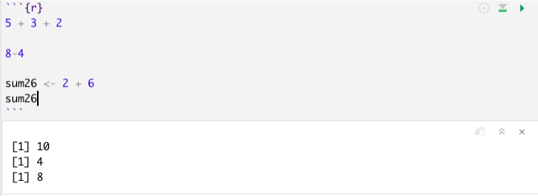

# Course Notes

This document will include important links and course notes for Experimental Methods in Political Science.

  - This site will be updated throughout the semester with new content. 
  - The Canvas modules will provide links to the relevant sections to review for a given week of the course.
  - The primary text for the course is [Field Experiments: Design, Analysis, and Interpretation](https://wwnorton.com/books/9780393979954) by Alan Gerber and Don Green. We will refer to this as FEDAI in the notes.
  - This is a new and living document. If you spot errors or have questions or suggestions, please email me at k.mccabe@rutgers.edu or send a Slack message.


<!-- If you need PDF output, uncomment bookdown::pdf_book above in YAML. You will need a LaTeX installation, e.g., https://yihui.name/tinytex/ -->

<!-- Instructions: https://ontheline.trincoll.edu/bookdown.html -->


## Setup in R {#rsetup}

**Goal**

By the end of the first week of the course, you will want to have R and RStudio installed on your computer (both free) and feel comfortable using R as a calculator.

R is an application that processes the R programming language in a statistical computing environment. RStudio is also an application, which serves as a user interface that makes working in R easier. We will primarily open and use RStudio to work with R.   

In other classes, you may come across Stata, SPSS, Excel, or SAS, which are programs that also conduct data analysis. R has the advantage of being free and open-source. Even after you leave the university setting, you will be able to use R/RStudio for free. As an open-source program, it is very flexible, and a community of active R/RStudio users is constantly adding to and improving the program.   


**R and RStudio Installation**

This content follows and reinforces [QSS 1.3](https://assets.press.princeton.edu/chapters/s11025.pdf) by Kosuke Imai. Additional resources are also linked below.

  - This [video](http://www.youtube.com/embed/ulIv0NiVTs4?rel=0) from Professor Christopher Bail explains why many social scientists use R and describes the R and RStudio installation process. This involves
    1. Going to [cran](https://cran.r-project.org/), select the link that matches your operating system, and
then follow the installation instructions, and 
    2. Visiting [RStudio](http://www.rstudio.com/) and follow the download and installation instructions. R is the statistical software and programming language used for analysis. RStudio provides a convenient user interface for running R code. 

```{r, echo=FALSE, warning=FALSE, message=FALSE}
library("vembedr")
library(knitr)

embed_url("https://www.youtube.com/watch?v=ulIv0NiVTs4")
```


 

## First Time Working in R and RStudio

This next section provides a few notes on using R and RStudio now that you have installed it. In this section, we cover the following materials:

  - Using R as a calculator and assigning objects using `<-`
  - Setting your working directory and the `setwd()` function.
  - Creating and saving an R script


### Open RStudio

RStudio is an open-source and free program that greatly facilitates the use of R, especially for users new to programming. Once you have downloaded and installed R and RStudio, to work in R, all you need to do now is ***open RStudio*** (it will open R). It should look like this, though your version numbers will be different:


**Note:** The first time you open RStudio, you likely only have the three windows above. We will want to create a fourth window by **opening an R script** to create the fourth window. 

  - To do this, in RStudio, click on File -> New -> R script in your computer's toolbar. This will open a blank document for text editing in the upper left of the RStudio window. We will return to this window in a moment.
      + You can alternatively click on the green + sign indicator in the top-left corner of the RStudio window, which should give you the option to create a new R script document.

Now you should have something that looks like this, similar to [Figure 1.1. in QSS](https://assets.press.princeton.edu/chapters/s11025.pdf):


  
  - The upper-left window has our script document that will contain code.
  - The lower-left window is the console. This will show the output of the code we run. We will also be able to type directly in the console.
  - The upper-right window shows the environment (and other tabs, such as the history of commands). When we load and store data in RStudio, we will see a summary of that in the environment.
  - The lower-right window will enable us to view plots and search help files, among other things.


### Using R as a Calculator

The *bottom left* window in your RStudio is the Console. You can type in this window to use R as a calculator or to try out commands. It will show the raw output of any commands you type. For example, we can try to use R as a calculator. Type the following in the Console (the bottom left window) and hit "enter" or "return" on your keyboard:

```{r}
5 + 3

5 - 3

5^2

5 * 3

5/3

(5 + 3) * 2
```

In the other RStudio windows, the upper right will show a history of commands that you have sent from the text editor to the R console, along with other items. The lower right will show graphs, help documents and other features. These will be useful later in the course.

### Working in an R Script

Earlier, I asked you to open an R script in the upper left window by doing File, then New File, then R Script. Let's go back to working in that window.

**Set your working directory `setwd()`**

(Almost) every time you work in RStudio, the first thing you will do is set your working directory. This is a designated folder in your computer where you will save your R scripts and datasets.

There are many ways to do this.

  - An easy way is to go to Session -> Set Working Directory -> Choose Directory. I suggest choosing a folder in your computer that you can easily find and that you will routinely use for this class. Go ahead and create/select it. 
  - Note: when you selected your directory, code came out in the bottom left Console window. This is the `setwd()` command which can also be used directly to set your working directory in the future.
  - If you aren't sure where your directory has been set, you can also type `getwd()` in your Console. Try it now


```{r, eval=F}
## Example of where my directory was
getwd()
```


If I want to  change the working directory, I can go to the top toolbar of my computer and use Session -> Set Working Directory -> Choose Directory or just type my file pathway using the `setwd()` below:

```{r, eval=FALSE}
## Example of setting the working directory using setwd().
## Your computer will have your own file path.
setwd("/Users/ktmccabe/Dropbox/Rutgers Teaching/")
```


**Saving the R Script**

Let's now save our R script to our working directory and give it an informative name. To do so, go to File, then Save As, make sure you are in the same folder on your computer as the folder you chose for your working directory.

Give the file an informative name, such as: "McCabeWeek1.R". Note: all of your R scripts will have the .R extension.


### Preparing your R script

Now that we have saved our R script, let's work inside of it. Remember, we are in the top-left RStudio window now.

  - Just like the beginning of a paper, you will want to title your R script. In R, any line that you start with a \# will not be treated as a programming command. You can use this to your advantage to write titles/comments. Below is a screenshot example of a template R script.
  - You can specify your working directory at the top, too. Add your own filepath inside `setwd()`


  - Then you can start answering problems in the rest of the script.
  - Think of the R script as where you write the final draft of your paper. In the Console (the bottom-left window), you can mess around and try different things, like you might when you are taking notes or outlining an essay. Then, write the final programming steps that lead you to your answer in the R script. For example, if I wanted to add 5 + 3, I might try different ways of typing it in the Console, and then when I found out `5 + 3` is the right approach, I would type that into my script.

### Executing Commands in your R script

The last thing we will note in this initial handout is how to execute commands in your R script.

To run / execute a command in your R script (the upper left window), you can

  1. Highlight the code you want to run, and then hold down "command + return" on a Mac or "control + enter" on Windows
  2. Place your cursor at the end of the line of code (far right), and hit "command + return" on a Mac or "control + return" on Windows, or
  3. Do 1 or 2, but instead of using the keyboard to execute the commands, click "Run" in the top right corner of the upper-left window.


Try it: Type `5 + 3` in the R script. Then, try to execute `5 + 3`. It should look something like this:

{width=70%}

After you executed the code, you should see it pop out in your Console:
```{r}
5 + 3
```


{width=90%}


Note: The symbol \# also allows for annotation behind commands or on a separate line. Everything that follows \# will be ignored by R. You can annotate your own code so that you and others can understand what each part of the code is designed to do.

```{r}
## Example
sum53 <- 5 + 3 # example of assigning an addition calculation
```

### Objects

Sometimes we will want to store our calculations as "objects" in R. We use `<-` to assign objects by placing it [to the left](https://www.youtube.com/watch?v=vLZA67L7gIo&ab_channel=BeyonceSasha1) of what we want to store. For example, let's store the calculation `5 + 3` as an object named `sum53`:

```{r}
sum53 <- 5 + 3
```

After we execute this code, `sum53 now stores the calculation. This means, that if we execute a line of code that just has `sum53`, it will output 8. Try  it:

```{r}
sum53
```

Now we no longer have to type `5 + 3`, we can just type `sum53`. For example, let's say we wanted to subtract 2 from this calculation. We could do:

```{r}
sum53 - 2
```

Let's say we wanted to divide two stored calculations:
```{r}
ten <- 5 + 5
two <- 1 + 1
ten / two
```

The information stored does not have to be numeric. For example, it can be a word, or what we would call a character string, in which case you need to use quotation marks.

```{r}
mccabe <- "professor for this course"
mccabe
```


*Note:* Object names cannot begin with numbers and no spacing is allowed. Avoid using special characters such as \% and \$, which have specific meanings in R. Finally, use concise and intuitive object names.

  - GOOD CODE: `practice.calc <- 5 + 3`
  - BAD CODE: `meaningless.and.unnecessarily.long.name <- 5 + 3`

While these are simple examples, we will use objects all the time for more complicated things to store (e.g., like full datasets!) throughout the course.

We can also store an array or "vector" of information using `c()`

```{r}
somenumbers <- c(3, 6, 8, 9)
somenumbers
```

**Importance of Clean Code**

Ideally, when you are done with your R script, you should be able to highlight the entire script and execute it without generating any error messages. This means your code is clean. Code with typos in it may generate a red error message in the Console upon execution. This can happen when there are typos or commands are misused.

For example, R is case sensitive. Let's say we assigned our object like before:
```{r}
sum53 <- 5 + 3
```

However, when we went to execute `sum53`, we accidentally typed `Sum53`:
```{r, error=TRUE}
Sum53
```

Only certain types of objects can be used in mathematical calculations. Let's say we tried to divide `mccabe` by 2:

```{r, error=TRUE}
mccabe / 2
```

A big part of learning to use R will be learning how to troubleshoot and detect typos in your code that generate error messages.

{width=80%}


### Practice with R Scripts

Below is an exercise that will demonstrate you are able to use R as a calculator and create R scripts.

  1. Create an R script saved as ``LastnameSetup1.R" (use your last name). Within the R script, follow the example from  this handout and title the script.
  2. Set your working directory, and include the file pathway (within `setwd()`) at the top of your .R script.
  3. Do the calculation 8 + 3 - 2 in R. Store it as an object with an informative name. Report the answer.
  4. Do the calculation 5 x 3 in R. Store it as an object with an informative name. Report the answer.
  5. Add these two calculations together. Note: do this by adding together the objects you created, not the underlying raw calculations. Report the answer.


## R Markdown

An R Markdown document, which you can create in RStudio, allows you to weave together regular text, R code, and the output of R code in the same document. This can be very convenient when conducting data analysis because it allows you more space to explain what you are doing in each step. It can also be an effective platform for writing a report on a data analysis, similar to what you do when you write up a problem set. It can also be useful for organizing replication files to post after you publish a paper.

R Markdown documents can be "compiled" into html, pdf, or docx documents. Below is an example of what a compiled html file looks like.

  - Note that the image has both written text and a gray chunk, within which there is some R code, as well as the output of the R code (e.g., the number 8 and the image of the histogram plot)

<center> {width=60%}</center>

We say this is a "compiled" RMarkdown document because it differs from the raw version of the file, which is a .Rmd file format. Below is an example of what the raw .Rmd version looks like, compared to the compiled html version.

{width=45%} {width=40%}


### How to get setup in RMarkdown

Just like with a regular R script, to work in RMarkdown, you will open up RStudio.

The **first time** you will be working in RMarkdown, you will want to install two packages: `rmarkdown` and `knitr`. You can do this in the Console window in RStudio.

Type the following into the Console window and hit enter/return.

```{r, eval=F}
install.packages("rmarkdown")
install.packages("knitr")
```

Once you have those installed, now, each time you want to create an RMarkdown document, you will open up a .Rmd R Markdown file and get to work.

  1. Go to File -> New File -> R Markdown in RStudio
      - Alternatively, you can click the green + symbol at the top left of your RStudio window
  2. This should open up a window with several options, similar to the image below
      - Create an informative title and change the author name to match your own
      - For now, we will keep the file type as html. In the future, you can create pdf or .doc documents. However, these require additional programs installed on your computer.


  3. After you hit "OK" a new .Rmd script file will open in your top-left window with some template language and code chunks, similar to the image below. 
  

  
  4. ***Save as .Rmd file.*** Save the file by going to "File -> Save as" in RStudio
      - Give the file an informative name like your LastnamePractice1.Rmd
  5. ***Key Components.*** Now you are ready to work within the Rmd script file. We will point to four basic components of this file, and you can build your knowledge of RMarkdown from there.
      1. The top part bracketed by `---` on top and bottom is the YAML component. This tells RStudio the pertinent information about how to "compile" the Rmd file. Most of the time you can leave this alone, but you can always edit the title, author, or date as you wish.
      2. The next component are the global options for the document. It is conveniently labeled "setup." By default what this is saying is that the compiled version will "echo" (i.e., display all code chunks and output) unless you specifically specify otherwise. For example, note that it says `include = FALSE` for the setup chunk. That setting means that this code chunk will "run" but it will not appear in the nicely compiled .html file. Most of the time you will not need to edit those settings.
      3. The third component I want to bring attention to is the body text. The \# symbol in RMarkdown is used to indicate that you have a new section of the document. For example, in the compiled images at the beginning, this resulted in the text being larger and bolded when it said "Problem 2." In addition to just using a single \#, using \#\# or \#\#\# can indicate subsections or subsubsections. Other than that symbol, you can generally write text just as you would in any word processing program, with some exceptions, such as how to make text bold or italicized. (See bottom of section for resources on the Markdown language.)
      4. The final component I want to call attention to are the other main body code chunks. These are specific parts of the document where you want to create a mini R script. To create these, you can simply click the + C symbol toward the top of the top left window of RStudio and indicate you want an R chunk.
      
      <center>
{width=20%}</center>
        - For example, in the image above, there is an R code chunk labeled `cars`. The `cars` component is just a label for the code chunk. Labeling code chunks is not necessary. By default, a new R code chunk will just have `r` in the brackets, and that is sufficient.
    
  6. ***Writing R Code.*** Within a code chunk, you can type R code just like you would in any R script. To run ("execute") the R code, you can run a single line the exact same way you do in a regular R script by moving the cursor to the end of a line of code or highlighting a portion of code and hitting "Run." However, in RMarkdown, you also have the option of running an entire code chunk at once by hitting the green triangle at the top-right of a given code chunk.
    
{width=70%}

  7. ***Knitting the document.*** Once you have added a code chunk and/or some text, you are ready to compile or "Knit" the document. This is what generates the .html document.
      - To do so, click on the Knit button toward the top of the top-left window of Rstudio. After a few moments, this should open up a preview window displaying the compiled html file. 
      - It will also save an actual .html file in your working directory (the same location on your computer where you have saved the .Rmd file)
      - Try to locate this compiled .html file on your computer and open it. For most computers, .html files will open in your default web browser, such as Google Chrome or Safari. 
      - This step is a common place where errors are detected and generated. Sometimes the compiling process fails due to errors in the R code in your code chunks or an error in the Markdown syntax. If your document fails to knit, the next step is to try to troubleshoot the error messages the compiling process generates. The best way to reduce and more easily detect errors is to "knit as you go." Try to knit your document after each chunk of code you create. 

### Additional RMarkdown resources

Here are a few additional resources for working with RMarkdown.

  - This [website](https://monashbioinformaticsplatform.github.io/2017-11-16-open-science-training/topics/rmarkdown.html) provides some basic syntax for the Markdown language, such as how to display bulleted lists and how to bold or italicize text.
  - This [page](https://rpubs.com/brandonkopp/RMarkdown) walks through the setup of RMarkdown documents similar to what the course notes just did. This provides a second set of instructions and additional examples of settings you can use to customize your RMarkdown output (e.g., how large figures are when they are displayed).
  - This [page](https://rmarkdown.rstudio.com/articles_intro.html) talks more about compiling aka rendering aka knitting Rmd documents into different formats, such as html, pdf, or Word doc files.
  

### Practice with R Markdown

Below is an exercise that will demonstrate you are able to use R as a calculator and compile RMarkdown documents.

  1. Create an Rmd file saved as "LastnameSetup1.Rmd" (use your last name). Provide an informative title for the document.
  2. Create a section labeled "Problems." 
  3. Create a code chunk where you do the calculation 8 + 3 - 2 in R. Store it as an object with an informative name. Report the answer as text underneath the code chunk.
  4. In a second code chunk, do the calculation 5 x 3 in R. Store it as an object with an informative name. Report the answer as text underneath the code chunk..
  5. In a third code chunk, add these two calculations together. Note: do this by adding together the objects you created, not the underlying raw calculations. Report the answer as text underneath the code chunk..
  6. Knit the file to create an html document. Open the html document in a web browser to check the formatting.

  

## What are experiments?

Our first discussion will be focused on elaborating on what we see as the goals of social science and how experiments fit into these goals.

We draw on the following readings

  - Gerber, A. and D.P. Green. 2012. *Field Experiments: Design, Analysis, and Interpretation.* W.W. Norton. Chapter 1.
  - Angrist, Joshua D. and Jorn-Steffen Pischke. Mostly Harmless Econometrics. Part One: Preliminaries: “Questions about Questions.” Available online [here](https://assets.press.princeton.edu/chapters/s8769.pdf) 
  - Kinder, Donald R. and Thomas R. Palfrey. 1993. “On Behalf of an Experimental Political Science.” In *Experimental Foundations of Political Science.* 
  - Sen, Maya and Omar Wasow. 2016. “Race as a Bundle of Sticks: Designs that Estimate Effects of Seemingly Immutable Characteristics.” Annual Review of Political Science doi: 10.1146/annurev-polisci-032015-010015.

We will sketch out the answers to these questions as a group. Along the way, we will try to build a research design for a research question we come up with as a class.


<style>
p.comment {
background-color: #DBDBDB;
padding: 10px;
border: 1px solid black;
margin-left: 25px;
border-radius: 5px;
font-style: italic;
}

</style>


***What are the goals of social science? What are examples of research questions that can be addressed with each goal?***

<p class="comment">
Your ideas ...                                                                                                                                                                                                             </p>


***What makes an experiment an experiment? What are the goals of experimentation?***

<p class="comment">
Your ideas ...                                                                                                                                                                                                             </p>


***What are some advantages of experimentation over other methods in political science?***

<p class="comment">
Your ideas ...                                                                                                                                                                                                             </p>


***What are examples of different types of experiments?***

<p class="comment">
Your ideas ...                                                                                                                                                                                                             </p>


***What are limitations of experiments? Can we experiment on everything?***

<p class="comment">
Your ideas ...                                                                                                                                                                                                             </p>


<!--chapter:end:index.Rmd-->

